## Prerequisites
 - You have created a Sales Push Card
 - Postman Client, CURL or any other API Development Platform

## Details
### You will learn
  - Push a card to your Mobile Device from an external system
  - View & delete a Web Page Matching Card
  - Perform an action using the Push Notification

---

[ACCORDION-BEGIN [Step 1: ](Get Familiar With The Real World Use-case)]

In the previous tutorial of the mission, you have created a Card that Alice will Subscribe.

In this tutorial, we will make Watson create a request in a different application. Once the request is created, Alice will receive a **push notification**.

We will use Postman to mock Watson's request.

[DONE]
[ACCORDION-END]

[ACCORDION-BEGIN [Step 2: ](Create A Service Key)]

Open your Mobile Services Cockpit.

!

Click **SAP Mobile Cards**.

!

Navigate to **Service Keys** tab and click **+** to create a new service key.

!

> If you can't see the Service Keys tab, refresh your page.

Enter/Select the values as indicated in the table, and click **OK**.

|Alias|Role|
|---|---|
|`SalesPushCardKey`| `register_card` |

!

You can now see the newly created service key in the table.

Make a note of the **Alias**, **API Key**, and the **URL** for your service key. You will be using these values in an upcoming step.

!

[DONE]
[ACCORDION-END]

[ACCORDION-BEGIN [Step 3: ](Copy Receiver's User Name)]

**Click Features Tab  &rarr; Push Notification**.
!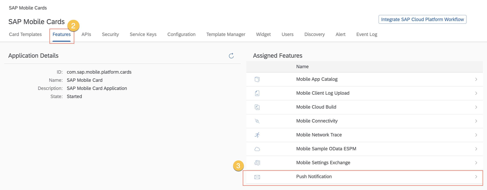

Make a note of your **User Name**. You will need it in an upcoming step.

> If you are unable to determine your User Name, use the **Send Notification** to send a custom message as a push notification.

!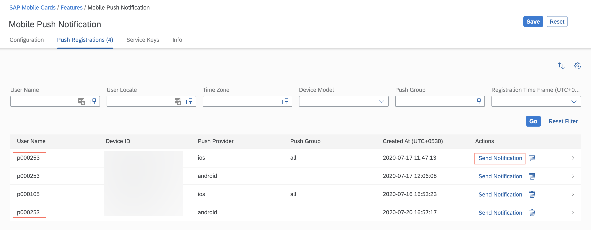

[DONE]
[ACCORDION-END]

[ACCORDION-BEGIN [Step 4: ](Copy A Sales Order Id)]

**Click Features Tab  &rarr; Mobile Sample OData ESPM**.
!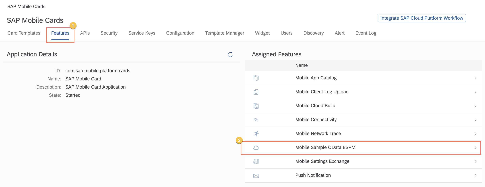

**Click V2**.

!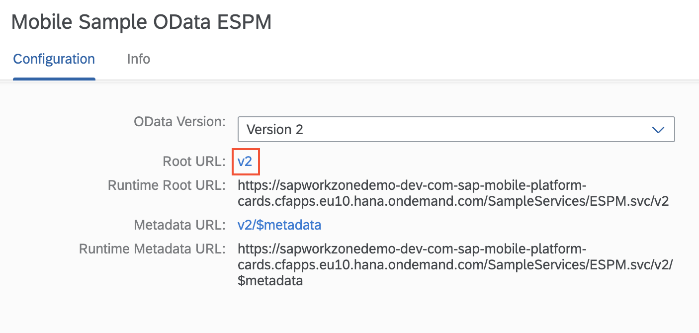

Add `/SalesOrderHeaders` to the URL in your browser.

!

Make a note of a **Sales Order Id**. You will need it in the next step.

!

[DONE]
[ACCORDION-END]

[ACCORDION-BEGIN [Step 5: ](Make An HTTP Request)]

In this step, you will make an HTTP Request. This knowledge is transferrable, i.e. you can implement this logic in your Web/Desktop/Mobile applications.

>Make sure you are choosing the preferred tab **above**: **Postman** or **cURL**.

[OPTION BEGIN [Postman]]

Create your HTTP Request by using the following configuration:

* Request Type & URL

|HTTP Method Type|URL|
|---|---|
|`POST`| `<The URL you copied from the service key table>/mobileservices/origin/hcpms/CARDS/v1/register/templated` |

* Authorization

|Authorization Type|Username|Password|
|---|---|---|
|`BASIC`| `<The Alias you copied from the service key table>` <br> `SalesPushCardKey` | `<The API Key you copied from the service key table>`|

* Headers

|Key|Value|
|---|---|
|`Content-Type`| `application/json` |

* Body - Raw + JSON

```JSON
{
  "method": "REGISTER",
  "username": "<The User Name you copied from the Push Registration table>",
  "templateName": "Sales Push Card BAS",
  "parameters": {
    "ID1": "<The Sales Order Id you copied from the Sample OData Service>"
  }
}
```

[OPTION END]

[OPTION BEGIN [cURL]]

Use the following cURL code to make the HTTP request. You will need to modify the text mentioned in **< >**.

```cURL
curl --user SalesPushCardKey:<The API Key you copied from the service key table> --location --request POST '<The URL you copied from the service key table>/mobileservices/origin/hcpms/CARDS/v1/register/templated' \
--header 'Content-Type: application/json' \
  --data-raw '{
    "method": "REGISTER",
    "username": "<Your User Name>",
    "templateName": "Sales Push Card BAS",
    "parameters": {
      "ID1": "<Sales Order Id>"
    }
  }'
```

[OPTION END]

[DONE]
[ACCORDION-END]

[ACCORDION-BEGIN [Step 6: ](View Notification On Device)]

>Make sure you are choosing the right device platform tab ( **Android** or **iOS** ) **above**.

[OPTION BEGIN [Android]]

You must be subscribed to `Sales Push Card BAS`.

!

> If you can't see the card on your device, please complete this tutorial before moving ahead.

Either terminate the app or send it to background.

!

Upon a successful HTTP Request call, you will see a **New card added* notification**; **Tap** on the notification.

!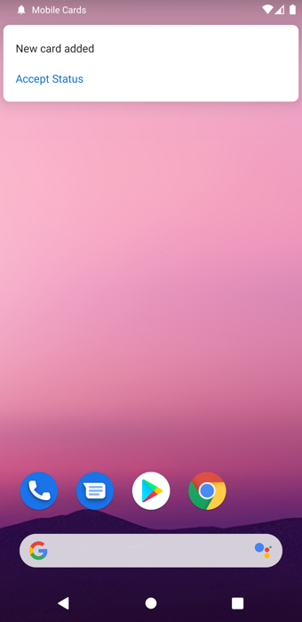

A place holder card is created while the app syncs data from the back end. **Tap 'Back' icon**  to to see the updated card.

!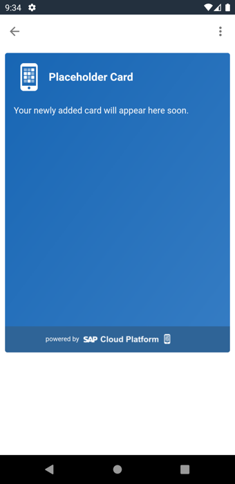

**Tap on the card** to to open it.

!

You can now see a sales order card for the **Sales Order Id** you specified in the HTTPS request method.

!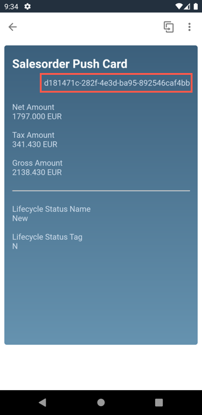

[OPTION END]

[OPTION BEGIN [iOS]]

You must be subscribed to `Sales Push Card BAS`.

!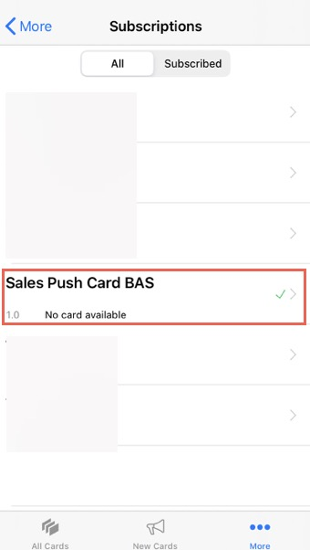

> If you can't see the card on your device, please complete this tutorial before moving ahead.

Either terminate the app or send it to background.

!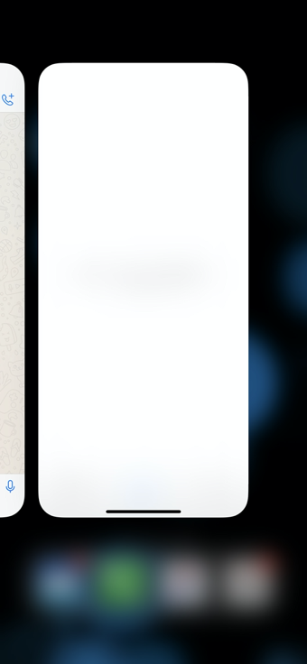

Upon a successful HTTP Request call, you will see a **New card added** notification; **Tap** on the notification.

!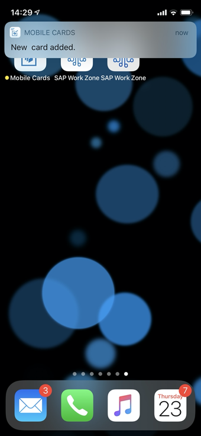

A place holder card is created while the app syncs data from the back end. **Wait** for the card to sync to to see the updated card.

!

> If you can't see the updated card. Perform a pull refresh.

You can now see a sales order card for the **Sales Order Id** you specified in the HTTPS request method.

!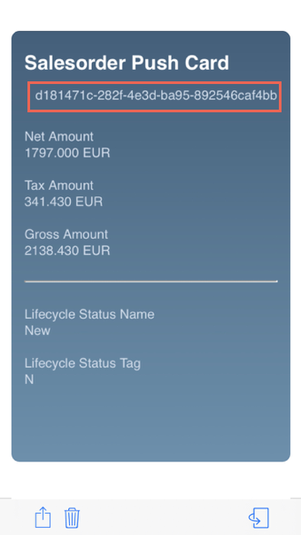

[OPTION END]

[DONE]
[ACCORDION-END]

[ACCORDION-BEGIN [Step 7: ](Perform Action Through Notification)]

>Make sure you are choosing the right device platform tab ( **Android** or **iOS** ) **above**.

Copy another **Sales Order Id** from the sample OData service; e.g. `439bb7dd-50cb-4556-82f4-c835a4627650`. We will perform an action that will update `LifeCycleStatus` and `LifeCycleStatusName`.

!

**Send an HTTP Request** for the new Sales Order Id.

```JSON
{
  "method": "REGISTER",
  "username": "<The User Name you copied from the Push Registration table>",
  "templateName": "Sales Push Card BAS",
  "parameters": {
    "ID1": "439bb7dd-50cb-4556-82f4-c835a4627650"
  }
}
```

[OPTION BEGIN [Android]]

Upon a successful HTTP Request call, you will see a *New card added* notification**; **Tap** on the **Accept Status** action in the notification.

!

Upon performing the action successfully, you will see a toast message on your device.

!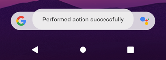

Open SAP Mobile Cards application, and tap on the card with the correct Sales Order Id `439bb7dd-50cb-4556-82f4-c835a4627650`.

!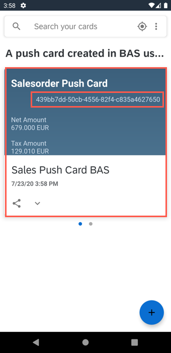

Notice that the `LifeCycleStatus` & `LifeCycleStatusName` have been updated.

!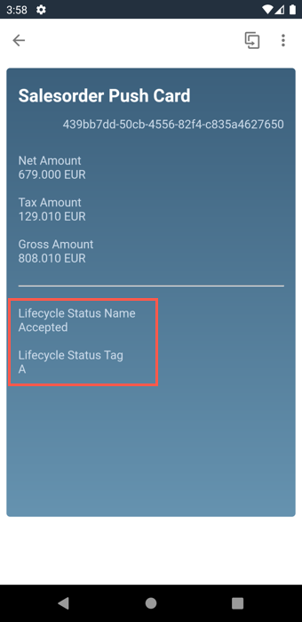

[OPTION END]

[OPTION BEGIN [iOS]]

Upon a successful HTTP Request call, you will see a *New card added* notification**; **Pull** the notification, and **Tap** **Accept Status**.

!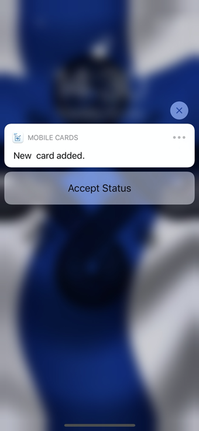

**Open SAP Mobile Cards** application. Upon performing the action successfully, you will see a toast message on your device.

!

**Tap** on the card with the correct Sales Order Id `439bb7dd-50cb-4556-82f4-c835a4627650`.

Notice that the `LifeCycleStatus` & `LifeCycleStatusName` have been updated.

!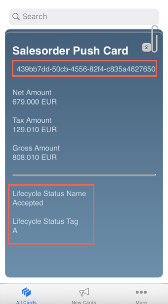

[OPTION END]

> After performing the action, the card update may take time. To force the update, *Unsubscribe & Subscribe* to the card.

Open the sample OData service and verify that the changes have taken effect for Sales Order Id - `439bb7dd-50cb-4556-82f4-c835a4627650`.

!

[VALIDATE_1]
[ACCORDION-END]

**Congratulations!** You have completed this tutorial.

You can now push cards to your Mobile Device effortlessly.

---
