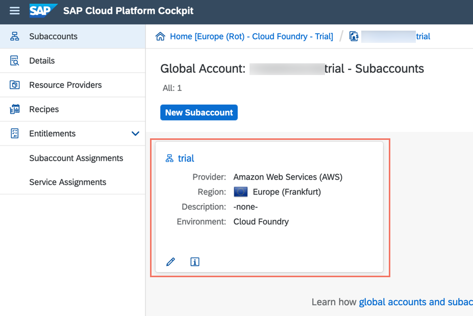
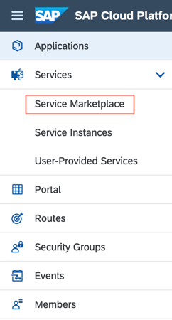

## Prerequisites
- [Get a Free Trial Account on SAP Cloud Platform](hcp-create-trial-account)
- [Enable SAP Cloud Platform Mobile Services](fiori-ios-hcpms-setup)
- **Install SAP Mobile Cards Application:** Download and install on your [iPhone](https://itunes.apple.com/us/app/sap-content-to-go/id1168110623?mt=8) or [Android](https://play.google.com/store/apps/details?id=com.sap.content2go)

## Details
### You will learn
  - How to connect the SAP Mobile Cards application to your SAP Cloud Platform Mobile Services

---

[ACCORDION-BEGIN [Step 1: ](Understand SAP Mobile Cards)]

SAP Mobile Cards is a feature within SAP Cloud Platform Mobile Services which provides our customers access to a micro-application platform to publish data into a consumer-grade wallet or passbook-style app. It allows companies to quickly create simple, yet highly valuable quick-win apps. These apps can give access to useful organisational tools like to do lists, payslips, time sheets and workflows like Leave request approvals, or Purchase Order approvals.

You can find more details on the [SAP Mobile Cards developer page](https://developers.sap.com/topics/mobile-cards.html).

[DONE]
[ACCORDION-END]

[ACCORDION-BEGIN [Step 2: ](Go to SAP Mobile Services cockpit)]

In your web browser, open the [SAP Cloud Platform trial cockpit](https://cockpit.hanatrial.ondemand.com/).

Navigate to the trial global account by clicking **Enter Your Trial Account**.

!

>If this is your first time accessing your trial account, you'll have to configure your account by choosing a region (select the region closest to you). Your user profile will be set up for you automatically.  

>Wait till your account is set up and ready to go. Your global account, your subaccount, your organization, and your space are launched. This may take a couple of minutes.

>Choose **Continue**.

>

Navigate to your subaccount by clicking on the tile named **trial**.

Under **Spaces**, choose the available space as highlighted below.

In the left pane, choose **Services** > **Service Marketplace**.

>The **Service Marketplace** is where you can find services to attach to any of your applications. These services are provided by SAP Cloud Platform to create and produce applications quickly and easily.

Search for **Mobile**, and click on the **SAP Mobile Services** tile.  

SAP Cloud Platform Mobile Services provides services to mobile applications, such as application analytics, app resources, onboarding, HTTP/HTTPS configuration and so on. Choose **Support** to open **SAP Cloud Platform Mobile Services Cockpit**.

Choose the relevant **Organization** and **Space** from the dropdown list, and then select **Open**.

>**Organization:** Organizations in Cloud Foundry enable collaboration among users and grouping of resources.

>**Space:** Cloud Foundry has a standard working environment for individual applications: it is called a space. Spaces are individual working areas, which normally contain a single application.

You have now logged in to the SAP Mobile Services cockpit.

Bookmark the **Mobile Services cockpit URL** for quick access.

[DONE]
[ACCORDION-END]

[ACCORDION-BEGIN [Step 3: ](Get familiar with available configurations)]

Navigate to **SAP Mobile Cards** to look into the Mobile Cards configuration.

>If the SAP Mobile Cards Advisory screen pops up, choose **Close** to close it.

Click **Features**.

> If you can't see the Features Tab, click **Initialize**. This will create a new service instance for Mobile Cards.

> 

Click **Mobile Sample OData ESPM** to look into available OData Version 2 and Version 4 sample endpoints.

Select **OData Version** Version 2 and click **Save**.

In the breadcrumb menu click **Features**.

 Click **Mobile Connectivity** to see the destination endpoints to create a new destination, which connects to your backend, or select an existing destination.

 

Below is a list of destinations from which the SAP Mobile Cards service can fetch data.

>For this tutorial, the `com.sap.edm.sampleservice.v2` destination is used. It's important that all destinations are only pointing to the root of the service.

Click **SAP Mobile Cards** navigation bar to go back to Mobile Cards admin page.

[DONE]
[ACCORDION-END]

[ACCORDION-BEGIN [Step 4: ](Configure SAP Mobile Cards Client)]

>Make sure you are choosing the right device platform tab ( **Android** or **iOS** ) **above**.

>Make sure you have installed the SAP Mobile Cards app on your phone.

You will configure the SAP Mobile Cards client with your SAP Cloud Platform account.

Click **APIs** and scan the respective QR Card to onboard your SAP Mobile Cards client.

[OPTION BEGIN [Android]]

Tap **SCAN QR CODE**.

Tap **I AGREE** on `End User License Agreement`.

Enter your SAP Cloud Platform credentials and tap **Log On**.

Choose a passcode with at least 8 characters to unlock the app, and tap **NEXT**.

Confirm the passcode and tap **DONE**.

You now have connected your SAP Mobile Cards client with your SAP Cloud Platform account.

[OPTION END]

[OPTION BEGIN [iOS]]

Scan the QR code with your camera and select the toast message to launch the SAP Mobile Cards app.

Enter your SAP Cloud Platform credentials and tap **Log On**.

Choose a passcode with at least 8 characters to unlock the app and tap Next.

Confirm the passcode and choose **Done**.

You now have connected your SAP Mobile Cards client with your SAP Cloud Platform account.

[OPTION END]

[VALIDATE_1]
[ACCORDION-END]

---
