## Prerequisites
- [Get a Free Trial Account on SAP Cloud Platform](hcp-create-trial-account)
- [Enable SAP Cloud Platform Mobile Services](fiori-ios-hcpms-setup)
- **Install SAP Mobile Cards Application:**
   <table><tr><td align="center">! Android</td><td align="center">! iOS</td></tr></table>

## Details
### You will learn
  - How to connect the SAP Mobile Cards application to your SAP Cloud Platform Mobile Services

---

[ACCORDION-BEGIN [Step 1: ](Understand SAP Mobile Cards)]

SAP Mobile Cards is a feature within SAP Cloud Platform Mobile Services which provides customers access to a micro-application platform to publish data into a consumer-grade wallet or passbook-style app.

It allows companies to quickly create simple, yet highly valuable quick-win apps. These apps can give access to useful organisational tools like to do lists, payslips, time sheets and workflows like Leave request approvals, or Purchase Order approvals.

You can read more about the features [here](https://help.sap.com/doc/f53c64b93e5140918d676b927a3cd65b/Cloud/en-US/docs-en/guides/getting-started/mck/mck-overview.html).

You can see the list of templates shipped out of the box [here](https://github.com/SAP-samples/mobile-cards-templates).

!

[DONE]
[ACCORDION-END]

[ACCORDION-BEGIN [Step 2: ](Go To SAP Mobile Services Cockpit)]

1. In your web browser, open the [SAP Cloud Platform trial cockpit](https://cockpit.hanatrial.ondemand.com/).

2. Provide the login details and click **Log On**.

    !

3. Navigate to the trial global account by clicking **Enter Your Trial Account**.

    !

    >If this is your first time accessing your trial account, you'll have to configure your account by choosing a region (select the region closest to you). Your user profile will be set up for you automatically.  

    >Wait till your account is set up and ready to go. Your global account, your subaccount, your organization, and your space are launched. This may take a couple of minutes.

    >Choose **Continue**.

    >!

4. Navigate to your subaccount by clicking on the tile named **trial**.

    !

5. Under **Spaces**, choose the available space as highlighted below.

    !

    >**Organization:** Organizations in Cloud Foundry enable collaboration among users and grouping of resources.

    >**Space:** Cloud Foundry has a standard working environment for individual applications: it is called a space. Spaces are individual working areas, which normally contain a single application.

6. In the left pane, choose **Services** > **Service Marketplace**.

    !

    >The **Service Marketplace** is where you can find services to attach to any of your applications. These services are provided by SAP Cloud Platform to create and produce applications quickly and easily.

7. Search for **Mobile**, and click on the **Mobile Services** tile.  

    !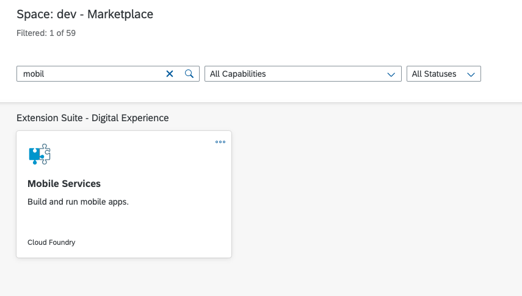

8. Choose **Support** to open **SAP Cloud Platform Mobile Services Cockpit**.

    !

9. Provide your Cloud Platform *credentials* and Click **Next**.

    !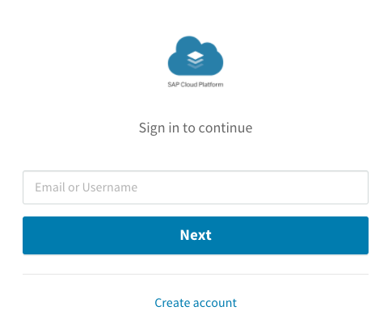

10. Choose the **Organization** and **Space** from the dropdown list, and then select **Open**.

    !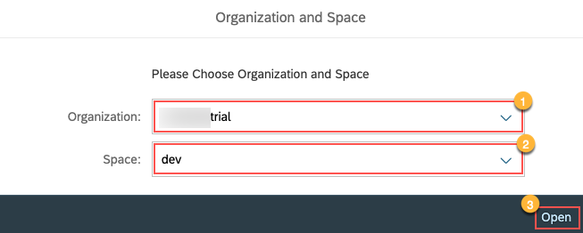

    > Since you will access the mobile services cockpit throughout the mission, Bookmark the **Mobile Services cockpit URL** for quick access.

[VALIDATE_1]
[ACCORDION-END]

[ACCORDION-BEGIN [Step 3: ](Get familiar with available configurations)]

1. Click **SAP Mobile Cards** in the side bar menu to open the Mobile Cards configuration.

    !

    >If the SAP Mobile Cards Advisory screen pops up, choose **Close** to close it.

2. Click **APIs** tab.

    !

    > If you can't see the APIs tab, click **Initialize**. This will create a new service instance for Mobile Cards.

    > !

In the next step, you will scan the respective QR code to connect your mobile application to SAP Cloud Platform Mobile Service.

[DONE]
[ACCORDION-END]

[ACCORDION-BEGIN [Step 4: ](Configure SAP Mobile Cards Client)]

>Make sure you are choosing the right device platform tab ( **Android** or **iOS** ) **above**.

[OPTION BEGIN [Android]]

1. Launch Mobile Cards Application on your device.

    !

    > If you don't have the application installed your device, complete all the prerequisites of this tutorial.

2. Tap **Proceed** in the Welcome pop-up.

    !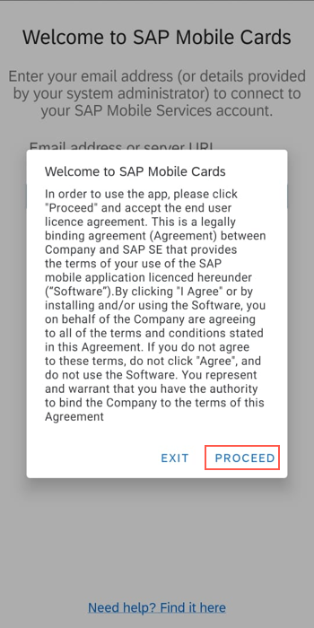

3. Tap **I AGREE** after reading the *End User License Agreement*.

    !

4. Tap **Scan QR CODE**.

    !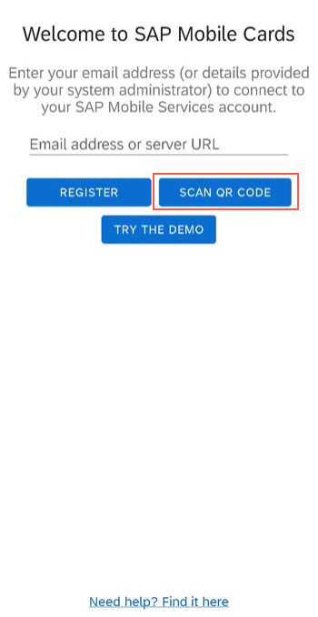

5. Scan the Android QR Code present in the APIs tab of the Mobile Services cockpit.

    !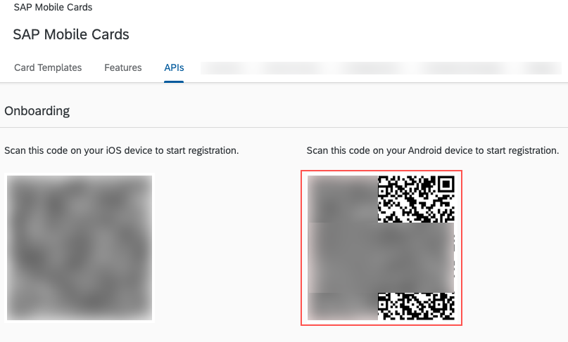

6. Enter your **SAP Cloud Platform login credentials** and tap **Log On**.

    !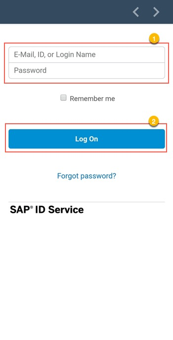

7. Specify an app **Passcode** matching the criteria, and tap **NEXT**.

    !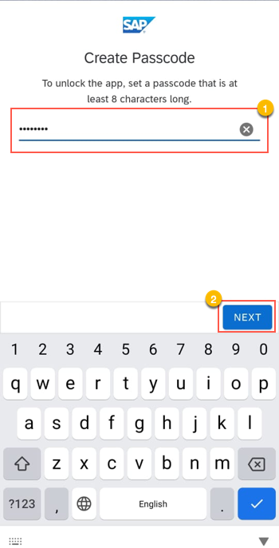

8. Re-enter the **Passcode** to verify, and tap **DONE**.

    !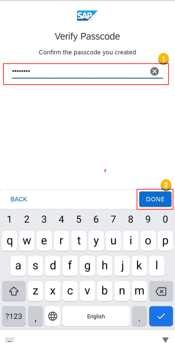

9. Place your finger on the fingerprint scanner to enable biometric authentication.

    !

    > This option is available only on devices that support biometric authentication. It allows you to use your biometric information, rather than the app passcode defined earlier.

10. Tap **Allow only while using the app** option for the location services request.

    !

    > SAP Mobile Cards is capable of showing some cards based on your location. [Click here](https://help.sap.com/doc/f53c64b93e5140918d676b927a3cd65b/Cloud/en-US/docs-en/guides/getting-started/mck/mck-android.html#location-specific-notifications) to read more about it.

    > This option is shown when you launch the application and log in to a server for the first time.

[OPTION END]

[OPTION BEGIN [iOS]]

1. Launch the **QR Code Scanner** from the Control Center on your iOS device.

    !

2. Scan the iOS QR Code present in the APIs tab of the Mobile Services cockpit.

    !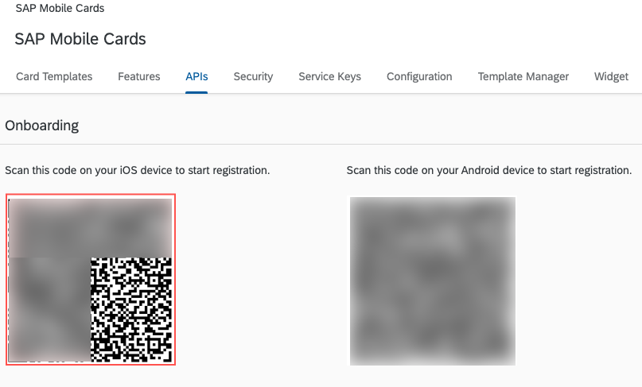

    > If the SAP Mobile Cards application doesn't open, you may not have the application installed on your mobile device. To install the application complete all the prerequisites of this tutorial.

3. Enter your **SAP Cloud Platform login credentials** and tap **Log On**.

    !

4. Define a passcode to unlock the app and tap **Done**.

    !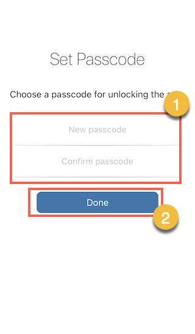

5. Tap **Enable** to enable biometric authentication.

    !

    > This biometric option may be Face ID depending on the capabilities of your device. This feature allows you to use your biometric information, rather than the app passcode defined earlier.

6. Tap **Allow** to enable notification functionality for your application.

    !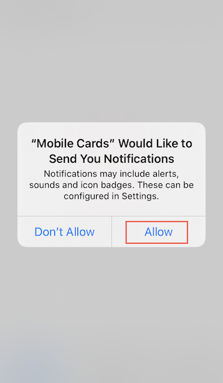

    > This option is shown when you launch the application and log in to a server for the first time.

[OPTION END]

You've now connected your SAP Mobile Cards client to your SAP Cloud Platform account.

You can now proceed to [this tutorial](cp-mobile-bas-setup), in which you will set up your Business Application Studio to build SAP Mobile Cards.

[DONE]
[ACCORDION-END]

---
