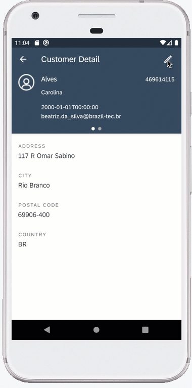
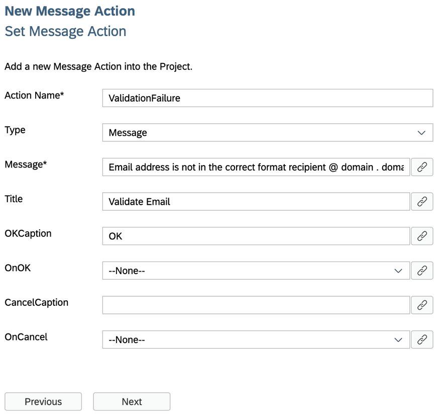
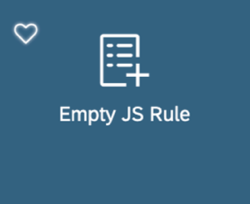
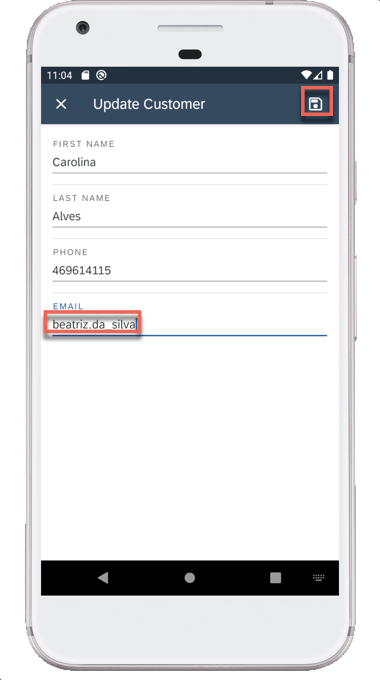
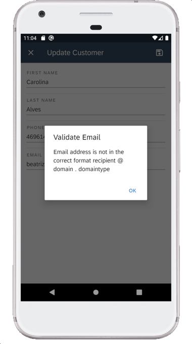
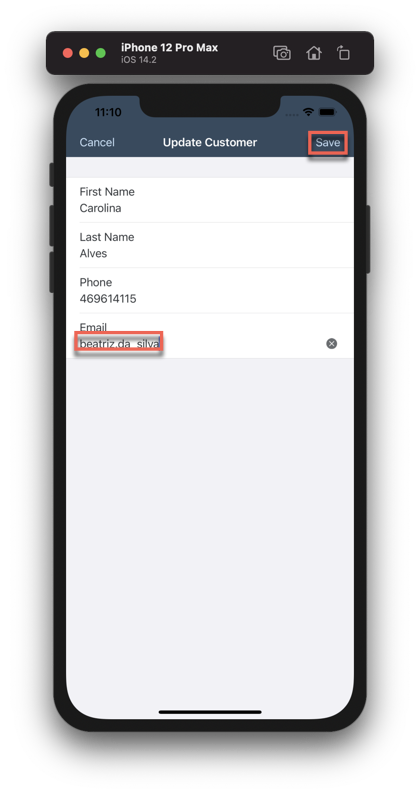
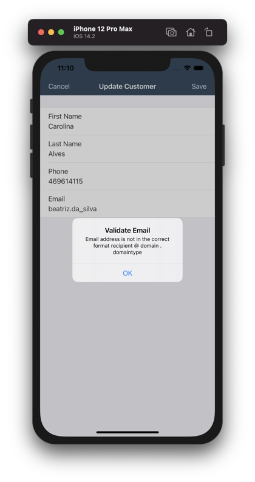
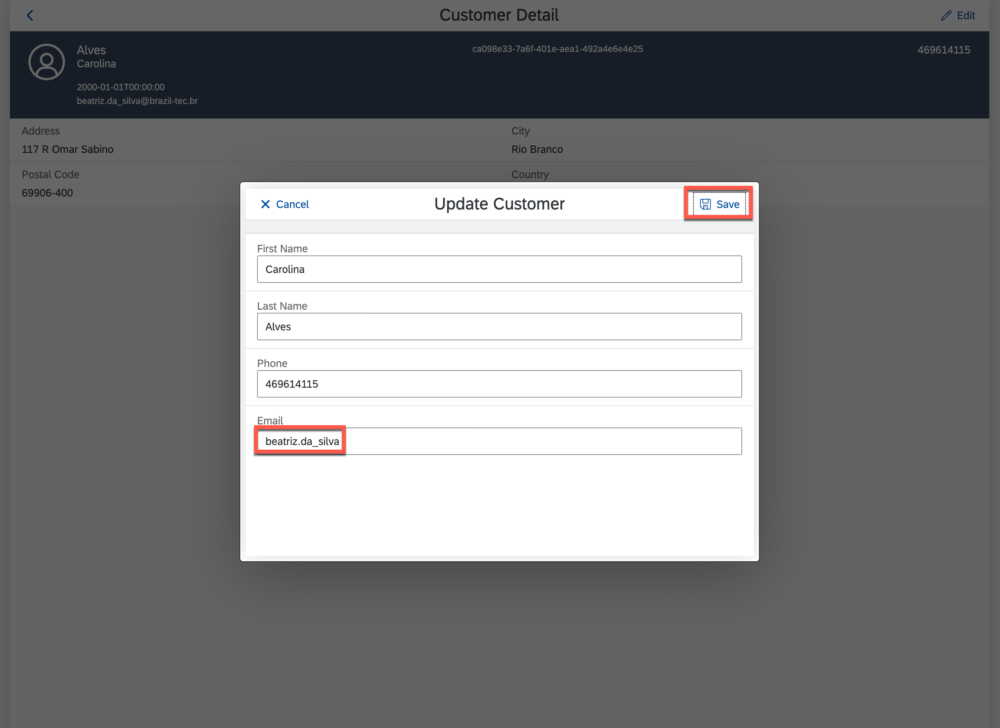
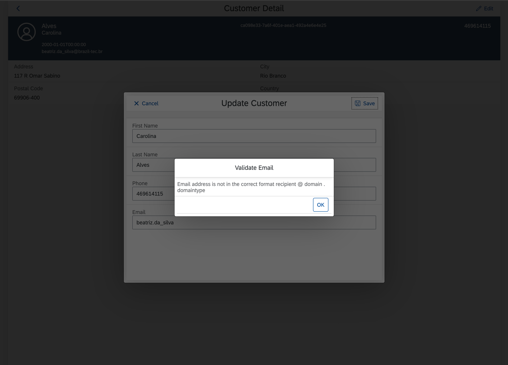

## Details
### You will learn
  - How to write a rule to validate an UI field

---



[ACCORDION-BEGIN [Step 1: ](Create a validation message)]

When allowing end-users to make updates to data, it is important to add validation rules to verify that they are entering valid information.
If the Update action fails due to the validation rule, the application will display a validation failure message to the end-user. You can customize this message by creating a Message action and adding the action to the validation Failure Message field in the Update action.

1. Right-click the **Actions** folder | **MDK: New Action** | choose **MDK Message Actions** in **Category** | click **Message Action** | **Next**.

    !

2. Provide the below information:

    | Field | Value |
    |----|----|
    | `Action Name`| `ValidationFailure` |
    | `Type` | Select `Message` from the dropdown |
    | `Message`| `Email address is not in the correct format recipient @ domain . domaintype` |
    | `Title` |  `Validate Email` |
    | `OKCaption`| `OK` |
    | `OnOK` | `--None--` |
    | `CancelCaption` | leave it blank |
    | `OnCancel` | `--None--` |

    !

3. Click **Next** and then **Finish** on the Confirmation step.

[DONE]
[ACCORDION-END]


[ACCORDION-BEGIN [Step 2: ](Create a new rule)]

In the MDK editor, you will create a new JavaScript file called `EmailValidation.js` to handle validation if a **@** symbol exists in the email address. In the validation rule, you will grab the data entered by the end-user, validate it and check for the **@** symbol then return true if the email address is of a valid format or false if it is not. The returning result of the validation rule can be used in the Update action to determine whether the action succeeds or fails.

>You can find more details about [writing a Rule](https://help.sap.com/doc/f53c64b93e5140918d676b927a3cd65b/Cloud/en-US/docs-en/guides/getting-started/mdk/development/rules.html).

1. Right-click the **Rules** folder | **MDK: New Rule File** | select **Empty JS Rule**.

    !

2. Enter the Rule name `EmailValidation`, click **Next** and then **Finish** on the confirmation step.

    !

3. Replace the generated snippet with below code.

    ```JavaScript
    export default function EmailValidation(context) {
        //The following evaluateTargetPath will retrieve the current value of the email control
        if ((context.evaluateTargetPath('#Control:FCEmail/#Value').indexOf('@')) === -1) {
            //If email value does not contain @ display a validation failure message to the end-user
            context.executeAction('/DemoSampleApp/Actions/ValidationFailure.action');
        } else {
            //If @ is present in the email value, return true to indicate validation is successful
            return true;
        }
    }
    ```

4. Save the changes.

    >The [`indexOf()` method](https://www.w3schools.com/jsref/jsref_indexof.asp) returns the index within the calling String object of the first occurrence of the specified value and -1, if no occurrence is found.

    >In above code there is a reference to `ValidationFailure.action` , you can navigate directly from here to the MDK file by right clicking on it.
    !

[DONE]
[ACCORDION-END]

[ACCORDION-BEGIN [Step 3: ](Add the validtion rule to the Update entity)]

Now, that you have created the validation rule, you will add it to the Update action. This will tell the Update action to run the validation rule before saving any data. If the validation rule is successful, the Update action will save the changes as expected. If the validation rule fails, the end-user receives the validation failure message telling them useful information so they can fix the problem before continuing.

1. Open `Customers_UpdateEntity.action` by double clicking on the action in the project explorer pane.

2. Expand the **Common Action Properties** and select `EmailValidation.js` rule for **Validation Rule** field.

    !

[DONE]
[ACCORDION-END]

[ACCORDION-BEGIN [Step 4: ](Deploy the application)]

Deploy the updated application to your MDK client.

1. Right-click `Application.app` and select **MDK: Deploy**.

    !

2. Select deploy target as **Mobile & Cloud**.

    !

    You should see success message for both deployments.

    !

[DONE]
[ACCORDION-END]

[ACCORDION-BEGIN [Step 5: ](Test the application)]

>Make sure you are choosing the right device platform tab above.

[OPTION BEGIN [Android]]

1. Re-launch the app on your device, you may asked to authenticate with passcode or Biometric authentication. You will see a _Confirmation_ pop-up, click **OK**.

2. In EMAIL property, enter a value with no contain of **@**, it throws a validation failure message on saving the record.

    
    

[OPTION END]

[OPTION BEGIN [iOS]]

1. Re-launch the app on your device, you may asked to authenticate with passcode or Biometric authentication. You will see a _Confirmation_ pop-up, click **OK**.

2. In Email property, enter a value with no contain of **@**, it throws a validation failure message on saving the record.

    
    

[OPTION END]

[OPTION BEGIN [Web]]

1. Either click the highlighted button or refresh the web page to load the changes.

    !

    >If you see the error `404 Not Found: Requested route ('xxxxxtrial-dev-nsdemosampleapp-approuter.cfapps.xxxx.hana.ondemand.com') does not exist.` while accessing the web application, make sure that in your space cockpit, highlight applications are in started state.

    >!

2. In Email property, enter a value with no contain of **@**, it throws a validation failure message on saving the record.

    !
    !

[OPTION END]

[VALIDATE_1]
[ACCORDION-END]

---

Congratulations, you have successfully completed **create Your First MDK Application** mission and you are now all set to [enhance Your First MDK App with Additional Functionalities](mission.mobile-dev-kit-enhance) mission.

---
