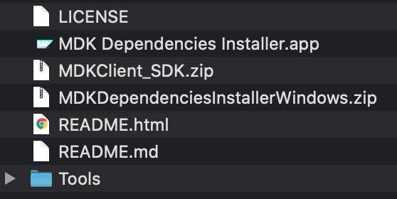
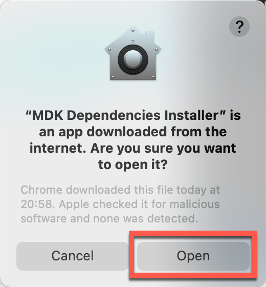
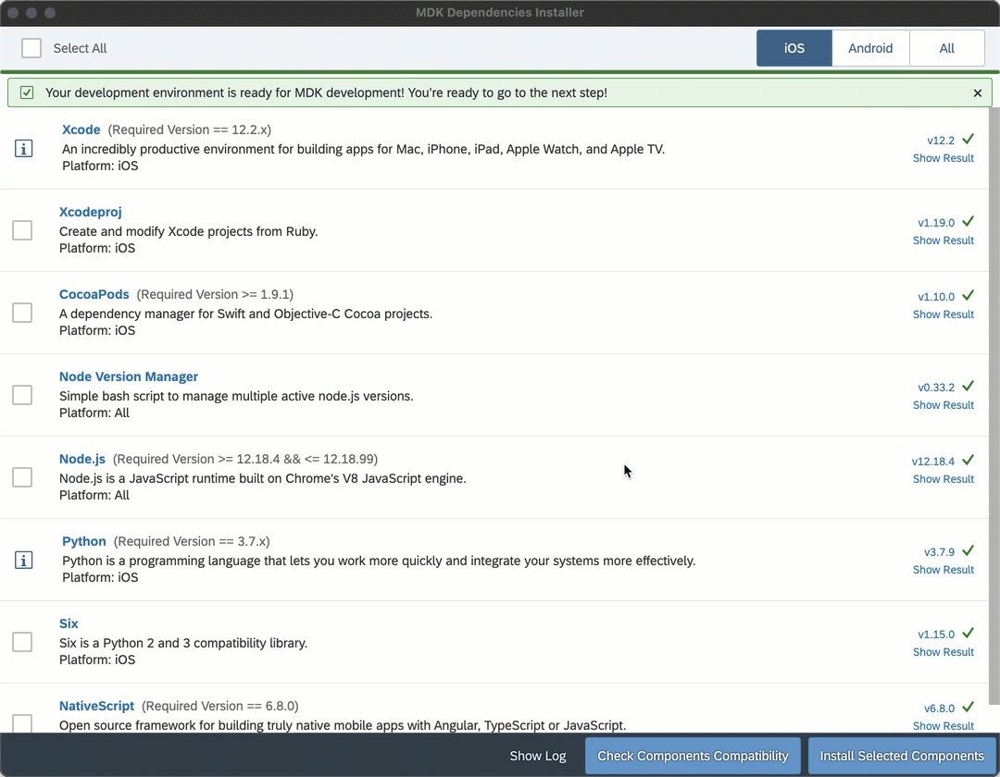
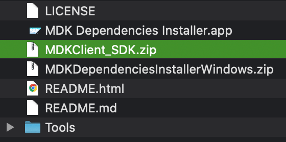
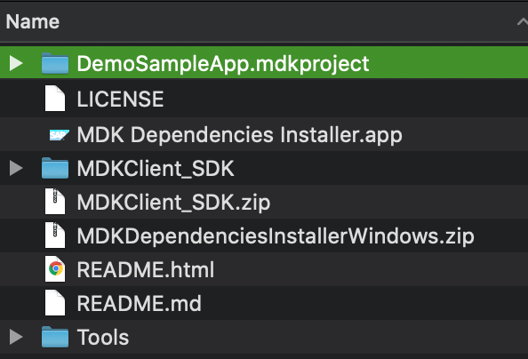
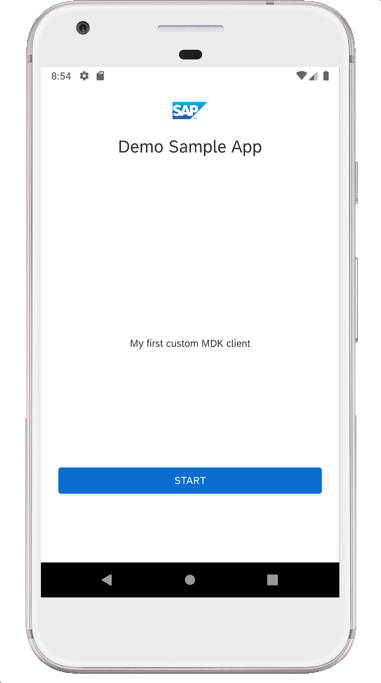
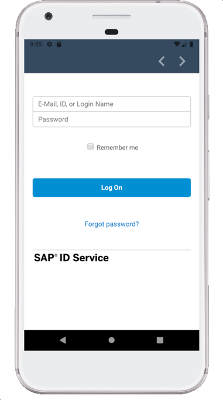
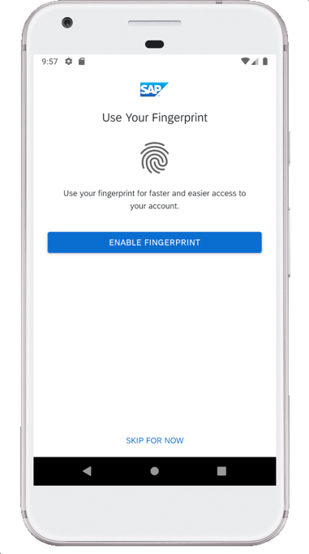

## Prerequisites
- **Tutorial**: [Set Up Initial Configuration for an MDK App](cp-mobile-dev-kit-ms-setup)
- **Download the latest version of Mobile Development Kit SDK** either from community [download page](trials-downloads.html?search=Mobile%20development%20kit) or [SAP Software Center](https://launchpad.support.sap.com/#/softwarecenter/search/Mobile%2520development%2520kit) if you are a SAP Cloud Platform Mobile Services customer

## Details
### You will learn
  - How to install a Mobile development kit client SDK on Mac and Windows OS
  - How to build a Mobile development kit client for iOS and Android
  - How to connect to SAP Cloud Platform Mobile app

  The SAP Mobile Services client available in the App Store is meant for demo and development or learning purposes. For distribution to your users, you need to build a custom client. This enables you to:

-	Provide customer app icon
-	Use your signing profiles
-	Distribute custom extensions
-	Provide app-specific settings (Custom EULA texts, Add app assets)
-	Add demo mode
-	Customize languages (for onboarding screens)
-	Use your own distribution channels, like the mobile device management of your choice

---

[ACCORDION-BEGIN [Step 1: ](Run MDK Dependencies Installer)]

>Make sure you are choosing the right development platform tab above.

Make sure that you have download latest version of MDK SDK as described in Prerequisites.

[OPTION BEGIN [Mac]]

1. Extract the downloaded zip file on your Mac OS.

    !

    >You will also find other files in the extracted folder. The README file contains information about the version requirements, dependencies and some getting started links.

2. MDK Dependencies Installer checks the status of the MDK dependencies and will install or upgrade the dependencies for you. Double click `MDK Dependencies Installer.app` file, click **Open**.

    !

    >If you find some issues (for example: app cant be opened because the identity of the developer cannot be confirmed) while opening this file, go to System Preferences > Security & Privacy and click **Open Anyway**.

3. Enter Admin user password and click **OK**.

    !

    >You may need to grant admin access via Privileges app.

    The installer will list all required components for iOS and Android platform and automatically check if they are already installed in the machine. Follow the installer UI to install the components you selected.

    !

[OPTION END]

[OPTION BEGIN [Windows]]

1. Extract the downloaded zip file on your Windows OS.

    !

    >You will also find other files in the extracted folder. The README file contains information about the version requirements, dependencies and some getting started links.

2. Extract `MDKDependenciesInstallerWindows` zip file.

    MDK Dependencies Installer checks the status of the MDK dependencies and will install or upgrade the dependencies for you. Double click the  `MDK_Dependencies_Installer` application file to open it.

    !

    The installer will list all required components for Android platform and automatically check if they are already installed in the machine. Follow the installer UI to install the components you selected.

    !

    >If MDK Dependencies Installer keeps showing `Loading...` then use command `MDK_Dependencies_Installer.exe –debug –debug` to see more information.
    There might be some issue due to Security Policy. It can be fixed by executing this in `PowerShell`:
    >`Set-ExecutionPolicy -ExecutionPolicy Bypass -Scope CurrentUser`

    >You might see different software versions depending on MDK SDK version you are using.

[OPTION END]

>You might see different software versions depending on MDK SDK version you are using.

>You can look into console by clicking **Show Log** for execution of each dependencies.

Once you've installed these prerequisites, your machine is ready to generate and build an MDK project.

[VALIDATE_2]
[ACCORDION-END]

[ACCORDION-BEGIN [Step 2: ](Installing the SDK dependencies)]

>Make sure you are choosing the right development platform tab above.

[OPTION BEGIN [Mac]]

1. To use the SDK to generate a mobile development kit client, the first step is to setup the SDK to create a client. Unzip `MDKClient_SDK.zip` if it is not already extracted.

    !

2. From a terminal window, navigate to the `[path] -> MDKClient_SDK` folder and execute `./install.command`. If everything is fine, you will a success message in the console followed by next steps.

    !

    !

    Notice that the `create-client.command` file has appeared in the SDK directory.

    !

[OPTION END]

[OPTION BEGIN [Windows]]

1. To use the SDK to generate a mobile development kit client, the first step is to setup the SDK to create a client. Unzip `MDKClient_SDK` if it is not already extracted.

    !

2. From a command line window, navigate to the `[path] -> MDKClient_SDK` folder and execute `install.cmd`.

    !

    If everything is fine, you will a success message in the console followed by next steps.

    !

    !    

    Once this completes, close the window. Notice that the `create-client.cmd` file has appeared in the SDK directory.

    !    

[OPTION END]

[DONE]
[ACCORDION-END]

[ACCORDION-BEGIN [Step 3: ](Create your .mdkproject folder)]

>Make sure you are choosing the right development platform tab above.

[OPTION BEGIN [Mac]]

1. In the `MDKClient_SDK` folder, you will find the `template.mdkproject` folder. It is recommended that you copy this folder to another location to use it for future builds and paste it anywhere you want and you can rename template to whatever you want but the directory name needs to end in `.mdkproject`.

    !

    The idea of retaining the `.mdkproject` folder is so you can use it again in the future to build additional MDK clients using the same settings using a different version of the MDK SDK.

    >For this tutorial, I have named my `.mdkproject` folder `DemoSampleApp.mdkproject` and put it outside of the MDK Client folder structure. I will refer this name for the rest of this tutorial.

    >!

2. Next, you will need to update the `BrandedSettings.json` and `MDKProject.json` files as needed for your client. Go into the `DemoSampleApp.mdkproject` folder.

    !

3. Open the `MDKProject.json` file and update it as needed. This file has some build-time configurations such as the application name, version and bundle ID.

    !

    >`AppName`: Provide a name for example: `DemoSampleApp`. This is the name of the application on the home screen of the device.

    >`BundleID`: It should be unique for iOS and same as **Identifier** `(AppID)` that is registered in Apple Developer account since that determines if the application can be installed alongside other applications. If the `XCode` project is setup to use _Automatically manage signing_ then when building, `XCode` will automatically generate a signing profile for the specified bundle id. Without matching them, trying to run the custom client in iOS device will result in failure.

    >`URLScheme`: Allows you to specify a custom URL scheme which opens the client.
    If the URL includes connection settings as URL parameters, these settings will override the ones used by the client. The default is `mdkclient`.

    >You can find more details about configuration of `MDKProject.json` file in [this](https://help.sap.com/doc/f53c64b93e5140918d676b927a3cd65b/Cloud/en-US/docs-en/guides/getting-started/mdk/custom-client/branding-custom-client.html) help documentation.        

4. Now, open the `BrandedSettings.json` file and update it with information from your MDK Mobile Services application.

    !

    To find the correct URLs for your client, you should go to [Mobile Services cockpit](https://developers.sap.com/tutorials/cp-mobile-dev-kit-ms-setup.html#1294a03f-3bd6-41e7-9173-c2284ca2854a) and find your MDK application that you want to link to this client.

    Click `com.sap.mdk.demo` > **Security** tab.

    Copy the Client ID, Redirect URL, OAuth Authorization & OAuth Token and paste to `ClientId`, `RedirectUrl`, `AuthorizationEndPointUrl` and `TokenUrl` parameters respectively.

    !

    `AppId`: App ID from `Info` tab.

    !

    `SapCloudPlatformEndpoint`: Server URL from `APIs` tab.

    !

    >For Android (7 and below), screen sharing or taking screen shots are disabled by default. To enable it, `add "EnableScreenSharing": true` in `ConnectionSettings` section. Screen sharing is already enabled in Android 8 and above. You can find more information about `Enable Screen Sharing` in [this](https://help.sap.com/doc/f53c64b93e5140918d676b927a3cd65b/Cloud/en-US/docs-en/guides/getting-started/mdk/custom-client/branding-custom-client.html#enable-screen-sharing) help documentation.

    Regarding other properties:
    **Debug settings**: The settings in the `DebugSettings` property are for development use and should not be enabled in a production setting.

    **Log Settings**: Set this to the log level to be used when the client is launched.

    **Demo**: If you want to access the app in the demo mode, you can configure required settings.        

    >If you are connecting to `AliCloud` accounts, you will also need to add your custom domains under `URLWhitelist` property in the same file. You can find more details in [documentation](https://help.sap.com/doc/f53c64b93e5140918d676b927a3cd65b/Cloud/en-US/docs-en/guides/getting-started/mdk/custom-client/branding-custom-client.html#connection-settings-whitelist).

5. In the last section of `BrandedSettings.json` file, make these changes:

    | Field | Value |
    |----|----|
    | `DetailLabelViewText` | `My first custom MDK client` |
    | `SigninButtonText` | `Start` |

    !        

[OPTION END]

[OPTION BEGIN [Windows]]

1. In the `MDKClient_SDK` folder, you will find the `template.mdkproject` folder. It is recommended that you copy this folder to another location to use it for future builds and paste it anywhere want and you can rename template to whatever you want but the directory name needs to end in `.mdkproject`.

    !

    The idea of retaining the `.mdkproject` folder is so you can use it again in the future to build additional MDK clients using the same settings using a different version of the MDK SDK.

    >For this tutorial, I have named my `.mdkproject` folder `DemoSampleApp.mdkproject` and put it outside of the MDK Client folder structure. I will refer this name for the rest of this tutorial.

    >!

2. Next, you will need to update the `BrandedSettings.json` and `MDKProject.json` files as needed for your client. Go into the `DemoSampleApp.mdkproject` folder.

    !

3. Open the `MDKProject.json` file and update it as needed. This file has some build-time configurations such as the application name, version and bundle ID.

    !

    >`AppName`: Provide a name for example: `DemoSampleApp`. This is the name of the application on the home screen of the device.

    >`BundleID`: The ID used for code signing

    >`URL Scheme`: Allows you to specify a custom URL scheme which opens the client.
    If the URL includes connection settings as URL parameters, these settings will override the ones used by the client. The default is `mdkclient`.

    >You can find more details about configuration of `MDKProject.json` file in [this](https://help.sap.com/doc/f53c64b93e5140918d676b927a3cd65b/Cloud/en-US/docs-en/guides/getting-started/mdk/custom-client/branding-custom-client.html) help documentation.                    

4. Now, open the `BrandedSettings.json` file and update it with information from your MDK Mobile Services application.

    !

    To find the correct URLs for your client, you should go to [Mobile Services cockpit](https://developers.sap.com/tutorials/cp-mobile-dev-kit-ms-setup.html#1294a03f-3bd6-41e7-9173-c2284ca2854a) and find your MDK application that you want to link to this client.

    Click `com.sap.mdk.demo` > **Security** tab.

    Copy the Client ID, Redirect URL, OAuth Authorization & OAuth Token and paste to `ClientId`, `RedirectUrl`, `AuthorizationEndPointUrl` and `TokenUrl` parameters respectively.

    !

    `AppId`: App ID from `Info` tab.

    !

    `SapCloudPlatformEndpoint`: Server URL from `APIs` tab.

    !

    >For Android (7 and below), screen sharing or taking screen shots are disabled by default. To enable it, `add "EnableScreenSharing": true` in `ConnectionSettings` section. Screen sharing is already enabled in Android 8 and above. You can find more information about `Enable Screen Sharing` in [this](https://help.sap.com/doc/f53c64b93e5140918d676b927a3cd65b/Cloud/en-US/docs-en/guides/getting-started/mdk/custom-client/branding-custom-client.html#enable-screen-sharing) help documentation.

    Regarding other properties:
    **Debug settings**: The settings in the `DebugSettings` property are for development use and should not be enabled in a production setting.

    **Log Settings**: Set this to the log level to be used when the client is launched.

    **Demo**: If you want to access the app in the demo mode, you can configure required settings.                

5. In the last section of `BrandedSettings.json` file, make these changes:

    | Field | Value |
    |----|----|
    | `DetailLabelViewText` | `My first custom MDK client` |
    | `SigninButtonText` | `Start` |

    !                  

[OPTION END]

[DONE]
[ACCORDION-END]

[ACCORDION-BEGIN [Step 4: ](Create the MDK Client)]

>Make sure you are choosing the right development platform tab above.

[OPTION BEGIN [Mac]]

1. You can create a client by running `./create-client.command` and providing the path to a valid `.mdkproject` directory.

    !

    >You can run the `create-client command` from any directory.  The resulting MDK client will be created in the directory where the `create-client command` is run from.

2. You will be asked whether you would like to build for iOS or Android or All?

    !

    >**All** option was chosen in this tutorial as you will learn how to create the MDK client for iOS and Android.

3. Then, you will be asked whether you would like to build for device or simulator?

    !

    >**device** option was chosen for this tutorial.

    Once the `create-client.command` script executed successfully, you will see **Application ready** message in terminal console.

    !

    You will also find your MDK Client app created under the `MDKClient_SDK` folder.

    !

[OPTION END]

[OPTION BEGIN [Windows]]

4. You can create a client by running `create-client.cmd` and providing the path to a valid `.mdkproject` directory.

    !

5. Once the `create-client.cmd` script executed successfully, you will see **Application ready** message in terminal console.

    !

    !

     You will also find your app created under the `MDKClient_SDK` folder.

    !

[OPTION END]

>This name of this folder is based on the `<App Name>` provided in the `MDKProject.json file` and this is the `NativeScript` project.

[VALIDATE_1]
[ACCORDION-END]

[ACCORDION-BEGIN [Step 5: ](Run the MDK Client)]

>Make sure you are choosing the right device platform tab above.

[OPTION BEGIN [Android]]

1. In this step, you will run the app on an android device. Attach the device to your Mac or Windows machine and run `tns device android` command to print a list of attached devices.

    !

    >Make sure **Developer option** and **USB debugging** option is enabled in android device.

2. Copy the **Device Identifier** value for your device.

3. In terminal or command line window, navigate to the app name folder **`DemoSampleApp`** (in `MDClient_SDK` path) and use `tns run android --device <device identifier>` command to run the MDK client on android device.

    !

    >To run the MDK client on Android emulator, you need to first create the client for emulator and then use `tns run android --emulator` command. Before trying to launch the client on Android emulator, make sure that you have already configured a virtual device (Android Studio>AVD Manager). Otherwise, you may get error like No emulator image available for device identifier.

    Once, above command gets successfully executed, you will see new MDK client up and running in Android device.

    

4. Tap **AGREE** on `End User License Agreement`.

5. In Welcome screen, you will notice that **app name**, **detailed label text** and **signing button text** have been updated as per changes done in step 3.3 & 3.5.

    

6. Tap **START** to connect MDK client to SAP Cloud Platform.

7. Enter your credentials to login to SAP Cloud Platform and tap **Log On** to authenticate.

    

8. Choose a passcode with at least 8 characters for unlocking the app and tap **NEXT**.

    

9. Confirm the passcode and tap **DONE**.

    

    Optionally, you can enable biometric authentication to get faster access to the app data.

    

    If there is any app metadata already deployed to Mobile Services, you will see `Update Now?` dialog box Otherwise you will see an empty screen.

    

    >You can always interrupt running process in terminal window by pressing `control + C`.

    >To build an **`APK` for an Android device**, use `tns build android --release`. More information about archiving can be found in `NativeScript` documentation [here](https://docs.nativescript.org/tooling/docs-cli/project/testing/build-android).

[OPTION END]

[OPTION BEGIN [iOS]]

1. In this step, In this step, you will run the app on an iOS device. Attach the device to your Mac and run `tns device ios` command to print a list of attached devices.

    !

2. Copy the **Device Identifier** value for your device.

3. In terminal window, navigate to the app name folder **`DemoSampleApp`** (in `MDClient_SDK` path) and use `tns run ios --device <device identifier>` command to run the MDK client on iOS device.

    !

    You can also run the app in Xcode. Open the project in Xcode with the command `open platforms/ios/<app name>.xcworkspace`, or open the workspace using the `File -> Open...` dialog in Xcode. Configure the application's code signing settings, then run the application for the target device.

    >To run the MDK client on iOS simulator, use `tns run ios --emulator` command.

    Once, above command gets successfully executed, you will see new MDK client up and running in your device.

    

4. Tap **Agree** on `End User License Agreement`.

5. In Welcome screen, you will notice that **app name**, **detailed label text** and **signing button text** have been updated as per changes done in step 3.3 & 3.5.

    

    Tap **Start** to connect MDK client to SAP Cloud Platform.

6. Enter your credentials to login to SAP Cloud Platform and tap **Log On** to authenticate.

    

7. Choose a passcode with at least 8 characters for unlocking the app and tap **Next**.

    

8. Confirm the passcode and tap **Done**.

    

    Optionally, you can enable biometric authentication to get faster access to the app data, tap **Enable**.

    

    If there is any app metadata already deployed to Mobile Services, you will see `Update Now?` dialog box Otherwise you will see an empty screen.

    

    >You can always interrupt running process in terminal window by pressing `control + C`.

    >To build an **IPA for an iOS device**, use `tns build ios --for-device --release`. This can also be accomplished in Xcode by opening the workspace and selecting the Archive option. More information about archiving can be found in Apple's documentation [here](https://developer.apple.com/library/content/documentation/IDEs/Conceptual/AppDistributionGuide/UploadingYourApptoiTunesConnect/UploadingYourApptoiTunesConnect.html).

[OPTION END]

**Congratulations!** You have successfully built Your Mobile Development Kit Client Using MDK SDK and you are now all set to [Build Your Mobile Development Kit Client Using Cloud Build Service](cp-mobile-dev-kit-cbs-client).

[DONE]
[ACCORDION-END]

---
