## Prerequisites
- **Tutorial group:** [Set Up for the Mobile Development Kit (MDK)](group.mobile-dev-kit-setup)
- **Download and install:** **SAP Mobile Services Client** on your [iOS](https://apps.apple.com/us/app/sap-mobile-services-client/id1413653544) or [Android](https://play.google.com/store/apps/details?id=com.sap.mobileservices.client) device
- **Download and install** **SAP Mobile Cards** on your [iOS](https://apps.apple.com/us/app/sap-mobile-cards/id1168110623) or [Android](https://play.google.com/store/apps/details?id=com.sap.content2go&hl=en) device
- **Download and install** **SAP Fiori Client** on your [iOS](https://apps.apple.com/us/app/sap-fiori-client/id824997258) or [Android](https://play.google.com/store/apps/details?id=com.sap.fiori.client&hl=en) device

## Details
### You will learn
  - How to open SAP standard apps like Mobile Cards, Fiori Client from MDK public store client
  - How to open an UI5 app running in a  Fiori Client from an MDK public store client
  - How to open a web page

You may clone an existing project from [GitHub repository](https://github.com/SAP-samples/cloud-mdk-tutorial-samples/tree/master/4-Level-Up-with-the-Mobile-Development-Kit/4-Implement-Deep-Linking-to-Another-App-from-an-MDK-App) and start directly with step 5 in this tutorial.

---

Deep links are used to send users directly to an app instead of a website or a store saving users the time and energy locating a particular page themselves – significantly improving the user experience.

If an app is already installed, you can specify a custom URL scheme (iOS Universal Links) or an intent URL (on Android devices) that opens that app. Using deep link, you can also navigate to specific events or pages, which could tie into campaigns that you may want to run.

!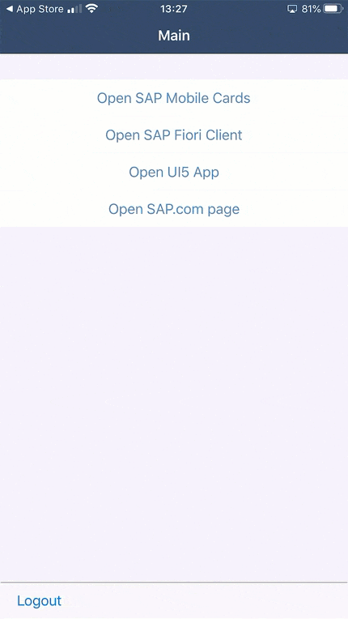

>**This tutorial has been executed using public store MDK client which has out of the box functionality to open the SAP standard apps like SAP Mobile Cards and SAP Fiori Client.
If you are building a custom version of Mobile development kit client, there you can implement deep links by specifying related custom URL scheme.**

[ACCORDION-BEGIN [Step 1: ](Create a new MDK project in SAP Business Application Studio)]

1. Launch the [Dev space](cp-mobile-bas-setup) in SAP Business Application Studio.

2. If you do not see the **Welcome** page, navigate to *View* menu &rarr; *Find Command* &rarr; search with *Welcome* to launch the Welcome page.

    !

3. In Welcome page, click **New project from template** .

    !

4. Select **MDK Project** and click **Next**.

    !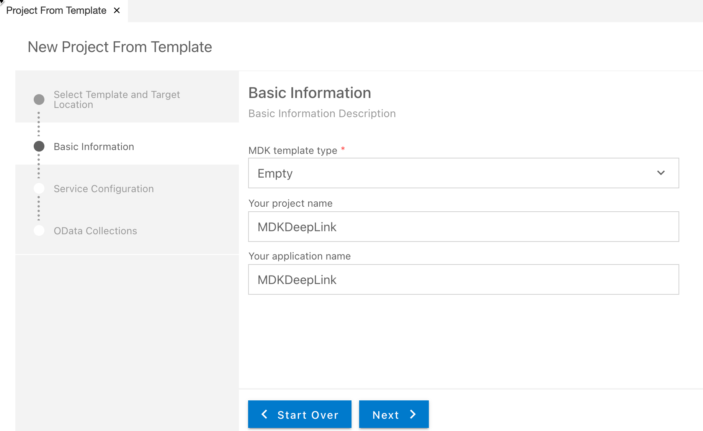

5. In *Basic Information* step, select or provide the below information and click **Next**:

    | Field | Value |
    |----|----|
    | `MDK Template Type`| Select `Empty` from the dropdown |
    | `Your Project Name` | `MDKDeepLink` |
    | `Your Project Name` | <default name is same as Project name, you can provide any name of your choice> |

    !

    >The _MDK Empty Project_ template creates a Logout action, Close page action, rule and an empty page (`Main.page`). After using this template, you can focus on creating your pages, other actions, and rules needed for your application.

    >More details on _MDK template_ is available in [help documentation](https://help.sap.com/doc/f53c64b93e5140918d676b927a3cd65b/Cloud/en-US/docs-en/guides/getting-started/mdk/webide.html#creating-a-new-project).

6. After clicking **Next**, the wizard will generate your MDK Application based on your selections. You should now see the `MDKDeepLink` project in the project explorer. As you have already opened the workspace, there is no need to open the generated project in new workspace or to add it to workspace. Ignore the pop-up or click the cross icon to hide the window.

    !

[DONE]
[ACCORDION-END]

[ACCORDION-BEGIN [Step 2: ](Create a new rule)]

In the MDK editor, you will create 4 new JavaScript files:

  * `OpenSAPMobileCards.js` to open SAP Mobile Cards app
  * `OpenSAPFioriClient.js` to open SAP Fiori Client app
  * `OpenUI5.js` to open an UI5 app running in SAP Fiori Client app
  * `OpenSAPcom.js` to open `SAP.com` web page

    >You can find more details about [writing a Rule](https://help.sap.com/doc/f53c64b93e5140918d676b927a3cd65b/Cloud/en-US/docs-en/guides/getting-started/mdk/development/rules.html).

1. Right-click the **Rules** folder | **New File**.

    !

2. Enter the file name `OpenSAPMobileCards.js`, click **OK**.

    Copy and paste the following code.

    ```JavaScript
    export default function openurl(clientAPI) {
        // Get the Nativescript UI Dialogs Module
        const dialogs = clientAPI.nativescript.uiDialogsModule;
        // Get the Nativescript Utils Module
        const utilsModule = clientAPI.nativescript.utilsModule;
        return dialogs.confirm("Do you want to leave the current app?").then((result) => {
            if (result === true) {
                //This will open SAP Mobile Cards app
                return utilsModule.openUrl("com.sap.content2go://").then(
                    (success) => Promise.resolve(success),
                    (failure) => Promise.reject('The requested app or page is not available ' + failure));
            } else {
                return Promise.reject('User Deferred');
            }
        });
    }
    ```
    !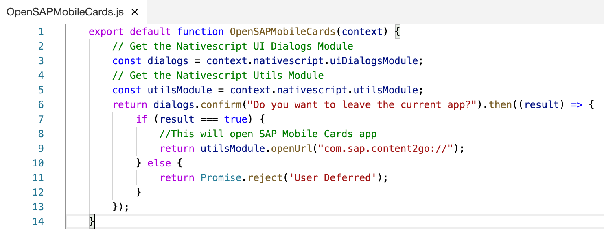

    >`openUrl` is a `NativeScript` API to open an URL on device. You can find more details about [this API](https://docs.nativescript.org/core-concepts/utils#openurl-function).

3. Save your changes to the `OpenSAPMobileCards.js` file.

4. Repeat the above step and create another new file:

    Enter the file name `OpenSAPFioriClient.js`, click **OK**.

    Copy and paste the following code.

    ```JavaScript
    export default function openurl(clientAPI) {
    // Get the Nativescript UI Dialogs Module
    const dialogs = clientAPI.nativescript.uiDialogsModule;
    // Get the Nativescript Utils Module
    const utilsModule = clientAPI.nativescript.utilsModule;
    return dialogs.confirm("Do you want to leave the current app?").then((result) => {
        if (result === true) {
            //This will open SAP Fiori Client App
        return utilsModule.openUrl("com.sap.fiori.client.xcallbackurl://x-callback-url").then(               
                (success) => Promise.resolve(success),
                (failure) => Promise.reject('The requested app or page is not available ' + failure));
        } else {
            return Promise.reject('User Deferred');
        }
    });
    }
    ```

    !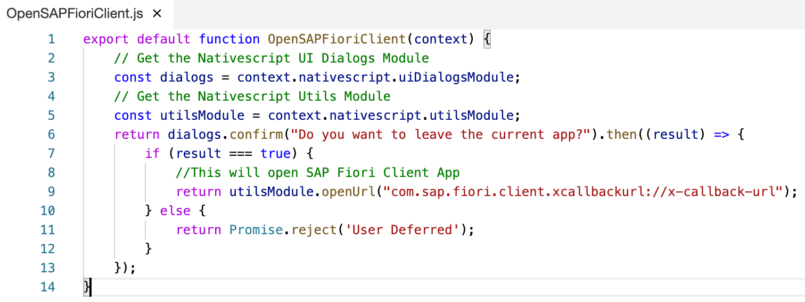

5. Save your changes to the `OpenSAPFioriClient.js` file.    

6. Repeat the above step and create another new file:

    Enter the file name `OpenUI5.js`, click **OK**.

    Copy and paste the following code.

    ```JavaScript
    export default function openurl(clientAPI) {
        // Get the Nativescript UI Dialogs Module
        const dialogs = clientAPI.nativescript.uiDialogsModule;
        // Get the Nativescript Utils Module
        const utilsModule = clientAPI.nativescript.utilsModule;
        return dialogs.confirm("Do you want to leave the current app?").then((result) => {
            if (result === true) {
                //This will open Software Downloads app running in SAP Fiori Client
                return utilsModule.openUrl("com.sap.fiori.client.xcallbackurl://x-callback-url/openFioriUrl?url=https://launchpad.support.sap.com/#/softwarecenter").then(
                    (success) => Promise.resolve(success),
                    (failure) => Promise.reject('The requested app or page is not available ' + failure));
            } else {
                return Promise.reject('User Deferred');
            }
        });
    }
    ```

    !

7. Save your changes to the `OpenUI5.js` file.   

8. Create one more file and name it to `OpenSAPcom.js`.

    Copy and paste the following code.

    ```JavaScript
    export default function openurl(clientAPI) {
        // Get the Nativescript UI Dialogs Module
        const dialogs = clientAPI.nativescript.uiDialogsModule;
        // Get the Nativescript Utils Module
        const utilsModule = clientAPI.nativescript.utilsModule;
        return dialogs.confirm("Do you want to leave the current app?").then((result) => {
            if (result === true) {
                //This will open SAP.com website
                return utilsModule.openUrl("https://www.sap.com").then(
                    (success) => Promise.resolve(success),
                    (failure) => Promise.reject('The requested app or page is not available ' + failure));
            } else {
                return Promise.reject('User Deferred');
            }
        });
    }
    ```

    !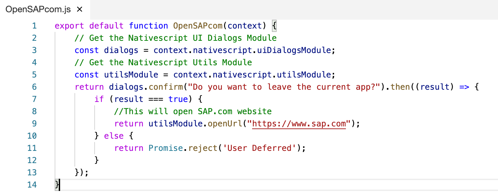

9. Save your changes to the `OpenSAPcom.js` file.

[DONE]
[ACCORDION-END]

[ACCORDION-BEGIN [Step 3: ](Add buttons on main page to open other apps or web pages)]

1. Next, on `Main.page`, drag and drop the **Section Button Table** Container control onto the Page.

    !

    >The controls available in Container section includes controls that act as containers for other controls, such as container items. A container is constant for all pages. The size of a container depends on the controls and contents included inside.  
    You can find more details about [Containers](https://help.sap.com/doc/69c2ce3e50454264acf9cafe6c6e442c/Latest/en-US/docs-en/reference/schemadoc/Page/SectionedTable/Container/ButtonTable.schema.html).

2. Now, you will add items to this Container control.

    Drag and drop the **Section Button** Container Item control onto the page.

    !

3. Repeat the above step, and drag and drop 3 more such **Section Button** Container Item controls.

    !

4. Select the first control and change its title to **Open SAP Mobile Cards**.

    !

5. Repeat the above step and change the title for other controls as below:

    !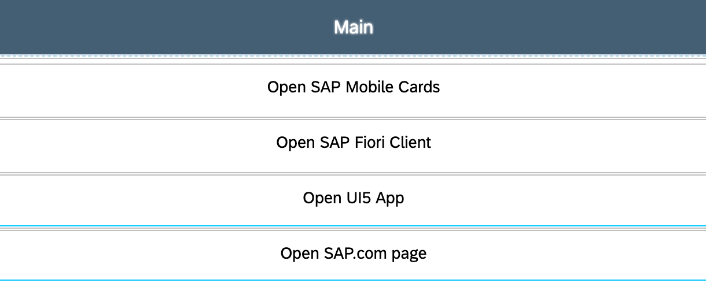

[VALIDATE_1]
[ACCORDION-END]

[ACCORDION-BEGIN [Step 4: ](Set onPress handler to the buttons)]

1. In this step, you will bind the JavaScript files to the `OnPress` of each button.

    In `Main.page`, select **Open SAP Mobile Cards** button. In the Properties pane, click the **Events** tab, click the **link icon** for the `Handler` property to open the object browser.

    Double-click the `OpenSAPMobileCards.js` and click **OK** to set it as the `OnPress` action.

    !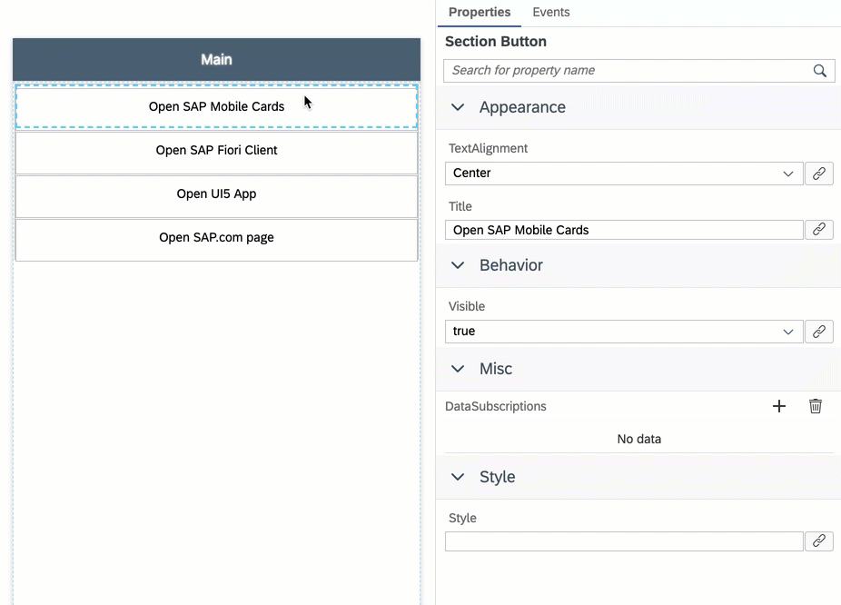

3. Repeat the same and do the following:

    Set the handler for **Open SAP Fiori Client** button to `OpenSAPFioriClient.js`.

    Set the handler for **Open UI5 App** button to `OpenUI5.js`.

    Set the handler for **Open SAP.com page** button to `OpenSAPcom.js`.

[DONE]
[ACCORDION-END]

[ACCORDION-BEGIN [Step 5: ](Deploy and activate the application)]

So far, you have learned how to build an MDK application in the SAP Business Application Studio editor. Now, we deploy this application definition to Mobile Services.

1. Right-click `Application.app` and select **MDK: Deploy**.

    !

2. Verify the URL and **Click Enter** on your keyboard.

    !   

    >SAP Business Application Studio pre-populates the end-point of the environment it is running in. If you want to connect to a different environment, modify the API endpoint by copying it from your target SAP Cloud Platform account: *SAP Cloud Platform Cockpit &rarr; Sub-account &rarr; API Endpoint*

3. Select the organisation in which you have enabled Mobile Services.

    !   

4. Select the space in which you have enabled Mobile Services.

    !   

5. Select the an application from Mobile Services.

    !   

    Upon successful setup, you should see **Deploy Succeeded** message.

    !

    >MDK editor stores deployment details in `.project.json` file. When you deploy to same configuration next time, you will not be asked for above details, MDK editor will pick up these details from `.project.json` file.

[DONE]
[ACCORDION-END]

[ACCORDION-BEGIN [Step 6: ](Populate the QR code for app onboarding)]

SAP Business Application Studio has a feature to generate QR code for app onboarding.

Double-click the `Application.app` to open it in MDK Application Editor and click **Application QR Code** icon to populate the QR code.

!

!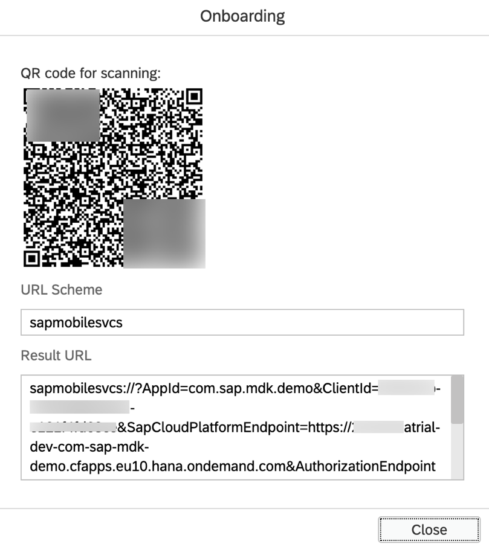

[DONE]
[ACCORDION-END]

[ACCORDION-BEGIN [Step 7: ](Run the app in MDK client)]

>Make sure you are choosing the right device platform tab above. Once you have scanned and onboarded using the onboarding URL, it will be remembered. When you Log out and onboard again, you will be asked either to continue to use current application or to scan new QR code.

[OPTION BEGIN [Android]]

1. Follow [these steps](https://github.com/SAP-samples/cloud-mdk-tutorial-samples/blob/master/Onboarding-Android-client/Onboarding-Android-client.md) to on-board the MDK client.

    Once you accept app update, you will see **Main** page with the buttons you added in previous step 3.

    !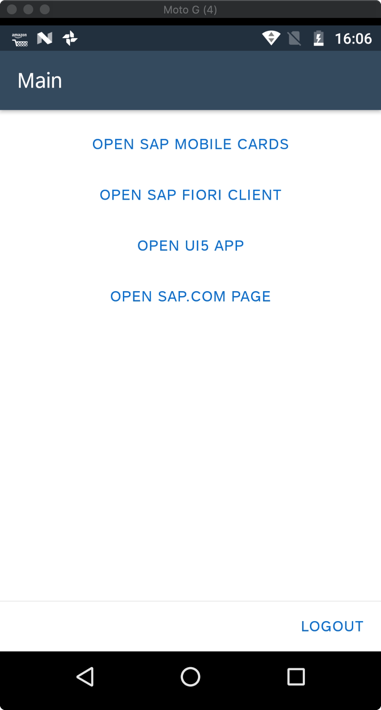

2. Tap **OPEN SAP MOBILE CARDS** and then tap **OK**.

    !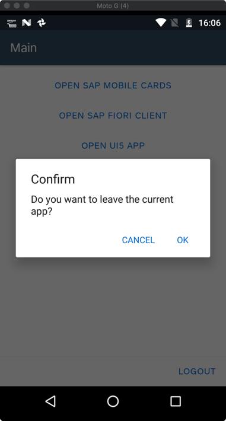

    If you have already installed SAP Mobile Cards app, then MDK app will open it.

    !

3. Tapping **OPEN SAP FIORI CLIENT** will open **SAP Fiori Client** app.

    >If you have access to any Fiori app or Fiori Launchpad page for example [SAP Support Launchpad](https://launchpad.support.sap.com), then enter that URL in your Fiori Client app.

    !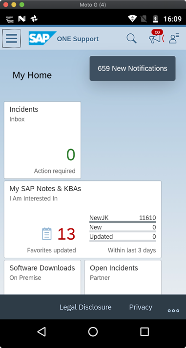

4. Tapping on **OPEN UI5 APP** will open a specific app running in SAP Fiori Client as per `OpenUI5.js` file.

    In below screenshot, there is one Software Downloads UI5 app part of SAP Support Launchpad.

    !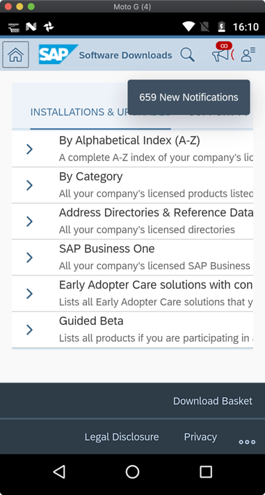

5. Tapping on **OPEN SAP.COM PAGE** will open SAP website.

    !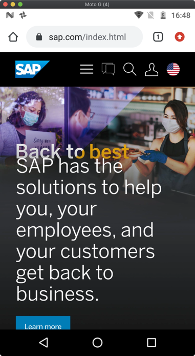

[OPTION END]

[OPTION BEGIN [iOS]]

1. Follow [these steps](https://github.com/SAP-samples/cloud-mdk-tutorial-samples/blob/master/Onboarding-iOS-client/Onboarding-iOS-client.md) to on-board the MDK client.

    Once you accept app update, you will see **Main** page with the buttons you added in previous step 3.

    !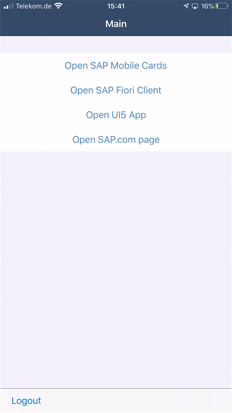

2. Tap **Open SAP Mobile Cards** and then tap **OK**.

    !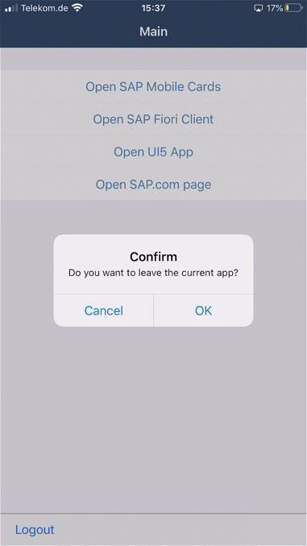

    If you already installed SAP Mobile Cards app, then MDK app will open it.

    !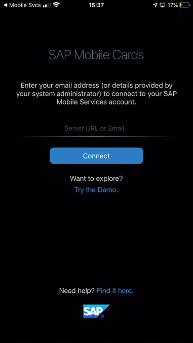

3. Tapping **Open SAP Fiori Client** will open **SAP Fiori Client** app.

    >If you have access to any Fiori app or Fiori Launchpad page for example [SAP Support Launchpad](https://launchpad.support.sap.com), then enter that URL in your Fiori Client app.

    !

4. Tapping on **Open UI5 App** will open a specific app running in SAP Fiori Client as per `OpenUI5.js` file.

    In below screenshot, there is one Software Downloads UI5 app part of SAP Support Launchpad.

    !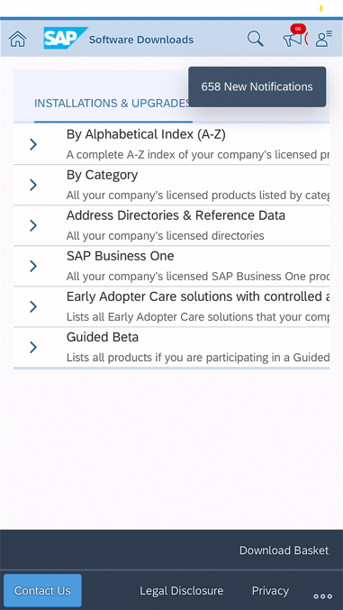

5. Tapping on **Open SAP.com page** will open SAP website.

    !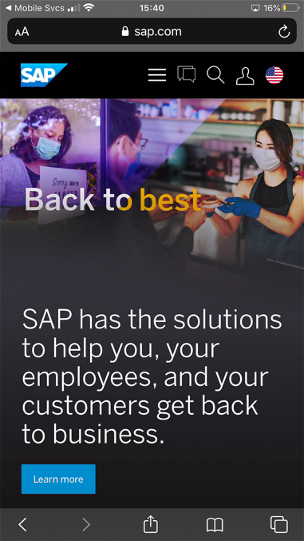

[OPTION END]

>Once you have scanned and onboarded using the onboarding URL, it will be remembered. When you Log out and onboard again, you will be asked either to continue to use current application or to scan new QR code.

**Congratulations!** You have successfully implemented Deep Linking to Another App from your MDK App and you are now all set to [Use OData Annotations to Add CRUD Functionality to an MDK App](cp-mobile-dev-kit-annotations).

[DONE]
[ACCORDION-END]

---
