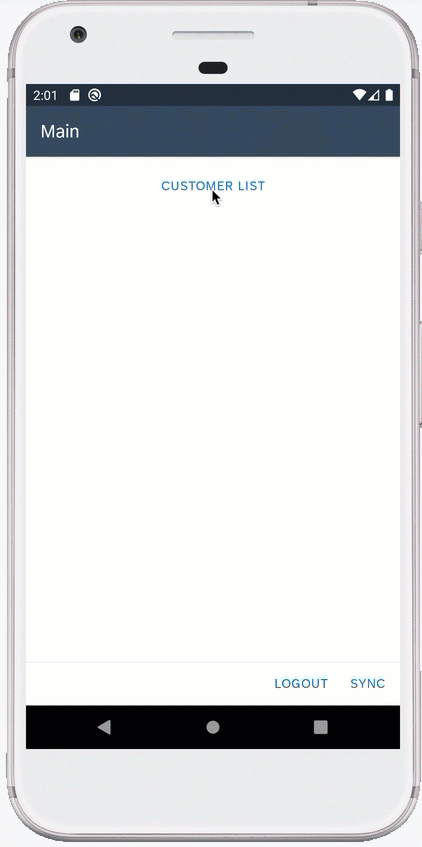
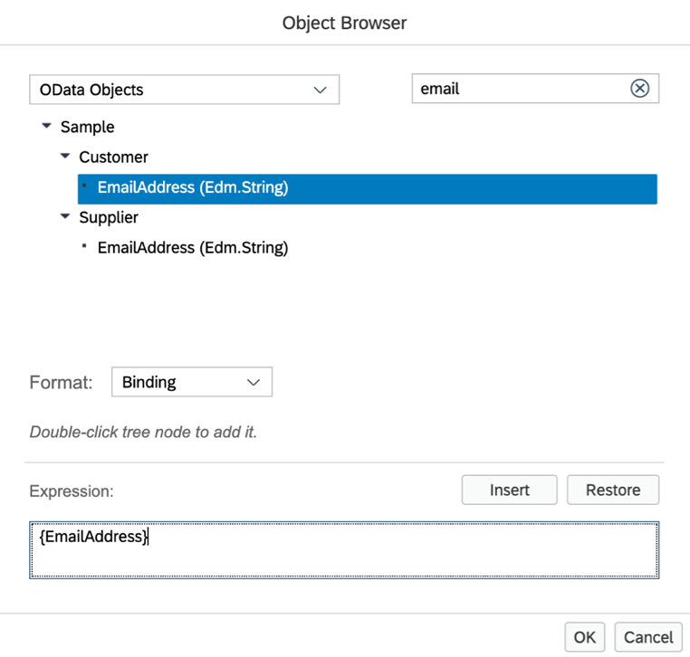
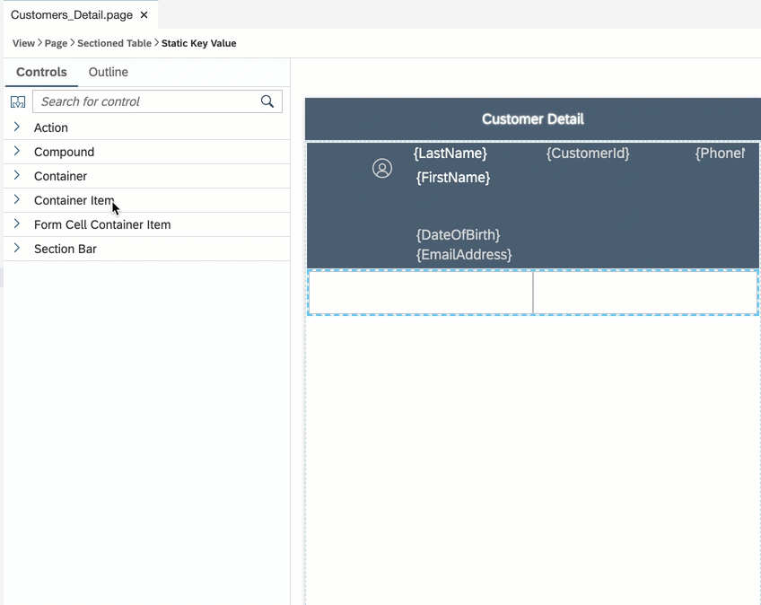
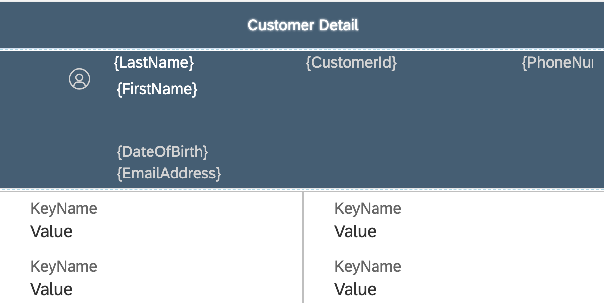
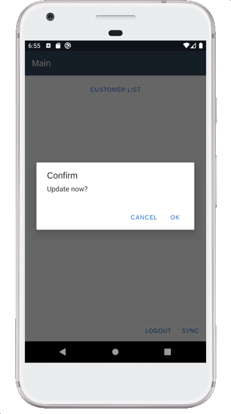
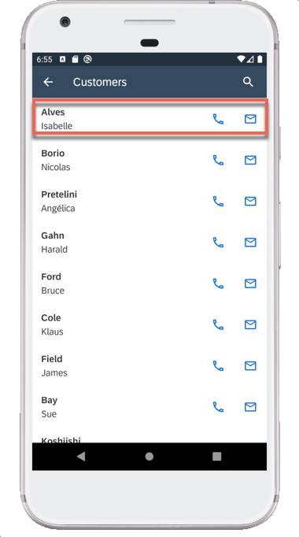
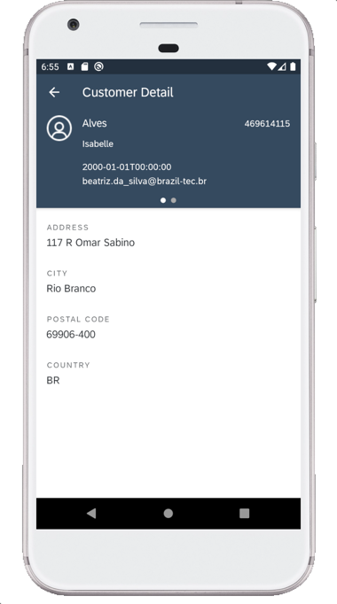
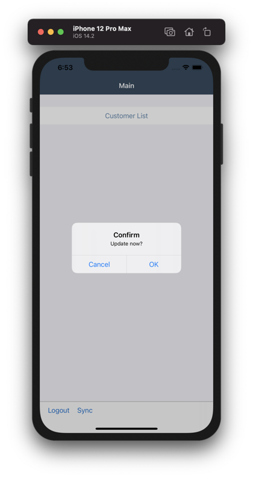
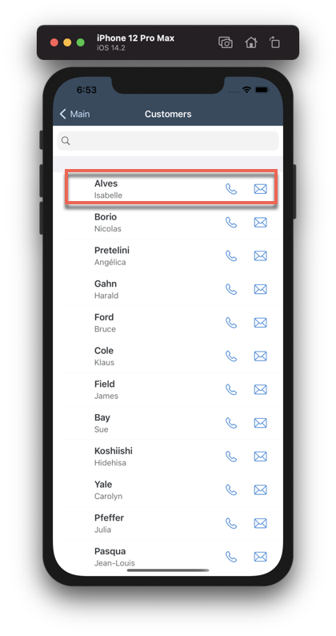
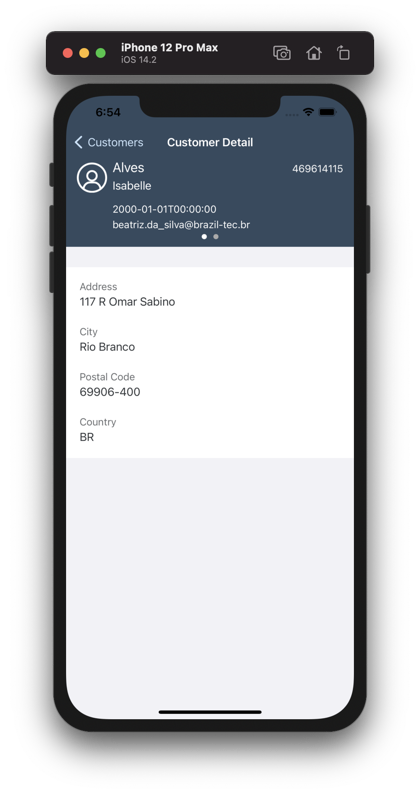

## Details
### You will learn
  - How to create a new page and add some controls to display customer information
  - How to navigate from one page to another page

---

To enhance your MDK app with customer details information, you need to carry out the following tasks:

*  Create a new customer details page
*  Add some controls to the page to display information like id, name, email, phone, address
*  Create a new navigation action to the customer details page
*  Navigate from customer list page to details page
*  Deploy app metadata to SAP Cloud Platform Mobile Services
*  Update the app with new changes

[ACCORDION-BEGIN [Step 1: ](Create the customer detail page)]

This page will show related details for a customer. In this page, you will add an **Object Header** control that is used to display information (like first name, last name, date of birth, email address & phone number) about the header of an object and **Static Key Value** control to display key value pair items like address, city, postal code & country.

1. In SAP Business Application Studio project, Right-click the **Pages** folder | **MDK: New Page** | **Section Page** | **Next**.

    !

2. Enter the Page Name `Customers_Detail` and click **Next** and the **Finish** on the Confirmation step.

    !

3. In the **Properties** pane set the Caption to **Customer Detail**.

    !

4. Next, you will add an **Object Header** container to display information like first name, last name, date of birth, email address & phone number.

    In the Layout Editor, expand the **Controls** | **Container** section, drag and drop the **Object Header** control onto the page area.

    !

5. Now, you will replace the default values of the control's properties with the values from customer entity.

    In the Properties pane, click the **link icon** to open the Object Browser for the `BodyText` property.

    Double click the `DateOfBirth` property of the Customer entity to set it as the binding expression and click **OK**.

    !

6. Repeat the above steps binding below Properties:

    | Property | Value |
    |----|----|
    | `Description` | `CustomerId` |
    | `FootNote`| `EmailAddress` |
    | `HeadlineText`| `LastName` |
    | `Status` | `PhoneNumber` |
    | `Subhead` | `FirstName` |

    >Make sure to select values for the mentioned properties only from **Customer** Entity. You may find similar values from other entities. For example,
    !

7. As enough fields have been selected to be displayed on the detail page, `SubStatus` and `Tags` are not required for this tutorial. In a real use case, you may need these properties.

    Remove the default value for `SubStatus` properties.

8. Also, delete items under `Tags`.

    !

    Page should look like below.

    !

9. In the main area of the page, let's display some other details like; address, city, postal code, county.

    Drag and drop a **Static Key Value** container onto the page under the **object header**.

    !

10. Expand the **Container Item** section of the Controls palette and drag and drop a **Key Value Item** onto the **Static Key Value** container on the page.

    !

11. Repeat the process and drag three more Key Value Items onto the **Static Key Value** section so you have a total of four when you are done.

    !

12. Select the **upper left** Key Value Item and set the `KeyName` to **Address**.

    !

13. For this tutorial, you will set the value as a combined binding of house number and street. You can find more details about [Target Path](https://help.sap.com/doc/f53c64b93e5140918d676b927a3cd65b/Cloud/en-US/docs-en/guides/getting-started/mdk/development/property-binding/target-path.html).

    Start with first part of the binding for **Address** property.

    Click the **link icon** next to the **Value** field to display the Object Browser and change the Format to **Binding Target Path**.

    Click the **checkbox** for _Current Object_ and double click `HouseNumber` to set it as the first part of the binding.

    !

    >Be careful not to select `HouseNumber` from `Address (ESPM.Address)`, final expression should be as per above animation.

    Now, set second part of the binding.

    The cursor will be at the end of binding in the Expression field. Add a space and then select **Street** property and click **Insert**.

    Click **OK** to set the binding.

    !

    >Be careful not to double click **Street** as that will replace the existing expression with just the Street property.

    >**Street** should be selected from **Customer** entity.

14. Select the **upper right** Key Value Item and set the `KeyName` to **City**.

    !

    Click the link icon to display the Object Browser. Change the format to **Binding** and double click the **City** property of the Customer entity to set it as the binding expression.

    Click **OK** to set the binding.

    !

    >Be careful not to select **City** from `Customer.Address (ESPM.Address)` collection, final expression should be as per above screenshot.

15. Repeat the process and set the **lower left** Key Value Item Key Name to **Postal Code** and bind the value to the Postal Code entity property.

16. Repeat the process and set the **lower right** Key Value Item Key Name to **Country** and bind the value to the Country entity property.

    >Be careful not to select _Postal Code_ & _City_ from Customer.Address (ESPM.Address) collection, final expression should be as per below screenshot.

    

[VALIDATE_1]
[ACCORDION-END]

[ACCORDION-BEGIN [Step 2: ](Create a navigation action)]

Now, you will create a Navigation action that opens the `Customers_Detail.page` when called.

1. In SAP Business Application Studio project, right-click the **Actions** folder | **MDK: New Action** | choose **MDK UI Actions** in **Category** | click **Navigation Action** | **Next**.

    !

2. Provide the below information:

    | Field | Value |
    |----|----|
    | `Action Name`| `NavToCustomers_Detail` |
    | `Page to Open` | Select `Customers_Detail.page` from the dropdown |

    !

3. Click **Next** and then **Finish** on the confirmation step.

[DONE]
[ACCORDION-END]

[ACCORDION-BEGIN [Step 3: ](Set the OnPress of the customer list)]

1. Go back to the `Customers_List page` and set the `OnLoaded` event of the Contact Cell table control. You will link the Contact Cell table control to the `NavToCustomers_Detail.action` so that when an end-user selects a customer, the Customer Detail page will open. MDK automatically passes the selected customer to the detail page.

2. In `Customers_List page`, select the **Contact Cell Table** control, **click** the link icon under the **Events** tab for the `OnPress` property to open the Object Browser.

3. Double click the `NavToCustomers_Detail.action` and click **OK** to set it as the `OnPress` Action.

    !

4. Save the changes to the `Customers_List page`.

[DONE]
[ACCORDION-END]

[ACCORDION-BEGIN [Step 4: ](Deploy and activate the application)]

Deploy the updated application to your MDK client.

Right-click `Application.app` and select **MDK: Deploy**.

!

You should see **Deploy Succeeded** message.

!

[DONE]
[ACCORDION-END]

[ACCORDION-BEGIN [Step 5: ](Test the application)]

>Make sure you are choosing the right device platform tab above.

[OPTION BEGIN [Android]]

1. Re-launch the app on your device, you may asked to authenticate with passcode or Fingerprint. You will see a _Confirmation_ pop-up, tap **OK**.

    

2. Tap **CUSTOMER LIST**, you will navigate to Customer List page.

    

3. Tap any record from the list, you will navigate to it's detail page.

    

[OPTION END]

[OPTION BEGIN [iOS]]

1. Re-launch the app on your device, you may asked to authenticate with passcode or Touch ID. You will see a _Confirmation_ pop-up, tap **OK**.

    

2. Tap **Customer List**, you will navigate to Customer List page.

    

3. Tap any record from the list, you will navigate to it's detail page.

    

[OPTION END]

>_Are you wondering how exactly MDK knew that clicking on a record in  list page would display respective record in detail page?_

>The MDK sets the current object to the selected record when running the on press action on the list.  The detail page then just needs to reference the correct properties assuming they are part of the object from the list page. You can look at [documentation](https://help.sap.com/doc/f53c64b93e5140918d676b927a3cd65b/Cloud/en-US/docs-en/guides/getting-started/mdk/development/action-binding-and-result.html#auto-set-action-binding) for more details.

**Congratulations**! You have successfully created a Customer Detail page and you are now all set to [Modify a Customer Record in an MDK App](cp-mobile-dev-kit-edit-customer).

[DONE]
[ACCORDION-END]

---
