## Details
### You will learn
  - How to create a new page for modifying customer details such as name, email and phone number
  - How to store changes locally
  - How to sync local changes with backend

---

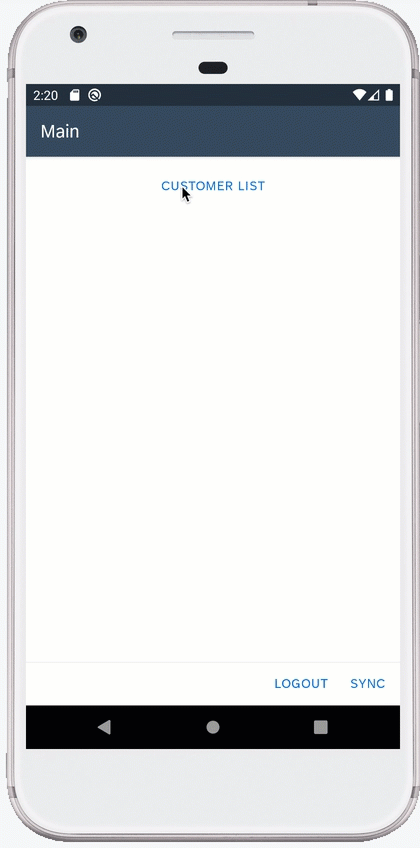

[ACCORDION-BEGIN [Step 1: ](Create a new page for modifying customer data)]

Regardless of whether your application is online or offline, you can allow users to modify data in the application.

For online applications, the changes are saved to the backend immediately.

For offline applications, the changes are stored locally until they are synced using an Upload action.

In this step, you will create the _Edit Customer Detail_ page as a **Form Cell Page**. This type of page allows for form input style changes. The page will provide only a subset of items available on the Customer Detail page. You will add the fields that will be editable by the end-user.

1. Right-click the **Pages** folder | **MDK: New Page** | **Form Cell Page** | **Next**.

    !

    >A Form Cell Page is suitable for pages that generate new objects or modify existing objects. It includes a form cell container by default. You can add form sections, multiple containers or action controls to this page. Under each container section, you can add various container items.

    >You can find more details about [Form Cell page](https://help.sap.com/doc/f53c64b93e5140918d676b927a3cd65b/Cloud/en-US/docs-en/guides/features/fiori-ui/mdk/formcell-page.html).

2. Enter the Page Name `Customers_Edit` and click **Next** and the **Finish** on the Confirmation step.

    !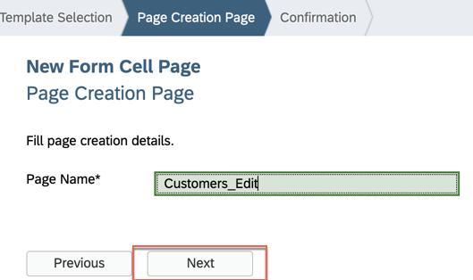

3. In the **Properties** pane set the Caption to **Update Customer**.

    !

4. Now, you will add the fields (like first name, last name, phone & email address) that will be editable by the end-user.

    In the Layout Editor, expand the **Control** | **Container Item** section.

    Drag and drop a **Simple Property** onto the Page area.

    !

5. Drag and drop three additional Simple Property controls onto the page so you have four total controls.

    !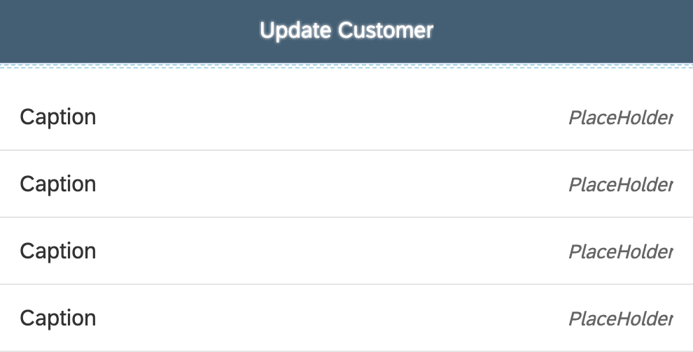

6. Select the first **Simple Property control** and provide the below information:

    | Property | Value |
    |----|----|
    | `Name`| `FCFirstName` |
    | `Caption` | `First Name` |
    | `IsEditable`| Select `true` from the dropdown |
    | `Value`| bind it to `FirstName` property of the Customer entity |

    !

    >Make sure, Format should be set as _Binding_.

    !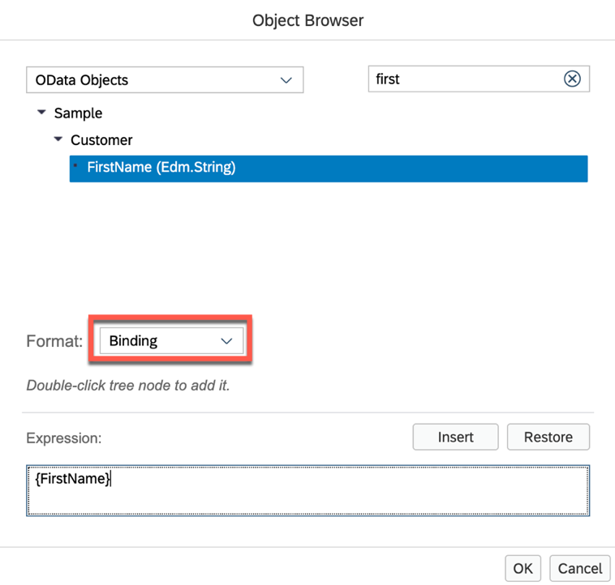

7. Select the second Simple Property control and provide the below information:

    | Property | Value |
    |----|----|
    | `Name`| `FCLastName` |
    | `Caption` | `Last Name` |
    | `IsEditable`| Select `true` from the dropdown |
    | `Value`| bind it to `LastName` property of the Customer entity |

    !

8. Select the third Simple Property control and provide the below information:

    | Property | Value |
    |----|----|
    | `Name`| `FCPhone` |
    | `Caption` | `Phone` |
    | `IsEditable`| Select `true` from the dropdown |
    | `Value`| bind it to `PhoneNumber` property of the Customer entity |

    !

9. Select the last Simple Property control and provide the below information:

    | Property | Value |
    |----|----|
    | `Name`| `FCEmail` |
    | `Caption` | `Email` |
    | `IsEditable`| Select `true` from the dropdown |
    | `Value`| bind it to `EmailAddress` property of the Customer entity |

    !

[VALIDATE_2]
[ACCORDION-END]

[ACCORDION-BEGIN [Step 2: ](Define a close page-cancel action)]

You will create a `CloseModalPage_Cancel.action` that closes the current page and cancels or interrupts any execution in process. This will be used with the cancel button on the **Edit Customer page**.

>You can close pages with the option to terminate ongoing events or wait until they are complete. Visit [documentation](https://help.sap.com/doc/69c2ce3e50454264acf9cafe6c6e442c/Latest/en-US/docs-en/reference/schemadoc/Action/ClosePage.schema.html)for more details about Close Page Action.

1. Right-click the **Actions** folder | **MDK: New Action** | choose **MDK UI Actions** in **Category** | click **Close Page Action** | **Next**.

    !

2. Provide the below information:

    | Property | Value |
    |----|----|
    | `Action Name`| `CloseModalPage_Cancel` |
    | `DismissModal` | Select `Canceled` from the dropdown |
    | `CancelPendingActions`| Select `true` from the dropdown |

    !

3. Click **Next** and then **Finish** on the confirmation step.

[DONE]
[ACCORDION-END]

[ACCORDION-BEGIN [Step 3: ](Add cancel button on the Edit Customer page)]

Now, you will add a button on the Edit Customer page and set it's `onPress` to `CloseModalPage_Cancel.action` created in step 2.

1. Drag and drop an **Action Bar Item** control to the upper left corner of the action bar.

    >Action Bar Item is a button that users can use to fire actions when pressed. You can add an Action Bar Item only to the Action Bar (at the top of the page).

    !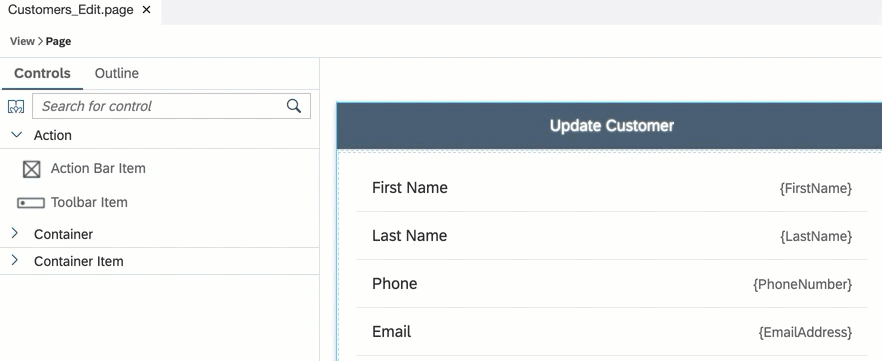

2. In the Properties pane, click the **link icon** to open the object browser for the **System Item** property.

    Double-click the **Cancel** type and click **OK**.

    !

    >System Item are predefined system-supplied icon or text. Overwrites _Text_ and _Icon_ if specified.

3. Now, you will set the `onPress` event to `CloseModalPage_Cancel.action`.

    In **Events** tab, click the **link icon** for the `OnPress` property to open the object browser.

    Double-click the `CloseModalPage_Cancel.action` and click **OK** to set it as the `OnPress` Action.

    !

[DONE]
[ACCORDION-END]

[ACCORDION-BEGIN [Step 4: ](Create navigation action)]

Now, create a navigation action that will open the `Customers_Edit.page` when executed.

1. Right-click the **Actions** folder | **MDK: New Action** | choose **MDK UI Actions** in **Category** | click **Navigation Action** | **Next**.

    !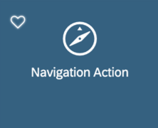

2. Provide the below information:

    | Property | Value |
    |----|----|
    | `Action Name`| `NavToCustomers_Edit` |
    | `PageToOpen` | Select `Customers_Edit.page` from the dropdown |
    | `ModalPage`| Select `true` from the dropdown |

    !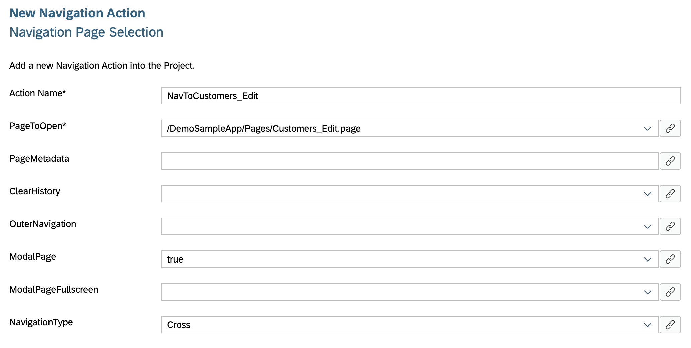

3. Click **Next** and then **Finish** on the confirmation step.

[DONE]
[ACCORDION-END]

[ACCORDION-BEGIN [Step 5: ](Add edit button to customer details page)]

You will add a button to the `Customers_Detail.page` called **Edit**. You will link this button to the navigation action you just created. This event will open the `Customers_Edit.page` when the Edit button is pressed by the end-user.

1. In `Customers_Detail.page`, drag and drop an **Action Bar Item** to the upper right of the action bar.

    !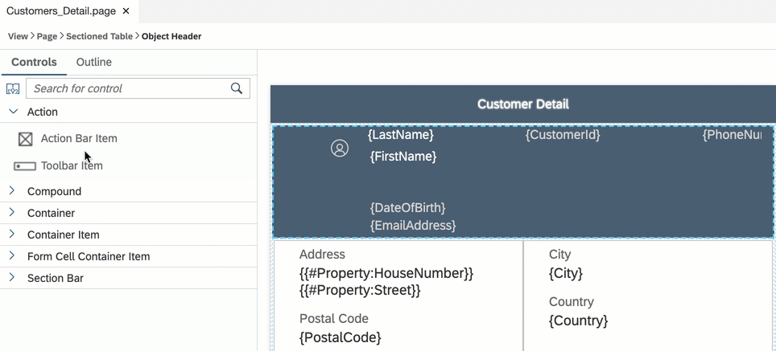

2. Click the **link icon** to open the object browser for the **System Item** property.

    Double-click the **Edit** type and click **OK**.

    !

3. In the Properties pane, click the **Events** tab, click the **link icon** for the `OnPress` property to open the object browser.

    Double-click the `NavToCustomers_Edit.action` and click **OK** to set it as the `OnPress` Action.

    !

[DONE]
[ACCORDION-END]

[ACCORDION-BEGIN [Step 6: ](Store the updated data locally)]

The next step is to store newly updated record locally for an offline application or send the updated record directly back to the backed for online applications. You will now create an action to map the changes received from the `Customers_Edit.page` to the corresponding field in the OData service. You will also show a failure message if the update action fails to save the changes.

First, define a failure message.

1. Right-click the **Actions** folder | **MDK: New Action** | choose **MDK Message Actions** in **Category** | click **Message Action** | **Next**.

    !

2. Provide the below information:

    | Property | Value |
    |----|----|
    | `Action Name`| `UpdateCustomerEntityFailureMessage` |
    | `Type` | Select `Message` from the dropdown |
    | `Message` | `Failed to Save Customer Updates` |
    | `Title` | `Update Customer` |
    | `OKCaption` | `OK` |
    | `OnOK` | `--None--` |
    | `CancelCaption` | leave it blank |
    | `OnCancel` | `--None--` |

    !

3. Click **Next** and then **Finish** on the confirmation step.

4. Next, you will define **Close Page-Complete Action** which allows the end-user to close the page and allow any execution to continue.

    >You can close pages with the option to terminate ongoing events or wait until they are complete.

    Right-click the **Actions** folder | **MDK: New Action** | choose **MDK UI Actions** in **Category** | click **Close Page Action** | **Next**.

    !

5. Provide the below information:

    | Property | Value |
    |----|----|
    | `Action Name` | `CloseModalPage_Complete` |
    | `DismissModal` | Select `Completed` from the dropdown |
    | `CancelPendingActions` | Select `false` from the dropdown |

    !

6. Click **Next** and then **Finish** on the confirmation step.

7. Next, you will create the **OData Update action** to update entity action that will map the changes to the correct entities in the OData service and save the changes.

    >You can find more details about [Update Entity Action](https://help.sap.com/doc/69c2ce3e50454264acf9cafe6c6e442c/Latest/en-US/docs-en/reference/schemadoc/Action/ODataService/UpdateEntity.schema.html).

    Right-click the **Actions** folder | **MDK: New Action** | choose **MDK Data Actions** in **Category** | click **OData Action** | **Next**.

    !

8. Provide the below information:

    | Property | Value |
    |----|----|
    | `Action Name`| `Customers_UpdateEntity` |
    | `Type` | Select `UpdateEntity` from the dropdown |
    | `Service`| Select `SampleService.service` from the dropdown |
    | `EntitySet`| Select `Customers` from the dropdown |
    | `ReadLink`| click link icon and Double-click `readLink` |

    !

    >The `readLink` is a direct reference to an individual entity set entry.

9. Click **Next**.

10. In **Property and Update Links** step, uncheck **City**.

11. Since in `Customers_Detail.page`, you defined four properties (First Name, Last Name, Phone & Email) to be edited, now, in this step, you will bind them to respective UI Controls.

    Check the `EmailAddress` property and click the **link icon** to open the object browser.

    Change the drop down in the object browser to `Controls & ClientData`, click the **Current Page** radio button.

    In the search box start typing the control name `FCEmail`. The list will filter down to show the matching values. Double-click the **Value (Value)** entry under the `FCEmail` field and click **OK** to set binding.

    !

12. Repeat the above step for remaining properties: `FirstName`, `LastName` and `PhoneNumber`.

    !

    Click **Next** and **Finish** on the confirmation screen. The action editor will open with the `Customers_UpdateEntity.action` loaded.

13. Next, define _Success_ and _Failure_ actions for `Customers_UpdateEntity.action`.

    In the action editor for the new action, expand the **Common Action Properties** and provide the below information:

    | Property | Value |
    |----|----|
    | `Success Action` | Select `CloseModalPage_Complete.action` from the dropdown |
    | `Failure Action` | Select `UpdateCustomerEntityFailureMessage.action` from the dropdown |

    >When `Customers_UpdateEntity.action` gets executed successfully then `CloseModalPage_Complete.action` will be triggered or if `Customers_UpdateEntity.action` fails then `UpdateCustomerEntityFailureMessage.action` will be triggered.

    !

14. Next, you will set the `OnPress` event of the _Save_ button.

    Now, that the Update action is created, you will need to call the Update action when the end-user presses the **Save** button. You will add a **Save** button on the `Customers_Edit.page` and link it to the `Customers_UpdateEntity.action`.

    In `Customers_Edit.page`, **drag and drop** an **Action Bar Item** to the upper right corner of the action bar.

    !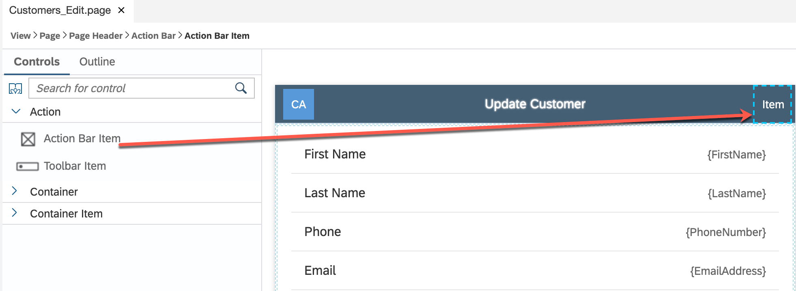

    Click the **link** icon to open the object browser for the **System Item** property.

    Double-click the **Save** type and click **OK**.

    !

15. In the Properties pane | **Events** tab, click the **link** icon for the `OnPress` property to open the object browser, bind it to `Customers_UpdateEntity.action`.

    !

[DONE]
[ACCORDION-END]

[ACCORDION-BEGIN [Step 7: ](Deploy and activate the application)]

Deploy the updated application to your MDK client.

Right-click `Application.app` and select **MDK: Deploy**.

!

You should see **Deploy Succeeded** message.

!

[VALIDATE_3]
[ACCORDION-END]

[ACCORDION-BEGIN [Step 8: ](Test the application)]

>Make sure you are choosing the right device platform tab above.

[OPTION BEGIN [Android]]

1. Re-launch the app on your device, you may asked to authenticate with passcode or Fingerprint. You will see a _Confirmation_ pop-up, tap **OK**.

2. Tap **CUSTOMER LIST**, tap one of the available customer record,  you will then navigate to Customer detail page. Tap `edit` icon.

    

3. For example, updating First Name from `Sebastien` to `Rob`. Tap save icon.

    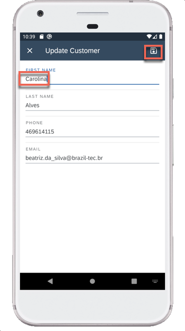

    Local record gets updated accordingly.

    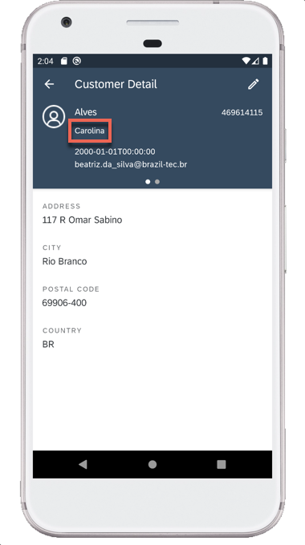

4. You can cross verify if a record has been updated in the backend.

    >Backend URL can be found in [Mobile Services Cockpit](https://developers.sap.com/tutorials/cp-mobile-dev-kit-ms-setup.html).

    >Mobile Applications | Native/Hybrid | click the MDK App com.sap.mdk.demo | Mobile Sample OData ESPM | click Root URL `v2` | add `/Customers`/ at the end of the URL

    But here result is pointing to old First Name (`Sebastien`).

    

    Since this is an Offline application, new entry is added to the request queue of the local store which needs to be sent or uploaded to the backend explicitly.  

    >MDK base template has added a **Sync** button on main page of the app to upload local changes from device to the backend and to download the latest changes from backend to the device. Actions | Service | `UploadOffline.action` & `DownloadOffline.action`.

5. On Main page, tap **SYNC**, a successful message will be shown.

    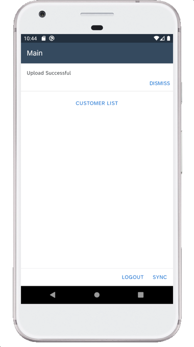

[OPTION END]

[OPTION BEGIN [iOS]]

1. Re-launch the app on your device, you may asked to authenticate with passcode or Touch ID. You will see a _Confirmation_ pop-up, tap **OK**.

2. Tap **Customer List**, tap one of the available customer record,  you will then navigate to Customer detail page. Tap **Edit**..

    

3. For example, updating First Name from `Sebastien` to `Rob`. Tap **Save**.

    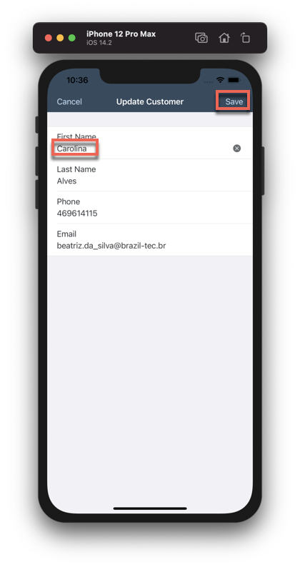

    Local record gets updated accordingly.

    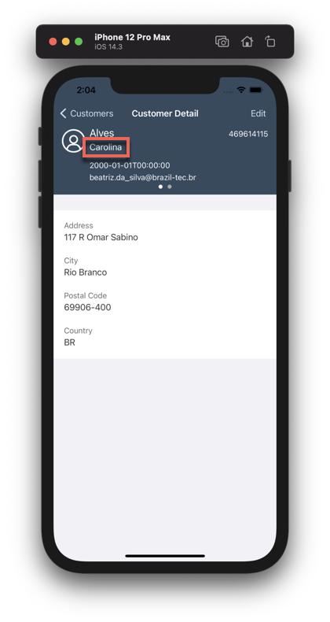

4. You can cross verify if a record has been updated in the backend.

    >Backend URL can be found in [Mobile Services Cockpit](https://developers.sap.com/tutorials/cp-mobile-dev-kit-ms-setup.html).

    >Mobile Applications | Native/Hybrid | click the MDK App com.sap.mdk.demo | Mobile Sample OData ESPM | click Root URL `v2` | add `/Customers`/ at the end of the URL

    But here result is pointing to old First Name (`Sebastien`).

    

    Since this is an Offline application, new entry is added to the request queue of the local store which needs to be sent or uploaded to the backend explicitly.  

    >MDK base template has added a **Sync** button on main page of the app to upload local changes from device to the backend and to download the latest changes from backend to the device. Actions | Service | `UploadOffline.action` & `DownloadOffline.action`.

5. On Main page, tap **Sync**, a successful message will be shown.

    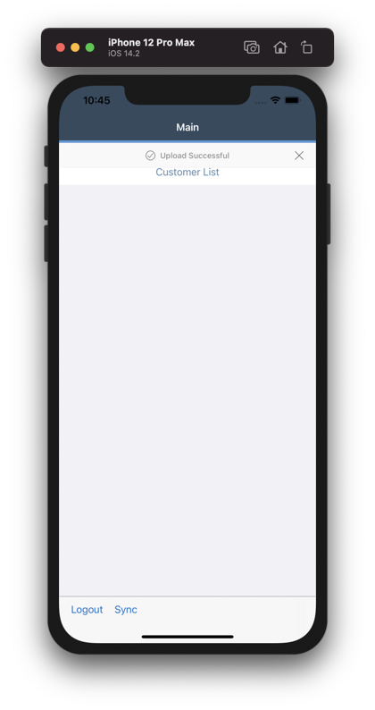

[OPTION END]

Now, refresh the URL to check if record has been updated in the backend. As Sync is pressed, `UploadOffline.action` gets triggered to upload local changes from device to the backend and on success of this call, `DownloadOffline.action` is being called.

**Congratulations!** You have successfully modified a Customer Record and you are now all set to [Define a Validation Rule in an MDK App](cp-mobile-dev-kit-add-validation).

[VALIDATE_1]
[ACCORDION-END]

---
