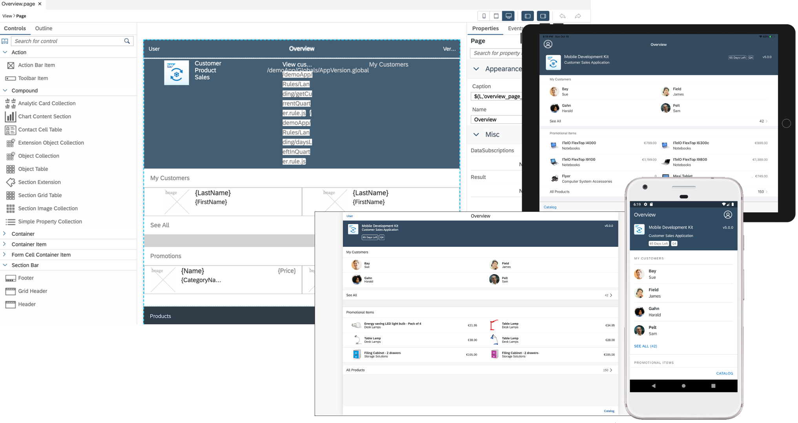
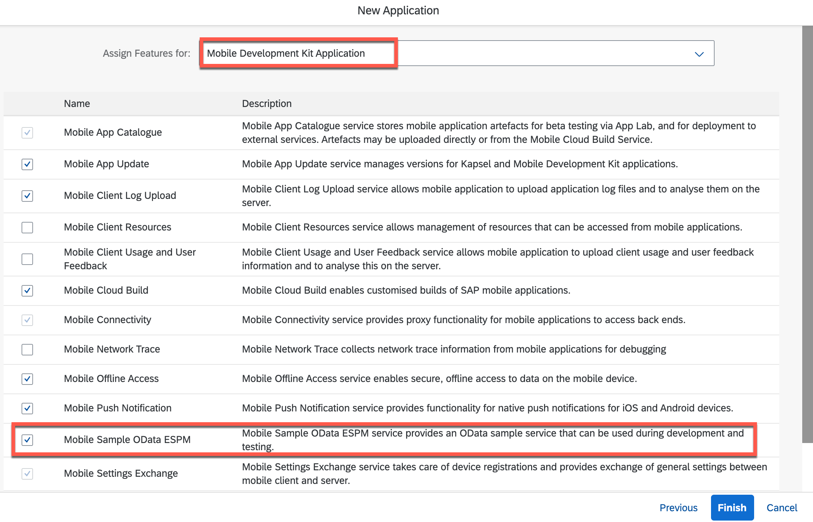
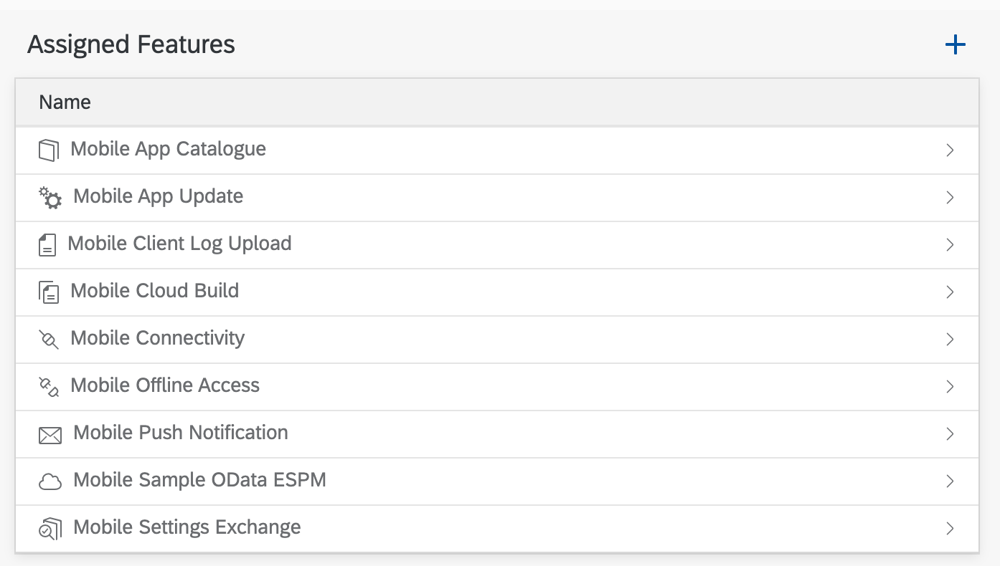
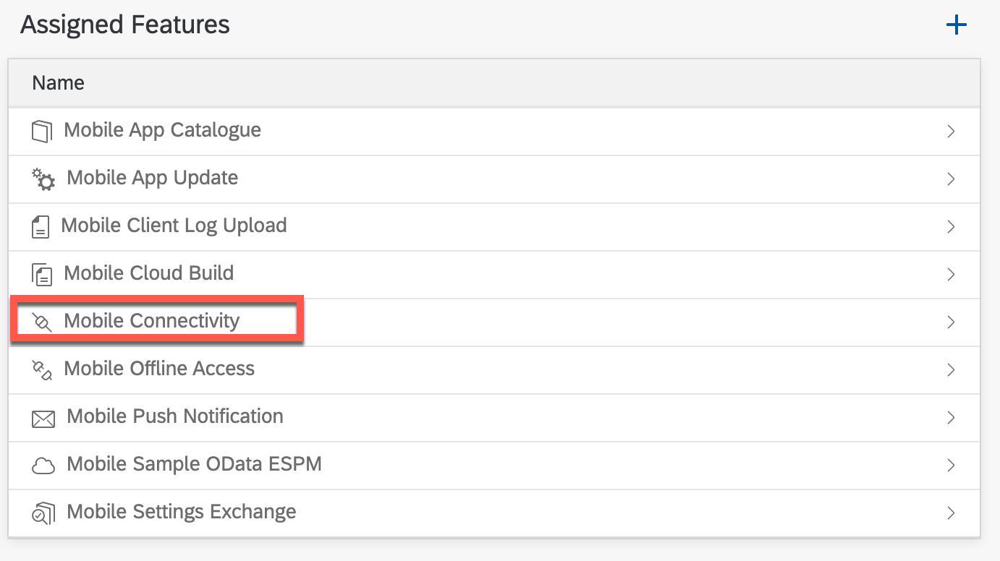

## Prerequisites
- **Tutorial:** If you don't have an SAP Cloud Platform account, follow the tutorial to [set up a free developer account](hcp-create-trial-account).
- **Tutorial:** [Access SAP Cloud Platform Mobile Services](fiori-ios-hcpms-setup)

## Details
### You will learn
  - How to configure MDK apps in the Mobile Services cockpit

---

[ACCORDION-BEGIN [Step 1: ](Understand the mobile development kit feature)]

Mobile Development Kit (MDK) allows developers and technical business users to build new native mobile apps and customize select SAP native mobile applications in a highly productive environment. It's architecture is based on `NativeScript`, so it supports native cross platform development which means you build your native mobile application once and deploy it to Android and iOS devices.

Mobile Development Kit provides robust online and offline capabilities, business logic, and mobile qualities such as access to the camera and barcode scanner. The first application developed with the Mobile Development Kit is [SAP Asset Manager](https://www.sap.com/products/asset-manager.html) and can easily be customized using the Mobile Development Kit.

You can find more details in the [Mobile Development Kit developer page](https://developers.sap.com/topics/mobile-development-kit.html).

!

[VALIDATE_2]
[ACCORDION-END]

[ACCORDION-BEGIN [Step 2: ](Configure a new MDK application in Mobile Services cockpit)]

Make sure that you have completed required pre-Prerequisites mentioned in this tutorial.

1. Navigate to [SAP Cloud Platform Mobile Services cockpit on Cloud Foundry environment](fiori-ios-hcpms-setup).

2. On the home screen, select **Create new app**.

    

3. Provide the required information and click **Next**.

    | Field | Value |
    |----|----|
    | `ID` | `com.sap.mdk.demo` |
    | `Name` | `SAP MDK Demo App` |

    !

    >Other fields are optional. For more information about these fields, see [Creating Applications](https://help.sap.com/doc/f53c64b93e5140918d676b927a3cd65b/Cloud/en-US/docs-en/guides/getting-started/admin/manage.html#creating-applications) in the SAP Cloud Platform documentation.

4. Select **Mobile Development Kit Application** from the dropdown and Click **Finish**.

    !

    >If you see a _Confirm Finish_ window, click **OK**.

5. Once you have created your application, you see a list of default features have been automatically assigned to the app.

    !

    >You can find more information on available features in SAP Cloud Platform Mobile Services in [help documentation](https://help.sap.com/doc/f53c64b93e5140918d676b927a3cd65b/Cloud/en-US/docs-en/guides/getting-started/admin/features.html).

[VALIDATE_3]
[ACCORDION-END]

[ACCORDION-BEGIN [Step 3: ](Add a sample backend to your MDK app)]

A sample OData service is available for developers to use during development and testing. The sample OData service also lets you evaluate how delta tokens are handled in your test application.

>More details on _Sample Back End_ is available in [help documentation](https://help.sap.com/doc/f53c64b93e5140918d676b927a3cd65b/Cloud/en-US/docs-en/guides/features/backend-connectivity/sample.html).

1. Click the **+** icon to add **Mobile Sample OData ESPM** feature to your MDK app.

    Here, you can view the root service and metadata URLs, and generate sample sales orders and purchase orders for multiple entity sets. You can view the data for each entity in a separate text file, and even can reset the sample data.

    !

    !

    >If you see a _Confirm Save_ window, click **OK**.

2. Click `com.sap.mdk.demo` to navigate back to app configuration page.

[VALIDATE_1]
[ACCORDION-END]

---
