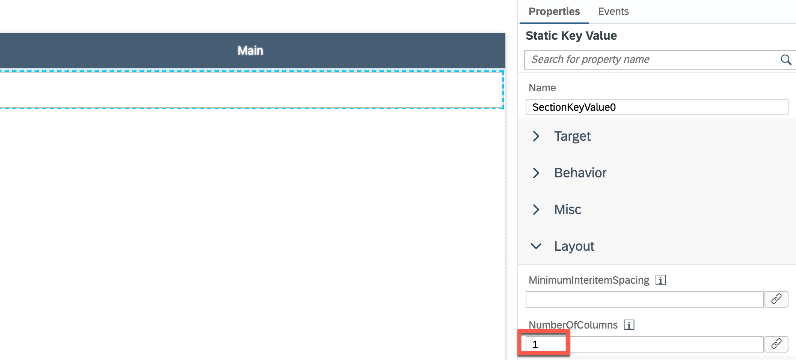
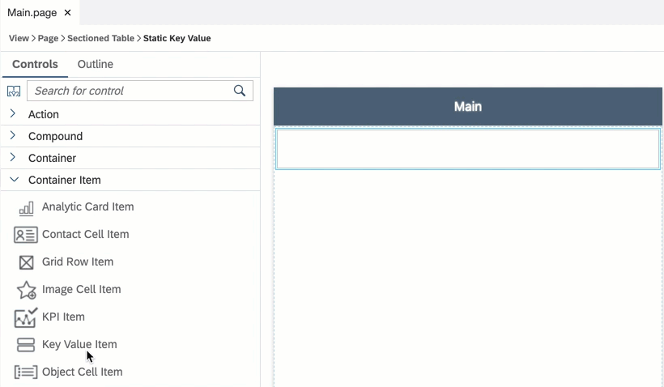
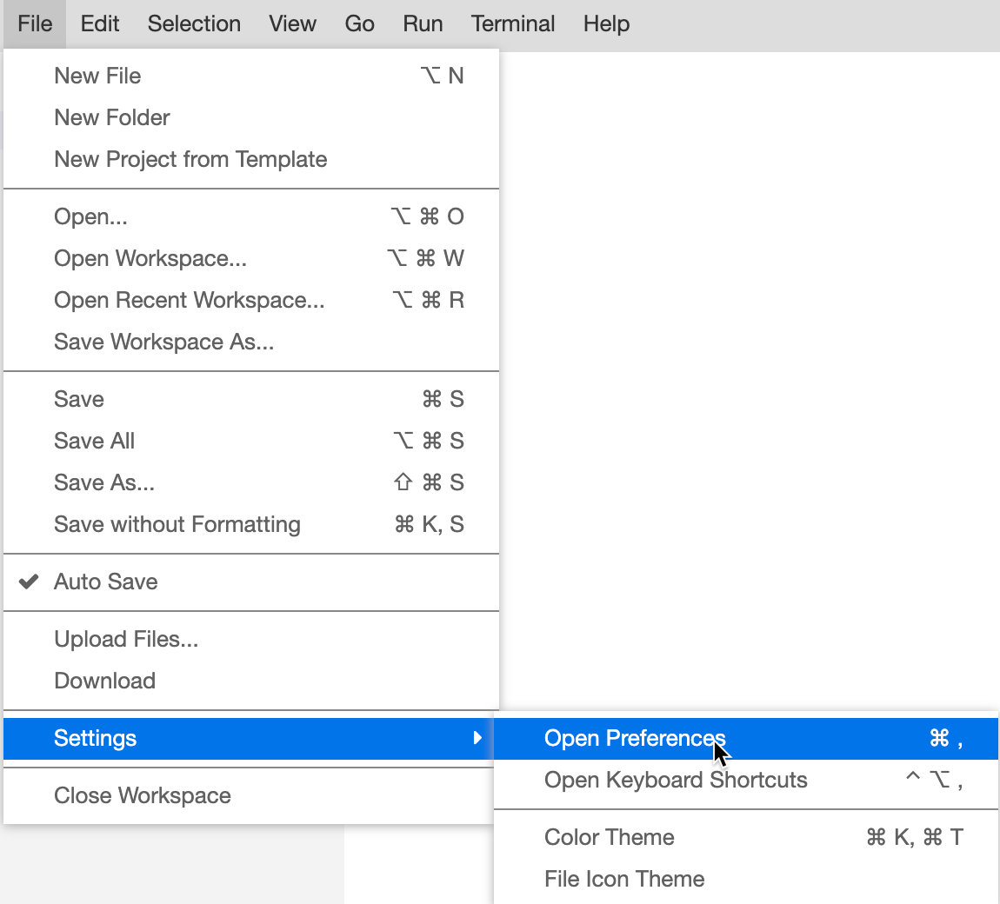
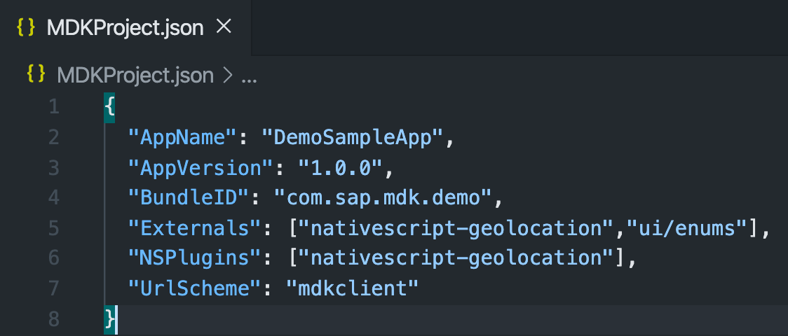
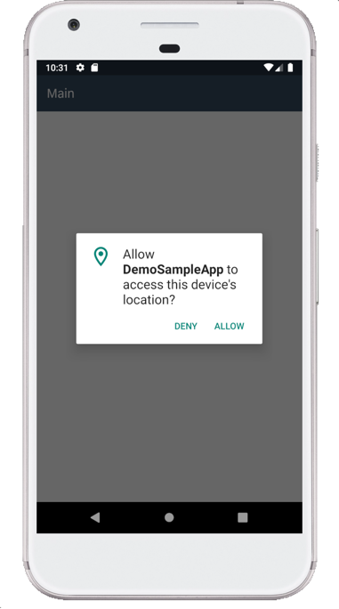
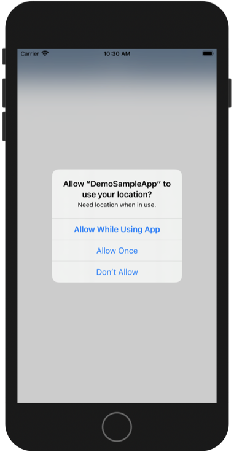
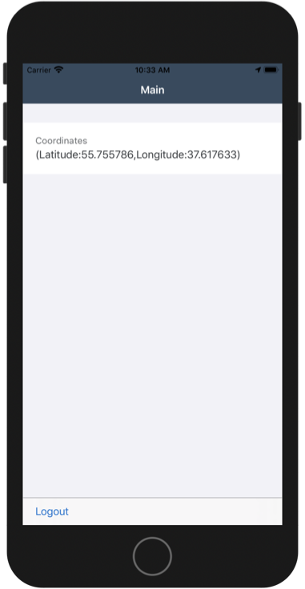

## Prerequisites
- **Tutorial**: [Set Up for the Mobile Development Kit (MDK)](group.mobile-dev-kit-setup)
- **Tutorial**: [Build Your Mobile Development Kit Client Using MDK SDK](cp-mobile-dev-kit-build-client) (Steps 1 to 3)

## Details
### You will learn
  - How to reference the NativeScript Geolocation plugin from a rule
  - How to add a NativeScript plugin to your branded MDK client
  - How to build a Mobile development kit client for iOS & Android and connect to SAP Mobile application
  - How to capture the device's current location

You may clone an existing metadata project from [GitHub repository](https://github.com/SAP-samples/cloud-mdk-tutorial-samples/tree/master/6-Create-Extension-Controls-in-Mobile-Development-Kit-Apps/2-Add-NativeScript-Plugin-in-an-MDK-App) and start directly with step 4 in this tutorial.

---

To extend the functionality, or customize the look and feel, and behavior of your client app, you can use the existing NativeScript plugins like nativescript-geolocation, nativescript-nfc etc. , add this to the client and reference it from a rule.

In this tutorial, you will use the existing NativeScript plugin nativescript-geolocation to capture the device location: latitude & longitude.


[ACCORDION-BEGIN [Step 1: ](Create a new MDK project in SAP Business Application Studio)]

1. Launch the [Dev space](cp-mobile-bas-setup) in SAP Business Application Studio.

2. Navigate to *File* menu &rarr; click **New Project from Template**.

    !

3. Select **MDK Project** and click **Next**.

    !  

4. In *Basic Information* step, select or provide the below information and click **Next**:

    | Field | Value |
    |----|----|
    | `MDK template type`| Select `Empty` from the dropdown |
    | `Your project name` | `MDK_Geolocation` |
    | `Your application name` | <default name is same as project name, you can provide any name of your choice> |    

    !

    >The _MDK Empty Project_ template creates a Logout action, Close page action, rule and an empty page (`Main.page`). After using this template, you can focus on creating your pages, other actions, and rules needed for your application. More details on _MDK template_ is available in [help documentation](https://help.sap.com/doc/f53c64b93e5140918d676b927a3cd65b/Cloud/en-US/docs-en/guides/getting-started/mdk/webide.html#creating-a-new-project).

5. After clicking **Next**, the wizard will generate your MDK Application based on your selections. You should now see the `MDK_Geolocation` project in the project explorer. As you have already opened the workspace, there is no need to open the generated project in a new workspace. Ignore the pop-up or click the cross icon to hide the window.

    !

[DONE]
[ACCORDION-END]


[ACCORDION-BEGIN [Step 2: ](Create a new rule to capture the device location)]

In the MDK editor, you will create a new JavaScript file called `GetCoordinates.js` to capture the device location: latitude & longitude.

>You can find more details about [writing a Rule](https://help.sap.com/doc/f53c64b93e5140918d676b927a3cd65b/Cloud/en-US/docs-en/guides/getting-started/mdk/development/rules.html).

1. Right-click the **Rules** folder | **MDK: New Rule File** | select **Empty JS Rule**.

    !

2. Enter the Rule name `GetCoordinates`, click **Next** and then **Finish** on the confirmation step.

    !

3. Replace the generated snippet with below code.

    ```JavaScript
    import * as geolocation from "nativescript-geolocation";
    import { Accuracy } from "tns-core-modules/ui/enums";
    export default function GetCoordinates(context) {
        var logger = context.getLogger();
        console.log("Current Log Level: " + logger.getLevel());
        // check if geolocation is not enabled
        if (!geolocation.isEnabled()) {
            // request for the user to enable it
            geolocation.enableLocationRequest();
        }
        // Get current location with high accuracy
        return geolocation.getCurrentLocation({
            desiredAccuracy: Accuracy.high, //This will return the finest location available
            updateDistance: 5, //Update distance filter in meters.
            timeout: 11000 //How long to wait for a location in ms.
        }).then(function (loc) {
            if (loc) {
                console.log(loc);
                console.log('\nCurrent Location: (' + loc.latitude + ',' + loc.longitude + ')');
                logger.log(loc.toString());

                var locMessage = '(' + "Latitude:" + loc.latitude + ',' + "Longitude:" + loc.longitude + ')';
                logger.log('Current Location: ' + locMessage, 'INFO');
                return locMessage;
            }
        }, function (e) {
            logger.log(e.message, 'ERROR');
        });
    }
    ```

  4. Save your changes to the `GetCoordinates.js` file.

[DONE]
[ACCORDION-END]


[ACCORDION-BEGIN [Step 3: ](Display the coordinates on a page)]

You will add this registered control in a Form Cell page.

  1. Double-click the `Main.page`, drag & drop **Static Key Value** container control to the page area.

    !

  2. In **Properties** | **Layout**, change `NumberOfColumns` to 1.

    !

  3. Drag & drop **Key Value Item** to the container.

    !

  4. Provide the following information:

    | Property | Value |
    |----|----|
    | `KeyName`| `Coordinates` |
    | `Value`| Bind it to rule `GetCoordinates.js` |

    !

[DONE]
[ACCORDION-END]

[ACCORDION-BEGIN [Step 4: ](List the NPM modules as external reference)]

In `GetCoordinates.js` file, you referred `nativescript-geolocation` and `tns-core-modules/ui/enums`. You now need to list these modules as external references in BAS configuration so when bundling, MDK editor knows not to worry about these references.

1. Navigate **File** menu | **Settings** | **Open Preferences**.

    !

2. Search with `mdk`, click **Edit in settings.json**.

    !

3. Include below references in `MDK.bundlerExternals` and save the changes.

    ```JSON
    "nativescript-geolocation",
    "tns-core-modules/ui/enums"
    ```

     !        

[DONE]
[ACCORDION-END]

[ACCORDION-BEGIN [Step 5: ](Deploy the application)]

So far, you have learned how to build an MDK application in the SAP Business Application Studio editor. Now, we deploy this application definition to Mobile Services.

1. Right-click `Application.app` and select **MDK: Deploy**.

    !

2. Select deploy target as **Mobile Services**.

    !

3. Select the application from Mobile Services.

    !

    You should see **Deploy succeeded** message.

    !

[DONE]
[ACCORDION-END]

[ACCORDION-BEGIN [Step 6: ](Add NativeScript plugin and External dependencies in your local .mdkproject)]

In order to use the existing NativeScript plugin in MDK client, you will need to first add it in `.mdkproject` and then create your branded MDK client.

1. Make sure that you have already completed steps 1 to 3 from [this](cp-mobile-dev-kit-build-client) tutorial.

2. Open `MDKProject.json` file and replace existing content with below:

    ```JSON
    {
      "AppName": "DemoSampleApp",
      "AppVersion": "1.0.0",
      "BundleID": "com.sap.mdk.demo",
      "Externals": ["nativescript-geolocation","ui/enums"],
      "NSPlugins": ["nativescript-geolocation"],
      "UrlScheme": "mdkclient"
    }
    ```

!

[DONE]
[ACCORDION-END]

[ACCORDION-BEGIN [Step 7: ](Add googlePlayServicesVersion in Android App Resources (Required only for Android client))]

With [Google Play services](https://developers.google.com/android/guides/overview), your app can take advantage of the latest, Google-powered features such as Maps, Google+, and more.

1. Navigate to `/DemoSampleApp.mdkproject/App_Resources/Android` and create a new file `before-plugins.gradle`.

    !

2. Provide the below information:

    ```Java
    android {  
      project.ext {
          googlePlayServicesVersion = "16+"
      }
    }
    ```

[VALIDATE_1]
[ACCORDION-END]


[ACCORDION-BEGIN [Step 8: ](Create & Run the MDK client)]

[OPTION BEGIN [Android]]

1. Follow steps 4 & 5 from [this](cp-mobile-dev-kit-build-client) tutorial to create your branded MDK client and run it in your device.

2. Once you have accepted the app update, allow your app to access your location.

    

    In Main page, you will see device's current location.

    

[OPTION END]

[OPTION BEGIN [iOS]]

1. Follow steps 4 & 5 from [this](cp-mobile-dev-kit-build-client) tutorial to create your branded MDK client and run it in your device.

2. Once you have accepted the app update, allow your app to access your location.

    

    In Main page, you will see device's current location.

    

[OPTION END]

**Congratulations!** You have learned how to capture device's current location in an MDK app and you are now all set to [Extend Your MDK App With a Map Custom Control (Using Metadata Approach)](cp-mobile-dev-kit-map-extension).

[DONE]
[ACCORDION-END]

---
