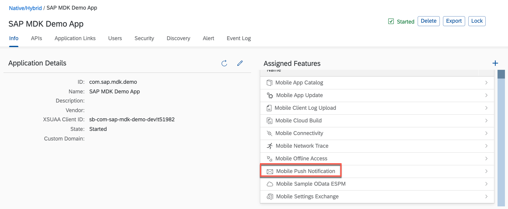
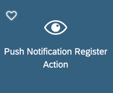
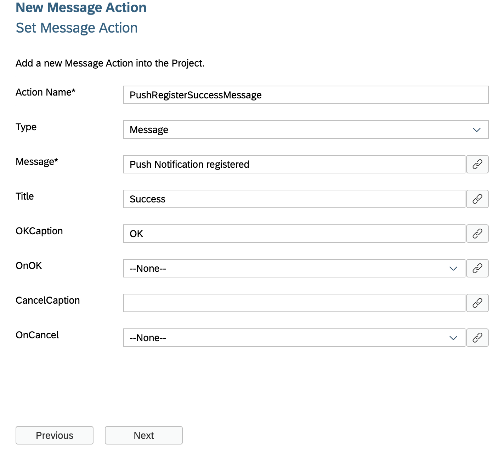
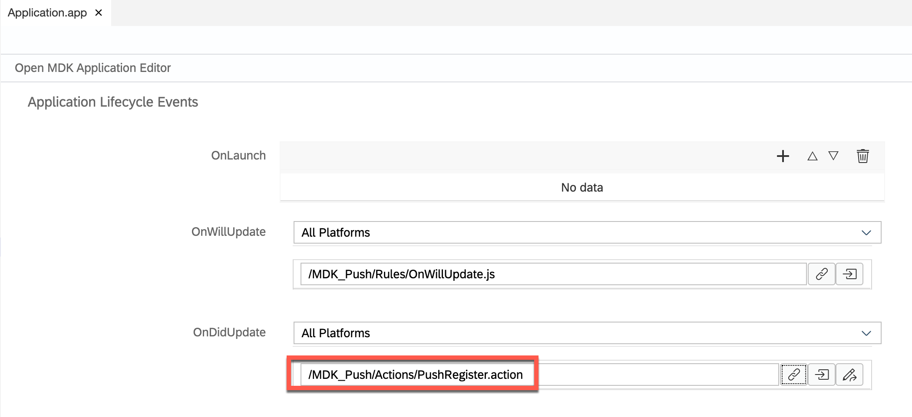
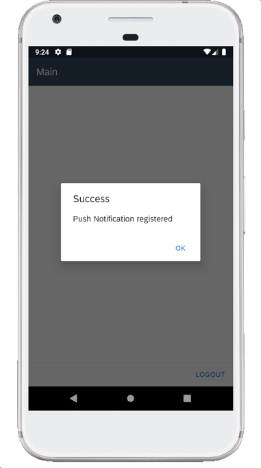
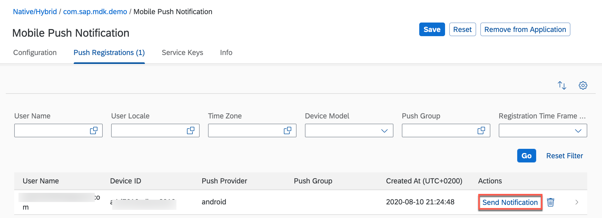
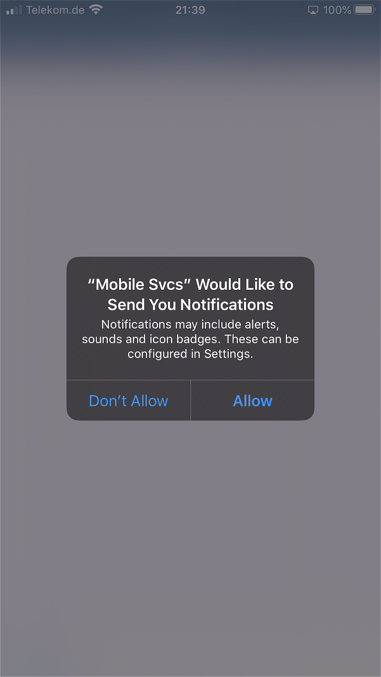
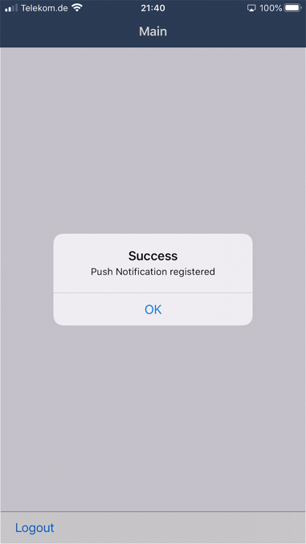
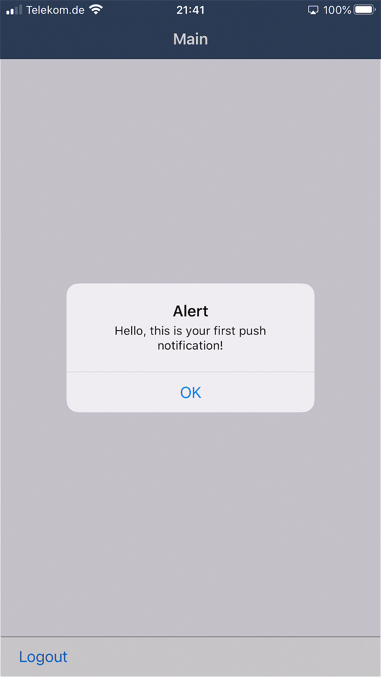
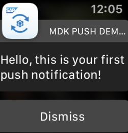

## Prerequisites
- **Tutorial group:** [Set Up for the Mobile Development Kit (MDK)](group.mobile-dev-kit-setup)
- **Download and install:** **SAP Mobile Services Client** on your [iOS](https://apps.apple.com/us/app/sap-mobile-services-client/id1413653544) or [Android](https://play.google.com/store/apps/details?id=com.sap.mobileservices.client) device (If you are connecting to `AliCloud` accounts then you will need to brand your [custom MDK client](cp-mobile-dev-kit-build-client) by whitelisting custom domains as allowed domains restrictions that exist by default in App store clients.)

## Details
### You will learn
  - How to use MDK push register action
  - How to use predefined push configuration for the public store version of SAP Mobile Services client (MDK client)
  - How to send push notification to an MDK app

You may clone an existing metadata project from [GitHub repository](https://github.com/SAP-samples/cloud-mdk-tutorial-samples/tree/master/4-Level-Up-with-the-Mobile-Development-Kit/6-Enable-Push-Notifications-in-the-MDK-Public-Store-Client) and start directly with step 4 in this tutorial.

---

[ACCORDION-BEGIN [Step 1: ](Define push notification settings in app configuration)]

1. Open the [SAP Mobile Services cockpit](cp-mobile-dev-kit-ms-setup), click **Mobile Push Notification** feature.

    !

    >You can add **Mobile Push Notification** feature by clicking on + icon in case feature is not already assigned to the application.

2. Select **SAP Mobile Services Client** under **Predefined for** option, click **Save**.

    !

    >Predefined push is supported only for the MDK (SAP Mobile Services client) public store client.

    >If you want to enable push notification in your custom MDK client then follow [this](cp-mobile-dev-kit-push-customclient) tutorial.

[VALIDATE_1]
[ACCORDION-END]

[ACCORDION-BEGIN [Step 2: ](Create a new MDK project in SAP Business Application Studio)]

1. Launch the [Dev space](cp-mobile-bas-setup) in SAP Business Application Studio.

2. Navigate to *File* menu &rarr; click **New Project from Template**.

    !

3. Select **MDK Project** and click **Start**.

    !  

4. In *Basic Information* step, select or provide the below information and click **Next**:

    | Field | Value |
    |----|----|
    | `MDK template type`| Select `Empty` from the dropdown |
    | `Your project name` | `MDK_Push` |
    | `Your application name` | <default name is same as project name, you can provide any name of your choice> |

    !

    >More details on _MDK template_ is available in [help documentation](https://help.sap.com/doc/f53c64b93e5140918d676b927a3cd65b/Cloud/en-US/docs-en/guides/getting-started/mdk/bas.html#creating-a-new-project-cloud-foundry).  

    >If you see *Cloud foundry token expired, continue without mobile services connection?* message, then set the Cloud Foundry environment again by clicking at bottom left corner of your status bar to initiate a valid session and click Start Over.   

5. After clicking **Next**, the wizard will generate your MDK Application based on your selections. You should now see the `MDK_Push` project in the project explorer. As you have already opened the workspace, there is no need to open the generated project in a new workspace. Ignore the pop-up or click the cross icon to hide the window.

    !

[DONE]
[ACCORDION-END]

[ACCORDION-BEGIN [Step 3: ](Create MDK actions to register for push notifications)]

In this step, you will create the following actions:

* **Push Notification Register action**: this will register the device with SAP Mobile Services for push notification.

* **Message actions**: these will display a message if Push Notification Register action has succeeded or failed.

1. Create a Push Notification Register action.

    Right-click the **Actions** folder | **MDK: New Action** | choose **MDK Other Actions** in **Category** | click **Push Notification Register Action** | **Next**.

    !

    Provide the below information:

    | Property | Value |
    |----|----|
    | `Action Name`| `PushRegister` |

    !

    >More details on _Push Notification Action_ is available in [help documentation](https://help.sap.com/doc/69c2ce3e50454264acf9cafe6c6e442c/Latest/en-US/docs-en/reference/schemadoc/Action/PushNotificationRegister.schema.html).

    Click **Next** and then **Finish** on the confirmation step.

2. Define a success message if the Push Register Notification action is succeeded.

    Right-click the **Actions** folder | **MDK: New Action** | choose **MDK Message Actions** in **Category** | click **Message Action** | **Next**.

    !

    Provide the below information:

    | Property | Value |
    |----|----|
    | `Action Name`| `PushRegisterSuccessMessage` |
    | `Type` | Select `Message` from the dropdown |
    | `Message` | `Push Notification registered` |
    | `Title` | `Success` |
    | `OKCaption` | `OK` |
    | `OnOK` | `--None--` |
    | `CancelCaption` | leave it blank |
    | `OnCancel` | `--None--` |

    !

    Click **Next** and then **Finish** on the confirmation step.

3. Define a failure message if the Push Register Notification action is failed.

    Right-click the **Actions** folder | **MDK: New Action** | choose **MDK Message Actions** in **Category** | click **Message Action** | **Next**.

    !

    Provide the below information:

    | Property | Value |
    |----|----|
    | `Action Name`| `PushRegisterFailureMessage` |
    | `Type` | Select `Message` from the dropdown |
    | `Message` | `Push Notification didn't register` |
    | `Title` | `Failure` |
    | `OKCaption` | `OK` |
    | `OnOK` | `--None--` |
    | `CancelCaption` | leave it blank |
    | `OnCancel` | `--None--` |

    !

    Click **Next** and then **Finish** on the confirmation step.

4. Define _Success_ and _Failure_ actions for `PushRegister.action`.

    In the action editor for the new action, expand the **Common Action Properties** and provide the below information:

    | Property | Value |
    |----|----|
    | `Success Action` | Click the link icon to bind it to `PushRegisterSuccessMessage.action` |
    | `Failure Action` | Click the link icon to bind it to `PushRegisterFailureMessage.action`  |

    >When `PushRegister.action` gets executed successfully then `PushRegisterSuccessMessage.action` will be triggered or if `PushRegister.action` fails then `PushRegisterFailureMessage.action` will be triggered.

    !

[DONE]
[ACCORDION-END]

[ACCORDION-BEGIN [Step 4: ](Call the push register action)]

In the step, you will set and call the Push Register Notification action when app is updated with the new metadata.

>It is up to developers how they want to call a Push Register Notification action.

In `Application.app` file, bind the `OnDidUpdate` event to `PushRegister.action`.

!

[DONE]
[ACCORDION-END]

[ACCORDION-BEGIN [Step 5: ](Deploy the application)]

So far, you have learned how to build an MDK application in the SAP Business Application Studio editor. Now, you will deploy this application definition to Mobile Services.

1. Right-click `Application.app` and select **MDK: Deploy**.

    !

2. Select deploy target as **Mobile Services**.

    !

3. Select the application from Mobile Services.

    !

    You should see **Deploy succeeded** message.

    !

[DONE]
[ACCORDION-END]

[ACCORDION-BEGIN [Step 6: ](Populate the QR code for app onboarding)]

SAP Business Application Studio has a feature to generate QR code for app onboarding.

Double-click the `Application.app` to open it in MDK Application Editor and click **Application QR Code** icon to populate the QR code.

!

!

[DONE]
[ACCORDION-END]

[ACCORDION-BEGIN [Step 7: ](Run the app in MDK client)]

>Make sure you are choosing the right device platform tab above. Once you have scanned and onboarded using the onboarding URL, it will be remembered. When you Log out and onboard again, you will be asked either to continue to use current application or to scan new QR code.

[OPTION BEGIN [Android]]

1. Follow [these steps](https://github.com/SAP-samples/cloud-mdk-tutorial-samples/blob/master/Onboarding-Android-client/Onboarding-Android-client.md) to on-board the MDK client.

2. Once you accept the App update, a message should show **Push Notification Registered**. Click **OK**.

    

3. It is time now to send the first push notification from the **SAP Mobile Services push notification feature**.

    Navigate to Mobile Services cockpit. In **Mobile Push Notification** feature, switch to **Push Registrations** tab.

    There you will find information about user registered for push notification and also details about Push providers. Identify your Device ID and click **Send Notification**.

    !

12. In notification dialog, type a notification message and click **Send**.

    !

    You will see a success toast message.

    !

    After sending notification, mobile device should receive the message.

    

[OPTION END]

[OPTION BEGIN [iOS]]

1. Follow [these steps](https://github.com/SAP-samples/cloud-mdk-tutorial-samples/blob/master/Onboarding-iOS-client/Onboarding-iOS-client.md) to on-board the MDK client.

2. Once you accept app update, you will notice that it will first ask permission to display notifications.

    !

3. If push registration is successful, a message should show **Push Notification Registered**. Click **OK**.

    !

4. It is time now to send the first push notification from the **SAP Mobile Services push notification feature**.

    Navigate to Mobile Services cockpit. In **Mobile Push Notification** feature, switch to **Push Registrations** tab.

    There you will find information about user registered for push notification and also details about Push providers. Identify your Device ID and click **Send Notification**.

    !

11. In notification dialog, type a notification message and click **Send**.

    !

    You will see a success toast message.

    !

    After sending notification, mobile device should receive the message.

    !

    If you have Apple watch connected to the iPhone device, you can also see same push notification on the Apple Watch.

    !

    >MDK supports rich push notification. MDK does not run on smart watches or as an Apple watch application.

[OPTION END]

>Once you have scanned and onboarded using the onboarding URL, it will be remembered. When you Log out and onboard again, you will be asked either to continue to use current application or to scan new QR code.

[DONE]
[ACCORDION-END]

---

Congratulations, you have successfully implemented Enable Push Notifications in the MDK Public Store Client and you are now all set to [Consume a REST API in an MDK App](cp-mobile-dev-kit-rest-api).

---
