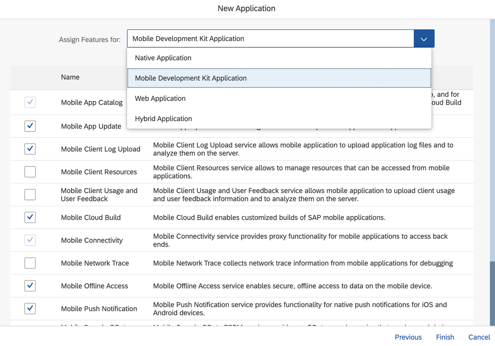
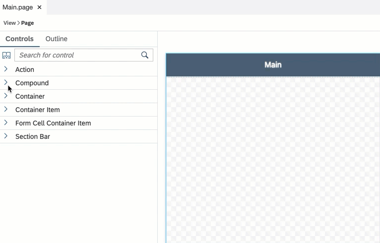
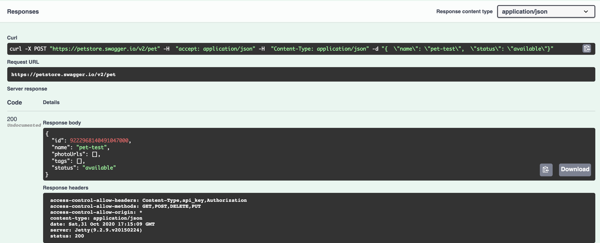
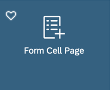
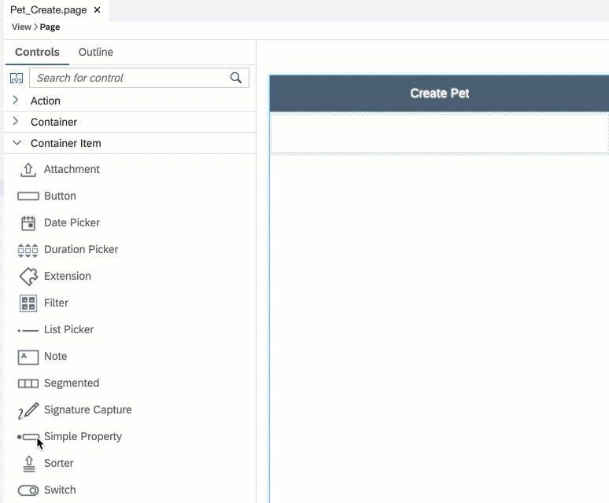
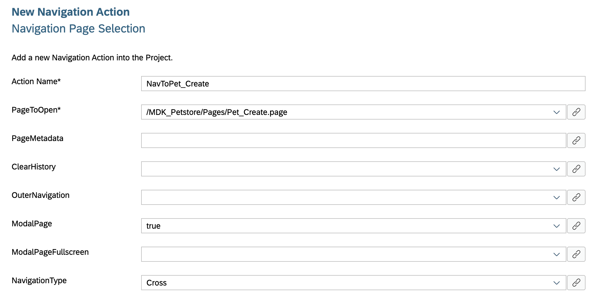

## Prerequisites
- **Tutorial:** [Set Up Business Application Studio for Mobile Technologies](cp-mobile-bas-setup)
- **Download and install:** **SAP Mobile Services Client** on your [iOS](https://apps.apple.com/us/app/sap-mobile-services-client/id1413653544) or [Android](https://play.google.com/store/apps/details?id=com.sap.mobileservices.client) device (If you are connecting to `AliCloud` accounts then you will need to brand your [custom MDK client](cp-mobile-dev-kit-build-client) by whitelisting custom domains as allowed domains restrictions that exist by default in App store clients.)

## Details
### You will learn
  - How to configure an application in Mobile Services
  - How to create MDK applications in SAP Business Application Studio
  - How to write a MDK rule to parse the response from REST API
  - How to retrieve and modify the data with calls to `Petstore` API

You may clone an existing project from [GitHub repository](https://github.com/SAP-samples/cloud-mdk-tutorial-samples/tree/master/4-Level-Up-with-the-Mobile-Development-Kit/7-Consume-rest-api-in-mdk-app) and start directly with step 6 or 16 in this tutorial but make sure you complete step 2.


---


Mobile Development Kit allows you to consume REST APIs. You need to first define REST endpoint as a destination in Mobile Services and then need to write MDK rules (JavaScript) to consume it. A rule will be needed to parse the response and then decide what to do.

A publicly available `Petstore` API from [swagger.io](https://petstore.swagger.io) is used as an example in this tutorial.


[ACCORDION-BEGIN [Step 1: ](Understand the Petstore API to retrieve data)]

1. Open [`Swagger Petstore`](https://petstore.swagger.io/), find all pets with status as `available`.

    !

2. Click **Execute** to get the response.

    !

    By looking at results, you now have understood

    -	what is the Request URL to retrieve pet information
    -	what is header parameter to be passed in GET call
    -	what is the response code
    -	how the response body looks like

With above details, you will next configure an app in Mobile Services, add root of request URL as a destination and then consume it in MDK.

[DONE]
[ACCORDION-END]

[ACCORDION-BEGIN [Step 2: ](Configure new MDK app in Mobile Services cockpit)]

1. Navigate to [SAP Cloud Platform Mobile Services cockpit on Cloud Foundry environment](fiori-ios-hcpms-setup).

2. On the home screen, select **Create new app**.

    !

3. Provide the required information and click **Next**.

    | Field | Value |
    |----|----|
    | `ID` | `com.sap.mdk.restapi` |
    | `Name` | `SAP MDK REST API` |

    !

    >Other fields are optional. For more information about these fields, see [Creating Applications](https://help.sap.com/doc/f53c64b93e5140918d676b927a3cd65b/Cloud/en-US/docs-en/guides/getting-started/admin/manage.html#creating-applications) in the SAP Cloud Platform documentation.

4. Select **Mobile Development Kit Application** from the dropdown and Click **Finish**.

    !

5. Click **Mobile Connectivity** to add `Petstore` root API as a destination.

    !

6. Click **Create** icon to add a new destination.  

    !

7. Provide the required information and click **Next**.

    | Field | Value |
    |----|----|
    | `Destination Name` | `swagger.petstore` |
    | `URL` | `https://petstore.swagger.io/v2` |

    !

8. For this tutorial, there is no Custom Headers, Annotations, Authentication required, click **Next** and Finish the form.

    In MDK rule, you will reference `Petstore` root URL via newly added destination `swagger.petstore`.

[DONE]
[ACCORDION-END]

[ACCORDION-BEGIN [Step 3: ](Create a new MDK project in SAP Business Application Studio)]

1. Launch the [Dev space](cp-mobile-bas-setup) in SAP Business Application Studio.

2. If you do not see the **Welcome** page, navigate to *View* menu &rarr; *Find Command* &rarr; search with *Welcome* to launch the Welcome page.

    !

3. In Welcome page, click **New project from template** .

    !

4. Select **MDK Project** and click **Next**.

    !

5. In *Basic Information* step, select or provide the below information and click **Next**:

    | Field | Value |
    |----|----|
    | `MDK Template Type`| Select `Empty` from the dropdown |
    | `Your Project Name` | `MDK_Petstore` |
    | `Your Project Name` | <default name is same as Project name, you can provide any name of your choice> |

    !

    >More details on _MDK template_ is available in [help documentation](https://help.sap.com/doc/f53c64b93e5140918d676b927a3cd65b/Cloud/en-US/docs-en/guides/getting-started/mdk/bas.html#creating-a-new-project-cloud-foundry).

6. After clicking **Next**, the wizard will generate your MDK Application based on your selections. You should now see the `MDK_Petstore` project in the project explorer. As you have already opened the workspace, there is no need to open the generated project in new workspace or to add it to workspace. Ignore the pop-up or click the cross icon to hide the window.

    !

[DONE]
[ACCORDION-END]

[ACCORDION-BEGIN [Step 4: ](Create rule to retrieve Pet information)]

A rule will be needed to parse the response from REST API.

>You can find more details about [writing a Rule](https://help.sap.com/doc/f53c64b93e5140918d676b927a3cd65b/Cloud/en-US/docs-en/guides/getting-started/mdk/development/rules.html).

1. Right-click the **Rules** folder | **New File**.

    !

2. Enter the file name `GetPetFindByStatus.js`, click **OK**.

3. Copy and paste the following code.

    ```JavaScript
    export default function GetPetFindByStatus(context) {
        //appId Returns the App ID com.sap.mdk.demo of application in Mobile Services on SAP Cloud Platform.
        let appId = context.evaluateTargetPath('#Application/#ClientData/MobileServiceAppId');
        // GET "https://petstore.swagger.io/v2/pet/findByStatus?status=available" -H "accept: application/json"
        let destination = 'swagger.petstore';
        let relativePath = 'pet/findByStatus?status=available';
        let requestPath = destination + '/' + relativePath;
        let params = {
            'method': 'GET',
            'header': {
                'x-smp-appid': appId,
                'Accept': 'application/json'
            }
        };
        //sendRequest Client API is used to send a request to SAP Cloud Platform Mobile Services.
        return context.sendRequest(requestPath, params).then((response) => {
            if (response.statusCode == 200) {
                console.log(response.content.toString());
                // Parse and act on results
                let result = JSON.parse(response.content.toString());
                //result returns an array of objects and this result will be used in binding the Target in step 5.2
                return result;
            }
            else {
                alert('something went wrong');
            }
        });
    }
    ```

    >You can find more details about [targeting properties on Application's `ClientData` Object] (https://help.sap.com/doc/f53c64b93e5140918d676b927a3cd65b/Cloud/en-US/docs-en/guides/getting-started/mdk/development/client-data.html) and about [Client API `sendRequest`](https://help.sap.com/doc/69c2ce3e50454264acf9cafe6c6e442c/Latest/en-US/docs-en/reference/apidoc/interfaces/ipageproxy.html#sendrequest) in documentation.

4. Save the changes to the `GetPetFindByStatus.js` file.

[DONE]
[ACCORDION-END]

[ACCORDION-BEGIN [Step 5: ](Display Pets list in MDK page)]

You will add an **Object Table** control  item on `Main.page` to display the list of Pets.

1. In `Main.page`, drag and drop **Object Table** control on the page.

    !

2. Provide the required information for **Target** section:

    | Field | Value |
    |----|----|
    | `Select Data Type` | Select `String Target` from the dropdown |
    | `Bind to` | `/MDK_Petstore/Rules/GetPetFindByStatus.js` |

    !

    >You can find more details on **Target** in [documentation](https://help.sap.com/doc/69c2ce3e50454264acf9cafe6c6e442c/Latest/en-US/docs-en/reference/schemadoc/definitions/Target.schema.html).


3. Under **Appearance**, provide below information:

    | Property | Value |
    |----|----|
    | `Description`| leave it empty |
    | `DetailImage` | leave it empty |
    | `Footnote`| leave it empty |
    | `PreserveIconStackSpacing` | Select `false` from the dropdown |
    | `ProgessIndicator`| leave it empty |
    | `Status` | `{status}` |
    | `Subhead` | `Pet Name: {name}` |
    | `SubStatus` | leave it empty |
    | `Title` | `Pet ID: {id}` |

    !

[DONE]
[ACCORDION-END]

[ACCORDION-BEGIN [Step 6: ](Deploy the application)]

So far, you have learned how to build an MDK application in the SAP Business Application Studio editor. Now, we deploy this application definition to Mobile Services.

1. Right-click `Application.app` and select **MDK: Deploy**.

    !

2. Verify the URL and **Click Enter** on your keyboard.

    !   

    >SAP Business Application Studio pre-populates the end-point of the environment it is running in. If you want to connect to a different environment, modify the API endpoint by copying it from your target SAP Cloud Platform account: *SAP Cloud Platform Cockpit &rarr; Sub-account &rarr; API Endpoint*

3. Select the organisation in which you have enabled Mobile Services.

    !   

4. Select the space in which you have enabled Mobile Services.

    !   

5. Select the an application `com.sap.mdk.restapi` from Mobile Services.

    !   

    Upon successful setup, you should see **Deploy Succeeded** message.

    !

    >MDK editor stores deployment details in `.project.json` file. When you deploy to same configuration next time, you will not be asked for above details, MDK editor will pick up these details from `.project.json` file.

[DONE]
[ACCORDION-END]

[ACCORDION-BEGIN [Step 7: ](Populate the QR code for app onboarding)]

SAP Business Application Studio has a feature to generate QR code for app onboarding.

Double-click the `Application.app` to open it in MDK Application Editor and click **Application QR Code** icon to populate the QR code.

!

!

[DONE]
[ACCORDION-END]

[ACCORDION-BEGIN [Step 8: ](Run the app in MDK client)]

>Make sure you are choosing the right device platform tab above. Once you have scanned and onboarded using the onboarding URL, it will be remembered. When you Log out and onboard again, you will be asked either to continue to use current application or to scan new QR code.

[OPTION BEGIN [Android]]

Follow [these steps](https://github.com/SAP-samples/cloud-mdk-tutorial-samples/blob/master/Onboarding-Android-client/Onboarding-Android-client.md) to on-board the MDK client.

Once you accept app update, you will see the Pets list on the **Main** page.


[OPTION END]

[OPTION BEGIN [iOS]]

Follow [these steps](https://github.com/SAP-samples/cloud-mdk-tutorial-samples/blob/master/Onboarding-iOS-client/Onboarding-iOS-client.md) to on-board the MDK client.

Once you accept app update, you will see the Pets list on the **Main** page.


[OPTION END]

>Once you have scanned and onboarded using the onboarding URL, it will be remembered. When you Log out and onboard again, you will be asked either to continue to use current application or to scan new QR code.

Congratulations, you have learned how to consume a REST API in MDK app to display Pets list.

Next, you will learn how to create a new pet record.

[DONE]
[ACCORDION-END]


[ACCORDION-BEGIN [Step 9: ](Understand the Petstore API to create new record)]

1. In [`Swagger Petstore`](https://petstore.swagger.io/), add a new pet to the store.

    !

    There is payload example to be passed for adding a new pet.

2. For testing, use below payload.

    ```JSON
    {
      "category": {
        "name": "Terrier"
      },
      "name": "pet-test",
      "tags": [
        {
          "name": "Labrador"
        }
      ],
      "status": "available"
    }
    ```

3. Click **Execute** to get the response.

    !

    By looking at results, you now have understood

    -	what is the Request URL & body to create a new pet record
    -	what are header parameters to be passed in POST call
    -	what is the response code
    -	how the response body looks like

With above details, you will now create a new MDK rule to create a new Pet record.

[DONE]
[ACCORDION-END]

[ACCORDION-BEGIN [Step 10: ](Create new page for new pet record)]

In this step, you will create the `Pet_Create.page` as a **Form Cell Page**. This type of page allows for form input style changes. You will add the fields that will be editable by the end-user.

1. Right-click the **Pages** folder | **MDK: New Page** | **Form Cell Page** | **Next**.

    !

    >You can find more details about [Form Cell page](https://help.sap.com/doc/f53c64b93e5140918d676b927a3cd65b/Cloud/en-US/docs-en/guides/features/fiori-ui/mdk/formcell-page.html).

2. Enter the Page Name `Pet_Create` and click **Next** and the **Finish** on the Confirmation step.

    !

3. In the **Properties** pane, set the **Caption** to **Create Pet**.

    !

4. Now, you will add the fields (like Category name, Pet name, Tag Name, Status) for creating a new pet record by the end-user.

    In the Layout Editor, expand the **Control** | **Container Item** section. Drag and drop a **Simple Property** onto the Page area.

    >You can find more details about [available controls in Form Cell page](https://help.sap.com/doc/69c2ce3e50454264acf9cafe6c6e442c/Latest/en-US/docs-en/reference/schemadoc/Page/FormCell/Container.schema.html).

    !

5. Drag and drop three additional Simple Property controls onto the page so you have four total controls.

    !

6. Select the first **Simple Property control** and provide the below information:

    | Property | Value |
    |----|----|
    | `Name`| `FCCreateCategory` |
    | `Caption` | `Category` |
    | `IsEditable`| Select `true` from the dropdown |
    | `PlaceHolder`| `Enter Value` |

    !

7. Select the second **Simple Property control** and provide the below information:

    | Property | Value |
    |----|----|
    | `Name`| `FCCreatePet` |
    | `Caption` | `Pet` |
    | `IsEditable`| Select `true` from the dropdown |
    | `PlaceHolder`| `Enter Value` |

    !

8. Select the third **Simple Property control** and provide the below information:

    | Property | Value |
    |----|----|
    | `Name`| `FCCreateTag` |
    | `Caption` | `Tag` |
    | `IsEditable`| Select `true` from the dropdown |
    | `PlaceHolder`| `Enter Value` |

    !

9. Select the last **Simple Property control** and provide the below information:

    | Property | Value |
    |----|----|
    | `Name`| `FCCreateStatus` |
    | `Caption` | `Status` |
    | `IsEditable`| Select `true` from the dropdown |
    | `PlaceHolder`| `Enter Value` |

    !    

[DONE]
[ACCORDION-END]


[ACCORDION-BEGIN [Step 11: ](Create rule to POST pet record)]

1. Right-click the **Rules** folder | **New File**.

    !

2. Enter the file name `PostPet.js`, click **OK**.

3. Copy and paste the following code.

    ```JavaScript
    export default function PostPet(context) {
        let appId = context.evaluateTargetPath('#Application/#ClientData/MobileServiceAppId');
        // POST "https://petstore.swagger.io/v2/pet" -H "accept: application/json" -H "Content-Type: application/json"
        let destination = 'swagger.petstore';
        let relativePath = 'pet';
        let requestPath = destination + '/' + relativePath;
        //Retrieve the individual input values from Pet_Create page and store them in local variables  
        let petCategory = context.evaluateTargetPath('#Page:Pet_Create/#Control:FCCreateCategory/#Value');
        let petName = context.evaluateTargetPath('#Page:Pet_Create/#Control:FCCreatePet/#Value');
        let petTag = context.evaluateTargetPath('#Page:Pet_Create/#Control:FCCreateTag/#Value');
        let petStatus = context.evaluateTargetPath('#Page:Pet_Create/#Control:FCCreateStatus/#Value');
        let requestBodyJSON = {
            "category": {
                "name": petCategory
            },
            "name": petName,
            "tags": [{
                "name": petTag
            }],
            "status": petStatus
        }
        let params = {
            'method': 'POST',
            'header': {
                'x-smp-appid': appId,
                'Accept': 'application/json',
                'Content-Type': 'application/json'
            },
            'body': JSON.stringify(requestBodyJSON)
        };
        return context.sendRequest(requestPath, params).then((response) => {
            if (response.statusCode == 200) {
                alert(response.content.toString());
            } else {
                alert('something went wrong');
            }

        });
    }
    ```

4. Save the changes to the `PostPet.js` file.

[DONE]
[ACCORDION-END]

[ACCORDION-BEGIN [Step 12: ](Add cancel button on create pet page)]

Now, you will add a button on the `Pet_Create.page` and set it's `onPress` to `ClosePage.action`.

1. Drag and drop an **Action Bar Item** to the left corner of the action bar.

    !

2. In the **Properties** pane, click the **link icon** to open the object browser for the **System Item** property. Double click the **Cancel** type and click **OK**.

    !

    >System Item are predefined system-supplied icon or text. Overwrites _Text_ and _Icon_ if specified.

3. Now, you will set the `onPress` event to `ClosePage.action`.

    In **Events** tab, click the **link icon** for the `OnPress` property to open the object browser.

    Double click the `ClosePage.action` and click **OK** to set it as the `OnPress` Action.

    !

[DONE]
[ACCORDION-END]

[ACCORDION-BEGIN [Step 13: ](Call the rule in MDK page)]

1. In `Pet_Create.page`, drag & drop an action bar item to the right corner of the action bar.

    !

2. In the **Properties** pane, click the **link icon** to open the object browser for the **System Item** property. Double click the **Save** type and click **OK**.

    !

3. Navigate to **Events** tab and bind `PostPet.js` rule to `OnPress` event.

    !

[DONE]
[ACCORDION-END]

[ACCORDION-BEGIN [Step 14: ](Create navigation action)]

Now, create a navigation action that will open the `Pet_Create.page` when executed.

1. Right-click the **Actions** folder | **MDK: New Action** | choose **MDK UI Actions** in **Category** | click **Navigation Action** | **Next**.

2. Provide the below information:

    | Property | Value |
    |----|----|
    | `Action Name`| `NavToPet_Create` |
    | `PageToOpen` | Select `Pet_Create.page` from the dropdown |
    | `ModalPage`| Select `true` from the dropdown |

    !

3. Click **Next** and then **Finish** on the confirmation step.

[DONE]
[ACCORDION-END]

[ACCORDION-BEGIN [Step 15: ](Add create button to pet list page)]

You will add a button to the `Main.page` called **Add**. You will link this button to the navigation action you just created. This event will open the `NavToPet_Create.action` when the Add button is pressed by the end-user.

1. In `Main.page`, drag and drop an **Action Bar Item** to the upper right of the action bar.

2. Click the **link icon** to open the object browser for the `SystemItem` property.

    Double click the **Add** type and click **OK**.

    !

3. In the Properties pane, click the **Events** tab, click the **link icon** for the `OnPress` property to open the object browser.

    Double click the `NavToPet_Create.action` action and click **OK** to set it as the `OnPress` Action.

    !

[DONE]
[ACCORDION-END]

[ACCORDION-BEGIN [Step 16: ](Redeploy the application)]

Right-click the `Application.app` file in the project explorer pane and select **MDK: Deploy**.

[DONE]
[ACCORDION-END]

[ACCORDION-BEGIN [Step 17: ](Update the MDK app with new metadata)]

[OPTION BEGIN [Android]]

1. Re-launch the app on your device, authenticate with passcode or Touch ID if asked. You will see a _Confirmation_ pop-up, tap **OK**.

2. Tap **+** icon on `Main.page` to navigate to Create Pet page.

    

3.  Fill out the details to create a new Pet record.

    

    A new record has been created and results are displaying in alert pop-up.

    

[OPTION END]

[OPTION BEGIN [iOS]]

1. Re-launch the app on your device, authenticate with passcode or Touch ID if asked. You will see a _Confirmation_ pop-up, tap **OK**.

2. Tap **+** icon on `Main.page` to navigate to Create Pet page.

    

3.  Fill out the details to create a new Pet record.

    

    A new record has been created and results are displaying in alert pop-up.

    

[OPTION END]

You have created a new record consuming REST API. Similarly, you can also modify and delete an existing record.

**Congratulations!** You have successfully completed **Level Up with the Mobile Development Kit** mission and you are now all set to [Brand Your Customized App with Mobile Development Kit SDK](mission.mobile-dev-kit-brand) mission.

[VALIDATE_2]
[ACCORDION-END]


---
