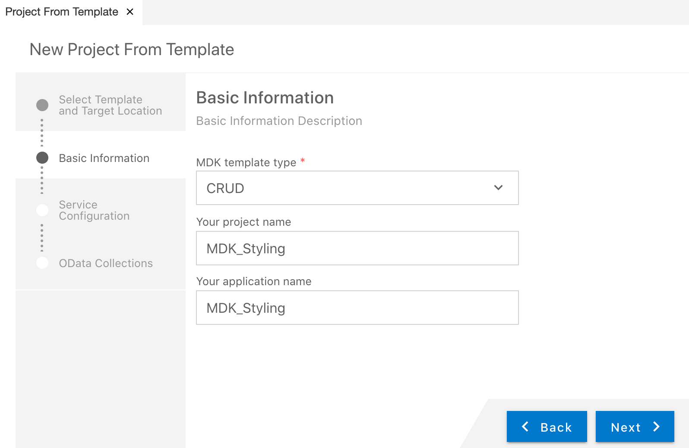
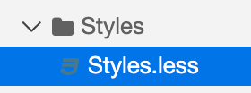
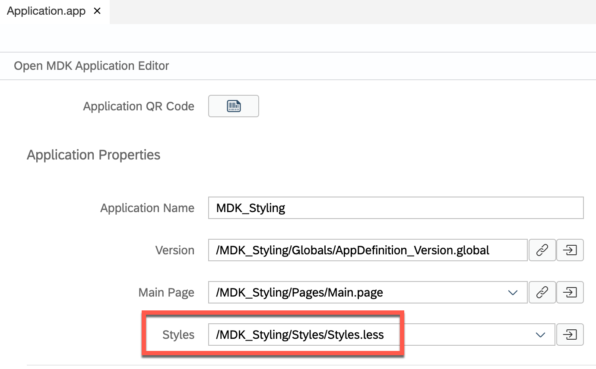
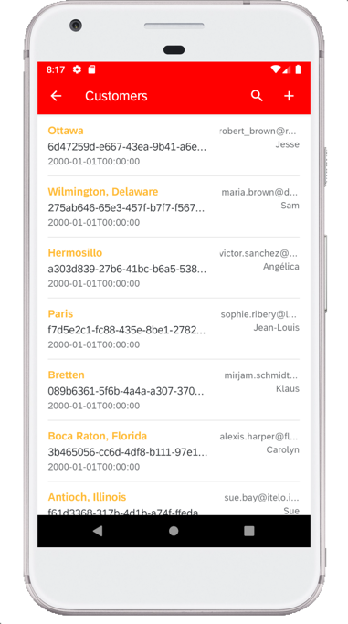
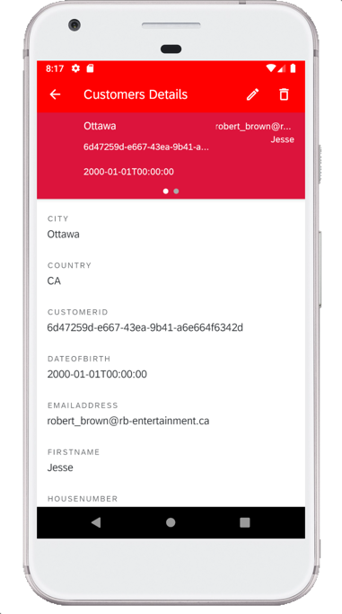

## Prerequisites
- **Tutorial group:** [Set Up for the Mobile Development Kit (MDK)](group.mobile-dev-kit-setup)
- **Download and install:** **SAP Mobile Services Client** on your [iOS](https://apps.apple.com/us/app/sap-mobile-services-client/id1413653544) or [Android](https://play.google.com/store/apps/details?id=com.sap.mobileservices.client) device (If you are connecting to `AliCloud` accounts then you will need to brand your [custom MDK client](cp-mobile-dev-kit-build-client) by allowing custom domains.)

## Details
### You will learn
  - How to change color of action bar and tool bar
  - How to change font color and background color of SDK control properties in a section page

You may clone an existing project from [GitHub repository](https://github.com/SAP-samples/cloud-mdk-tutorial-samples/tree/master/4-Level-Up-with-the-Mobile-Development-Kit/3-Add-Styling-to-an-MDK-App) and start directly with step 4 in this tutorial.

---

MDK Template supports Style **LESS** file for styling for `NativeScript`, Android SDK & iOS SDK controls.


[ACCORDION-BEGIN [Step 1: ](Create a new MDK project in SAP Business Application Studio)]

This step includes creating the mobile development kit project in the editor.

1. Launch the [Dev space](cp-mobile-bas-setup) in SAP Business Application Studio.

2. Navigate to *File* menu &rarr; click **New Project from Template**.

    !

3. Select **MDK Project** and click **Start**.

    !

4. In *Basic Information* step, select or provide the below information and click **Next**:

    | Field | Value |
    |----|----|
    | `MDK template type`| Select `CRUD` from the dropdown |
    | `Your project name` | `MDK_Styling` |
    | `Your application name` | <default name is same as project name, you can provide any name of your choice> |

    !

    >The `CRUD` template creates the offline or online actions, rules, messages, List Detail Pages with editable options. More details on _MDK template_ is available in [help documentation](https://help.sap.com/doc/f53c64b93e5140918d676b927a3cd65b/Cloud/en-US/docs-en/guides/getting-started/mdk/bas.html#creating-a-new-project-cloud-foundry).  

    >If you see *Cloud foundry token expired, continue without mobile services connection?* message, then set the Cloud Foundry environment again by clicking at bottom left corner of your status bar to initiate a valid session and click Start Over.

7. In *Service Configuration* step, provide or select the below information and click **Next**:

    | Field | Value |
    |----|----|
    | `Service File Name`| `<Provide any name of your choice>` |
    | `OData Source` | Select `Mobile Services` from the dropdown |
    | `Application Id` | Select `com.sap.mdk.demo` from the dropdown |
    | `Destination` | Select `SampleServiceV2` from the dropdown |
    | `Enter a path to the OData service` | Leave it as it is |
    | `Language URL` | Leave it with the default value |
    | `Enable Offline` | It's enabled by default |

    !

    >In [this tutorial](cp-mobile-dev-kit-ms-setup), server-side configuration for this MDK app were already done.

    Regardless of whether you are creating an online or offline application, this step is needed app to connect to an OData service. When building an Mobile Development Kit application, it assumes the OData service created and the destination that points to this service is set up in Mobile Services.

    Since you will create an offline based app, hence **Enable Offline** option is selected.

8. In *OData Collections* step, select `Customers` (if not selected as default). Click **Finish** to complete the project creation.

    !

9. After clicking **Finish**, the wizard will generate your MDK Application based on your selections. You should now see the `MDK_Styling` project in the project explorer. As you have already opened the workspace, there is no need to open the generated project in a new workspace. Ignore the pop-up or click the cross icon to hide the window.

    !

[DONE]
[ACCORDION-END]

[ACCORDION-BEGIN [Step 2: ](Add style metadata in LESS file)]

The `LESS` stylesheet provides the ability to define styling styles that can be used to style the UI in the MDK app.

>You can find more details about [styling in MDK](https://help.sap.com/doc/69c2ce3e50454264acf9cafe6c6e442c/Latest/en-US/docs-en/reference/schemadoc/Styles.less.html).

1. In `MDK_Styling` project, expand the **Styles** folder and open the `Styles.less` file.

    !

2. Copy and paste the following code.

    ```LESS
    @mdkYellow1: #ffbb33;
    @mdkRed1: #ff0000;

    //// This style applies to all the ActionBars in the application
    ActionBar {
        color: white;
        background-color: red;
    }

    //// This style applies to all the ToolBars in the application
    ToolBar {
        color: white;
        background-color: blue;
    }

    //// LogoutToolbarItem is tool bar item for Logout in Main.page
    #LogoutToolbarItem  {
        color: brown;
    }

    //// UploadToolbarItem is tool bar item for Sync in Main.page
    #UploadToolbarItem  {
        color: green;
    }

    //// By-Class style: These style classes can be referenced from rules and set using ClientAPI setStyle function
    //// below snippet is to style Customers button on Main.page
    .MyCustomerButton{
      font-color: @mdkRed1;
      background-color: black;
    }

    //// below snippet is to style Title property of an Object Table control in Customers_List.page
    .ObjectTableTitle {
      font-color: @mdkYellow1;
      background-color: @mdkRed1;
    }

    //// below snippet is to style Object Header control in Customers_Detail.page

    /* Object Header - BodyText */
    /* iOS Only */
    .objectHeaderBodyText {
      font-color: red;
    }

    /* Object Header - Description */
    /* iOS Only */
    .objectHeaderDescription {
      font-color: blue;
    }

    /* Object Header - Footnote */
    /* iOS Only */
    .objectHeaderFootNote {
      font-color: green;
    }

    /* Object Header - Headline */
    /* iOS Only */
    .objectHeaderHeadline {
      font-color: #ff00ff;
    }

    /* Object Header - Background */
    .objectHeaderBackground {
    background-color: #DC143C;
    }

    /* Object Header - StatusText */
    /* iOS Only */
    .objectHeaderStatus {
      background-color: #cccccc;
      font-color: red;
      font-name: italicSystem;
      font-style: italic;
      font-size: 18;
    }

    /* Object Header - Subhead */
    /* iOS Only */
    .objectHeaderSubhead {
      font-color: yellow;
    }

    /* Object Header - SubstatusText */
    /* iOS Only */
    .objectHeaderSubStatus {
      background-color: #cccccc;
      font-color: blue;
      font-name: italicSystem;
      font-style: italic;
      font-size: 18;
    }
    ```

    >By default there is a tint overlay overlay on the toolbar.  If you want a solid color toolbar that matches the action bar you need to use the `bartintcolor` property in the style instead of the background color (or in addition to). `bartintcolor: blue;`

3. Save your changes to the `Styles.less` file.

    >`Styles.less` is already bound to Styles properties in `Application.app` file.

    >!

[VALIDATE_1]
[ACCORDION-END]

[ACCORDION-BEGIN [Step 3: ](Set the styling for SDK controls)]

In this step, you will bind style classes:

* `MyCustomerButton` to `Customers` section button control on `Main.page`
* `ObjectTableTitle` to Title property of Object Table in `Customers_List.page`
* `objectHeaderBodyText` to `BodyText` property of Object Header in `Customers_Detail.page`
* `objectHeaderDescription` to `Description` property of Object Header in `Customers_Detail.page`
* `objectHeaderFootNote` to `Footnote` property of Object Header in `Customers_Detail.page`
* `objectHeaderHeadline` to `HeadlineText` property of Object Header in `Customers_Detail.page`
* `objectHeaderBackground` to `ObjectHeader` property of Object Header in `Customers_Detail.page`
* `objectHeaderStatus` to `StatusText` property of Object Header in `Customers_Detail.page`
* `objectHeaderSubhead` to `Subhead` property of Object Header in `Customers_Detail.page`
* `objectHeaderSubStatus` to `SubstatusText` property of Object Header in `Customers_Detail.page`

1.  Double click `Main.page`, select `Customers` section button, click **link** icon next to **Style** property.

    In Object browser, double click `MyCustomerButton` class to bind style property and click **OK**.

    !

2. Navigate to **Pages** | **Customers**, double-click `Customers_List.page`, select **Object Table** control, scroll-down to **Style** section.

    Click **link** icon next to **Title** property.

    In Object browser, double-click `ObjectTableTitle` class to bind style property and click **OK**.

    !

3. Navigate to **Pages** | **Customers**, double-click `Customers_Detail.page`, select **Object Header** control, scroll-down to **Style** section and bind control properties to style properties.

    !


[VALIDATE_3]
[ACCORDION-END]

[ACCORDION-BEGIN [Step 4: ](Deploy the application)]

So far, you have learned how to build an MDK application in the SAP Business Application Studio editor. Now, you will deploy this application definition to Mobile Services.

1. Right-click `Application.app` and select **MDK: Deploy**.

    !

2. Select deploy target as **Mobile Services**.

    !

    You should see **Deploy succeeded** message.

    !

[DONE]
[ACCORDION-END]

[ACCORDION-BEGIN [Step 5: ](Populate the QR code for app onboarding)]

SAP Business Application Studio has a feature to generate QR code for app onboarding.

Double-click the `Application.app` to open it in MDK Application Editor and click **Application QR Code** icon to populate the QR code.

!

!

[DONE]
[ACCORDION-END]

[ACCORDION-BEGIN [Step 6: ](Run the app in MDK client)]

>Make sure you are choosing the right device platform tab above. Once you have scanned and onboarded using the onboarding URL, it will be remembered. When you Log out and onboard again, you will be asked either to continue to use current application or to scan new QR code.

[OPTION BEGIN [Android]]

1. Follow [these steps](https://github.com/SAP-samples/cloud-mdk-tutorial-samples/blob/master/Onboarding-Android-client/Onboarding-Android-client.md) to on-board the MDK client.

    Once you accept app update, you will see the **Main** page (with **LOGOUT** and **SYNC** options at bottom of the page) and **CUSTOMERS** entity set to navigate to List-Detail page. In Main page, you will notice styling on action bar, tool bar, items (Logout & Sync) available on tool bar, `CUSTOMERS` button.

    

2. Tap on **CUSTOMERS** to navigate to Customer List. You will see that Title property has been styled.

    

3. Tap on any record to navigate to Customer Detail page. You will see that Object Header control has been styled.

           

[OPTION END]

[OPTION BEGIN [iOS]]

1. Follow [these steps](https://github.com/SAP-samples/cloud-mdk-tutorial-samples/blob/master/Onboarding-iOS-client/Onboarding-iOS-client.md) to on-board the MDK client.

    Once you accept app update, you will see the **Main** page (with **Logout** and **Sync** options at bottom of the page) and `Customers` entity set to navigate to List-Detail page. In Main page, you will notice styling on action bar, tool bar, items (Logout & Sync) available on tool bar, `Customers` button.

    

2. Tap on **Customers** to navigate to Customer List. You will see that Title property has been styled.

    

3. Tap on any record to navigate to Customer Detail page. You will see that Object Header control has been styled.

       


[OPTION END]

>Once you have scanned and onboarded using the onboarding URL, it will be remembered. When you Log out and onboard again, you will be asked either to continue to use current application or to scan new QR code.

[VALIDATE_2]
[ACCORDION-END]

---

Congratulations, you have successfully styled your MDK app and you are now all set to [Implement Deep Linking to Another App from an MDK App](cp-mobile-dev-kit-deep-link).

---
