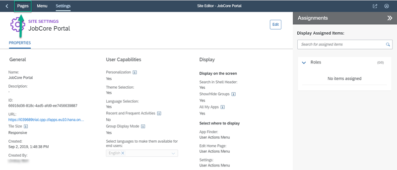
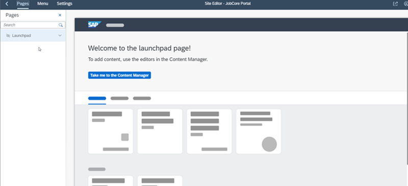
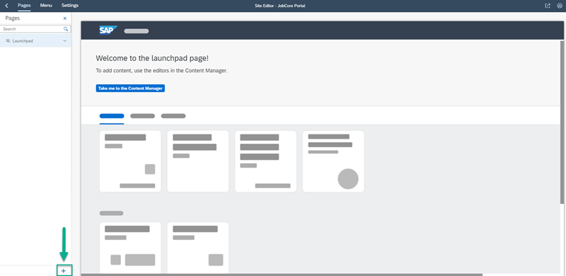
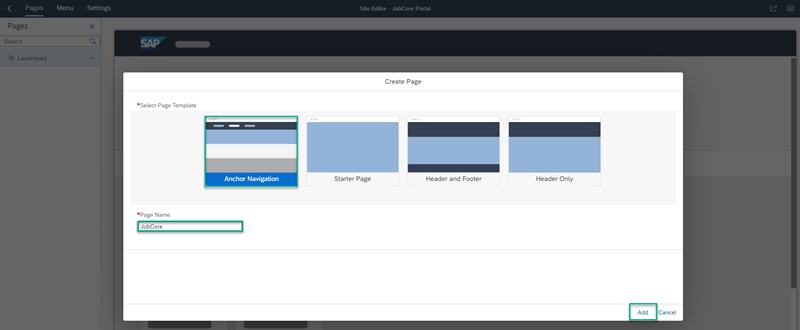
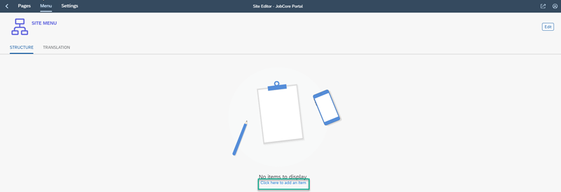

## Prerequisites
You have subscribed to the Portal service.

### You will learn
  - How to create a Portal site
  - How to add a page to your site and make it the home page
  - How to create a site menu

In this group of tutorials our goal is to create an attractive Portal site for a recruiting company called `JobCore Recruiting`. The site will include apps and web content. The site will contain two pages: a launchpad page and another page. Both pages will be displayed in the site menu.

Let's get started!

[ACCORDION-BEGIN [Step 1: ](Create a site)]

When you access the Portal service, the Site Directory is in focus. From here you will create your new Portal site.

1. In the Site Directory, click **Create New Site**.

    

2. Enter `JobCore Portal` as the site name and click **Create**.

    

    The Site Editor opens with the **Site Settings** screen in focus.

3. Click the **Pages** tab.

    

In your new site, you can already see the default **Launchpad** page in the **Pages** panel on the left.
> Note that the page is marked with an eye icon with a cross. This icon indicates that the page is not part of the site menu and is not yet visible in your site.

In the next step, you are going to add a second page to your Portal site.

  

>For your information: Once you've created your site, you can go back to the Site Directory. There you can see that your new site is now represented by a new tile. In the future, each time you want to edit your site, you can click the pencil icon from this tile. You can also delete the site from here or preview it to see how your site users will see your site at runtime.

[VALIDATE_6]

[ACCORDION-END]

[ACCORDION-BEGIN [Step 2: ](Add a page to the site)]

1. Click **+** at the bottom of the  **Pages** panel of the Site Manager.

    

2. Select the **Anchor Navigation** page template.

3. Enter `JobCore` as the **Page Name**.

4. Click **Add**.

    

Now we have a page called `JobCore` and we have the default `Launchpad` page that you can see in the **Pages** panel. Let's add them both to the site menu.   

[DONE]

[ACCORDION-END]

[ACCORDION-BEGIN [Step 3: ](Design the site menu)]

1. Click the **Menu** tab to open the **Site Menu** editor.

    

2. Click  **Click here to add an item** to open the **Add Menu Item** screen.

    

3. Enter the following values:

    |  :------------- | :-------------
    |  **Display Name** | **`Home`**
    |  **Item Type**    | **`Page`**
    |  **Select Page**  | **`JobCore`**

4. Click **Add**.  

    

    This takes you back to the **Menu Editor**. You'll see that the page you called `Home` has been added to the site's menu structure.

5. Now add the `Launchpad` page to the site menu.

    Hover over the `Home` menu item and click the + icon on the right.

    

6. Click **Add Item** to open the **Add Menu Item** screen.

    

7. Enter the following values:

    |  :------------- | :-------------
    |  **Display Name**           | **`My Apps`**
    |  **Item Type**           | **`Page`**
    |  **Select Page**    | **`Launchpad`**

8. Click **Add**.

    

9. Click **Save** in the editor.

    

>Note that both the `Launchpad` and `Home` pages appear in the site menu structure.

[VALIDATE_7]

[ACCORDION-END]

[ACCORDION-BEGIN [Step 4: ](Set the site's home page)]

1. Click the **Pages** tab to go back to the page editor.

    

2. Click the downward facing arrow next to the `JobCore` page, and then click **Set as home page**.

    

Now you have a Portal site called the `JobCore Portal` with 2 pages. Both pages are part of the site menu and the `JobCore` page (your `Home` page) is set as the first page that opens when a user logs on to your site.

In the next tutorial you're going to add web content to the `Home` page.

[DONE]
[ACCORDION-END]
