## Details
### You will learn
  - How to create a URL app and add it to your site

In this tutorial you'll add a URL app to your Portal site.

[ACCORDION-BEGIN [Step 1: ](Go to the Content Manager)]

Click the **Content Manager** icon in the left panel of the Site Manager.

!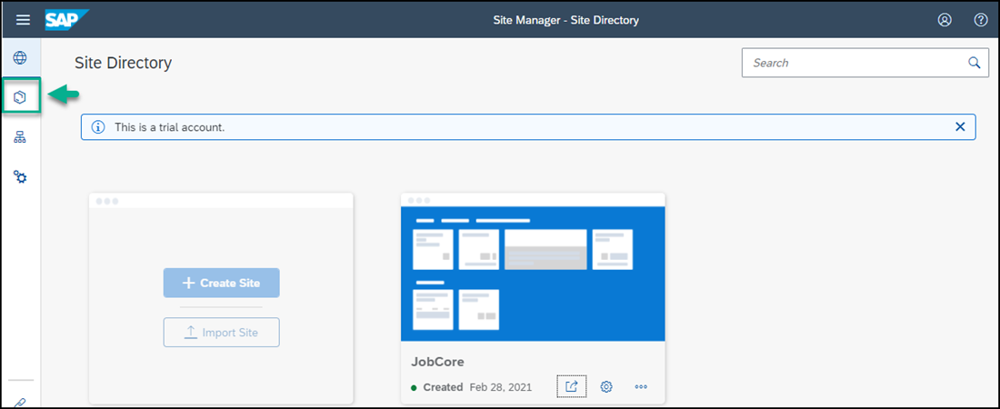

[DONE]
[ACCORDION-END]

[ACCORDION-BEGIN [Step 2: ](Create and configure new app)]

1. Click **+ New** and select **App** from the list.

    !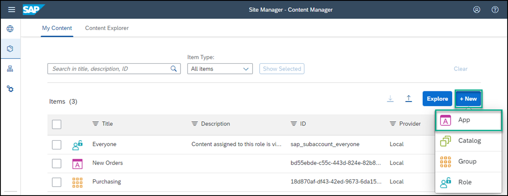

    The App editor opens on the  **PROPERTIES** tab.

2. Enter the following values:

    * **Title**: `Innovation at SAP`

    * **Open App**: In place

    * **URL**:  `https://sap.io`

    !

3. Click the **NAVIGATION** tab to specify the intent of your app.

    > The unique combination of a semantic object and an action is called an intent. It is used to define navigation to an application.

4. Enter the following values:

     * **Semantic Object**: `Innovation`

     * **Action**:  `Display`

    !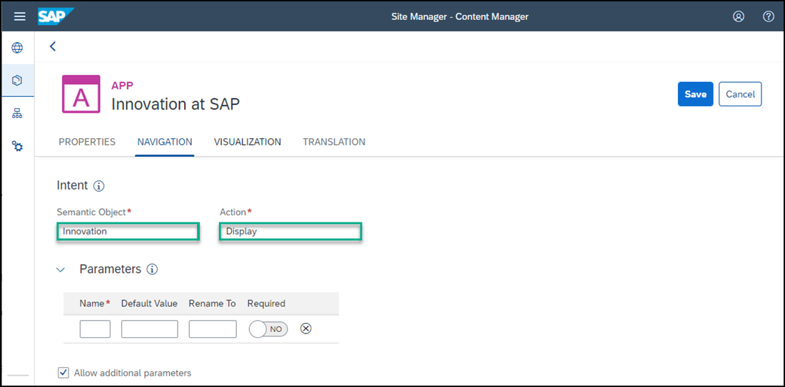

5. Click the **VISUALIZATION** tab.

    In this tab, you specify how the app will be displayed in the launchpad.

6.  Enter the following values:

    * **Subtitle**: `SAP.iO program `

    * **Information**:  `Learn about SAP.iO`

    * **Icon**: Click the browse icon, type `Visits`, select the displayed icon, and click **OK**.

      You see a preview of the tile with all the properties you entered.

      !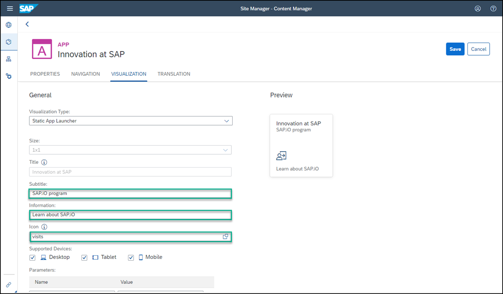

7.  Click **Save**.

You have configured the URL app and in the next step you will go back to the Content Manager to see it in the list of content items.

[DONE]
[ACCORDION-END]

[ACCORDION-BEGIN [Step 3: ](View the app that you created)]
Click the Content Manager icon in the left side panel of the App editor to navigate to the top level of your configured content.

!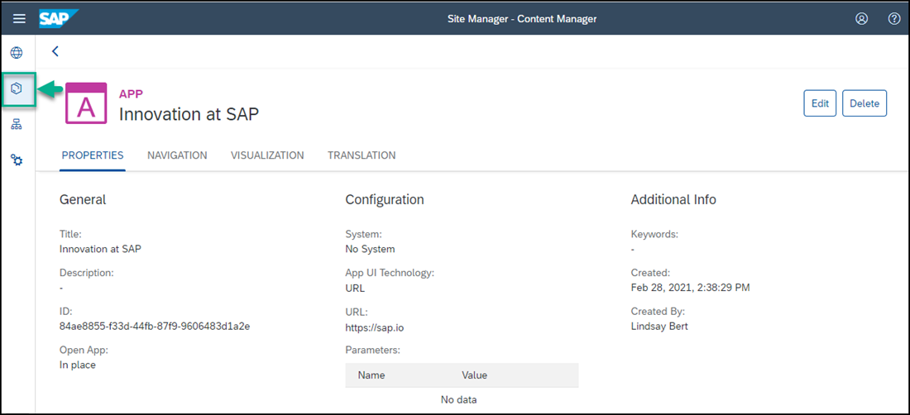

In the Content Manager, you see your app in the list:

!

For end users to view the app in runtime, you must assign the app to a role. Any end user who is a member of this role will be able to access the app. In this tutorial, we use the `Everyone` role.  You also need to assign the app to a group so that it's visible in the launchpad page.

This is described in the following steps.

[DONE]
[ACCORDION-END]

[ACCORDION-BEGIN [Step 4: ](Assign the app to the Everyone role)]

In this step, you'll assign your app to the `Everyone` role.

>Content assigned to the `Everyone` role is visible to all users.

1. Go back to the Content Manager and click the **Everyone** role.

    !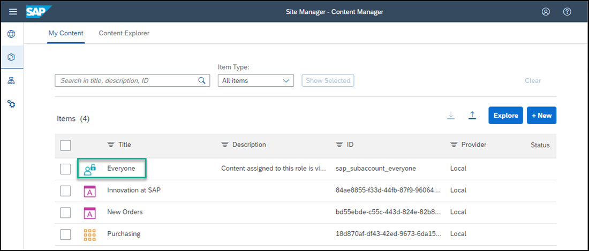

2. Click **Edit**.

3. In the Role editor, in the **Assignments** panel, type `In` to search for your app.

4. In the **Results** list, click + to assign your app to this role.

    !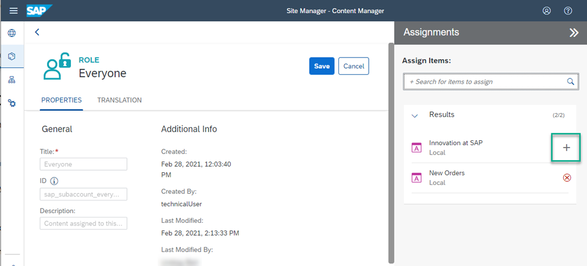

5. Click **Save**.

[DONE]
[ACCORDION-END]

[ACCORDION-BEGIN [Step 5: ](Create a group and assign the app to it)]

In this step, you'll create a new group and assign your app to it.

>A group is a set of one or more apps displayed together in the launchpad. Assigning apps to groups allows users to view them in the launchpad page.

1. Open the Content Manager and click **+ New** and select **Group** to open the Group editor.

    !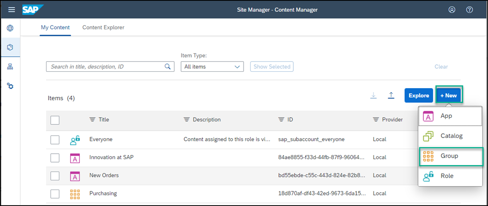

2. Enter the **Title** `SAP` and in the **Assignments** panel on the upper right of the screen, type in the first two letters of your app (in this case it will be `In`), to search for your app. You should see **Innovation at SAP**.

3. In the **Results** list, click + to assign your app to this group.

    !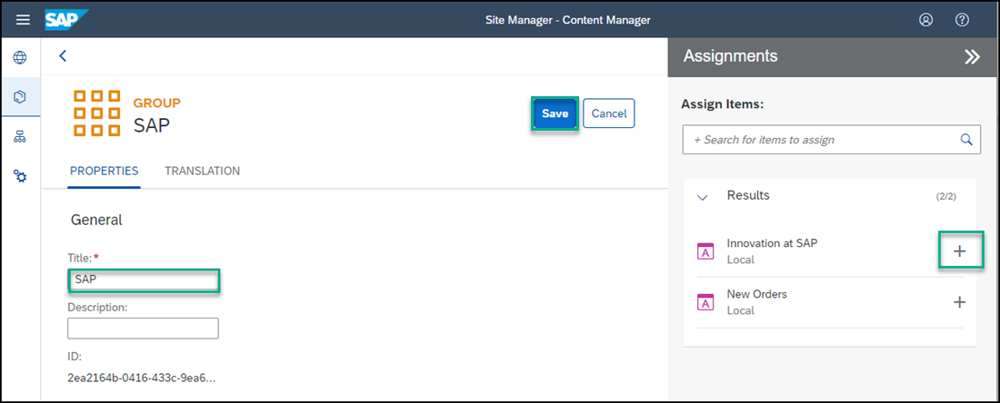

4. Click **Save**.

[DONE]
[ACCORDION-END]

[ACCORDION-BEGIN [Step 7: ](Review the site)]

1. Click the Site Directory icon in the left panel.

    !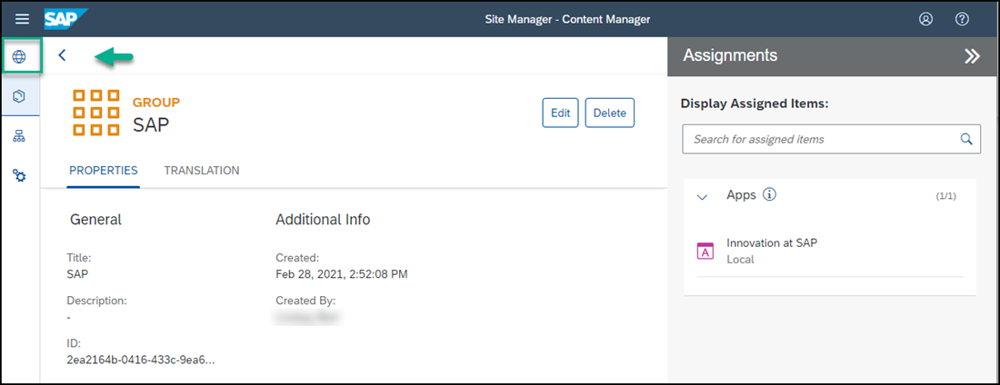

2. On the `JobCore Portal` tile in the Site Directory, click the  **Go to site** icon:

    !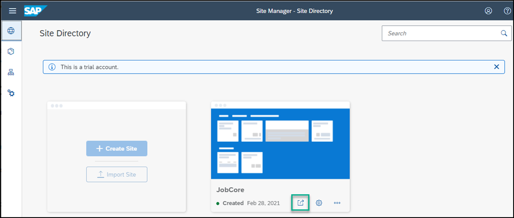

The **Home** page opens. You'll see that your new app is displayed in the `SAP` group.

!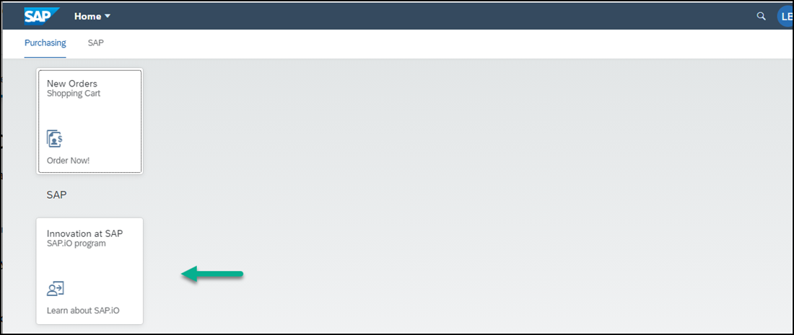

You can now launch your application by clicking the **Innovation at SAP** tile.

Congratulations you've created a Portal site with two apps!

[VALIDATE_7]
[ACCORDION-END]

---
