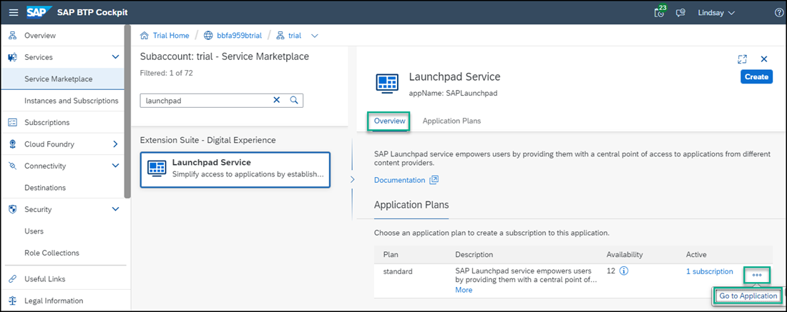
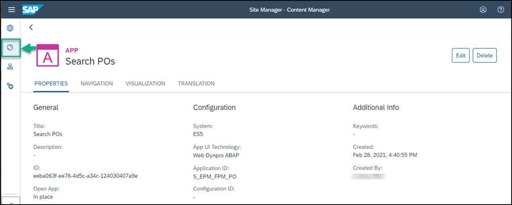
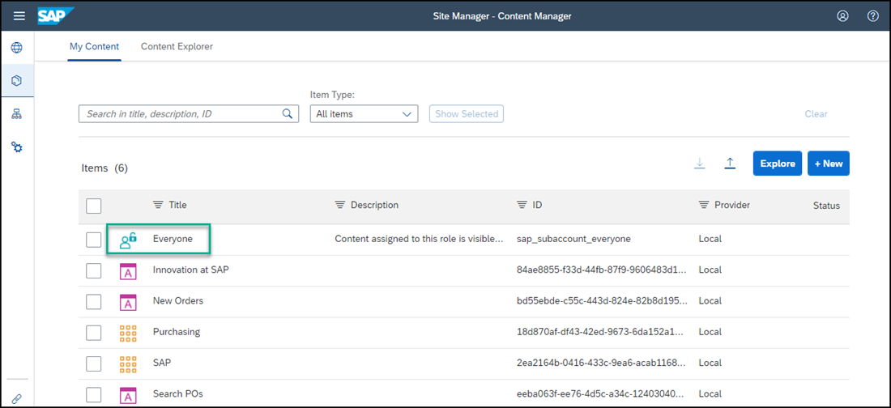
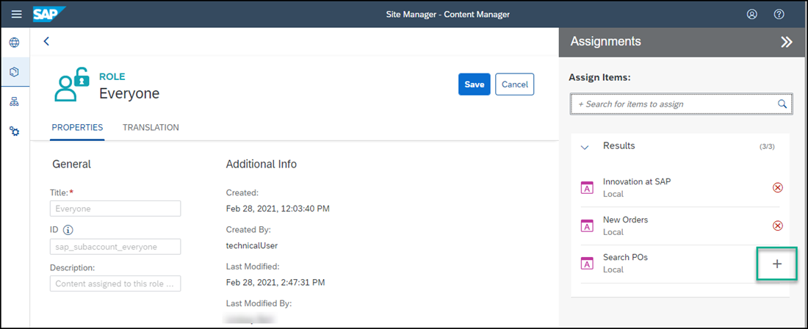

## Prerequisites
- You have created a destination between SAP Cloud Platform and your backend system using the SAP Gateway Demo System.
- You have opened your trial account or other subaccount.

## Details
### You will learn
  - How to expose a Web Dynpro ABAP backend application to your SAP Cloud Platform Portal site.

---

[ACCORDION-BEGIN [Step 1: ](Open the Content Manager)]

1. Click **Subscriptions** in the left navigation panel of your trial account and in the search box, enter `portal` to search for the **Portal** tile.

    

2. Click **Go to Application** on the **Portal** tile.

    

    The **Site Manager** opens with the **Site Directory** in focus.

4. In the side panel, click the icon that opens the **Content Manager**.

    

[DONE]
[ACCORDION-END]

[ACCORDION-BEGIN [Step 2: ](Configure the Web Dynpro ABAP app)]

1.  In the Content Manager, click **+ New** -> **App**.

    

2. In the **PROPERTIES** tab, enter these values:

    |  Field     | Value
    |  :------------- | :-------------
    |  Title           | `Search POs`
    |  System          | Select the value `ES5`
    |  App UI Technology    | Select `Web Dynpro ABAP`
    |  Application ID           | `S_EPM_FPM_PO`

    

3. In the **NAVIGATION** tab, enter these values:

    |  Field     | Value
    |  :------------- | :-------------
    |  Semantic Object           | `S_EPM_FPM_PO`
    |  Action          | `Display`

    

4. In the **VISUALIZATION** tab, enter these value:

    |  Field     | Value
    |  :------------- | :-------------
    |  Subtitle           | `Search for Purchase Orders`
    |  Icon          | Select the `activity-2` icon. Just type the icon name in the search bar.

    Click **Save**.

    

You've configured the app. Now you need to assign it to a group so that users will be able to see the app on the launchpad page of your Portal site. You also need to assign it to the **Everyone** role so that users can access the app.  

[DONE]
[ACCORDION-END]

[ACCORDION-BEGIN [Step 3: ](Assign the app to a group)]

In this step, we will first create a new group and then assign the app to it.

1. Use the back arrow to get back to the Content Manager.

    

2. Click **+ New** and select **Group**.

    

3. Name the group `Purchase Orders`.

4. In the **Assignments** panel on the right, type in `se` to find the `Search POs` app.  Then next to the app name, click the **+** icon to assign the app to the group.

    

5. Click **Save**.

6. Use the back arrow to go back to the Content Manager to see your new group in the list.

[DONE]
[ACCORDION-END]

[ACCORDION-BEGIN [Step 4: ](Assign the app to a role)]

In this step you will assign the app to the `Everyone` role so that users can access and launch the app in the launchpad page.

1. In the Content Manager, click the `Everyone` role.

    

2. Click **Edit** in the Role editor.

3. In the **Assignments** panel on the right, enter `se` in the search bar to look for the `Search POs` app.

3. Click the **+** icon next to the app name to assign the app to the `Everyone` role.

3.  Click **Save**.

    

[DONE]
[ACCORDION-END]

[ACCORDION-BEGIN [Step 5: ](Launch the app)]

1. From the side panel, click the icon that opens the Site Directory.

    

2. On the `JobCore Portal` site (or another site that you created), click the **Go to site** icon.

    

3. Enter your logon details if prompted to do so.

4. Click **My Apps** in the menu bar. You will see the two groups that you created.

5. In the `Purchase Orders` group, click the Web Dynpro ABAP app called `Search POs` to launch it.

    

And this is what you'll see.

  

[VALIDATE_7]

[ACCORDION-END]
