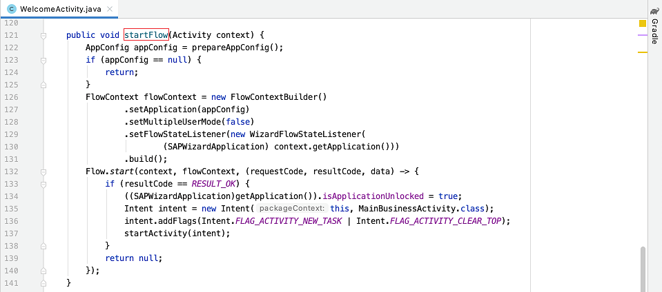
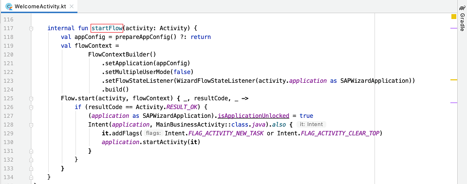
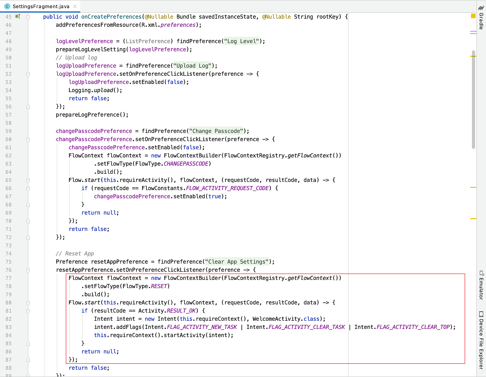
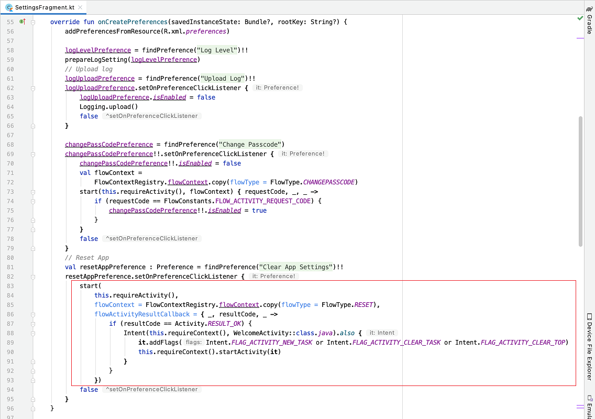

## Prerequisites
- You completed [Try Out the SAP BTP SDK Wizard for Android](cp-sdk-android-wizard-app).
- You completed [Get Familiar with Flows Component by Wizard Generated Application](cp-sdk-android-flows-wizard).
- You completed [Customize the Onboarding Flow](cp-sdk-android-flows-onboarding).

## Details
### You will learn
  - How to handle application restore and passcode timeout with the Flows Component
  - How to reset an application with the Flows component

---

[ACCORDION-BEGIN [Step 1: ](Application restore with the Flows component)]

After onboarding, when next time users open the mobile app, the restore flow will be started. Basically, the restore flow consists of the screen to unlock the app with either the passcode or the biometric information, if enabled. The restore flow will also check if the passcode is expired based on the expired days defined in the passcode policy. When the passcode is expired, the restore will ask user to create a new passcode and launch a "change passcode" flow.

Similar to the onboarding flow, the restore flow will also listen to the flow states and notify corresponding events to the client code.

The flows component will automatically determine whether to use the onboarding or restore flow, so the app can use the same client code for the two flows.

[OPTION BEGIN [Java]]

1.  Open the project you [previously created](cp-sdk-android-wizard-app) using the SAP BTP SDK Wizard for Android.

2.  In Android Studio, on Windows, press **`Ctrl+N`**, or, on a Mac, press **`command+O`**, and type **`WelcomeActivity`** to open `WelcomeActivity.java`.

3.  On Windows, press **`Ctrl+F12`**, or, on a Mac, press **`command+F12`**, and type **`startFlow`** to move to the `startFlow` method. As we mentioned in [Get Familiar with Flows Component by Wizard Generated Application](cp-sdk-android-flows-wizard), this method starts an onboarding flow. After onboarding, when next time the app starts, the same method is called and the Flows Component detects that the user is already onboarded and starts the restore flow. The client code does not need handle the logic to explicitly start a restore flow.

    !

4.  The restore flow will notify the same events as the onboarding flow and one more `UnlockWithPasscode` event which is specific for the restore flow. When the app is unlocked with passcode, client code can get the passcode from the callback `onUnlockWithPasscode` of the `FlowStateListener` instance and open the secure store. [Customize the Onboarding Flow](cp-sdk-android-flows-onboarding) explains the events notified in the onboarding flow.

5.  When the app is put to background, the Flows component will monitor whether the passcode is timeout based on the "Lock Timeout" value defined in the passcode policy. When the passcode is timeout and the app is put to foreground again, a timeout unlock flow will be started. The type of this flow is `FlowType.TIMEOUT_UNLOCK`, which is internally used by the Flows Component for passcode timeout scenario. The function of this flow is exactly the same as the restore flow.

[OPTION END]

[OPTION BEGIN [Kotlin]]

1.  Open the project you [previously created](cp-sdk-android-wizard-app) using the SAP BTP SDK Wizard for Android.

2.  In Android Studio, on Windows, press **`Ctrl+N`**, or, on a Mac, press **`command+O`**, and type **`WelcomeActivity`** to open `WelcomeActivity.kt`.

3.  On Windows, press **`Ctrl+F12`**, or, on a Mac, press **`command+F12`**, and type **`startFlow`** to move to the `startFlow` method. As we mentioned in [Get Familiar with Flows Component by Wizard Generated Application](cp-sdk-android-flows-wizard), this method starts an onboarding flow. After onboarding, when next time the app starts, the same method is called and the Flows Component detects that the user is already onboarded and starts the restore flow. The client code does not need handle the logic to explicitly start a restore flow.

    !

4.  The restore flow will notify the same events as the onboarding flow and one more `UnlockWithPasscode` event which is specific for the restore flow. When the app is unlocked with passcode, client code can get the passcode from the callback `onUnlockWithPasscode` of the `FlowStateListener` instance and open the secure store. [Customize the Onboarding Flow](cp-sdk-android-flows-onboarding) explains the events notified in the onboarding flow.

5.  When the app is put to background, the Flows component will monitor whether the passcode is timeout based on the "Lock Timeout" value defined in the passcode policy. When the passcode is timeout and the app is put to foreground again, a timeout unlock flow will be started. The type of this flow is `FlowType.TIMEOUT_UNLOCK`, which is internally used by the Flows Component for passcode timeout scenario. The function of this flow is exactly the same as the restore flow.

[OPTION END]

[VALIDATE_1]
[ACCORDION-END]

[ACCORDION-BEGIN [Step 2: ](Reset application with the Flows component)]

There will be cases that the user wants to reset the app to initial status. The reset flow is designed for the purpose to clear all the application data, user data and security data managed by the Flows Component.

[OPTION BEGIN [Java]]

1.  Open the project you [previously created](cp-sdk-android-wizard-app) using the SAP BTP SDK Wizard for Android.

2.  In Android Studio, on Windows, press **`Ctrl+N`**, or, on a Mac, press **`command+O`**, and type **`SettingsFragment`** to open `SettingsFragment.java`.

3.  On Windows, press **`Ctrl+F12`**, or, on a Mac, press **`command+F12`**, and type **`onCreatePreferences`** to move to the `onCreatePreferences` method. To start the flow to reset application, set the flow type as **`FlowType.RESET`** for the **`FlowContext`** instance, and then start the flow with this **`FlowContext`** instance. The entire process to reset application will be handled automatically.

    !

4.  When the reset flow is started, by default, a dialog will pop up to ask the user for confirmation.

    !

    Client code can customize the reset flow to hide this dialog by overriding the **`isResetConfirmationNeeded`** function of the **`FlowOptions`** instance to return **`false`**, and set this **`FlowOptions`** instance for the **`FlowContext`** instance to start the reset flow.

    ```Java
    FlowContext flowContext = new FlowContextBuilder()
                .setFlowType(FlowType.RESET)
                .setFlowOptions(new FlowOptions(){
                    @Override
                    public boolean isResetConfirmationNeeded() {
                        return false;
                    }
                }).build();
    Flow.start(this, flowContext);
    ```

5.  Before removing all the data managed by the Flows Component, the reset flow will notify the `ApplicationReset` event. Client code can use the callback `onApplicationReset` of the `FlowStateListener` instance to insert its own logic for application reset, for example, clear the data managed by the client code and un-register the push token.

    In Android Studio, on Windows, press **`Ctrl+N`**, or, on a Mac, press **`command+O`**, and type **`WizardFlowStateListener`** to open `WizardFlowStateListener.java`. On Windows, press **`Ctrl+F12`**, or, on a Mac, press **`command+F12`**, and type **`onApplicationReset`** to move to the `onApplicationReset` method.

    !

[OPTION END]

[OPTION BEGIN [Kotlin]]
1.  Open the project you [previously created](cp-sdk-android-wizard-app) using the SAP BTP SDK Wizard for Android.

2.  In Android Studio, on Windows, press **`Ctrl+N`**, or, on a Mac, press **`command+O`**, and type **`SettingsFragment`** to open `SettingsFragment.kt`.

3.  On Windows, press **`Ctrl+F12`**, or, on a Mac, press **`command+F12`**, and type **`onCreatePreferences`** to move to the `onCreatePreferences` method. To start the flow to reset application, set the flow type as **`FlowType.RESET`** for the **`FlowContext`** instance, and then start the flow with this **`FlowContext`** instance. The entire process to reset application will be handled automatically.

    !

4.  When the reset flow is started, by default, a dialog will pop up to ask the user for confirmation.

    !

    Client code can customize the reset flow to hide this dialog by setting the value of **`needConfirmWhenReset`** parameter to **`false`** for the **`FlowOptions`** instance and set this **`FlowOptions`** instance for the **`FlowContext`** instance to start the reset flow.

    ```Kotlin
    val flowContext =
            FlowContextBuilder()
                    .setFlowType(FlowType.RESET)
                    .setFlowOptions(FlowOptions(
                            needConfirmWhenReset = false
                    ))
                    .build()
    Flow.start(this, flowContext)
    ```

5.  Before removing all the data managed by the Flows Component, the reset flow will notify the `ApplicationReset` event. Client code can use the callback `onApplicationReset` of the `FlowStateListener` instance to insert its own logic for application reset, for example, clear the data managed by the client code and un-register the push token.

    In Android Studio, on Windows, press **`Ctrl+N`**, or, on a Mac, press **`command+O`**, and type **`WizardFlowStateListener`** to open `WizardFlowStateListener.kt`. On Windows, press **`Ctrl+F12`**, or, on a Mac, press **`command+F12`**, and type **`onApplicationReset`** to move to the `onApplicationReset` method.

    !

[OPTION END]

Congratulations! You now have learned how to restore and reset application with the Flows component!

[VALIDATE_2]
[ACCORDION-END]

---
