## Details
### You will learn
- How the offline feature works, through demonstration
- How the synchronization code works
- How to handle errors that occur while syncing
---

[ACCORDION-BEGIN [Step 1: ](Generate and run an offline app)]

1.  Follow the instructions at [Try Out the SAP Cloud Platform SDK for Android Wizard](cp-sdk-android-wizard-app) to create a new application using the SAP Cloud Platform SDK for Android Wizard and select **Offline** for the OData option on the **Project Features** tab. The push feature is not needed for this application.

    

2.  Run the app. After the login process, a screen is displayed explaining that the offline store is opening. As the screen suggests, opening the offline store for the first time can take up to a few minutes. One technique to decrease this initial time is to only download data that is relevant to the user, such as customers that belong in their sales region.

    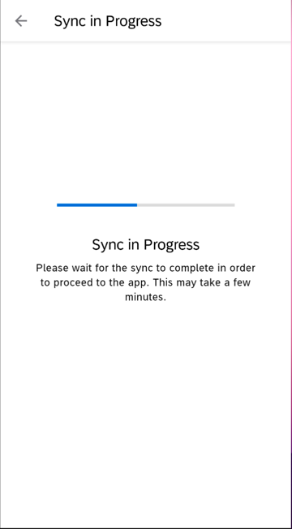

3.  When you get to the app's home page, turn on **airplane mode** on your device, or disable Wi-Fi and data.

    

4.  The entity list screen is populated based on the `metadata.xml` file retrieved when the application was created. Tap the **Products** list item.

    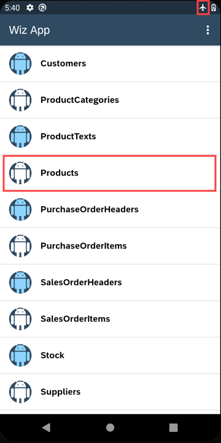

    The **Products** screen makes a data request to display the available products. Notice that it succeeds without a working network connection. The data request is fulfilled from the offline store that was previously created and populated on the device.

    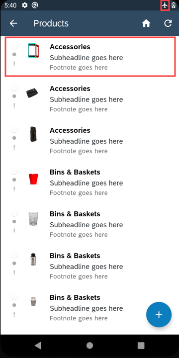

5.  On the detail screen, tap the edit toolbar icon.

    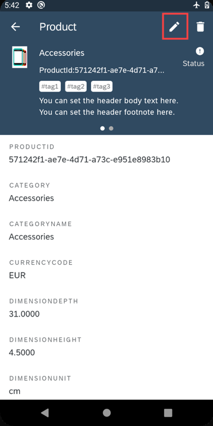

6.  Make a change to the currency code and tap the save toolbar icon.

    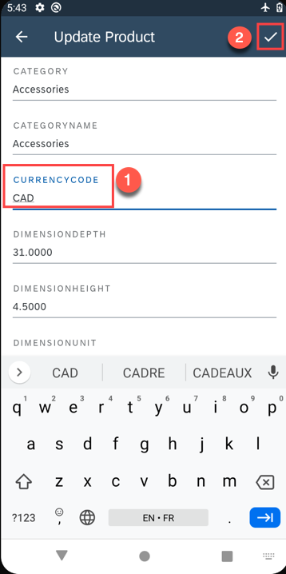

7.  Navigate back to the app's **Home** screen and tap **Synchronize** using the three-dot-menu in the top right of the title bar.

    

    The sync should fail because you haven't turned airplane mode off yet.

    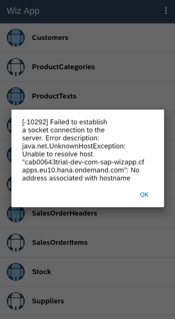

8.  Turn off airplane mode or re-enable Wi-Fi/data and attempt a sync again. You will see a notification that describes the sync action.

    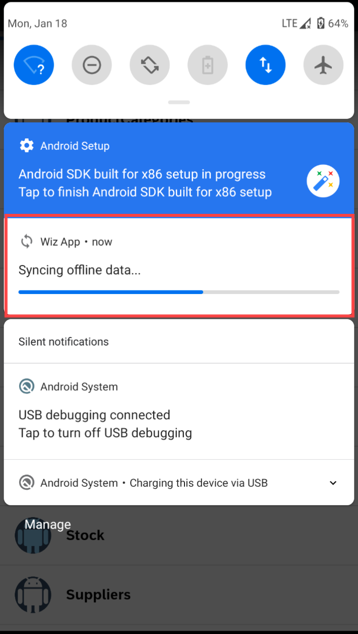

    When the sync completes, the change you made will have been applied to the back end.

[VALIDATE_3]
[ACCORDION-END]

[ACCORDION-BEGIN [Step 2: ](Examine the defining queries)]

>Make sure you are selecting the right language above.

The offline store is populated based on objects called in using `OfflineODataDefiningQuery`. The defining queries are located in `SAPServiceManager.java`, in the `initializeOffline` method.

[OPTION BEGIN [Java]]

```Java
OfflineODataDefiningQuery customersQuery = new OfflineODataDefiningQuery("Customers", "Customers", false);
OfflineODataDefiningQuery productsQuery = new OfflineODataDefiningQuery("Products", "Products", true);
```

[OPTION END]

[OPTION BEGIN [Kotlin]]

```Kotlin
val customersQuery = OfflineODataDefiningQuery("Customers", "Customers", false)
val productsQuery = OfflineODataDefiningQuery("Products", "Products", true)
```

[OPTION END]

Defining queries tell the `OfflineODataProvider` (the class that manages the offline store) which entity sets to store on the device. In the case of the wizard-generated application, there is a defining query for each available entity by default, meaning that each entity is stored offline and available if the user doesn't have an internet connection. For more information, see [Defining Queries](https://help.sap.com/doc/c2d571df73104f72b9f1b73e06c5609a/Latest/en-US/docs/user-guide/odata/Offline_OData_Defining_Application_Configuration_File.html#defining-queries).

>With an offline-enabled app, requests made against the entity sets that are included in the defining requests will always be fulfilled from the local offline store.

[VALIDATE_1]
[ACCORDION-END]

[ACCORDION-BEGIN [Step 3: ](Examine the offline service and service manager)]

>Make sure you are selecting the right language above.

The application allows users to make changes against a local offline store and synchronize manually at any time. The sync operation is performed by a [foreground service](https://developer.android.com/guide/components/services#Foreground). In the wizard-generated application, the `OfflineODataSyncService` is the foreground service. There are three operations that must be implemented in order to use the offline store functionality: `openStore`, `downloadStore`, and `uploadStore`. As their names suggest, the operations open the offline store, download server changes, and upload user changes, respectively.

[OPTION BEGIN [Java]]

1.  In Android Studio, on Windows, press **`Ctrl+N`**, or, on a Mac, press **`command+O`**, and type **`OfflineODataSyncService`** to open `OfflineODataSyncService.java` and examine the three methods.

    

    The service is simply a wrapper for the corresponding methods of the `OfflineODataProvider` class. The methods perform the `open`/`download`/`upload` operations and pass the given callbacks through.

    

    The `openStore` method is called by `LogonActivity.java` when the user logs into the application and binds the `OfflineODataSyncService`. For more information, see [Creating a Bound Service](https://developer.android.com/guide/components/services#CreatingBoundService).

    

    The `uploadStore` and `downloadStore` methods are called by `SAPServiceManager` when the user wants to perform a sync. When an entity is created locally in the offline store, its primary key is left unset. This is because when the user performs an `upload`, the server will set the primary key for the client. An `upload` and a `download` are normally performed together because the `download` may return updated values from the server, such as a newly-created primary key.

    

[OPTION END]

[OPTION BEGIN [Kotlin]]

1.  In Android Studio, on Windows, press **`Ctrl+N`**, or, on a Mac, press **`command+O`**, and type **`OfflineODataSyncService`** to open `OfflineODataSyncService.kt` and examine the three methods.

    

    The service is simply a wrapper for the corresponding methods of the `OfflineODataProvider` class. The methods perform the `open`/`download`/`upload` operations and pass the given callbacks through.

    

    The `openStore` method is called by `LogonActivity.kt` when the user logs into the application and binds the `OfflineODataSyncService`. For more information, see [Creating a Bound Service](https://developer.android.com/guide/components/services#CreatingBoundService).

    

    The `uploadStore` and `downloadStore` methods are called by `SAPServiceManager` when the user wants to perform a sync. When an entity is created locally in the offline store, its primary key is left unset. This is because when the user performs an `upload`, the server will set the primary key for the client. An `upload` and a `download` are normally performed together because the `download` may return updated values from the server, such as a newly-created primary key.

    

[OPTION END]

For more information about how the offline store works, see the [Offline API](https://help.sap.com/doc/c2d571df73104f72b9f1b73e06c5609a/Latest/en-US/docs/user-guide/odata/Offline_OData_Introduction.html).

[VALIDATE_2]
[ACCORDION-END]

[ACCORDION-BEGIN [Step 4: ](Introduce a synchronization error)]

When syncing changes made while offline, conflicts can occur. One example might be if two people attempted to update a description field for the same product. Another might be updating a record that was deleted by another user. The [`ErrorArchive`](https://help.sap.com/doc/c2d571df73104f72b9f1b73e06c5609a/Latest/en-US/docs/user-guide/odata/Offline_OData_Handling_Errors_And_Conflicts.html#accessing-the-errorarchive) provides a way to see details of any of the conflicts that may have occurred. The following instructions demonstrate how to use `ErrorArchive`.

1.  Update a **SalesOrderItem** and change its quantity to be zero and save it. Update a second item and change its quantity to a different non-zero number and save it.

    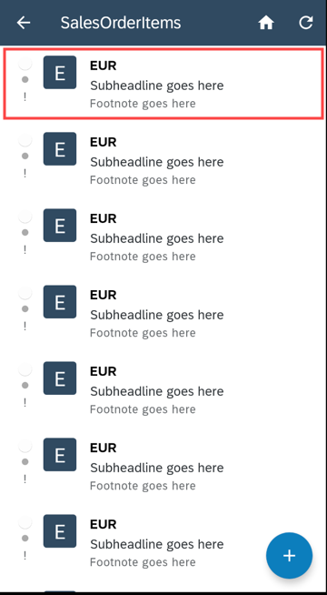

    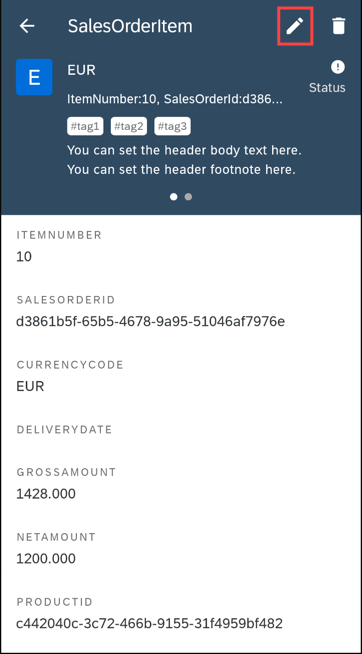

    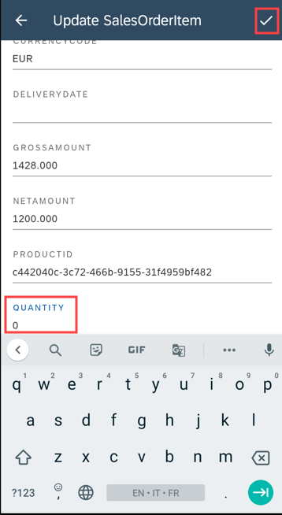

    Notice that the items are now marked with a yellow indicator to indicate that an item has been locally modified but not yet synced.

    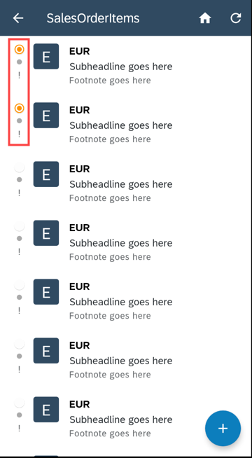

2.  Attempt a sync, and you'll notice that the sync completes, but if you examine the **SalesOrderItems** list, one item has a red mark beside it, indicating it is in an error state. This is because the back end has a check that **SalesOrderItems** cannot have zero for their quantity. This check does not exist in the local offline store, so the update succeeds locally but fails when the offline store is synced.

    

[DONE]
[ACCORDION-END]

[ACCORDION-BEGIN [Step 5: ](Display ErrorArchive details)]

In this section we will create an **Error Information** screen that displays the details from the `ErrorArchive`.

[OPTION BEGIN [Java]]

1.  Press **`Shift`** twice and type **`strings.xml`** to open `res\values\strings.xml`.

2.  Add the following values.

    ```XML
    <string name="error_header">Error Information</string>
    <string name="request_method">Request Method</string>
    <string name="request_status">Request Status</string>
    <string name="request_message">Request Message</string>
    <string name="request_body">Request Body</string>
    <string name="request_url">Request URL</string>
    ```

3.  Create a new activity in the `mdui` folder by right-clicking, then selecting **New** > **Activity** > **Empty Activity**. Name the new activity **`ErrorActivity`**.

4.  Press **`Shift`** twice and type **`activity_error`** to open `res/layout/activity_error.xml`. (Click **Text** to switch to code view.)

5.  Replace its contents with the following XML.

    ```XML
    <?xml version="1.0" encoding="utf-8"?>
    <LinearLayout xmlns:android="http://schemas.android.com/apk/res/android"
        xmlns:app="http://schemas.android.com/apk/res-auto"
        xmlns:tools="http://schemas.android.com/tools"
        android:layout_width="match_parent"
        android:layout_height="match_parent"
        tools:context=".mdui.ErrorActivity"
        android:orientation="vertical">

        <ScrollView
            xmlns:android="http://schemas.android.com/apk/res/android"
            android:layout_height="wrap_content"
            android:layout_width="match_parent">

            <LinearLayout
                xmlns:android="http://schemas.android.com/apk/res/android"
                android:layout_height="wrap_content"
                android:layout_width="match_parent"
                android:orientation="vertical">

                <TextView
                    android:layout_width="match_parent"
                    android:layout_height="wrap_content"
                    android:padding="@dimen/key_line_16dp"
                    style="@style/Test.ObjectCell.Headline"
                    android:text="@string/error_header"/>

                <View
                    android:layout_width="match_parent"
                    android:layout_marginTop="@dimen/key_line_16dp"
                    android:layout_height="1dp"
                    android:background="?android:attr/listDivider" />

                <TextView
                    android:layout_width="match_parent"
                    android:layout_height="wrap_content"
                    android:padding="@dimen/key_line_16dp"
                    style="@style/FioriTextStyle.OVERLINE"
                    android:text="@string/request_message"/>

                <TextView
                    android:id="@+id/requestMessageTextView"
                    android:layout_width="match_parent"
                    android:layout_height="wrap_content"
                    android:paddingLeft="@dimen/key_line_16dp"
                    android:paddingRight="@dimen/key_line_16dp"
                    style="@style/TextAppearance.Fiori.Subtitle1"
                    android:singleLine="false"
                    android:text="@string/request_message"/>

                <View
                    android:layout_width="match_parent"
                    android:layout_marginTop="@dimen/key_line_16dp"
                    android:layout_height="1dp"
                    android:background="?android:attr/listDivider" />

                <TextView
                    android:layout_width="match_parent"
                    android:layout_height="wrap_content"
                    android:padding="@dimen/key_line_16dp"
                    style="@style/FioriTextStyle.OVERLINE"
                    android:text="@string/request_body"/>

                <TextView
                    android:id="@+id/requestBodyTextView"
                    android:layout_width="match_parent"
                    android:layout_height="wrap_content"
                    android:paddingLeft="@dimen/key_line_16dp"
                    android:paddingRight="@dimen/key_line_16dp"
                    style="@style/TextAppearance.Fiori.Subtitle1"
                    android:singleLine="false"
                    android:text="@string/request_body"/>

                <View
                    android:layout_width="match_parent"
                    android:layout_marginTop="@dimen/key_line_16dp"
                    android:layout_height="1dp"
                    android:background="?android:attr/listDivider" />

                <TextView
                    android:layout_width="match_parent"
                    android:layout_height="wrap_content"
                    android:padding="@dimen/key_line_16dp"
                    style="@style/FioriTextStyle.OVERLINE"
                    android:text="@string/request_url"/>

                <TextView
                    android:id="@+id/requestURLTextView"
                    android:layout_width="match_parent"
                    android:layout_height="wrap_content"
                    android:paddingLeft="@dimen/key_line_16dp"
                    android:paddingRight="@dimen/key_line_16dp"
                    style="@style/TextAppearance.Fiori.Subtitle1"
                    android:singleLine="false"
                    android:text="@string/request_url"/>

                <View
                    android:layout_width="match_parent"
                    android:layout_marginTop="@dimen/key_line_16dp"
                    android:layout_height="1dp"
                    android:background="?android:attr/listDivider" />

                <View
                    android:layout_width="match_parent"
                    android:layout_height="1dp"
                    android:background="?android:attr/listDivider" />

                <TextView
                    android:layout_width="match_parent"
                    android:layout_height="wrap_content"
                    android:padding="@dimen/key_line_16dp"
                    style="@style/FioriTextStyle.OVERLINE"
                    android:text="@string/request_status"/>

                <TextView
                    android:id="@+id/requestStatusTextView"
                    android:layout_width="match_parent"
                    android:layout_height="wrap_content"
                    android:paddingLeft="@dimen/key_line_16dp"
                    style="@style/TextAppearance.Fiori.Subtitle1"
                    android:text="@string/request_status"/>

                <View
                    android:layout_width="match_parent"
                    android:layout_marginTop="@dimen/key_line_16dp"
                    android:layout_height="1dp"
                    android:background="?android:attr/listDivider" />

                <TextView
                    android:layout_width="match_parent"
                    android:layout_height="wrap_content"
                    android:padding="@dimen/key_line_16dp"
                    style="@style/FioriTextStyle.OVERLINE"
                    android:text="@string/request_method"/>

                <TextView
                    android:id="@+id/requestMethodTextView"
                    android:layout_width="match_parent"
                    android:layout_height="wrap_content"
                    android:paddingLeft="@dimen/key_line_16dp"
                    style="@style/TextAppearance.Fiori.Subtitle1"
                    android:text="@string/request_method"/>

                <View
                    android:layout_width="match_parent"
                    android:layout_marginTop="@dimen/key_line_16dp"
                    android:layout_height="1dp"
                    android:background="?android:attr/listDivider" />
            </LinearLayout>
        </ScrollView>
    </LinearLayout>
    ```

6.  Replace the `ErrorActivity.java` generated activity code with the following code.

    In the package statement and the import, if needed, replace `com.sap.wizapp` with the package name of your project.

    ```Java
    package com.sap.wizapp.mdui;

    import androidx.appcompat.app.AppCompatActivity;
    import android.os.Bundle;
    import android.view.MenuItem;
    import android.widget.TextView;

    import com.sap.wizapp.R;

    public class ErrorActivity extends AppCompatActivity {

        @Override
        protected void onCreate(Bundle savedInstanceState) {
            super.onCreate(savedInstanceState);
            setContentView(R.layout.activity_error);
            getSupportActionBar().setDisplayHomeAsUpEnabled(true);
            int errorCode = getIntent().getIntExtra("ERROR_CODE", 0);
            String errorMethod = getIntent().getStringExtra("ERROR_METHOD");
            String requestURL = getIntent().getStringExtra("ERROR_URL");
            String errorMessage = getIntent().getStringExtra("ERROR_MESSAGE");
            String body = getIntent().getStringExtra("ERROR_BODY");
            ((TextView) (findViewById(R.id.requestStatusTextView))).setText("" + errorCode);

            if (errorMethod != null) {
                ((TextView) (findViewById(R.id.requestMethodTextView))).setText(errorMethod);
            }
            if (requestURL != null) {
                ((TextView) (findViewById(R.id.requestURLTextView))).setText(requestURL);
            }
            if (errorMessage != null) {
                ((TextView) (findViewById(R.id.requestMessageTextView))).setText(errorMessage);
            }
            if (body != null) {
                ((TextView) (findViewById(R.id.requestBodyTextView))).setText(body);
            }
        }

        @Override
        public boolean onOptionsItemSelected(MenuItem item) {
            finish();
            return super.onOptionsItemSelected(item);
        }
    }
    ```

7.  On Windows, press **`Ctrl+N`**, or, on a Mac, press **`command+O`**, and type **`EntitySetListActivity`** to open `EntitySetListActivity.java`.

8.  In the `synchronize` method, find the line that performs the `sapServiceManager.synchronize` method call.

    

9.  Between the `progressBar.setVisibility(View.INVISIBLE);` line and the `syncCompleteHandler.call();` line in the success callback, add the following code, which queries the error archive and displays information to the user about the first error encountered.

    ```Java
    SAPServiceManager serviceManager = ((SAPWizardApplication)getApplication()).getSAPServiceManager();
    OfflineODataProvider provider = serviceManager.retrieveProvider();
    try {
        List<OfflineODataErrorArchiveEntity> errorArchive = provider.getErrorArchive();

        for (OfflineODataErrorArchiveEntity errorEntity : errorArchive) {
            String requestURL = errorEntity.getRequestURL();
            String method = errorEntity.getRequestMethod();
            String message = errorEntity.getMessage();
            Integer statusCode = errorEntity.getHttpStatusCode() != null  ?  errorEntity.getHttpStatusCode() : 0;
            String body = errorEntity.getRequestBody();

            LOGGER.error("RequestURL: " + requestURL);
            LOGGER.error("HTTP Status Code: " + statusCode);
            LOGGER.error("Method: " + method);
            LOGGER.error("Message: " + message);
            LOGGER.error("Body: " + body);

            Intent errorIntent = new Intent(EntitySetListActivity.this, ErrorActivity.class);
            errorIntent.putExtra("ERROR_URL", requestURL);
            errorIntent.putExtra("ERROR_CODE", statusCode);
            errorIntent.putExtra("ERROR_METHOD", method);
            errorIntent.putExtra("ERROR_BODY", body);
            try {
                JSONObject jsonObj = new JSONObject(message);
                errorIntent.putExtra("ERROR_MESSAGE", jsonObj.getJSONObject("error").getString("message"));
            } catch (JSONException e) {
                e.printStackTrace();
            }

            // Reverts all failing entities to the previous state or set
            // offlineODataParameters.setEnableIndividualErrorArchiveDeletion(true);
            // to cause the deleteEntity call to only revert the specified entity
            // https://help.sap.com/doc/c2d571df73104f72b9f1b73e06c5609a/Latest/en-US/docs/user-guide/odata/Offline_OData_Handling_Failed_Requests.html#reverting-an-error-state
            // provider.deleteEntity(errorEntity, null, null);
            startActivity(errorIntent);
            break; //For simplicity, only show the first error encountered
        }
    } catch (OfflineODataException e) {
        e.printStackTrace();
    }
    ```

10.  Run the app again, and re-attempt the sync. When the sync fails, you should see the following error screen.

    

    You can see that the HTTP status code, method, and message are included. When the application attempted a sync, the entity being updated didn't pass the backend checks, produced a `DataServiceException`, and is now in the error state. All entities that did not produce errors are successfully synced. One way to correct the exception would be to change the quantity from 0 to a valid positive number. Another would be to delete the `ErrorArchive` entry, reverting the entity to its previous state. For more information on error handling, see [Handling Errors and Conflicts](https://help.sap.com/doc/c2d571df73104f72b9f1b73e06c5609a/Latest/en-US/docs/user-guide/odata/Offline_OData_Handling_Errors_And_Conflicts.html) and [Handling Failed Requests](https://help.sap.com/doc/c2d571df73104f72b9f1b73e06c5609a/Latest/en-US/docs/user-guide/odata/Offline_OData_Handling_Failed_Requests.html).

[OPTION END]

[OPTION BEGIN [Kotlin]]

1.  Press **`Shift`** twice and type **`strings.xml`** to open `res\values\strings.xml`.

2.  Add the following values.

    ```XML
    <string name="error_header">Error Information</string>
    <string name="request_method">Request Method</string>
    <string name="request_status">Request Status</string>
    <string name="request_message">Request Message</string>
    <string name="request_body">Request Body</string>
    <string name="request_url">Request URL</string>
    ```

3.  Create a new activity in the `mdui` folder by right-clicking, then selecting **New** > **Activity** > **Empty Activity**. Name the new activity **`ErrorActivity`**.

4.  Press **`Shift`** twice and type **`activity_error`** to open `res/layout/activity_error.xml`. (Click **Text** to switch to code view.)

5.  Replace its contents with the following XML.

    ```XML
    <?xml version="1.0" encoding="utf-8"?>
    <LinearLayout xmlns:android="http://schemas.android.com/apk/res/android"
        xmlns:app="http://schemas.android.com/apk/res-auto"
        xmlns:tools="http://schemas.android.com/tools"
        android:layout_width="match_parent"
        android:layout_height="match_parent"
        tools:context=".mdui.ErrorActivity"
        android:orientation="vertical">

        <ScrollView
            xmlns:android="http://schemas.android.com/apk/res/android"
            android:layout_height="wrap_content"
            android:layout_width="match_parent">

            <LinearLayout
                xmlns:android="http://schemas.android.com/apk/res/android"
                android:layout_height="wrap_content"
                android:layout_width="match_parent"
                android:orientation="vertical">

                <TextView
                    android:layout_width="match_parent"
                    android:layout_height="wrap_content"
                    android:padding="@dimen/key_line_16dp"
                    style="@style/Test.ObjectCell.Headline"
                    android:text="@string/error_header"/>

                <View
                    android:layout_width="match_parent"
                    android:layout_marginTop="@dimen/key_line_16dp"
                    android:layout_height="1dp"
                    android:background="?android:attr/listDivider" />

                <TextView
                    android:layout_width="match_parent"
                    android:layout_height="wrap_content"
                    android:padding="@dimen/key_line_16dp"
                    style="@style/FioriTextStyle.OVERLINE"
                    android:text="@string/request_message"/>

                <TextView
                    android:id="@+id/requestMessageTextView"
                    android:layout_width="match_parent"
                    android:layout_height="wrap_content"
                    android:paddingLeft="@dimen/key_line_16dp"
                    android:paddingRight="@dimen/key_line_16dp"
                    style="@style/TextAppearance.Fiori.Subtitle1"
                    android:singleLine="false"
                    android:text="@string/request_message"/>

                <View
                    android:layout_width="match_parent"
                    android:layout_marginTop="@dimen/key_line_16dp"
                    android:layout_height="1dp"
                    android:background="?android:attr/listDivider" />

                <TextView
                    android:layout_width="match_parent"
                    android:layout_height="wrap_content"
                    android:padding="@dimen/key_line_16dp"
                    style="@style/FioriTextStyle.OVERLINE"
                    android:text="@string/request_body"/>

                <TextView
                    android:id="@+id/requestBodyTextView"
                    android:layout_width="match_parent"
                    android:layout_height="wrap_content"
                    android:paddingLeft="@dimen/key_line_16dp"
                    android:paddingRight="@dimen/key_line_16dp"
                    style="@style/TextAppearance.Fiori.Subtitle1"
                    android:singleLine="false"
                    android:text="@string/request_body"/>

                <View
                    android:layout_width="match_parent"
                    android:layout_marginTop="@dimen/key_line_16dp"
                    android:layout_height="1dp"
                    android:background="?android:attr/listDivider" />

                <TextView
                    android:layout_width="match_parent"
                    android:layout_height="wrap_content"
                    android:padding="@dimen/key_line_16dp"
                    style="@style/FioriTextStyle.OVERLINE"
                    android:text="@string/request_url"/>

                <TextView
                    android:id="@+id/requestURLTextView"
                    android:layout_width="match_parent"
                    android:layout_height="wrap_content"
                    android:paddingLeft="@dimen/key_line_16dp"
                    android:paddingRight="@dimen/key_line_16dp"
                    style="@style/TextAppearance.Fiori.Subtitle1"
                    android:singleLine="false"
                    android:text="@string/request_url"/>

                <View
                    android:layout_width="match_parent"
                    android:layout_marginTop="@dimen/key_line_16dp"
                    android:layout_height="1dp"
                    android:background="?android:attr/listDivider" />

                <View
                    android:layout_width="match_parent"
                    android:layout_height="1dp"
                    android:background="?android:attr/listDivider" />

                <TextView
                    android:layout_width="match_parent"
                    android:layout_height="wrap_content"
                    android:padding="@dimen/key_line_16dp"
                    style="@style/FioriTextStyle.OVERLINE"
                    android:text="@string/request_status"/>

                <TextView
                    android:id="@+id/requestStatusTextView"
                    android:layout_width="match_parent"
                    android:layout_height="wrap_content"
                    android:paddingLeft="@dimen/key_line_16dp"
                    style="@style/TextAppearance.Fiori.Subtitle1"
                    android:text="@string/request_status"/>

                <View
                    android:layout_width="match_parent"
                    android:layout_marginTop="@dimen/key_line_16dp"
                    android:layout_height="1dp"
                    android:background="?android:attr/listDivider" />

                <TextView
                    android:layout_width="match_parent"
                    android:layout_height="wrap_content"
                    android:padding="@dimen/key_line_16dp"
                    style="@style/FioriTextStyle.OVERLINE"
                    android:text="@string/request_method"/>

                <TextView
                    android:id="@+id/requestMethodTextView"
                    android:layout_width="match_parent"
                    android:layout_height="wrap_content"
                    android:paddingLeft="@dimen/key_line_16dp"
                    style="@style/TextAppearance.Fiori.Subtitle1"
                    android:text="@string/request_method"/>

                <View
                    android:layout_width="match_parent"
                    android:layout_marginTop="@dimen/key_line_16dp"
                    android:layout_height="1dp"
                    android:background="?android:attr/listDivider" />
            </LinearLayout>
        </ScrollView>
    </LinearLayout>
    ```

6.  Replace the `ErrorActivity.kt` generated activity code with the following code.

    In the package statement and the import, if needed, replace `com.sap.wizapp` with the package name of your project.

    ```Kotlin
    package com.sap.wizapp.mdui

    import androidx.appcompat.app.AppCompatActivity
    import android.os.Bundle
    import android.view.MenuItem
    import android.view.View
    import android.widget.TextView

    import com.sap.wizapp.R

    class ErrorActivity : AppCompatActivity() {

        override fun onCreate(savedInstanceState: Bundle?) {
            super.onCreate(savedInstanceState)
            setContentView(R.layout.activity_error)
            supportActionBar!!.setDisplayHomeAsUpEnabled(true)
            val errorCode = intent.getIntExtra("ERROR_CODE", 0)
            val errorMethod = intent.getStringExtra("ERROR_METHOD")
            val requestURL = intent.getStringExtra("ERROR_URL")
            val errorMessage = intent.getStringExtra("ERROR_MESSAGE")
            val body = intent.getStringExtra("ERROR_BODY")
            (findViewById<View>(R.id.requestStatusTextView) as TextView).text = "".plus(errorCode)

            errorMethod?.let {
                (findViewById<View>(R.id.requestMethodTextView) as TextView).text = it
            }
            requestURL?.let {
                (findViewById<View>(R.id.requestURLTextView) as TextView).text = it
            }
            errorMessage?.let {
                (findViewById<View>(R.id.requestMessageTextView) as TextView).text = it
            }
            body?.let {
                (findViewById<View>(R.id.requestBodyTextView) as TextView).text = it
            }
        }

        override fun onOptionsItemSelected(item: MenuItem): Boolean {
            finish()
            return super.onOptionsItemSelected(item)
        }
    }

    ```

7.  On Windows, press **`Ctrl+N`**, or, on a Mac, press **`command+O`**, and type **`EntitySetListActivity`** to open `EntitySetListActivity.kt`.

8.  In the `synchronize` method, find the line that performs the `sapServiceManager.synchronize` method call.

    

9.  Between the `progressBar!!.visibility = View.INVISIBLE` line and the `syncCompleteHandler.call()` line in the success callback, add the following code, which queries the error archive and displays information to the user about the first error encountered.

    ```Kotlin
    val serviceManager = (application as SAPWizardApplication).sapServiceManager
    val provider = serviceManager.retrieveProvider()

    try {
        val errorArchive = provider!!.errorArchive

        for (errorEntity in errorArchive) {
            val requestURL = errorEntity.requestURL
            val method = errorEntity.requestMethod
            val message = errorEntity.message
            val statusCode = errorEntity.httpStatusCode?.let { it } ?: 0
            val body = errorEntity.requestBody

            LOGGER.error("RequestURL: $requestURL")
            LOGGER.error("HTTP Status Code: $statusCode")
            LOGGER.error("Method: $method")
            LOGGER.error("Message: $message")
            LOGGER.error("Body: $body")

            val errorIntent = Intent(this@EntitySetListActivity, ErrorActivity::class.java)

            errorIntent.putExtra("ERROR_URL", requestURL)
            errorIntent.putExtra("ERROR_CODE", statusCode)
            errorIntent.putExtra("ERROR_METHOD", method)
            errorIntent.putExtra("ERROR_BODY", body)

            try {
                val jsonObj = JSONObject(message)
                errorIntent.putExtra("ERROR_MESSAGE", jsonObj.getJSONObject("error").getString("message"))
            } catch (e: JSONException) {
                e.printStackTrace()
            }

            // Reverts all failing entities to the previous state or set
            // offlineODataParameters.setEnableIndividualErrorArchiveDeletion(true);
            // to cause the deleteEntity call to only revert the specified entity
            // https://help.sap.com/doc/c2d571df73104f72b9f1b73e06c5609a/Latest/en-US/docs/user-guide/odata/Offline_OData_Handling_Failed_Requests.html#reverting-an-error-state
            // provider.deleteEntity(errorEntity, null, null);
            startActivity(errorIntent)
            break //For simplicity, only show the first error encountered
        }
    } catch (e: OfflineODataException) {
        e.printStackTrace()
    }

    ```

10.  Run the app again, and re-attempt the sync. When the sync fails, you should see the following error screen.

    

    You can see that the HTTP status code, method, and message are included. When the application attempted a sync, the entity being updated didn't pass the backend checks and produced a `DataServiceException` and is now in the error state. All entities that did not produce errors are successfully synced. One way to correct the exception would be to change the quantity from 0 to a valid positive number. Another would be to delete the `ErrorArchive` entry, reverting the entity to its previous state. For more information on error handling, see [Handling Errors and Conflicts](https://help.sap.com/doc/c2d571df73104f72b9f1b73e06c5609a/Latest/en-US/docs/user-guide/odata/Offline_OData_Handling_Errors_And_Conflicts.html) and [Handling Failed Requests](https://help.sap.com/doc/c2d571df73104f72b9f1b73e06c5609a/Latest/en-US/docs/user-guide/odata/Offline_OData_Handling_Failed_Requests.html).

[OPTION END]

>Further information on using the offline feature can be found at [Step by Step with the SAP Cloud Platform SDK for Android — Part 6 — Offline OData](https://blogs.sap.com/2018/10/15/step-by-step-with-the-sap-cloud-platform-sdk-for-android-part-6-offline-odata/).

Congratulations! You have created an offline-enabled app using the SAP Cloud Platform SDK for Android Wizard and examined how the `ErrorArchive` can be used to view synchronization errors!

[DONE]
[ACCORDION-END]

---
