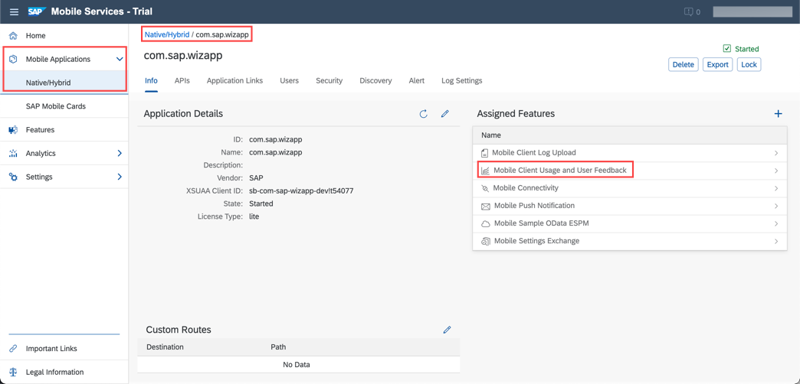
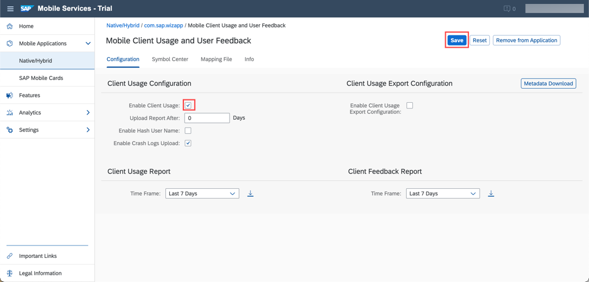
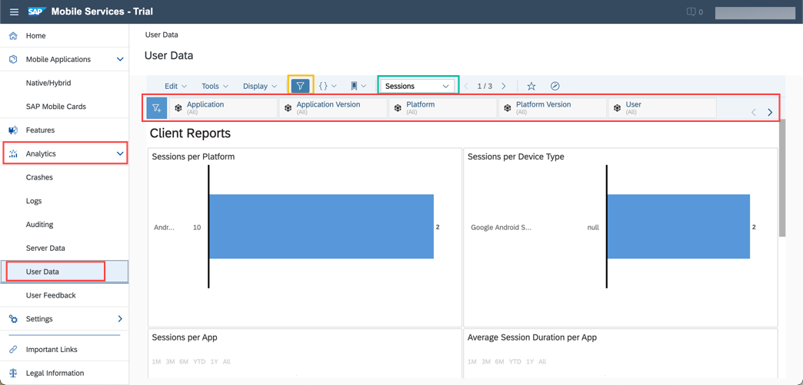
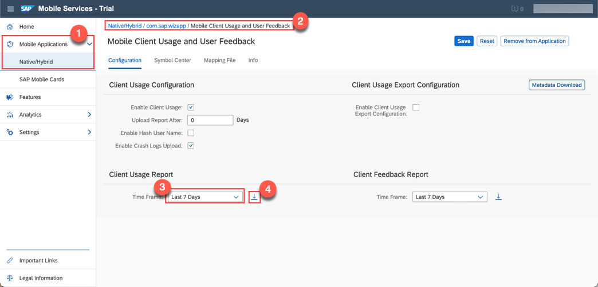
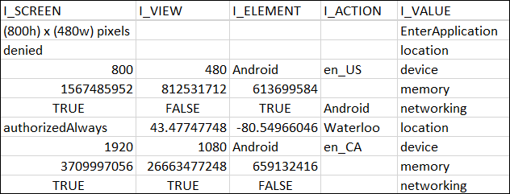

## Prerequisites
- You completed [Try Out the SAP Cloud Platform SDK for Android Wizard](cp-sdk-android-wizard-app).


## Details
### You will learn
- How the Usage Reporting feature works
- How to customize the consent screen
- How to further instrument the Wizard app
- How to add code to enable auto-upload of usage data based on the client policy
---

[ACCORDION-BEGIN [Step 1: ](Manual upload of usage data)]

As shown in the tutorial, [Try Out the SAP Cloud Platform SDK for Android Wizard](cp-sdk-android-wizard-app), ensure that **Enable Usage Reporting** is checked when creating the app.

!

When the app is first installed, a consent screen will automatically be shown to users.

The app must first receive permission to collect usage information from the user.

1.  Tap **ALLOW** to allow the app to record how the app is being used.

    !

    If **DENY** was selected, the user's choice can later be changed in the app's **Settings** screen.

    !

    Once you try to enable **Consent to Usage Collection**, the consent screen will be displayed again to confirm your choice.

2.  From the **Settings** screen, tap **Upload Usage Data**.

    !

    The upload will fail with a HTTP 403 error if usage was not enabled in the [Mobile Services cockpit](https://mobile-service-cockpit-web.cfapps.eu10.hana.ondemand.com/).

    !

3.  To review this policy setting, in the [Mobile Services cockpit](https://mobile-service-cockpit-web.cfapps.eu10.hana.ondemand.com/), access **Mobile Client Usage and User Feedback** by navigating to **Mobile Applications** > **Native/Hybrid** > **com.sap.wizapp** > **Mobile Client Usage and User Feedback**.

    !

    The **Client Usage Configuration** specifies whether uploads of usage data are allowed and the time interval between automatic usage report uploads.

    The preset value for **Upload Report After** is 0 (usage reports will not be uploaded automatically), which we will use in the implementation of automatically uploading usage reports to the server. Finally, click **Save** to save any changes.

    !

4.  If an empty usage report notification is shown when **Upload Usage Data** is selected, navigate away from the app by going to your phone's **Home** screen and re-entering the app. Then try uploading the usage report again. Placing the app in the background will complete or end the current usage session. Partial sessions can not be uploaded.

    !

    If **Upload Usage Data** was successful, then a Toast message should pop up informing you that the usage information has been uploaded to the server.

    !

[DONE]
[ACCORDION-END]

[ACCORDION-BEGIN [Step 2: ](Examine uploaded usage data)]

1.  To view the application usage report, go to your management cockpit under **Analytics** > **User Data**.

    !

    Different charts become available when you switch the tabs between **Sessions**, **Demographics**, and **Behavior**. The mark in the yellow box controls whether to display filters that are in the red box right below **User Data**.

2.  To download the usage report, go to **Mobile Applications** > **Native/Hybrid** > **com.sap.wizapp** > **Mobile Client Usage and User Feedback**. You can filter the data by changing the value of the **Last 7 Days** dropdown. Click the **Download** icon to export the filtered data to a `.csv` file.

    !

3.  Open the downloaded `clientUsage_uploads.csv`. The file contains usage entries from the app that record different actions, such as button taps and timers.

    | Column            | Description
    | :---------------- | :-----------------
    | `APPLICATIONID`   | Identifies the app the usage report events were generated from
    | `DEVICEMODEL`     | Device type (Samsung, Android Emulator, etc.)
    | `DEVICEPLATFORM`  | Android or iOS
    | `DEVICEVERSION`   | Device software version
    | `REGISTRATIONID`  | A unique ID generated when you first register your device
    | `USERSESSIONID`   | A unique ID generated every time the application is re-opened
    | `RECORDKEY`       | What kind of information is being described (information about the device (`DeviceInfo`), an event within the application (`BehaviorEvent`), etc.)
    | `RECORDTYPE`      | `BehaviorEvent` type (e.g. `viewDisplayed`, `userInteraction`)
    | `TIMERSTART`      | Time the event began
    | `TIMERDURATION`   | How long an event ran for, in seconds
    | `I_SCREEN`        | Screen resolution of the device using the current `OSLifecycle` state as the key
    | `I_VIEW`          | The name of the Screen/View where `BehaviourEvents` are generated
    | `I_ELEMENT`       | UI element or screen control that was interacted with
    | `I_ACTION`        | Action that the user performed
    | `I_VALUE`         | Value related to the interaction, if applicable

    In the following example, there are three different Android devices with varying software versions.

    !

    In the next example, the timer recorded how long the user kept the application active on their device before exiting for five different sessions. Recording how long users spend in the application is a typical measurement. You can also specify other processes to time, such as application startup, data requests, or the time taken to open an offline store.

    !

    A session is typically defined as how long the app has been open for in the foreground, but different records within the application can also be modified to act as sessions.

4.  There can be multiple `USERSESSIONIDs` associated with a single `REGISTRATIONID`. `REGISTRATIONID` is independent of your username and you can see a complete list of all user registrations for the app in the [Mobile Services cockpit](https://mobile-service-cockpit-web.cfapps.eu10.hana.ondemand.com/) by navigating to **Mobile Applications** > **Native/Hybrid** > **com.sap.wizapp** > **Mobile Settings Exchange** > **User Registrations**.

    !

    In the following example the same user registered on two different devices and ran three user sessions.

    !

When the application is initially launched, the report will contain entries that describe the device screen, memory and networking capabilities in a condensed form in four columns, marking the end of a session.

| `I_VALUE`           |  Description
| :------------------ | :-----------------
| `EnterApplication`  | Screen resolution of the device (`I_SCREEN`)
| `location`          | Location permission for the application (denied or authorized); if authorized then it will list the latitude (`I_VIEW`), longitude (`I_ELEMENT`), and city (`I_ACTION`)
| `device`            | Reiterates the screen resolution (`I_SCREEN` and `I_VIEW`), device platform (`I_ELEMENT`), and specifies the device language (`I_ACTION`)
| `memory`            | Device RAM (`I_SCREEN`), internal storage (`I_VIEW`), and available space on the SD card (`I_ELEMENT`)

!

The app also records a few of the screens that user opens, and more usage reporting statements can be added in the code to track other specific screens.

In the example below, the user navigated to the **Entity List** screen, accessed the categories at positions 6 and 1, then entered the **Settings** screen.

!

[OPTION BEGIN [Java]]

The code segment that records `EntitySetListActivity` is in the `onCreate` method in `EntitySetListActivity.java`.

```Java
UsageService usageService = SDKInitializer.INSTANCE.getService(JvmClassMappingKt.getKotlinClass(UsageService.class));
if (usageService != null) {
    usageService.eventBehaviorViewDisplayed(EntitySetListActivity.class.getSimpleName(),
            "elementId", "onCreate", "called");
}
```

[OPTION END]

[OPTION BEGIN [Kotlin]]

The code segment that records `EntitySetListActivity` is in the `onCreate` method in `EntitySetListActivity.kt`.

```Kotlin
SDKInitializer.getService(UsageService::class)?.eventBehaviorViewDisplayed(EntitySetListActivity::class.java.simpleName, "elementId", "onCreate", "called")
```

[OPTION END]


[VALIDATE_1]
[ACCORDION-END]


[ACCORDION-BEGIN [Step 3: ](Add further usage instrumentation)]

The Usage feature can be used to instrument an app to track things that might provide insight into a user's behaviors.

The following steps record how often users start adding or updating products but cancel their changes.  This is somewhat similar to a metric in a shopping cart type app, where it might be interesting to know how often items are added to a shopping cart, but the sale is not completed.

[OPTION BEGIN [Java]]

1.  In Android Studio, on Windows, press **Ctrl+N**, or, on a Mac, press **command+O**, and type **`ProductsCreateFragment`** to open `ProductsCreateFragment.java`.

2.  On Windows, press **Ctrl+F12**, or, on a Mac, press **command+F12**, and type **`onCreate`**, to move to the `onCreate` method in the same file.

3.  Find the following line:

    ```Java
    super.onCreate(savedInstanceState);
    ```

4.  Then add the following code segment immediately after:

    ```Java
    UsageService.getInstance().eventBehaviorUserInteraction(ProductsCreateFragment.class.getSimpleName(), "elementId", "createOrEditProductClicked", "Begin Create or Edit Product");
    ```

    This generates a usage event record for when a user taps the **Add** or **Edit** icon within **Products**.

5.  On Windows, press **Ctrl+F12**, or, on a Mac, press **command+F12**, and type **`onOptionsItemSelected`** to move to the `onOptionsItemSelected` method. Add the following code segment before the `default:` case in the same file:

    ```Java
    case android.R.id.home:
      UsageService.getInstance().eventBehaviorUserInteraction(ProductsCreateFragment.class.getSimpleName(), "elementId", "onBackPressed", "Create or Edit Product Cancelled");
      return super.onOptionsItemSelected(item);
    ```

    This generates the usage event record whenever the user navigates away from an editing screen without saving.

6.  Build and run the app.

7.  Generate usage information by accessing **Products**.

    !

8.  Tap the floating **Add** button to create a product.

    !

9.  Press the **Back** button to exit the page without saving.

    !

10.  Repeat those steps two more times to generate multiple entries for the usage report.

11.  Select an existing product and tap its **Edit** button.

    !

12.  Then immediately tap the **check mark** button to save the information.

    !

13.  End the usage session by placing the app in the background. Navigate back into the app.

14.  Upload the usage by going to **Settings** and tap on **Upload Usage Data**.

15.  After downloading the `clientUsage_uploads.csv` file from the [Mobile Services cockpit](https://mobile-service-cockpit-web.cfapps.eu10.hana.ondemand.com/), you should be able to see new entries with `I_VIEW` values of `ProductsCreateFragment` and `I_ACTION` values of `onBackPressed` and `createOrEditProductClicked`.

    !

16.  In four empty cells that are not in the `P` ( `I_ACTION` ) column on the Excel spreadsheet, label two of them with **`Product Create or Edit Clicked`** and **`Cancelled Product Create or Edit`** respectively. Next to `Product Create or Edit Clicked`, use the following formula to find the number of times the user intended to add/update a product:

    ```Excel
    =COUNTIF(P:P, "*createOrEditProductClicked*")
    ```

17.  Next to `Cancelled Product Create or Edit`, use the following formula to find the number of times the user cancelled an add/update product action:

    ```Excel
    =COUNTIF(P:P, "*onBackPressed*")
    ```

    In the example, the user tried to create a product four times, but cancelled three times.

    !

[OPTION END]

[OPTION BEGIN [Kotlin]]

1.  In Android Studio, on Windows, press **Ctrl+N**, or, on a Mac, press **command+O**, and type **`ProductsCreateFragment`** to open `ProductsCreateFragment.kt`.

2.  On Windows, press **Ctrl+F12**, or, on a Mac, press **command+F12** and type **`onCreate`**, to move to the `onCreate` method in the same file.

3.  Find the following line:

    ```Kotlin
    super.onCreate(savedInstanceState)
    ```

4.  Add the following code segment immediately after:

    ```Kotlin
    UsageService.getInstance().eventBehaviorUserInteraction(ProductsCreateFragment::class.java.simpleName, "elementId", "createOrEditProductClicked", "Begin Create or Edit Product")
    ```

    This generates a usage event record for when a user taps the **Add** or **Edit** icon within **Products**.

5.  On Windows, press **Ctrl+F12**, or, on a Mac, press **command+F12** and type **`onOptionsItemSelected`**, to move to the `onOptionsItemSelected` method. Add the following code segment before the `else` case in the same file:

    ```Kotlin
    android.R.id.home -> {
      UsageService.getInstance().eventBehaviorUserInteraction(ProductsCreateFragment::class.java.simpleName, "elementId", "onBackPressed", "Create or Edit Product Cancelled")
      super.onOptionsItemSelected(item)
    }
    ```

    This generates the usage event record whenever the user navigates away from an editing screen without saving.

6.  Build and run the app.

7.  Generate usage information by accessing **Products**.

    !

8.  Tap the floating **Add** button to create a product.

    !

9.  Press the **Back** button to exit the page without saving.

    !

10.  Repeat those steps two more times to generate multiple entries for the usage report.

11.  Select an existing product and tap its **Edit** button.

    !

12.  Then immediately tap the **check mark** button to save the information.

    !

13.  End the usage session by placing the app in the background. Navigate back into the app.

14.  Upload the usage by going to **Settings** and tap on **Upload Usage Data**.

15.  After downloading the `clientUsage_uploads.csv` file from the [Mobile Services cockpit](https://mobile-service-cockpit-web.cfapps.eu10.hana.ondemand.com/), you should be able to see new entries with `I_VIEW` values of `ProductsCreateFragment` and `I_ACTION` values of `onBackPressed` and `createOrEditProductClicked`.

    !

16.  In four empty cells that are not in the `P` ( `I_ACTION` ) column on the Excel spreadsheet, label two of them with **`Product Create or Edit Clicked`** and **`Cancelled Product Create or Edit`** respectively. Next to `Product Create or Edit Clicked`, use the following formula to find the number of times the user intended to add/update a product:

    ```Excel
    =COUNTIF(P:P, "*createOrEditProductClicked*")
    ```

17.  Next to `Cancelled Product Create or Edit`, use the following formula to find the number of times the user cancelled an add/update product action:

    ```Excel
    =COUNTIF(P:P, "*onBackPressed*")
    ```

    In the example, the user tried to create a product four times, but cancelled three times.

    !

[OPTION END]

[DONE]
[ACCORDION-END]


[ACCORDION-BEGIN [Step 4: ](Auto-upload of usage data)]

Mobile Services provides a **Client Usage Configuration** under **Mobile Client Usage and User Feedback** specifying whether uploads to Mobile Services are allowed and how often they should occur. The following instructions demonstrate how to modify the app to read and store the configuration (same as the concept of the following `policy`) and upload the usage data to Mobile Services using the specified interval.

[OPTION BEGIN [Java]]

1.  Input the number of days after which a report should automatically be uploaded and click **Save**. For the purposes of this tutorial, use the value **`1`** to simplify testing later on.

    !

2.  In Android Studio, on Windows, press **Ctrl+N**, or, on a Mac, press **command+O**, and type **`MainBusinessActivity`** to open `MainBusinessActivity.java`.

3.  Add the following variables to the top of the `MainBusinessActivity` class:

    ```Java
    //Make sure to import org.slf4j.LoggerFactory
    private static final Logger LOGGER = LoggerFactory.getLogger(MainBusinessActivity.class);

    private static final String USAGE_POLICY_ENABLED = "dataCollectionEnabled";
    private static final String USAGE_POLICY_UPLOAD_AFTER_DAYS = "uploadDataAfterDays";
    private static final String SETTINGS_USAGE = "usagePolicy";

    private static boolean isUsageEnabled;
    private static int uploadInterval;
    ```

4.  On Windows, press **Ctrl+F12**, or, on a Mac, press **command+F12**, and type **`startEntitySetListActivity`** to move to the `startEntitySetListActivity` method.

5.  Before the method `startEntitySetListActivity`, add the following code:

    ```Java
    private void getClientPolicyFromServer() {
        Settings settings = new Settings();
        settings.load(Settings.SettingTarget.DEVICE, "mobileservices/settingsExchange", new PolicyCallbackListener());
    }

    private class PolicyCallbackListener implements Settings.CallbackListener {

        @Override
        public void onSuccess(@NonNull JSONObject result) {
            JSONObject usagePolicyJson = result.optJSONObject(SETTINGS_USAGE);
            if (usagePolicyJson != null) {
                isUsageEnabled = usagePolicyJson.optBoolean(USAGE_POLICY_ENABLED, false);
                uploadInterval = usagePolicyJson.optInt(USAGE_POLICY_UPLOAD_AFTER_DAYS, 0);
            }
            uploadUsage();
        }

        @Override
        public void onError(@NonNull Throwable throwable) {
            LOGGER.error("Could not download the policy from the server due to error: " + throwable.getMessage());
        }
    }
    ```

    This code gets the usage policy information from the server client policy and stores it inside global variables.

    >There may be an error on `Settings`. Select it and press **`Alt+Enter`** on Windows, or, press **`option+Enter`** on Macs, to import the related class from `com.sap.cloud.mobile.foundation.settings`.

6.  Add the following method in the file:

    ```Java
    private void uploadUsage() {
        int newDays = uploadInterval;
        UsageBroker.setDaysToWaitBetweenUpload(newDays);

        //if newDays is greater than 0 then auto-upload is considered to be enabled on Mobile Services
        if (newDays > 0) {
            // The upload will only occur if the last upload was more than newDays ago
            AppUsageUploader.addUploadListener(new AppUsageUploader.UploadListener() {
                @Override
                public void onSuccess() {
                    Toast.makeText(getApplication(),
                            getResources().getString(R.string.usage_upload_ok),
                            Toast.LENGTH_LONG).show();
                }

                @Override
                public void onError(Throwable error) {
                    // make sure to import com.sap.cloud.mobile.foundation.networking.HttpException;
                    if (error instanceof HttpException) {
                        LOGGER.debug("Usage Upload server error: {}, code = {}",
                                ((HttpException) error).message(), ((HttpException) error).code());
                    } else {
                        LOGGER.debug("Usage Upload error: {}", error.getMessage());
                    }
                    String errorMessage = getResources().getString(R.string.usage_upload_failed);
                    LOGGER.error(errorMessage, error);
                }

                @Override
                public void onProgress(int i) {
                    LOGGER.debug("Usage upload progress: " + i);
                }
            });
            UsageBroker.upload(this, false);
        }
    }
    ```

    This code sets the upload interval for the application's `UsageBroker` object and then requests an upload of usage. If the amount of days between uploading is sufficient, it will upload the data and, if not, it will delay the upload. If the **Upload Report After** interval is 0 it will not upload any usage.

    >There may be an error on `HttpException`. Select it and press **`Alt+Enter`** on Windows, or, press **`option+Enter`** on Macs, to import the related class from `com.sap.cloud.mobile.foundation.networking`.

7.  On Windows, press **Ctrl+F12**, or, on a Mac, press **command+F12**, and type **`startEntitySetListActivity`** to move to the `startEntitySetListActivity` method.

8.  At the very beginning of the method, add the following method call:

    ```Java
    getClientPolicyFromServer();
    ```

9.  In Android Studio, on Windows, press **Ctrl+N**, or, on a Mac, press **command+O**, and type **`SettingsFragment`** to open `SettingsFragment.java`.

10.  On Windows, press **Ctrl+F**, or, on a Mac, press **command+F**, to find:

    ```Java
    UsageBroker.upload(getContext(), false);
    ```

11.  Change **false** to **true**.

    This will allow the user to upload the usage report via the app's settings screen regardless of the number of days specified in the policy.

    When the app is run and the number of days in the policy has passed, there should be a Toast notification showing that the usage report has been uploaded successfully.

12.  To test this feature, in **Settings** > **System** > **Date & time** from the emulator, toggle **Use network-provided time** to **off**.

13.  Change the **Date** to a day in the future and re-run the app (quit first). The usage report should be uploaded automatically.

    !

[OPTION END]

[OPTION BEGIN [Kotlin]]

1.  Input the number of days after which a report should automatically be uploaded and click **Save**. For the purposes of this tutorial, use the value **`1`** to simplify testing later on.

    !

2.  In Android Studio, on Windows, press **Ctrl+N**, or, on a Mac, press **command+O**, and type **`MainBusinessActivity`** to open `MainBusinessActivity.kt`.

3.  Near the end of the class, add the following companion objects:

    ```Kotlin
    companion object{
        //Make sure to import org.slf4j.LoggerFactory
        private val LOGGER = LoggerFactory.getLogger(MainBusinessActivity::class.java)

        private val USAGE_POLICY_ENABLED = "dataCollectionEnabled"
        private val USAGE_POLICY_UPLOAD_AFTER_DAYS = "uploadDataAfterDays"
        private val SETTINGS_USAGE = "usagePolicy"

        private var isUsageEnabled: Boolean = false
        private var uploadInterval: Int = 0
    }
    ```

4.  On Windows, press **Ctrl+F12**, or, on a Mac, press **command+F12**, and type **`startEntitySetListActivity`** to move to the `startEntitySetListActivity` method.

5.  Before the method `startEntitySetListActivity`, add the following code:

    ```Kotlin
    private fun getClientPolicyFromServer() {
        val settings = Settings()
        settings.load(Settings.SettingTarget.DEVICE, "mobileservices/settingsExchange", PolicyCallbackListener())
    }

    private inner class PolicyCallbackListener: Settings.CallbackListener {

        override fun onSuccess(result: JSONObject) {
            val usagePolicyJson = result.optJSONObject(SETTINGS_USAGE)
            usagePolicyJson?.let {
                isUsageEnabled = it.optBoolean(USAGE_POLICY_ENABLED, false)
                uploadInterval = it.optInt(USAGE_POLICY_UPLOAD_AFTER_DAYS, 0)
            }
            uploadUsage()
        }

        override fun onError(throwable: Throwable) {
            LOGGER.error("Could not download the policy from the server due to error: " + throwable.message)
        }
    }
    ```

    This code gets the usage policy information from the server client policy and stores it inside global variables.

    >There may be an error on `Settings`. Select it and press **`Alt+Enter`** on Windows, or, press **`option+Enter`** on Macs, to import the related class from `com.sap.cloud.mobile.foundation.settings`.

6.  Add the following method in the file:

    ```Kotlin
    private fun uploadUsage() {
        val newDays = uploadInterval
        UsageBroker.setDaysToWaitBetweenUpload(newDays)

        //if newDays is greater than 0 then auto-upload is considered to be enabled on Mobile Services
        if (newDays > 0) {
            // The upload will only occur if the last upload was more than newDays ago
            AppUsageUploader.addUploadListener(object: AppUsageUploader.UploadListener {
                override fun onSuccess() {
                    Toast.makeText(application, resources.getString(R.string.usage_upload_ok), Toast.LENGTH_LONG).show()
                }

                override fun onError(error: Throwable) {
                    // make sure to import com.sap.cloud.mobile.foundation.networking.HttpException;
                    if (error is HttpException) {
                        LOGGER.debug("Usage Upload server error: {}, code = {}", error.message(), error.code())
                    } else {
                        LOGGER.debug("Usage Upload error: {}", error.message)
                    }

                    val errorMessage = resources.getString(R.string.usage_upload_failed)
                    LOGGER.error(errorMessage, error)
                }

                override fun onProgress(i: Int) {
                    LOGGER.debug("Usage upload progress: $i")
                }
            })
            UsageBroker.upload(this, false)
        }
    }
    ```

    This code sets the upload interval for the application's `UsageBroker` object and then requests an upload of usage. If the amount of days between uploading is sufficient, it will upload the data and, if not, it will delay the upload. If the **Upload Report After** interval is 0 it will not upload any usage.

    >There may be an error on `HttpException`. Select it and press **`Alt+Enter`** on Windows, or, press **`option+Enter`** on Macs, to import the related class from `com.sap.cloud.mobile.foundation.networking`.

7.  On Windows, press **Ctrl+F12**, or, on a Mac, press **command+F12**, and type **`startEntitySetListActivity`** to move to the `startEntitySetListActivity` method.

8.  At the very beginning of the method, add the following method call:

    ```Kotlin
    getClientPolicyFromServer()
    ```

9.  In Android Studio, on Windows, press **Ctrl+N**, or, on a Mac, press **command+O**, and type **`SettingsFragment`** to open `SettingsFragment.kt`.

10.  On Windows, press **Ctrl+F**, or, on a Mac, press **command+F**, to find:

    ```Kotlin
    UsageBroker.upload(requireContext(), false)
    ```

11.  Change **false** to **true**.

    This will allow the user to upload the usage report via the app's settings screen regardless of the number of days specified in the policy.

    When the app is run and the number of days in the policy has passed, there should be a Toast notification showing that the usage report has been uploaded successfully.

12.  To test this feature, in **Settings** > **System** > **Date & time** from the emulator, toggle **Use network-provided time** to **off**.

13.  Change the **Date** to a day in the future and re-run the app (quit first). The usage report should be uploaded automatically.

    !

[OPTION END]

>See [Client Usage](https://help.sap.com/doc/f53c64b93e5140918d676b927a3cd65b/Cloud/en-US/docs-en/guides/features/usage/android/usage.html) and [Step by Step with the SAP Cloud Platform SDK for Android — Part 8 — Client Usage](https://blogs.sap.com/2018/10/15/step-by-step-with-the-sap-cloud-platform-sdk-for-android-part-8-usage/) for further information on usage.

Congratulations! You have learned how the usage feature can provide insights into how a deployed application is being used!


[DONE]
[ACCORDION-END]

---
