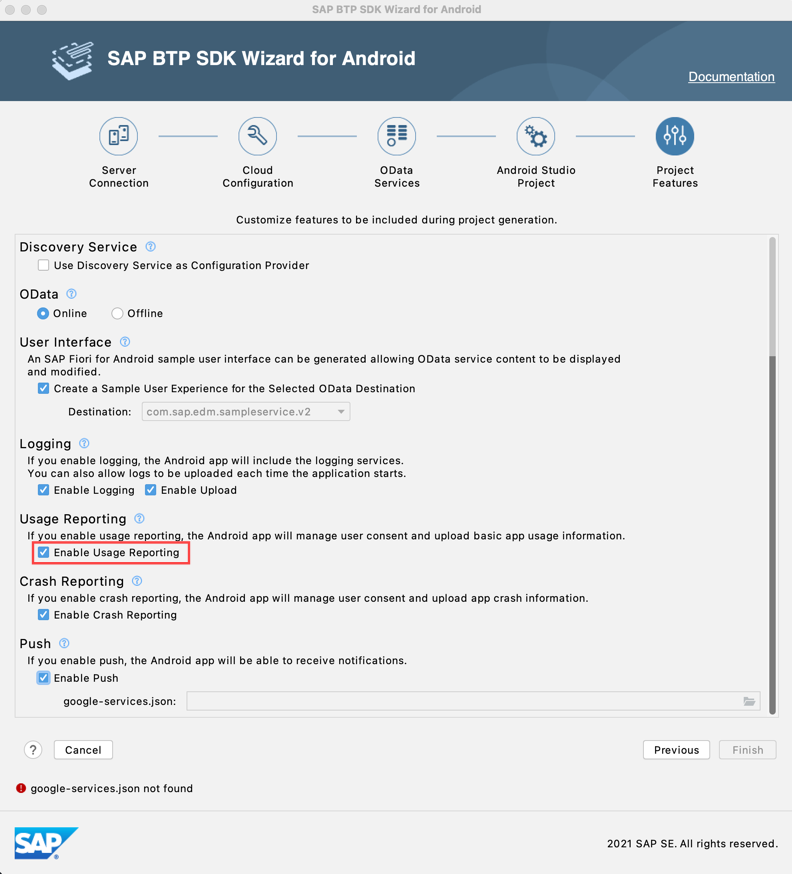
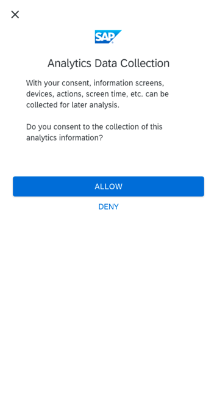
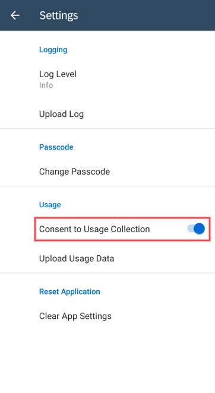
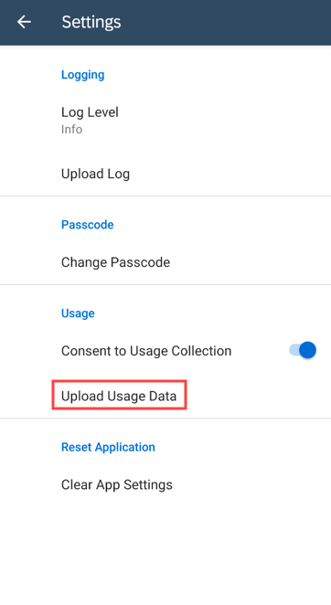
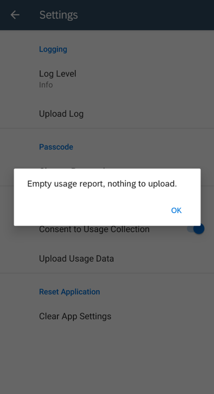

## Prerequisites
- You completed [Try Out the SAP Cloud Platform SDK for Android Wizard](cp-sdk-android-wizard-app).


## Details
### You will learn
- How the Usage Reporting feature works
- How to customize the consent screen
- How to further instrument the Wizard app
- How to add code to enable auto-upload of usage data based on the client policy
---

[ACCORDION-BEGIN [Step 1: ](Manual upload of usage data)]

As shown in the tutorial, [Try Out the SAP Cloud Platform SDK for Android Wizard](cp-sdk-android-wizard-app), ensure that **Enable Usage Reporting** is checked when creating the app.



The app must first receive permission to collect usage information from the user.

1.  The text displayed to the user can be customized by accessing `res/values/strings_localized/strings_localized(en).xml` (or by pressing **Shift** twice then searching for **`strings_localized.xml`**) and editing the text between the string tags below. For more details on localization (translation), see [Add New Languages to your Android Application](cp-sdk-android-wizard-app-translation).

    ```xml
    <string name="get_usage_permission_explanation">
      Detailed text about how data privacy pertains to this app and why it is important for the user to enable this functionality
    </string>
    ```

    When the app is first installed, a **consent** screen will automatically be shown to users.

2.  Tap **OK** to allow the app to record how the app is being used.

    

    If **Not Now** was selected, the user's choice can later be changed in the app's **Settings** screen.

    

3.  From the **Settings** screen, tap **Upload Usage**.

    

    The upload will fail with a HTTP 403 error if usage was not enabled in the Mobile Services cockpit.

    

4.  To review this policy setting, in the Mobile Services cockpit, access **Client Policies** by navigating to **Mobile Applications** > **Native/Hybrid** > **Wiz App** > **Client Policies**.

    

    The **Usage Report Policy** specifies whether uploads of usage data are allowed and the time interval between automatic usage report uploads.

    The preset value for **Upload Report After** is 0 (usage reports will not be uploaded automatically), which we will use in the implementation of automatically uploading usage reports to the server.

    

5.  If an empty usage report notification is shown when **Upload Usage** is selected, navigate away from the app by going to your phone's **Home** screen and re-entering the app. Then try uploading the usage report again. Placing the app in the background will complete or end the current usage session. Partial sessions can not be uploaded.

    

    If **Upload Usage** was successful, then a Toast message should pop up informing you that the usage information has been uploaded to the server.

    

[DONE]
[ACCORDION-END]

[ACCORDION-BEGIN [Step 2: ](Examine uploaded usage data)]

1.  To view the application usage report, go to your management cockpit under **Analytics** > **Client Data Report**, and click the **Download** icon.

2.  Different charts become available when you select the dropdown that includes **User Sessions per Application, Time Period**. You can filter the data by changing the value of the **Last 7 Days** dropdown and clicking **Go**. Click the **Download** icon to export the filtered data to a `.csv` file.

    

3.  Open the downloaded `client_uploads.csv`. The file contains usage entries from the app that record different actions, such as button taps and timers.

    | Column            | Description
    | :---------------- | :-----------------
    | `APPLICATIONID`   | Identifies the app the usage report events were generated from
    | `DEVICEMODEL`     | Device type (Samsung, Android Emulator, etc.)
    | `DEVICEPLATFORM`  | Android or iOS
    | `DEVICEVERSION`   | Device software version
    | `TIMERSTART`      | Time the event began
    | `TIMERDURATION`   | How long an event ran for in seconds
    | `REGISTRATIONID`  | A unique ID generated when you first register your device
    | `USERSESSIONID`   | A unique ID generated every time the application is re-opened
    | `RECORDKEY`       | What kind of information is being described (information about the device (`DeviceInfo`), an event within the application (`BehaviorEvent`), etc.)
    | `RECORDTYPE`      | `BehaviorEvent` type (e.g. `viewDisplayed`, `userInteraction`)
    | `I_SCREEN`        | Screen resolution of the device using the current `OSLifecycle` state as the key
    | `I_VIEW`          | The name of the Screen/View where `BehaviourEvents` are generated
    | `I_ELEMENT`       | UI element or screen control that was interacted with
    | `I_ACTION`        | Action that the user performed
    | `I_VALUE`         | Value related to the interaction, if applicable

    In the following example, there are three different Android devices with varying software versions.

    

    In the next example, the timer recorded how long the user kept the application active on their device before exiting for five different sessions. Recording how long users spend in the application is a typical measurement. You can also specify other processes to time, such as application startup, data requests, or the time taken to open an offline store.

    

    A session is typically defined as how long the app has been open for in the foreground, but different records within the application can also be modified to act as sessions.

4.  There can be multiple `USERSESSIONIDs` associated with a single `REGISTRATIONID`. `REGISTRATIONID` is independent of your username and you can see a complete list of all user registrations for the app in the Mobile Services cockpit by navigating to **Mobile Applications** > **Native/Hybrid** > **Wiz App** > **User Registrations**.

    In the following example the same user registered on two different devices and ran three user sessions.

    

When the application is initially launched, the report will contain entries that describe the device screen, memory and networking capabilities in a condensed form in four columns, marking the end of a session.

| `I_VALUE`           |  Description
| :------------------ | :-----------------
| `EnterApplication`  | Screen resolution of the device (`I_SCREEN`)
| `location`          | Location permission for the application (denied or authorized); if authorized then it will list the latitude (`I_VIEW`), longitude (`I_ELEMENT`) and city (`I_ACTION`)
| `device`            | Reiterates the screen resolution (`I_SCREEN` and `I_VIEW`), device platform (`I_ELEMENT`) and specifies the device language (`I_ACTION`)
| `memory`            | Device RAM (`I_SCREEN`), internal storage (`I_VIEW`), and available space on the SD card (`I_ELEMENT`)


The app also records a few of the screens that user opens, and more usage reporting statements can be added in the code to track other specific screens.

In the example below, the user navigated from the **Logon** screen to the **Entity List** screen and accessed the categories at positions 3 and 0, then entered the **Settings** screen.


[OPTION BEGIN [Java]]

The code segment that records `LogonActivity` is in the `onCreate` method in `LogonActivity.java`.

```Java
((SAPWizardApplication)getApplication()).getUsageUtil().eventBehaviorViewDisplayed("LogonActivity", "elementID", "onCreate", "called");
```

The code segment that records `EntitySetListActivity` is in the `onCreate` method in `EntitySetListActivity.java`.

```Java
usageUtil = ((SAPWizardApplication) getApplication()).getUsageUtil();
usageUtil.eventBehaviorViewDisplayed(EntitySetListActivity.class.getSimpleName(),
				"elementId", "onCreate", "called");
```

[OPTION END]

[OPTION BEGIN [Kotlin]]

The code segment that records `LogonActivity` is in the `onCreate` method in `LogonActivity.kt`.

```Kotlin
(application as SAPWizardApplication).usageUtil.eventBehaviorViewDisplayed("LogonActivity", "elementID", "onCreate", "called")
```

The code segment that records `EntitySetListActivity` is in the `onCreate` method in `EntitySetListActivity.kt`.

```Kotlin
usageUtil = (application as SAPWizardApplication).usageUtil
usageUtil.eventBehaviorViewDisplayed(EntitySetListActivity::class.java.simpleName,
				"elementId", "onCreate", "called")
```

[OPTION END]


[VALIDATE_1]
[ACCORDION-END]


[ACCORDION-BEGIN [Step 3: ](Add further usage instrumentation)]

The Usage feature can be used to instrument an app to track things that might provide insight into a user's behaviors.

The following steps record how often users start adding or updating products but cancel their changes.  This is somewhat similar to a metric in a shopping cart type app, where it might be interesting to know how often items are added to a shopping cart, but the sale is not completed.

[OPTION BEGIN [Java]]

1.  In Android Studio, on Windows, press **Ctrl+N**, or, on a Mac, press **command+O**, and type **`ProductsCreateFragment`** to open `ProductsCreateFragment.java`.

2.  Add the following variable into the **`ProductsCreateFragment`** class near the other private variables:

    ```Java
    private UsageUtil usageUtil;
    ```

3.  On Windows, press **Ctrl+F12**, or, on a Mac, press **command+F12**, and type **`onCreate`** to move to the `onCreate` method in the same file.

4.  Find the following line:

    ```Java
    super.onCreate(savedInstanceState);
    ```

5.  Then add the following code segment immediately after:

    ```Java
    usageUtil = ((SAPWizardApplication)getActivity().getApplication()).getUsageUtil();
    usageUtil.eventBehaviorUserInteraction(ProductsCreateFragment.class.getSimpleName(),
      "elementId", "createOrEditProductClicked", "Begin Create or Edit Product");
    ```

    This generates a usage event record for when a user taps the **Add** or **Edit** icon within **Products**.

6.  On Windows, press **Ctrl+F12**, or, on a Mac, press **command+F12**, and type **`onOptionsItemSelected`** to move to the `onOptionsItemSelected` method. Add the following code segment before the `default:` case in the same file:

    ```Java
    case android.R.id.home:
      usageUtil = ((SAPWizardApplication)getActivity().getApplication()).getUsageUtil();
      usageUtil.eventBehaviorUserInteraction(ProductsCreateFragment.class.getSimpleName(),
        "elementId", "onBackPressed", "Create or Edit Product Cancelled");
      return true;
    ```

    This generates the usage event record whenever the user navigates away from an editing screen without saving.

7.  In Android Studio, on Windows, press **Ctrl+N**, or, on a Mac, press **command+O**, and type **`ProductsDetailFragment`** to open `ProductsDetailFragment.java`.

8.  On Windows, press **Ctrl+F12**, or, on a Mac, press **command+F12**, and type **`onOptionsItemSelected`** to move to the `onOptionsItemSelected` method.

9.  Modify the return statements so the cases and default case end with the following code:

    ```Java
    return false;
    ```

    When the return statements are set to false, it ensures that the code added to `ProductsCreateFragment.java` gets executed when the **Navigate Back** button is pressed.

10.  Build and run the app.

11.  Generate usage information by accessing **Products**.

    

12.  Tap the floating **Add** button to create a product.

    

13.  Press the **Back** button to exit the page without saving.

    

14.  Repeat those steps two more times to generate multiple entries for the usage report.

15.  Select an existing product and tap its **Edit** button.

    

16.  Then immediately tap the **check mark** button to save the information.

    

17.  End the usage session by placing the app in the background. Navigate back into the app.

18.  Upload the usage by going to **Settings** and tap on **Upload Usage**.

19.  After downloading the `client_uploads.csv` file from the Mobile Services cockpit, you should be able to see new entries with `I_VIEW` values of `ProductsCreateFragment` and `I_ACTION` values of `onBackPressed` and `createProductClicked`.

    

20.  In four empty cells that are not in the R column on the Excel spreadsheet, label two of them with **`Product Create or Edit Clicked`** and **`Cancelled Product Create or Edit`**. Next to `Product Create or Edit Clicked`, use the following formula to find the number of times the user intended to add/update a product:

    ```Excel
    =COUNTIF(R:R, "*createOrEditProductClicked*")
    ```

21.  Next to `Cancelled Product Create or Edit`, use the following formula to find the number of times the user cancelled an add/update product action:

    ```Excel
    =COUNTIF(R:R, "*onBackPressed*")
    ```

    In the example, the user tried to create a product four times, but cancelled three times.

    

[OPTION END]

[OPTION BEGIN [Kotlin]]

1.  In Android Studio, on Windows, press **Ctrl+N**, or, on a Mac, press **command+O**, and type **`ProductsCreateFragment`** to open `ProductsCreateFragment.kt`.

2.  Add the following variable into the **`ProductsCreateFragment`** class near the other private variables:

    ```Kotlin
    private lateinit var usageUtil: UsageUtil
    ```

3.  On Windows, press **Ctrl+F12**, or, on a Mac, press **command+F12** and type **`onCreate`**, to move to the `onCreate` method in the same file.

4.  Find the following line:

    ```Kotlin
    super.onCreate(savedInstanceState)
    ```

5.  Add the following code segment immediately after:

    ```Kotlin
    usageUtil = (activity!!.application as SAPWizardApplication).usageUtil
    usageUtil.eventBehaviorUserInteraction(ProductsCreateFragment::class.java.simpleName,
      "elementId", "createOrEditProductClicked", "Begin Create or Edit Product");
    ```

    This generates a usage event record for when a user taps the **Add** or **Edit** icon within **Products**.

6.  On Windows, press **Ctrl+F12**, or, on a Mac, press **command+F12** and type **`onOptionsItemSelected`**, to move to the `onOptionsItemSelected` method. Add the following code segment before the `else` case in the same file:

    ```Kotlin
    android.R.id.home -> {
      usageUtil = (activity!!.application as SAPWizardApplication).usageUtil
      usageUtil.eventBehaviorUserInteraction(ProductsCreateFragment::class.java.simpleName,
        "elementId", "onBackPressed", "Create or Edit Product Cancelled")
      true
    }
    ```

    This generates the usage event record whenever the user navigates away from an editing screen without saving.

7.  In Android Studio, on Windows, press **Ctrl+N**, or, on a Mac, press **command+O**, and type **`ProductsDetailFragment`** to open `ProductsDetailFragment.kt`.

8.  On Windows, press **Ctrl+F12**, or, on a Mac, press **command+F12**, and type **`onOptionsItemSelected`** to move to the `onOptionsItemSelected` method.

9.  Modify the return statements so the cases and `else` case end with the following code:

    ```Kotlin
    false
    ```

    When the return statements are set to false, it ensures that the code added to `ProductsCreateFragment.kt` gets executed when the **Navigate Back** button is pressed.

10.  Build and run the app.

11.  Generate usage information by accessing **Products**.

    

12.  Tap the floating **Add** button to create a product.

    

13.  Press the **Back** button to exit the page without saving.

    

14.  Repeat those steps two more times to generate multiple entries for the usage report.

15.  Select an existing product and tap its **Edit** button.

    

16.  Then immediately tap the **check mark** button to save the information.

    

17.  End the usage session by placing the app in the background. Navigate back into the app.

18.  Upload the usage by going to **Settings** and tap on **Upload Usage**.

19.  After downloading the `client_uploads.csv` file from the Mobile Services cockpit, you should be able to see new entries with `I_VIEW` values of `ProductsCreateFragment` and `I_ACTION` values of `onBackPressed` and `createProductClicked`.

    

20.  In four empty cells that are not in the R column on the Excel spreadsheet, label two of them with **`Product Create or Edit Clicked`** and **`Cancelled Product Create or Edit`**. Next to `Product Create or Edit Clicked`, use the below formula to find the number of times the user intended to add/update a product:

    ```Excel
    =COUNTIF(R:R, "*createOrEditProductClicked*")
    ```

21.  Next to `Cancelled Product Create or Edit`, use the following formula to find the number of times the user cancelled an add/update product action:

    ```Excel
    =COUNTIF(R:R, "*onBackPressed*")
    ```

    In the example, the user tried to create a product four times, but cancelled three times.

    

[OPTION END]

[DONE]
[ACCORDION-END]


[ACCORDION-BEGIN [Step 4: ](Auto-upload of usage data)]

Mobile Services provides a **Usage Report Policy** under **Client Policies** specifying whether uploads to Mobile Services are allowed and how often they should occur. The following instructions demonstrate how to modify the app to read and store the policy and upload the usage data to Mobile Services using the specified interval.

[OPTION BEGIN [Java]]

1.  Input the number of days after which a report should automatically be uploaded and click **Save**. For the purposes of this tutorial, use the value **`1`** to simplify testing later on.

    

2.  In Android Studio, on Windows, press **Ctrl+N**, or, on a Mac, press **command+O**, and type **`ClientPolicy`** to open `ClientPolicy.java`.

3.  Add the following variables to the `ClientPolicy` class below the private variables:

    ```Java
    private boolean isUsageEnabled;
    private int uploadInterval;

    public void setUsageEnabled(boolean usageEnabled) { isUsageEnabled = usageEnabled; }

    public boolean isUsageEnabled() { return isUsageEnabled; }

    public void setUploadInterval(int interval) { uploadInterval = interval; }

    public int getUploadInterval() { return uploadInterval; }
    ```

    This code creates variables to handle usage data and provides them with getters and setters.

4.  In Android Studio, on Windows, press **Ctrl+N**, or, on a Mac, press **command+O**, and type **`ClientPolicyManager`** to open `ClientPolicyManager.java`.

5.  Add the following variables to the `ClientPolicyManager` class with the rest of the `private static final` variables:

    ```Java
    private static final String USAGE_POLICY_ENABLED = "dataCollectionEnabled";
    private static final String USAGE_POLICY_UPLOAD_AFTER_DAYS = "uploadDataAfterDays";
    private static final String SETTINGS_USAGE = "usagePolicy";
    ```

6.  On Windows, press **Ctrl+F12**, or, on a Mac, press **command+F12**, and type **`onSuccess`** to move to the `onSuccess` method.

7.  Place the following code near the end of the method, before the line `downloadLatch.countDown();`:

    ```Java
    JSONObject usagePolicyJson = result.optJSONObject(SETTINGS_USAGE);
    if (usagePolicyJson != null) {
      boolean isUsageEnabled = usagePolicyJson.optBoolean(USAGE_POLICY_ENABLED, false);
      int uploadInterval = usagePolicyJson.optInt(USAGE_POLICY_UPLOAD_AFTER_DAYS, 0);
      policyFromServer.setUsageEnabled(isUsageEnabled);
      policyFromServer.setUploadInterval(uploadInterval);
    }
    ```

    This code gets the usage policy information from the server client policy and stores it inside a `ClientPolicy` object.

8.  In Android Studio, on Windows, press **Ctrl+N**, or, on a Mac, press **command+O**, and type **`LogonActivity`** to open `LogonActivity.java`.

9.  Add the following method:

    ```Java
    private void uploadUsage() {
        //the ExecutorService runs the code on a separate thread because getting the ClientPolicyManager data causes a significant impact to performance
        ExecutorService executorService = Executors.newSingleThreadExecutor();
        executorService.submit(() -> {
          int newDays = clientPolicyManager.getClientPolicy(true).getUploadInterval();
          UsageBroker.setDaysToWaitBetweenUpload(newDays);

          //if newDays is greater than 0 then auto-upload is considered to be enabled on Mobile Services
          if (newDays > 0) {
              // The upload will only occur if the last upload was more than newDays ago
              try {
                  UsageBroker.upload(this, false, new AppUsageUploader.UploadListener() {
                    @Override
                    public void onSuccess() {
                      Toast.makeText(getApplication(), getResources().getString(R.string.usage_upload_ok), Toast.LENGTH_LONG).show();
                    }

                    @Override
                    public void onError(Throwable error) {
                      // make sure to import com.sap.cloud.mobile.foundation.networking.HttpException;
                      if (error instanceof HttpException) {
                        LOGGER.debug("Usage Upload server error: {}, code = {}", ((HttpException) error).message(), ((HttpException) error).code());
                      } else {
                        LOGGER.debug("Usage Upload error: {}", error.getMessage());
                      }
                      String errorCause = error.getLocalizedMessage();
                      ErrorMessage errorMessage = new ErrorMessage(getResources().getString(R.string.usage_upload_failed), errorCause, new Exception(error), false);
                      errorHandler.sendErrorMessage(errorMessage);
                    }

                    @Override
                    public void onProgress(int i) {
                      LOGGER.debug("Usage upload progress: " + i);
                    }
                  });
              }
              catch (MalformedURLException e) {
                e.printStackTrace();
              }
          }
        });
    }
    ```

    This code sets the upload interval for the application's `UsageBroker` object and then requests an upload of usage. If the amount of days between uploading is sufficient, it will upload the data and, if not, it will delay the upload. If the **Upload Report After** interval is 0 it will not upload any usage.

    >There may be an error on `HttpException`. Select it and press **`Alt+Enter`** on Windows, or, press **`option+Enter`** on Macs, to import the related class from `com.sap.cloud.mobile.foundation.networking`.

10.  On Windows, press **Ctrl+F12**, or, on a Mac, press **command+F12**, and type **`finishLogonActivity`** to move to the `finishLogonActivity` method.

11.  In the **else block**, before the call to `startEntitySetListActivity`, add the following method call:

    ```Java
    uploadUsage();
    ```

12.  In Android Studio, on Windows, press **Ctrl+N**, or, on a Mac, press **command+O**, and type **`SettingsFragment`** to open `SettingsFragment.java`.

13.  On Windows, press **Ctrl+F**, or, on a Mac, press **command+F**, to find:

    ```Java
    UsageBroker.upload(getContext(), false, new AppUsageUploader.UploadListener() {
    ```

14.  Change **false** to **true** on that line.

    This will allow the user to upload the usage report via the app's settings screen regardless of the number of days specified in the policy.

    When the app is run and the number of days in the policy has passed, there should be a Toast notification showing that the usage report has been uploaded successfully.

15.  To test this feature, in **Settings** > **System** > **Date & time** from the emulator, toggle **Automatic date & time** to **off**.

16.  Change the date to a day in the future and re-run the app. The usage report should be uploaded automatically.

    

[OPTION END]

[OPTION BEGIN [Kotlin]]

1.  Input the number of days after which a report should automatically be uploaded and click **Save**. For the purposes of this tutorial, use the value **`1`** to simplify testing later on.

    

2.  In Android Studio, on Windows, press **Ctrl+N**, or, on a Mac, press **command+O**, and type **`ClientPolicy`** to open `ClientPolicy.kt`.

3.  Add the following variables to the `ClientPolicy` class below the variables:

    ```Kotlin
    var isUsageEnabled: Boolean? = null
    var uploadInterval: Int? = null
    ```

    This code creates variables to handle usage data and provides them with getters and setters.

4.  In Android Studio, on Windows, press **Ctrl+N**, or, on a Mac, press **command+O**, and type **`ClientPolicyManager`** to open `ClientPolicyManager.kt`.

5.  Add the following variables to the `ClientPolicyManager` class with the rest of the `private val` variables in companion object:

    ```Kotlin
    private val USAGE_POLICY_ENABLED = "dataCollectionEnabled"
    private val USAGE_POLICY_UPLOAD_AFTER_DAYS = "uploadDataAfterDays"
    private val SETTINGS_USAGE = "usagePolicy"
    ```

6.  On Windows, press **Ctrl+F12**, or, on a Mac, press **command+F12**, and type **`onSuccess`** to move to the `onSuccess` method.

7.  Place the following code near the end of the method, before the line `downloadLatch.countDown()`:

    ```Kotlin
    result.optJSONObject(SETTINGS_USAGE)?.let {
      val isUsageEnabled = it.optBoolean(USAGE_POLICY_ENABLED, false)
      val uploadInterval = it.optInt(USAGE_POLICY_UPLOAD_AFTER_DAYS, 0)
      policyFromServer?.isUsageEnabled = isUsageEnabled
      policyFromServer?.uploadInterval = uploadInterval
    }
    ```

    This code gets the usage policy information from the server client policy and stores it inside a `ClientPolicy` object.

8.  In Android Studio, on Windows, press **Ctrl+N**, or, on a Mac, press **command+O**, and type **`LogonActivity`** to open `LogonActivity.kt`.

9.  Add the following method:

    ```Kotlin
    private fun uploadUsage() {
        //the ExecutorService runs the code on a separate thread because getting the ClientPolicyManager data causes a significant impact to performance
        val executorService = Executors.newSingleThreadExecutor()
        executorService.submit {
            val newDays = clientPolicyManager?.getClientPolicy(true)?.uploadInterval
            newDays?.let {
                UsageBroker.setDaysToWaitBetweenUpload(it)

                //if newDays is greater than 0 then auto-upload is considered to be enabled on Mobile Services
                if (it > 0) {
                    // The upload will only occur if the last upload was more than newDays ago
                    try {
                        UsageBroker.upload(this, false, object: AppUsageUploader.UploadListener {
                            override fun onSuccess() {
                              Toast.makeText(application, resources.getString(R.string.usage_upload_ok), Toast.LENGTH_LONG).show()
                            }

                            override fun onError(error: Throwable) {
                              // make sure to import com.sap.cloud.mobile.foundation.networking.HttpException;
                              if (error is HttpException) {
                                  LOGGER.debug("Usage Upload server error: {}, code = {}", error.message(), error.code())
                              } else {
                                  LOGGER.debug("Usage Upload error: {}", error.message)
                              }
                              val errorCause = error.localizedMessage
                              val errorMessage = ErrorMessage(resources.getString(R.string.usage_upload_failed), errorCause, Exception(error), false)
                              errorHandler?.sendErrorMessage(errorMessage)
                            }

                            override fun onProgress(i: Int) {
                              LOGGER.debug("Usage upload progress: $i")
                            }
                        })
                    } catch (e: MalformedURLException) {
                        e.printStackTrace()
                    }
                }
            }
        }
    }
    ```

    This code sets the upload interval for the application's `UsageBroker` object and then requests an upload of usage. If the amount of days between uploading is sufficient, it will upload the data and, if not, it will delay the upload. If the **Upload Report After** interval is 0 it will not upload any usage.

10.  On Windows, press **Ctrl+F12**, or, on a Mac, press **command+F12**, and type **`finishLogonActivity`** to move to the `finishLogonActivity` method.

11.  In the **else block**, before the call to `startEntitySetListActivity`, add the following method call:

    ```Kotlin
    uploadUsage()
    ```

12.  In Android Studio, on Windows, press **Ctrl+N**, or, on a Mac, press **command+O**, and type **`SettingsFragment`** to open `SettingsFragment.kt`.

13.  On Windows, press **Ctrl+F**, or, on a Mac, press **command+F**, to find:

    ```Kotlin
    UsageBroker.upload(applicationContext, false, object: AppUsageUploader.UploadListener {
    ```

14.  Change **false** to **true** on that line.

    This will allow the user to upload the usage report via the app's settings screen regardless of the number of days specified in the policy.

    When the app is run and the number of days in the policy has passed, there should be a Toast notification showing that the usage report has been uploaded successfully.

15.  To test this feature, in **Settings** > **System** > **Date & time** from the emulator, toggle **Automatic date & time** to **off**.

16.  Change the date to a day in the future and re-run the app. The usage report should be uploaded automatically.

    

[OPTION END]

>See [Client Usage](https://help.sap.com/doc/c2d571df73104f72b9f1b73e06c5609a/Latest/en-US/docs/user-guide/foundation/Usage.html) and [Step by Step with the SAP Cloud Platform SDK for Android — Part 8 — Client Usage](https://blogs.sap.com/2018/10/15/step-by-step-with-the-sap-cloud-platform-sdk-for-android-part-8-usage/) for further information on usage.

Congratulations! You have learned how the usage feature can provide insights into how a deployed application is being used!


[DONE]
[ACCORDION-END]

---
