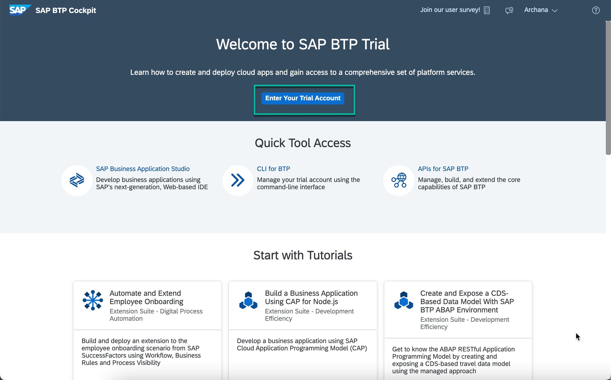
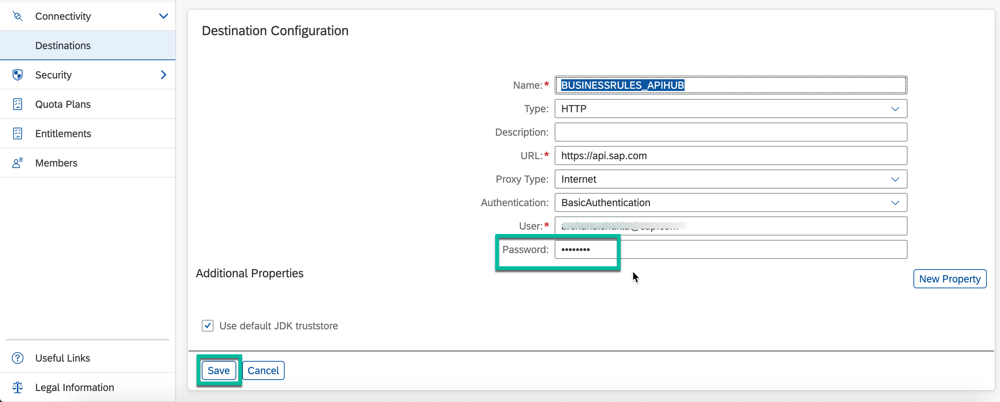

## Details
### You will learn
  - How to enable and configure workflow, business rules and process visibility services

Digital process automation for live processes is a family of services to automate business processes, manage decision logic and provide end-to-end visibility in your processes.

Users can now use SAP Cloud Platform Workflow, SAP Cloud Platform Business Rules and SAP Cloud Platform Process Visibility services together to create process extensions on top of any business application, orchestrate tasks or build process-centric differentiating applications.

In this tutorial mission, setup and use these services to automate and achieve operational insights into employee onboarding process.

---

[ACCORDION-BEGIN [Step 1: ](Setup your account using Booster)]

You will use the **Boosters** to automatically set up the workflow, business rules, and process visibility services in your account.

1. In your web browser, open the [SAP Cloud Platform trial cockpit](https://cockpit.hanatrial.ondemand.com/).

2. Navigate to the trial global account by clicking **Enter Your Trial Account**.

    !

    >If this is your first time accessing your trial account, you'll have to configure your account by choosing a region (select the region closest to you). Your user profile will be set up for you automatically.  

    >Wait till your account is set up and ready to go. Your global account, your subaccount, your organization, and your space are launched. This may take a couple of minutes.

    >Choose **Continue**.

    >

3. From your global account page, choose the **Boosters** from left-hand navigation. Among the available options, click **Start** of **Set up account for Workflow Management**.

    !

4. Automated onboarding will be started with pre-configured steps.

    > It with take 4-5 minutes to complete the entire setup.

    !

    - Wait until you see the success popup window once the booster completes successfully. **Close** the popup.  

    !


    > This automatic setup will do the following:

    > - Add Business Rules, Workflow, Process Visibility, Portal, Application Runtime, HTML5 Applications and Connectivity entitlements in your account.

    > - Create service instance for each of Business Rules, Workflow, Process Visibility and Portal services.

    > - Create destinations with name **BUSINESS_RULES** and **BUSINESSRULES_APIHUB**. These destinations will be used while integration of business rules with workflow and importing business rules project from API Hub respectively.

    > - Create a role collection with name **BPMServices** and add all the needed roles.

    > - Assign this role collection to your user.

[DONE]
[ACCORDION-END]

[ACCORDION-BEGIN [Step 2: ](Setup Fiori Launchpad)]
You will import, build and deploy the multi target project that will create a Fiori Launchpad to access workflow, business rules and process visibility applications which will be used in next tutorials.

1. Download the `WorkflowManagementFLP.tar.zip` from  [GitHub](https://github.com/SAP-samples/cloud-workflow-samples/blob/master/cf-workflowmanagement-flp/resources/WorkflowManagementFLP.tar.zip) in your local file system and extract the zip.

>This multi target application when deployed will create the Fiori Launchpad to access workflow, business rules and process visibility applications.

!

2. In your web browser, open the [SAP Cloud Platform Trial cockpit](https://account.hanatrial.ondemand.com/cockpit).

3. Choose **SAP Business Application Studio**.
    > SAP Business Application Studio is already enabled in your trial account. This would not be the case in your productive account and you need to enable the Subscription to access the studio.

    !

4. In the application studio, create a **Dev Space** of **SAP Fiori** type with **Workflow Management**  extension, if not already available.

    

    > Wait until the dev space is created and you see running status.
    !

5. Click on the **Dev Space** to go into the workspace.
    > It takes 2-3 minutes first time to initialize your dev workspace. You will see a Welcome Page once the dev space is initialized.

    -  Next, click **Open Workspace** and then click **Open** in the popup.

    

    > The **PROJECTS** explorer gets opened.

6. Right-click anywhere on the empty space of the **PROJECTS** explorer and select **Upload Files...**.

      

      - In the **Import** dialog, browse for the `WorkflowManagementFLP.tar` file that you extracted in your local system and choose **Open**.

      - The multi target application gets imported under the **PROJECTS** explorer.

      - Next, we need to extract the **tar** file. For this, open the new terminal window and enter the commands one-by-one to uncompress the uploaded file.

      

    ```
    mkdir WorkflowManagementFLP

    tar -C WorkflowManagementFLP -xvf WorkflowManagementFLP.tar

    ```

      

7. Right-click **mta.yaml** file inside **`WorkflowManagementFLP`** project and choose the **Build MTA** option.

    !

    - After the build has completed, navigate to the **`mta_archives` | `WorkflowManagementFLP_0.0.1.mtar`** file.

    !

8. Open new terminal and run this command to setup cloud foundry organisation and space where you will deploy the FLP MTA project.

    > You need to enter the **API Endpoint URL**, **Organisation Name** and **Space Name** of your trial account.

    > You can get the trial API Endpoint, organisation name and space name from your trial account overview page.
        !

    ```
    HISTFILE= && cf login -a <your trial account API End Point> -u <your trial email ID> -p <your trial user password> -o <your trial organisation name> -s <your trial space name>

    ```

    ```
    For example: HISTFILE= && cf login -a https://api.cf.us10.hana.ondemand.com -u mytestworkflow@sap.com -p hello123 -o 008a0765trial -s dev

    ```

9. Right-click `WorkflowManagementFLP_0.0.1.mtar` and choose **Deploy MTA Archive**.

    !

    > It with take approximately 5 minutes to deploy the multi target application.

    


[DONE]
[ACCORDION-END]


[ACCORDION-BEGIN [Step 3: ](Configure destination)]

    > The sample business rule used in this scenario is published in API Business Hub. **BUSINESSRULES_APIHUB** destination is used in SAP Cloud Platform Business Rules application to import business rules from API Business Hub.

1. From your global account page, choose the `trial` tile to access your subaccount.
    > If you run the booster in different subaccount then navigate into the respective account.  

    !

2. Click **Connectivity | Destinations** from the left-hand navigation and search for the destination with name `BUSINESSRULES_APIHUB`

    

3. In **Destination Configuration** section, click **Edit** and enter your trial password:

    

    - **Save** the destination.

[DONE]
[ACCORDION-END]

[ACCORDION-BEGIN [Step 4: ](Access Applications from Fiori Launchpad)]

The Fiori Launchpad will be used in the next tutorials to access business rules, workflow and process visibility applications.

1. Click **Spaces** and then navigate into **dev** space.

2. In **dev** space, click **Applications** and from among the available applications select `WorkflowManagementFLP_appRouter` application.

    

3. In the **Overview** section, click app-router link to open workflow, business rules and process visibility applications.

    > Log on with your trial user ID and password.

    

    The app-router link will open the SAP Fiori launchpad with **Business Rules**, **Workflow** and **Process Visibility** applications.

    

These steps complete the setup of the starter scenario for business process management services in your trial account. In the next tutorial, you will access the sample content of these different services, set them up in your account and then run the scenario to get an integrated experience.

[VALIDATE_1]
[ACCORDION-END]

<p style="text-align: center;">Give us 55 seconds of your time to help us improve</p>

<p style="text-align: center;"><a href="https://sapinsights.eu.qualtrics.com/jfe/form/SV_0im30RgTkbEEHMV?TutorialID=cp-starter-ibpm-employeeonboarding-1-setup" target="_blank"></a></p>
