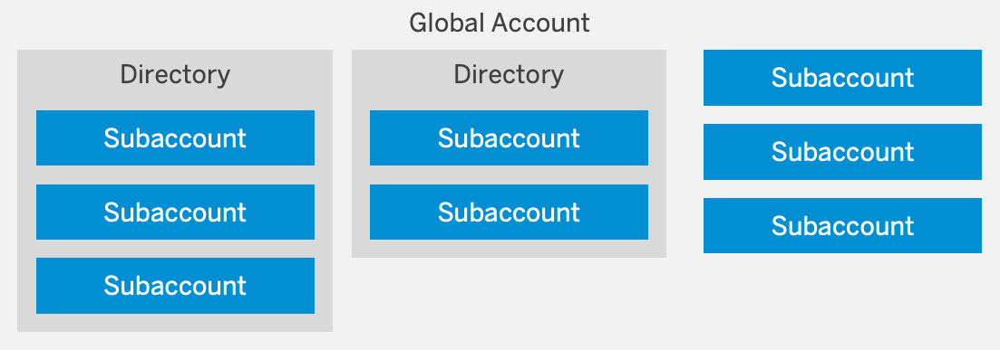
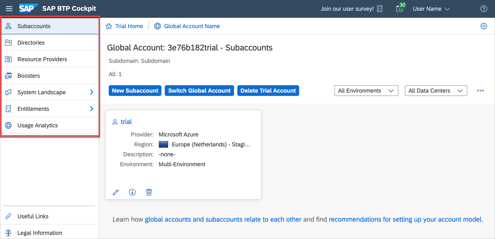
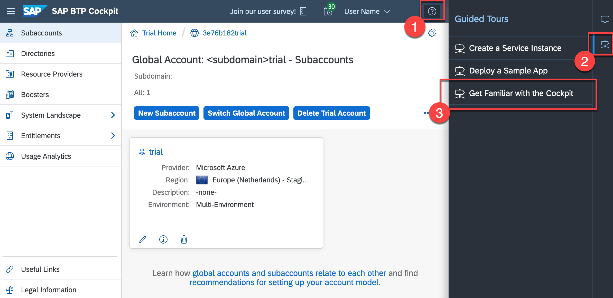

## Prerequisites
 - You must have registered for a trial account on SAP Business Technology Platform.
[Sign up](hcp-create-trial-account) for a free trial.

## Details
### You will learn
  - What SAP BTP trial offers
  - The relationship between global accounts, directories, and subaccounts
  - What Entitlements and Quotas are
  - Environments available for BTP trial
  - How to navigate in the SAP BTP cockpit
  - What the sapcp CLI is

---

[ACCORDION-BEGIN [Step: ](Welcome to SAP BTP Trial)]

So you've signed up for SAP BTP trial but are not quite sure where to start? This tutorial is here to help!

A trial account on SAP Business Technology Platform enables you to experience it for free, offering access to a comprehensive set of platform services, as well as early access to beta functionality.

Trial accounts are intended for personal exploration, and not for production use or team development. They allow restricted use of the platform resources and services.

You can use your SAP BTP trial account for up to 365 days in total. However, your trial account is suspended after 30 days but don't worry, you can easily extend that time by clicking **Extend Trial** in the popup window that appears once your trial account has been suspended. After 365 days total, you trial account is deleted but you can always create a new account. For more information, see [Trial Accounts](https://help.sap.com/viewer/65de2977205c403bbc107264b8eccf4b/Cloud/en-US/046f127f2a614438b616ccfc575fdb16.html).

All trial accounts are already using cloud management tools feature set B.
For more information, see [Cloud Management Tools — Feature Set Overview](https://help.sap.com/viewer/65de2977205c403bbc107264b8eccf4b/Cloud/en-US/caf4e4e23aef4666ad8f125af393dfb2.html).

If you ever want to delete your trial account, you can navigate to the **Subaccounts** page in the global account scope and click the **Delete Trial** button.

[DONE]
[ACCORDION-END]
[ACCORDION-BEGIN [Step: ](Environments)]

SAP BTP currently offers these [environments](https://help.sap.com/viewer/65de2977205c403bbc107264b8eccf4b/Cloud/en-US/15547f7e7ecd47ee9fa052b0e18c7b0a.html) for trial accounts: Cloud Foundry, ABAP, and Kyma.

To become familiar with the specifics of the trial offerings regarding, have a look at the following resources:

- [Getting Started with a Trial Account in the Cloud Foundry Environment](https://help.sap.com/viewer/DRAFT/60f1b283f0fd4d0aa7b3f8cea4d73d1d/Internal/en-US/e50ab7b423f04a8db301d7678946626e.html)
- [Getting Started with a Trial Account in the ABAP Environment](https://help.sap.com/viewer/DRAFT/60f1b283f0fd4d0aa7b3f8cea4d73d1d/Internal/en-US/720c423ef1a8498ab690cf0e5512ba50.html)
- [Getting Started with a Trial Account in the Kyma Environment](https://help.sap.com/viewer/DRAFT/60f1b283f0fd4d0aa7b3f8cea4d73d1d/Internal/en-US/ccb83c700e8d4bb8aa545d7307b8b08a.html)

### Cloud Foundry
In addition to global accounts, directories, and subaccounts, the Cloud Foundry environment includes another hierarchical level represented by **orgs** and **spaces**.

**Each Cloud Foundry subaccount contains exactly one Cloud Foundry org.** They have a 1:1 relationship. When you create a Cloud Foundry trial account, you get a global account with one Cloud Foundry subaccount in it, where the org is created automatically. You have the option of creating additional Cloud Foundry subaccounts within your trial global account, however in those you must create an org yourself by clicking on the **Enable Cloud Foundry** button.

**In your org you can then create one or more spaces, where you deploy apps and use services.** Similar to subaccounts, spaces enable you to once again structure and sub-divide quota if you want to. When you create your Cloud Foundry trial global account in the cockpit, one space is also automatically created within your org. You also have the option of adding additional ones if you like.

### ABAP
Within the Cloud Foundry environment, you can create a new space for ABAP development. This is what we refer to as the ABAP environment. It allows you to create extensions for ABAP-based products, such as SAP S/4HANA Cloud, and develop new cloud applications. You can transform existing ABAP-based custom code or extensions to the cloud.

The ABAP environment is based on the latest ABAP platform cloud release that is also used for SAP S/4HANA Cloud. It leverages the innovations provided by SAP HANA. The software stack contains standard technology components that are familiar from the standalone Application Server ABAP. The ABAP environment supports the ABAP RESTful Application Programming Model including SAP Fiori and Core Data Services (CDS). SAP Services and APIs are offered according to a new whitelisting approach. The ABAP environment provides you technical access to SAP Business Technology Platform services, such as destination service, integration, machine learning, and IoT.

### Kyma
Kyma environment is a runtime you can use to build cloud-native Kubernetes-based extensions by using microservices and serverless functions. The offered functionality ensures smooth consumption of SAP and non-SAP applications, running workloads in a highly scalable environment and building event-based and API-based extensions. To enable Kyma trial, log in to your SAP BTP trial home, create a subaccount, add entitlements, and click Enable Kyma in the Overview section of your subaccount.

[DONE]
[ACCORDION-END]

[ACCORDION-BEGIN [Step: ](Entitlements)]
You should understand the difference between entitlements and quota, because you'll encounter these 2 terms quite often.

- **Entitlements** are your right to provision and consume a resource. They refer to what you're entitled to use (e.g., which services and service plans).
- **Quota** is the numeric quantity that defines the maximum allowed consumption of that resource. In other words, how much of a service plan you're entitled to use.

Entitlements and quotas are managed at the global account level, distributed to directories and subaccounts, and consumed by the subaccounts.

When you remove quotas or entitlements from a subaccount, they become available again at global account level and can be assigned to other subaccounts.

For more information on entitlements, you can always consult documentation on [Entitlements](https://help.sap.com/viewer/65de2977205c403bbc107264b8eccf4b/Cloud/en-US/00aa2c23479d42568b18882b1ca90d79.html).

If you run into problems regarding entitlements and quotas, can check out the [Guided Answers](https://gad5158842f.us2.hana.ondemand.com/dtp/viewer/#/tree/2065/actions/27066?version=current).

[DONE]
[ACCORDION-END]

[ACCORDION-BEGIN [Step: ](Account Model)]

Now that you know what to expect from your trial account, let's learn about how things are structured in SAP BTP.

Your **global account**, **directories**, and **subaccounts** in SAP BTP are the way in which all of your activities are structured.

A **global account** is the realization of a contract you made with SAP (be it enterprise or trial). It's region-independent, and it's used to manage subaccounts, members, and quotas. You receive quotas to use platform resources per global account and then distribute the quotas to the subaccount for actual consumption. A global account can contain one or more subaccounts in which you deploy applications and use services.

**Directories** allow you to organize and manage your subaccounts according to your technical and business needs. A directory can contain one or more subaccounts. It can't contain other directories. Using directories to group subaccounts is optional - you can still create subaccounts directly under your global account.

**Subaccounts** let you structure a global account according to your project's requirements with regards to members, authorizations, and quotas. Subaccounts in a global account are independent from each other. Each subaccount is associated with a **region**, which is the physical location where applications, data, or services are hosted. The region assigned to your subaccount doesn't have to be directly related to your location. You could be located in the United States, for example, but operate your subaccount in Europe.

In your trial global account, a Cloud Foundry subaccount with an org and a space called dev is automatically created for you.

!

If you want to get a deeper understanding of the account structure, have a look at the documentation on the [Account Model](https://help.sap.com/viewer/65de2977205c403bbc107264b8eccf4b/Cloud/en-US/8ed4a705efa0431b910056c0acdbf377.html).

[VALIDATE_2]
[ACCORDION-END]

[ACCORDION-BEGIN [Step: ](Navigate in the cockpit)]
You can access your trial account cockpit at [https://cockpit.eu10.hana.ondemand.com/trial/#/home/trial](https://cockpit.hanatrial.ondemand.com/trial/#/home/trial).

There are 2 ways of navigating in the cockpit:

- using the left hand-side navigation
- using the breadcrumbs at the top of the page

There are certain actions you can perform at each hierarchical level (global account, subaccount, space etc.) - we will refer to the sum of these actions as a **scope**. For example, when you are in a global account you can add global account members, create subaccounts and add entitlements to subaccounts. They represent the **global account scope**.

This scope is reflected in both the left hand-side navigation and the breadcrumbs. This step helps you understand how to use both of them together to navigate through the cockpit in the most efficient way possible.

### Left hand-side navigation

 The left hand-side navigation changes depending on where you are in the cockpit. It reflects the actions possible in that scope.

### Breadcrumbs

You may ask yourself - if the left hand-side navigation changes depending on where you are in the cockpit,  then how can you navigate back? Simple - you use the breadcrumbs at the top.

The breadcrumbs coincide with the hierarchical path you've travelled in order to reach your current scope in the cockpit. For example, to reach an application in the Cloud Foundry environment you will have to go to your global account, then to the subaccount, then to the space and then finally to the application.

The last item in your breadcrumbs always represents the scope you find yourself in at that moment. To go back, simply follow the breadcrumbs to retrace your steps.

Let's have a look at the following screenshot, taken from an application deployed in the Cloud Foundry dev space:

1. **Trial Home**: Here you can find your trial homepage.

2. **Global account**: This contains all your subaccounts and entitlements.

3. The 3rd item represents your **subaccount**.

4. Afterwards, you have your **space** as the 4th item.

5. Here, you have your **deployed application**, which is the current scope.

6. This would be the instance of the deployed application.

To get an overview of the navigation in the cockpit, have a look at our guided tour: **Get Familiar with the Cockpit**. To start the guided tour, navigate to your global account scope and open the Web Assistant.

!

[DONE]
[ACCORDION-END]
[ACCORDION-BEGIN [Step : ](Get to know the sapcp CLI)]
The sapcp CLI is **an alternative to the cockpit**, for users who prefer working on the command line rather than GUIs. It consists of a client and a server. The client needs to be installed on your computer (make sure you update it regularly!) and it interacts with SAP BTP through a server. You connect to this CLI server at login.

The base call to enter on the command line is `sapcp`.

Here are some of the tasks you can use the CLI for:

- Creating subaccounts
- Managing entitlements of global accounts and subaccounts
- Managing users and their authorizations in global accounts and subaccounts
- Subscribing to applications

To find out more about the sapcp CLI, you can have a look at this tutorial: [Get Started with the SAP BTP command line interface (sapcp CLI)](cp-sapcp-getstarted).

[DONE]
[ACCORDION-END]

---
