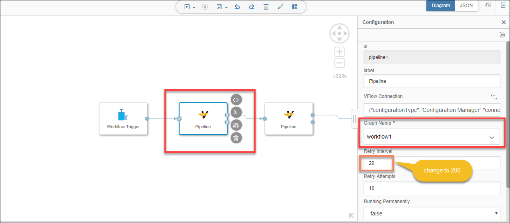

## Details
### You will learn  
During this tutorial, you will build a task Workflow using the **Pipeline** operator. This Workflow combines both tasks which you created during the previous tutorials into a process which you execute at once.

### Time to Complete
**15 Min**

---

[ACCORDION-BEGIN [Step 1: ](Create Workflow)]

Open the modelling environment for building pipelines via SAP Data Hub Modeler (`https://sapdatahubtrial/app/pipeline-modeler`).

>As the above URL is a local URL, it will be accessible only if you are doing the tutorials and have already configured the hosts file. If not, please refer to [Getting Started with SAP Data Hub, trial edition 2.3](https://caldocs.hana.ondemand.com/caldocs/help/Getting_Started_Data_Hub_23.pdf) guide.

Enter **DEFAULT** as the **Tenant**, `DATAHUB` as **Username** and the password which you have selected during system setup as **Password** to logon.

Create a new graph and add **`Workflow Trigger`** operator, 2 X **Pipeline** operators and a **Workflow Terminator** to the graph by drag and drop.

Connect the `output` out port of the **Workflow Trigger** to the `input` in port of the first **Pipeline** operator. Connect the `output` out port of the first **Pipeline** operator to the `input` in port of the second **Pipeline** operator. Connect the `output` out port of the second **Pipeline** operator to the `stop` in port of the **Workflow Terminator** operator.

Right click on the first **Pipeline** operator and go to **Open Configuration**. Under the parameter **Graph name** select the graph that we have created in the tutorial **Create Workflow (part 1), Enrich data with Data Transform**. In our case, we have named it as **Workflow 1**.

Similarly, for the second **Pipeline** operator, select the graph that we have created in the tutorial **Create Workflow (part 2), Aggregate data with Data Transform** under the parameter **Graph Name**. In our case, we have named it as **Workflow 2**. Also increase the parameter Retry interval from 20 to 200 for this **Pipeline**.

[DONE]

[ACCORDION-END]

[ACCORDION-BEGIN [Step 2: ](Execute Workflow)]

Once done, save the graph. In our case, we have named it as **Workflow 3**. Now execute the graph using the button at the top of the page. The execution status is displayed in the bottom part of the screen and it changes from **Running** to **Completed** once the execution completes.

We have now executed the **Workflow 3** but you will notice in the above screenshot that, **Workflow 3** calls the linked pipeline, **Workflow 1**. Once the execution of **Workflow 1** completes, it starts the execution of **Workflow 2**.

**Remark**: When you look at the `EnrichDevices` or `STATISTICS_DATA` data set, you will not see any changes compared to the previous two tutorials.

[DONE]

[ACCORDION-END]

---

## Next Steps
[Create Workflow (part 4): Monitor task and Workflow execution ](https://developers.sap.com/germany/tutorials/datahub-trial-v2-workflow-part04.html)
