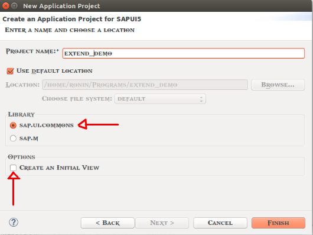
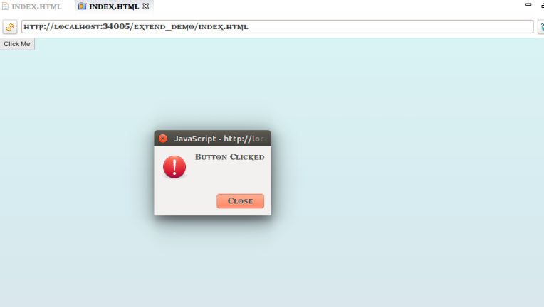

## Prerequisites  
 - **Proficiency:** Beginner
 - Should have basic understanding of HTML,CSS and JavaScript.

## Next Steps
  - Select a tutorial from the [Tutorial Navigator](http://go.sap.com/developer/tutorial-navigator.html) or the [Tutorial Catalog](http://go.sap.com/developer/tutorials.html)

## Details
### You will learn  
You will learn how to extend an existing control i.e Button in your application, and how to assign it events to call it as button is one of the most widely used element in a web page.

### Time to Complete
  **10 Min**.
---

1. Create a new **SAP Project in Eclipse** as follows:

     

2. In your index.html file between the scripts tag add the following

    ```javascript
       sap.ui.commons.Button.extend()
    ```

     This line will allow you to extend the Button from ui.commons library.

3. Then you have to define the extended Button control by adding **Metadata** to it.Control metadata consist of properties, events, as well as aggregations and associations.

4. In this case you will just declare and define  an event which you are going to use.

    ```javascript
    sap.ui.commons.Button.extend("extendButton",{

        metadata: {			

        events: {

        "click" : {}  

    }

    },
    onclick : function(evt) {   

    this.fireClick();

    },

    renderer: {}

    });
    ```

    Events consist of the name of your event and below that is the method to be called when that event is occurred.

    The renderer defines the HTML structure that will be added to the DOM tree of your application whenever the control is instantiates in a view. It is usually called initially by the core of SAPUI5 and whenever a property of the control is changed. But in this case you will leave it empty.

5. Now you will create an object of the extended control and define the method to be called.

    ```javascript
    var oButton = new extendButton({

        text: 'Click Me',

        click: function(evt) {

          alert('Button Clicked');

      }

      });
    ```

6. Place the object created in your content.

    ```javascript
    oButton.placeAt("content");
    ```

7. Your final code will look like this

    

8. Now to run the code, right-click on the project file and select run as **Web App Preview**.

    

---
## Next Steps
 - Select a tutorial from the [Tutorial Navigator](http://go.sap.com/developer/tutorial-navigator.html) or the [Tutorial Catalog](http://go.sap.com/developer/tutorials.html)
