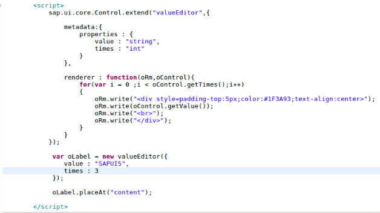
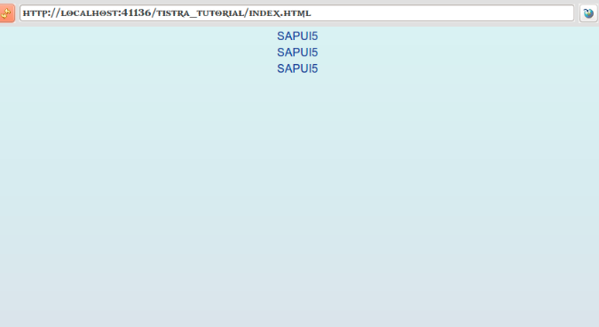

## Prerequisites  
- **Proficiency:** Beginner
- Should have basic understanding of HTML, CSS and JavaScript.

## Next Steps
 - Select a tutorial from the [Tutorial Navigator](http://go.sap.com/developer/tutorial-navigator.html) or the [Tutorial Catalog](http://go.sap.com/developer/tutorials.html)

## Details
### You will learn  
You will learn how to extend a control in your application from scratch.
Understand the basic flow of control and it's required parameters.

### Time to Complete
**10 Min**.
---
1. Create a new **SAP Project in Eclipse** as follows:

   

2. In your `index.html` file between the scripts tag add the following

    ```javascript
       sap.ui.core.Control.extend()
    ```

3. Then you have to define the extended control by adding **Metadata** to it.

    ```javascript
    sap.ui.core.Control.extend("valueEditor",{

    metadata : {
  	    properties : {
  		     value : "string",
  		     times : "int"
       }
    },
    renderer: {}
    });
    ```

4. Now add the renderer  which defines the HTML structure that will be added to the DOM tree of your application whenever the control is instantiates in a view.

    ```javascript
    renderer : function(oRm,oControl){
    for(var i = 0 ;i < oControl.getTimes();i++)
       {
        oRm.write("<div style=padding-top:5px;color:#1F3A93;text-align:center>");
        oRm.write(oControl.getValue());
        oRm.write("<br>");
        oRm.write("</div>");
       }
    }
    ```

5. Now you will create an object of the extended control, pass the values for it's property and place the object in the content.

    ```javascript
    var oLabel = new valueEditor({
  				value : "SAPUI5",
  				times : 3
  			 });
    oLabel.placeAt("content");

    ```

6. Your final code will look like this:

     

7. Now to run the code, right-click on the project file and select run as **Web App Preview**.

     

---

## Next Steps
 - Select a tutorial from the [Tutorial Navigator](http://go.sap.com/developer/tutorial-navigator.html) or the [Tutorial Catalog](http://go.sap.com/developer/tutorials.html)
