## Prerequisites
 - **Proficiency:** Intermediate
 - This tutorial is part of the [Customize UI's, themes and onboarding for iOS apps ](https://developers.sap.com/group.ios-sdk-custom.html) group
 &nbsp;
 - **Development environment:** Apple iMac, MacBook or MacBook Pro running Xcode 10 or higher
 - **SAP Cloud Platform SDK for iOS:** Version 3.0 SP01

## Details
In this tutorial, you will use the SAP Cloud Platform's integration with SAP Translation Hub to add multilingual features to your iOS app generated with the SDK for iOS Assistant. This way, you can run your app in many languages, depending on your device's preferred language.

### You will learn

 - How to enable SAP Translation Hub in your SAP Cloud Platform trial account
 - How to add your SAP Translation Hub account into the SDK for iOS Assistant
 - How to create multilingual capabilities to your Xcode project using the SDK for iOS Assistant
 - How to modify and correct the generated translations

### Time to Complete
**15 Min**

---

[ACCORDION-BEGIN [Step 1: ](Enable SAP Translation Hub)]

Log on to your SAP Cloud Platform account at [https://cockpit.hanatrial.ondemand.com/cockpit/](https://cockpit.hanatrial.ondemand.com/), log in and choose Neo Trial as landscape.

In the navigation on the left select **Services**.

Locate the **SAP Translation Hub** tile (search for `translation`):

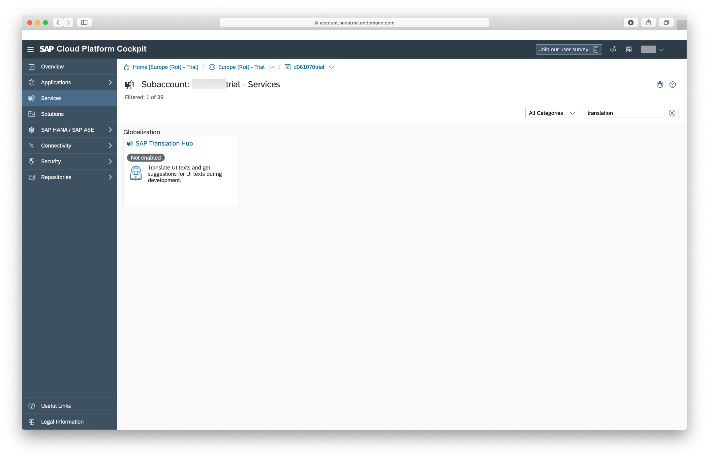

If it is not yet enabled, click the tile.

In the next page, click the **Enable** button:


Once the **SAP Translation Hub** service is enabled, click the **Go to UI for Translation Workflow** link at the bottom.


The **SAP Translation Hub** web interface will open in a new tab:


Leave the SAP Translation Hub web interface open for now, as we will need it later.

[DONE]
[ACCORDION-END]

[ACCORDION-BEGIN [Step 2: ](Enable SAP Translation Hub in the SDK Assistant)]

Open the **SDK for iOS Assistant**. Click the **Manage Accounts** option in the lower-left corner:

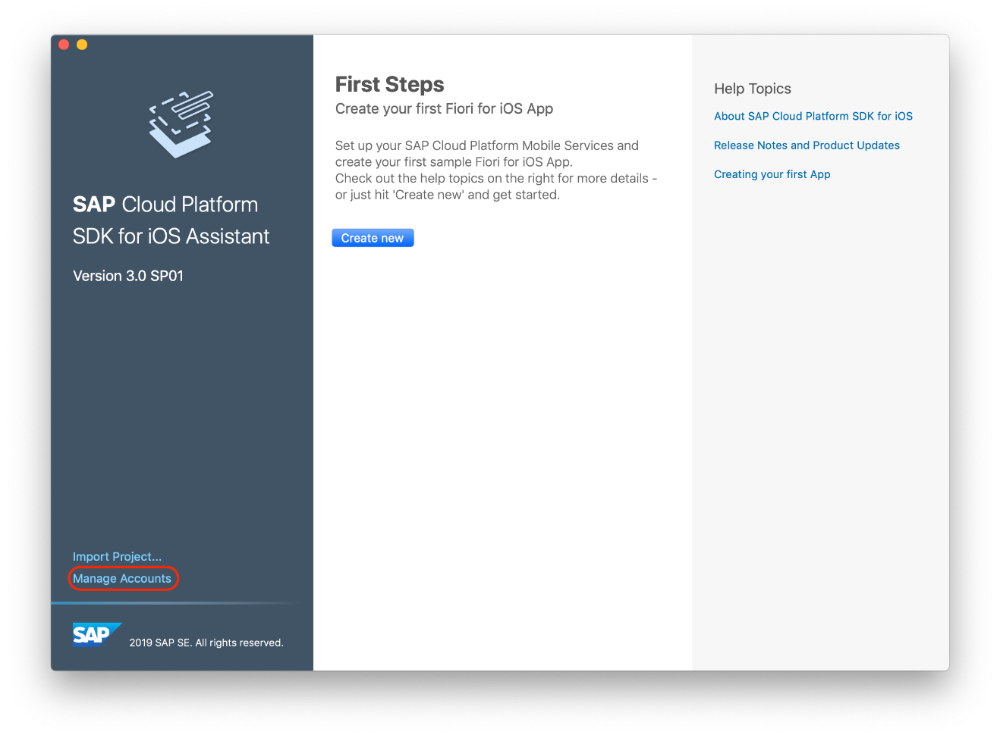

Click the **Add new...** button to add a new account.

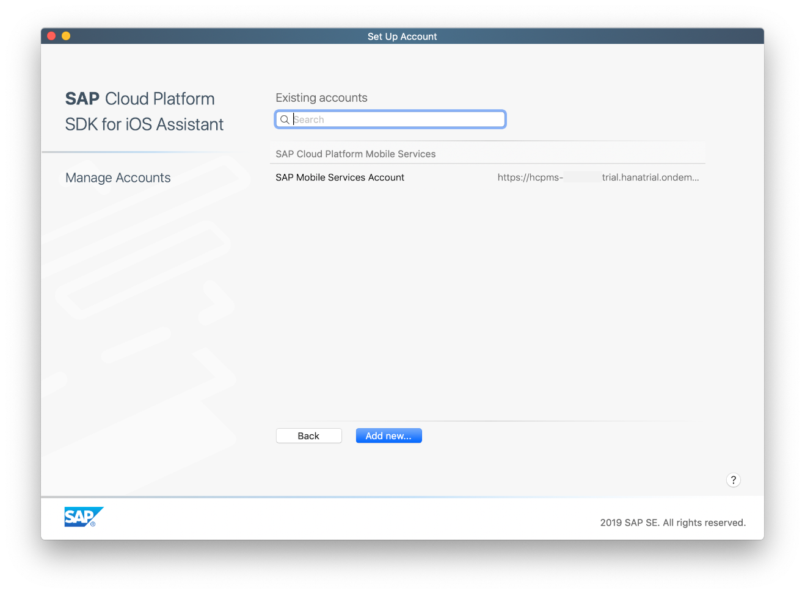

From the **Type** dropdown list, select **SAP Cloud Platform Translation Hub**:

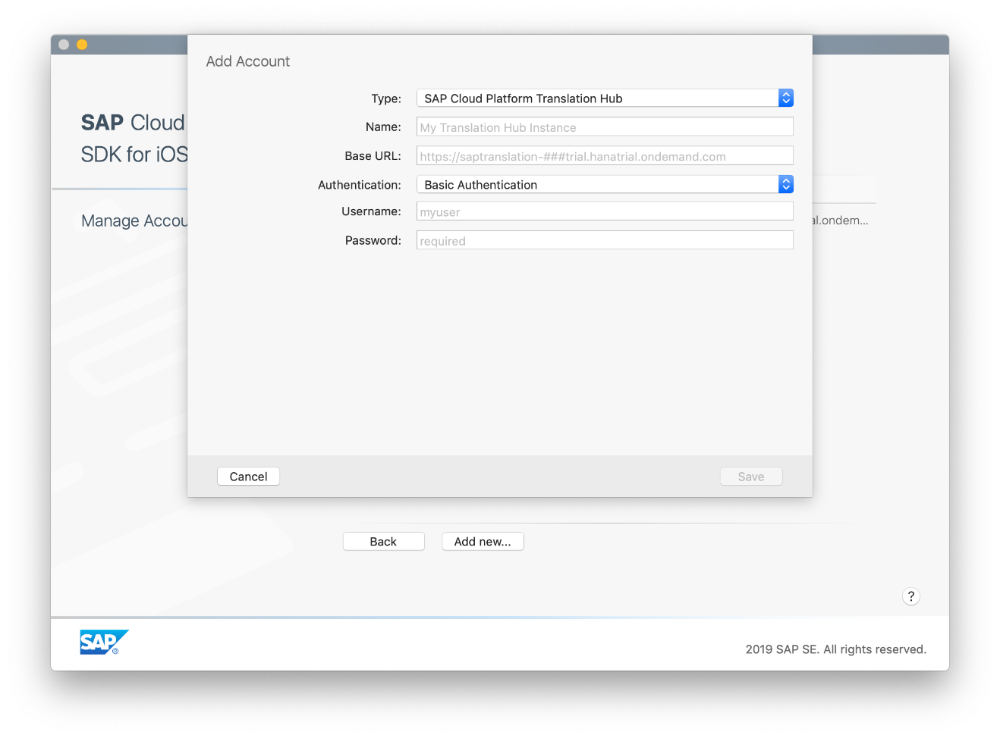

Enter the following values to your new account configuration:

| Field | Value |
|----|----|
| Name | A descriptive name for the configuration, for instance `SAP Translation Hub` |
| Base URL | `https://saptranslation-<your_trial_account_user>trial.hanatrial.ondemand.com/` |
| User | Your trial account user |
| Password | Password for your trial account user |

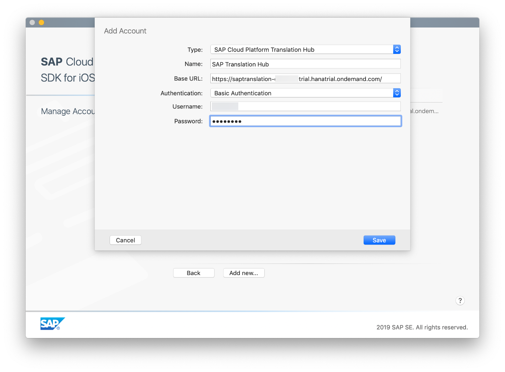

Click **Save** when done. The account is now added to the SDK for iOS Assistant:

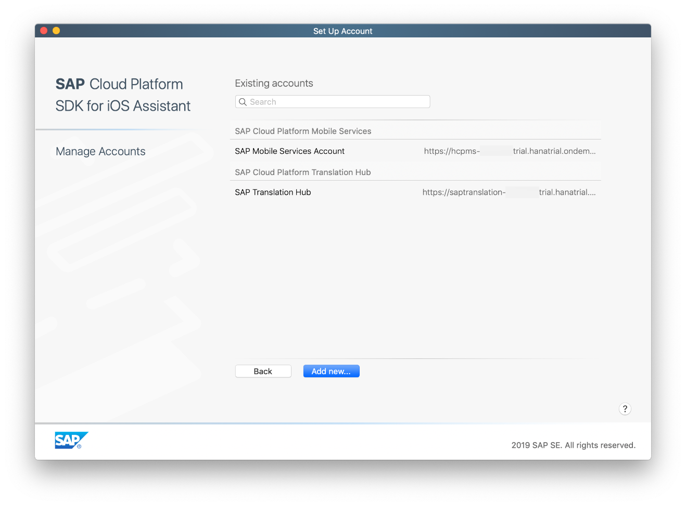

Go back to the main screen by clicking **Back**.

[DONE]
[ACCORDION-END]


[ACCORDION-BEGIN [Step 3: ](Add translations)]

If you don't have an application for the translation you can simple create one by adding a sample app in the **SDK for iOS Assistant**.

For that simply click on the **Create new** button on the initial screen.


Next select the **Sample App** tile to go to the creation process.


Make sure your Mobile Services account is selected and click on **Next**.

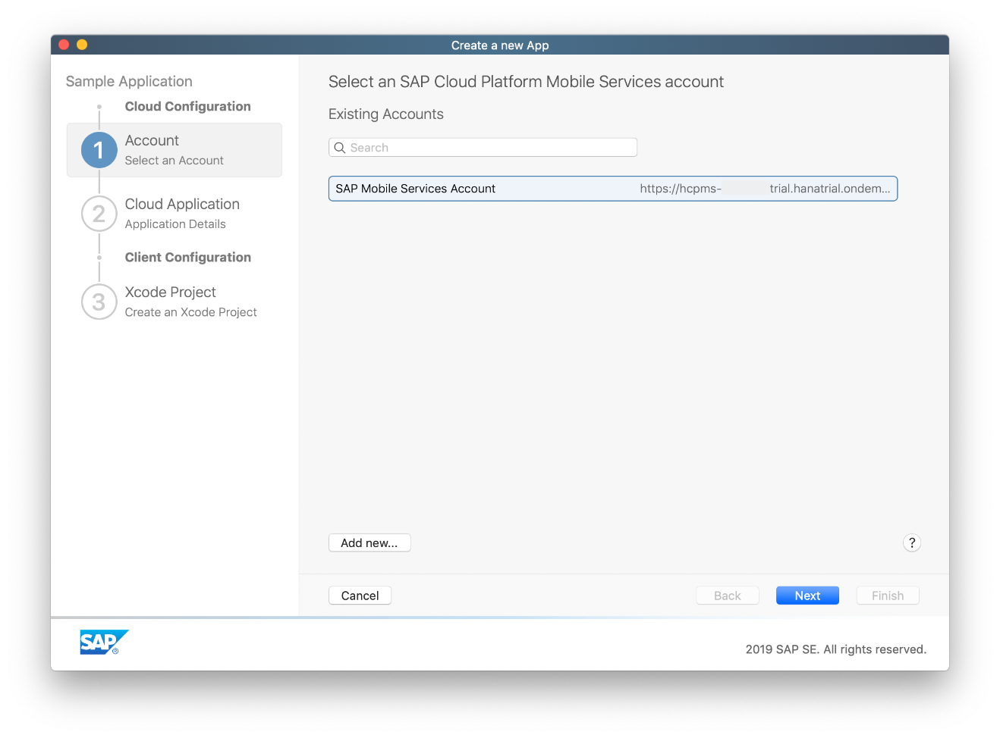

Now the assistant will ask you to add an SAP Cloud Platform Mobile Services application. You can fill out the fields as you wish.

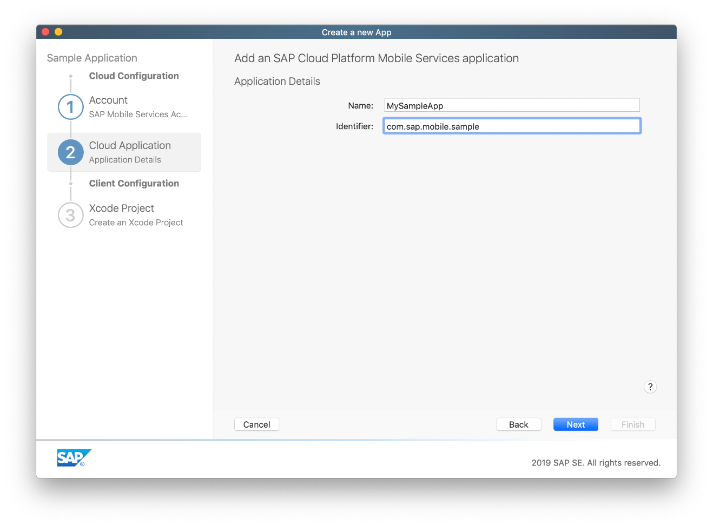

The last step is to create the Xcode project. Fill out the fields as you wish.


The project you just created is a fully functional iOS app connected against one of our sample services. After the creation you will see the project in the **Recent Projects** list on the initial screen. If you click on **All Projects** you will get an overview of all your projects.


On the **Manage Screen** click on **Translate** under the **Add Translation** part on the right side.

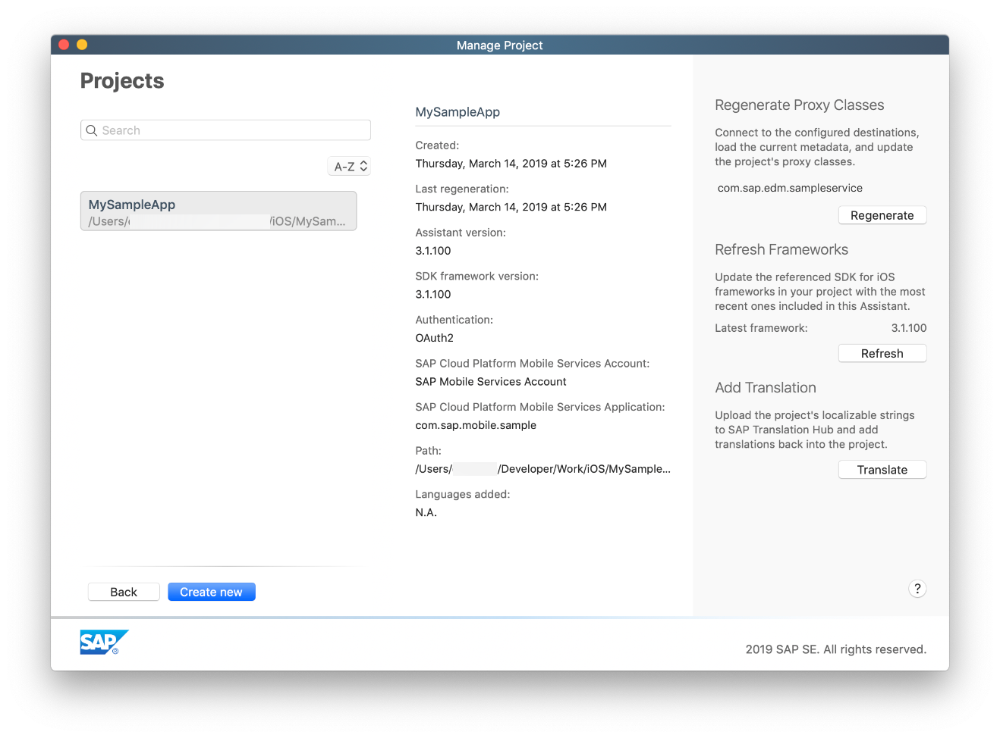

[DONE]
[ACCORDION-END]

[ACCORDION-BEGIN [Step 4: ](Add translation to your project)]

Now we will go through the translation flow to add localization to our app.

First select the previously added **Translation Hub account** and click on **Next**.

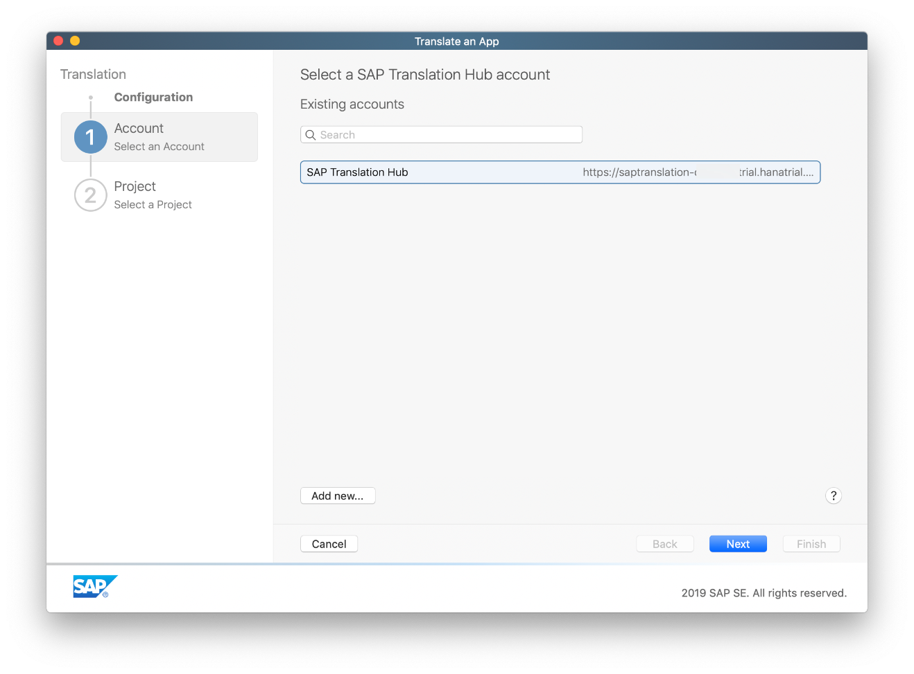

The Translation Hub doesn't have a project yet so click on **Add new** to create one.

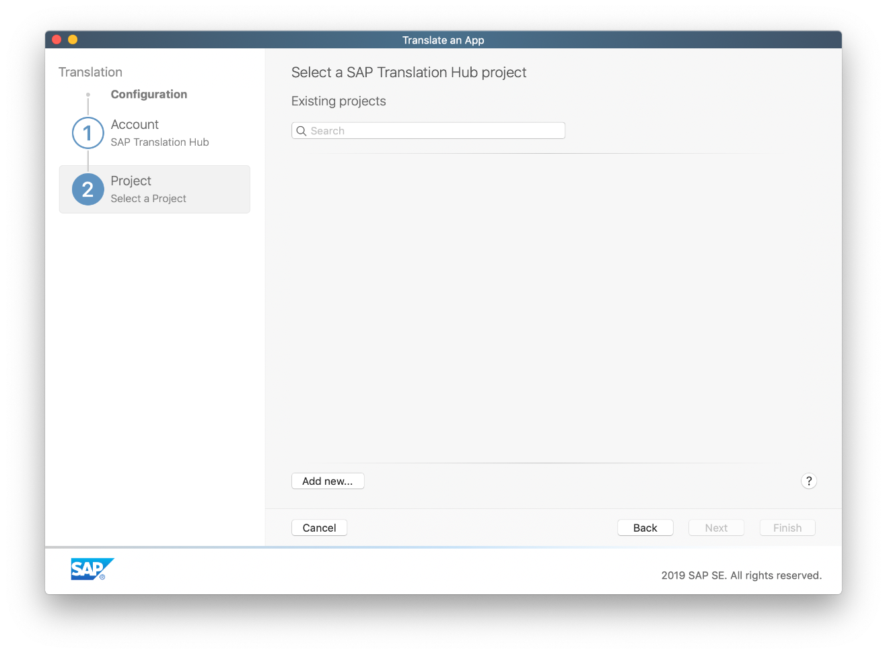

For the **Translation Hub Project Details** enter a **Project Name** and select the languages you want to translate to. Click on **Save**.

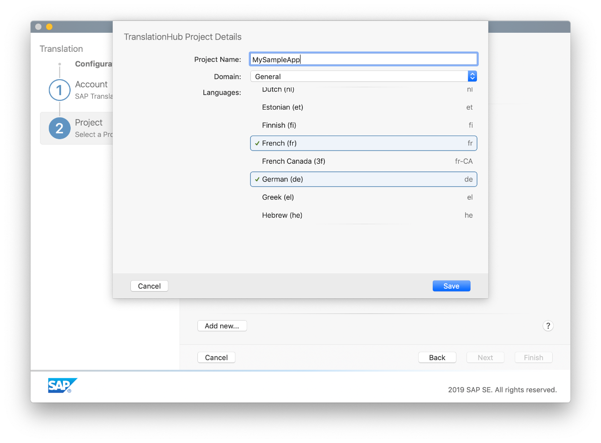

You will see now the created Translation Hub project. Select it and click on **Finish**.


[DONE]
[ACCORDION-END]

[ACCORDION-BEGIN [Step 5: ](Examine the updated Xcode project)]

Open the Xcode project for your app. Notice the added `InfoPlist.strings` and `Localizable.strings` files for the languages you have selected for translation:

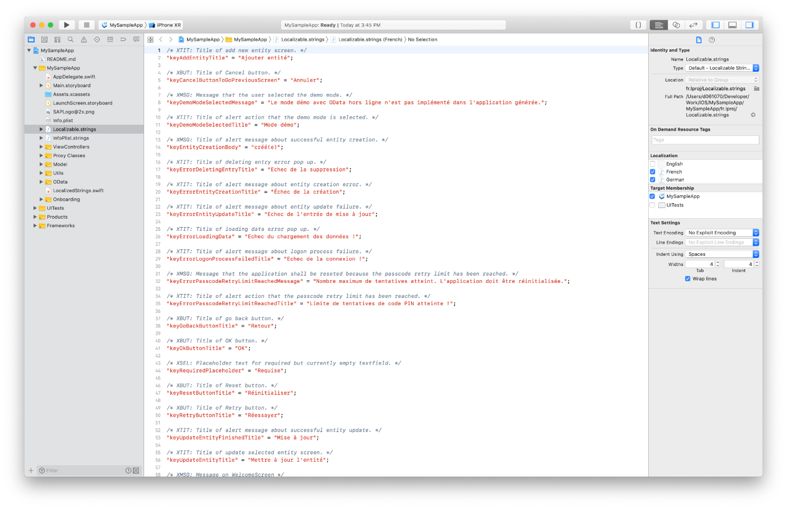

If you run the app now, and change the simulators language to one of the languages you translated to, you will see the strings have changed. It can happen that some of the translations are not 100% correct. You can fix that relatively easy by changing the values in the `Localizable.strings` file or you can do it in the **SAP Translation Hub**.

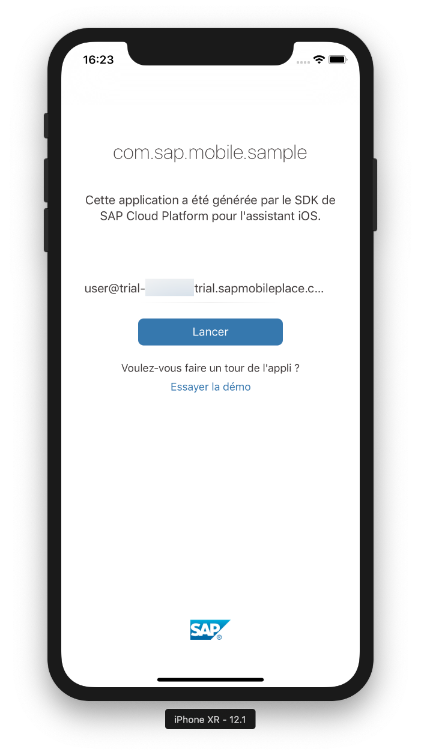

[DONE]
[ACCORDION-END]

[ACCORDION-BEGIN [Step 6: ](Modify the generated translations)]

Go back to your cloud account and make sure you're on the Neo landscape.

Navigate to **Services > SAP Translation Hub** in your SAP Cloud Platform trial account and click the **Go to UI for Translation Workflow** link. The **SAP Translation Hub** web interface will open in a new tab. you will now see the just added `MySampleApp` project:

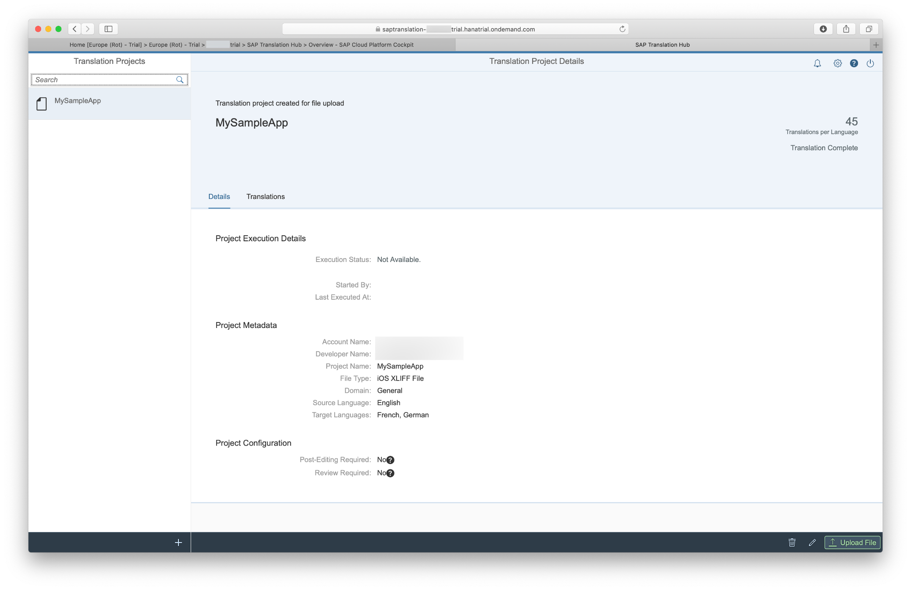

Click on the **Translations** tab. On this page, an overview of the original texts and the translated texts for the selected languages are shown:


Here you can correct any translations that may be incorrect, and click the **Save Project** button once done.

[DONE]
[ACCORDION-END]

[ACCORDION-BEGIN [Step 7: ](Re-import the modified translations)]

If you changed some of the translations in the **SAP Translation Hub** you have to run the translation out of the **SDK for iOS Assistant** again.
To do so go back to the **All Projects**, select the project for localization and click on **Translate**.

After finishing up the process the service should have updated the localized Strings in your Xcode project.

[DONE]
[ACCORDION-END]

[ACCORDION-BEGIN [Step 8: ](Localize the app name)]

If you go back to Xcode you will see `"CFBundleName" = "$(PRODUCT_NAME)";` in the `InfoPlist.strings` file. This will help choose the correct translation of your app's name. It is necessary to translate the app's name manually, so we need to add translations for that.

Each of the `InfoPlist.strings` files represent one of the languages. Go in each of them and change the `"$(PRODUCT_NAME)"` to a proper bundle name also add the following line of code right below it:

```swift

"CFBundleDisplayName" = "Your translated application name";
```

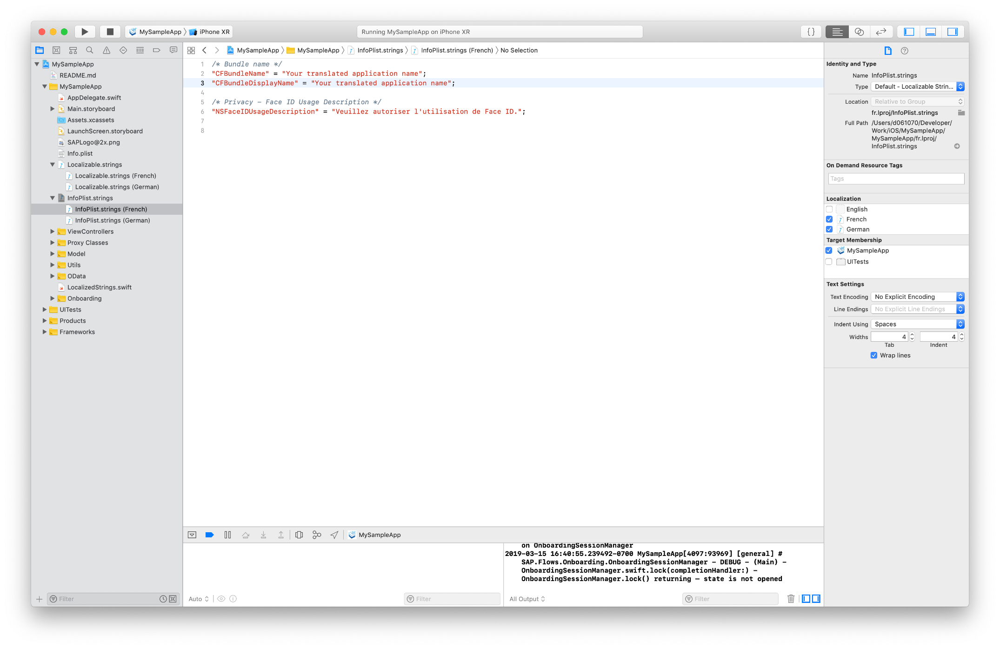

If you run the app now you should see the value you entered:


[VALIDATE_8]
[ACCORDION-END]

---
