## Prerequisites  
- **Development environment:** Apple Mac running macOS High Sierra or higher with Xcode 10 or higher
- **SAP BTP SDK for iOS:** Version 3.0 SP01
- [Get a Free Trial Account on SAP BTP](hcp-create-trial-account)
- [Set Up the SAP BTP SDK for iOS](fiori-ios-hcpms-install-sdk)

## Details
### You will learn  
  - How to connect to the correct API through the Assistant
  - How access the Image Classifier API to identify images

---

[ACCORDION-BEGIN [Step 1: ](Create a new Xcode project)]

For this tutorial we will create a Xcode project from scratch via Xcode and connect to the API manually. Please go ahead and create a new Xcode Project with the following configuration:

Property             |  Value
:-------------------------:|:-------------------------:
Template  | `Single View App`
Product Name | `MyImageClassifierApp`

For the other properties choose something which match your preferences.


Now we want to find the right API for us to classify images with. Fortunately the SAP API Business Hub offers such an API. Please go to [SAP API Business Hub](https://api.sap.com) and search for **SAP Leonardo ML - Functional Services**. Click on the **SAP Leonardo Machine Learning Foundation - Functional Services** to go to the available APIs.

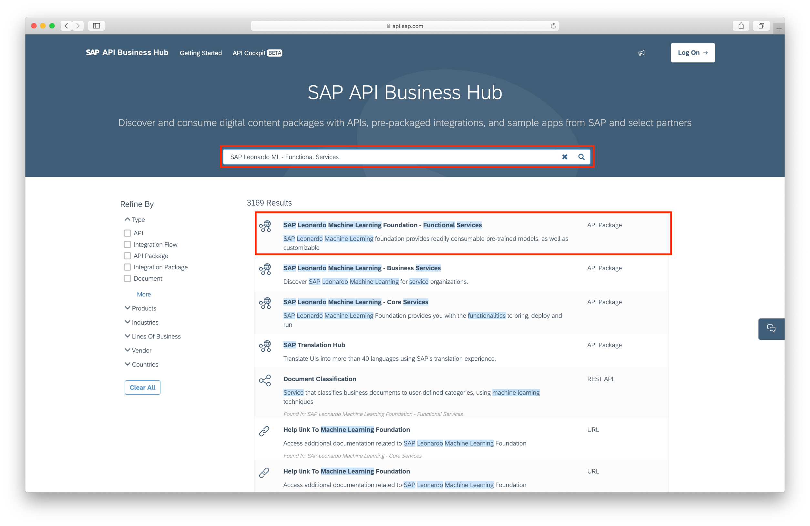

We want to use the **Product Image Classification API**, for that please search for **Image**. Click on the **Product Image Classification API** to see the API details.

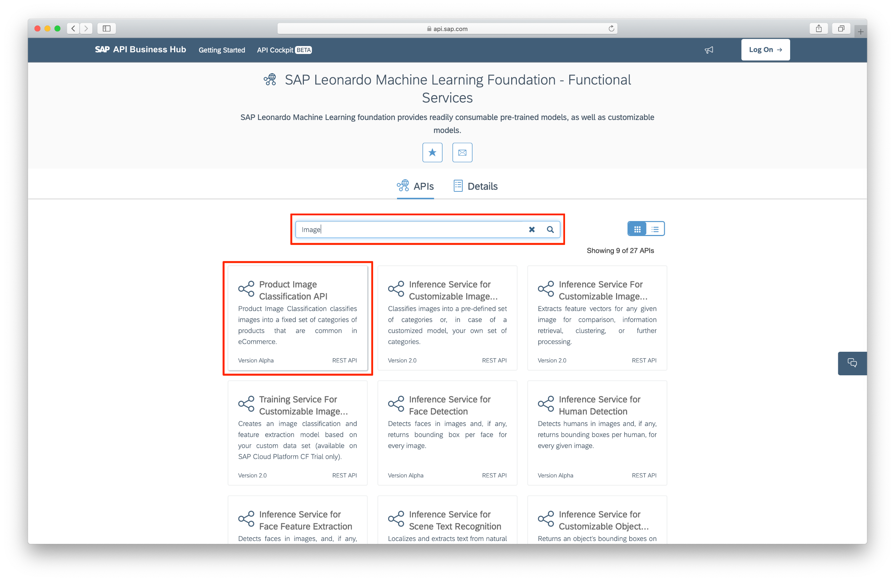

The SAP API Business Hub offers code snippets for the API implementation in several languages like `JavaScript`, `Java`, `Swift` or `SAPUI5`. Please click on **Code Snippet**.


In the code snippet pop-up, select the language **Swift** and click on **Copy and Close**. We have the needed code in the clipboard.


A typical **200** response from the API would look like this:

```json
{
  "_id": "string",
  "error": "string",
  "request": "string",
  "predictions": [
    {
      "name": "string",
      "results": [
        {
          "label": "string",
          "score": 0
        }
      ]
    }
  ],
  "status": "QUEUED",
  "tenantName": "string",
  "error_description": "string"
}

```

[DONE]
[ACCORDION-END]

[ACCORDION-BEGIN [Step 2: ](Export the needed SAP Frameworks to your Xcode project)]

You can implement the API without the SAP BTP SDK for iOS but in this tutorial we will use it. So please open your **SAP BTP SDK Assistant for iOS** and select **SAP BTP SDK Assistant for iOS** in the navigation bar on top. Now select **Export Frameworks..** and choose the corresponding folder where your project is located. You might want to create a **Frameworks** folder to export them.


Please go to Xcode and select your project file to be able to embed the needed binaries. Click on the **+** icon in the **Embedded Binaries** section.

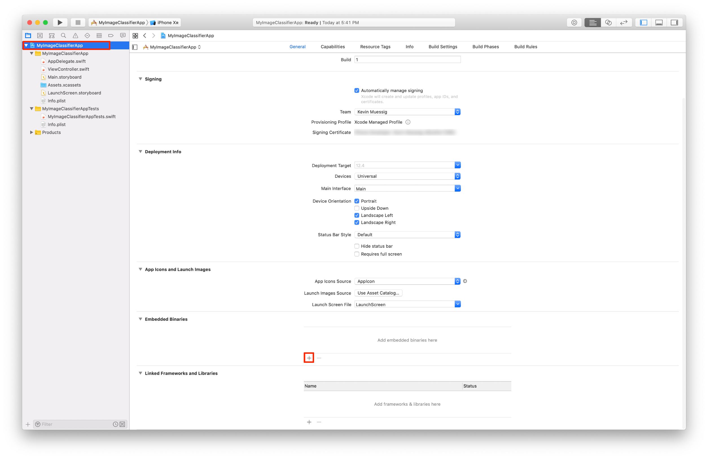

In the upcoming pop-up, please click on **Add Other...** to select the needed frameworks.

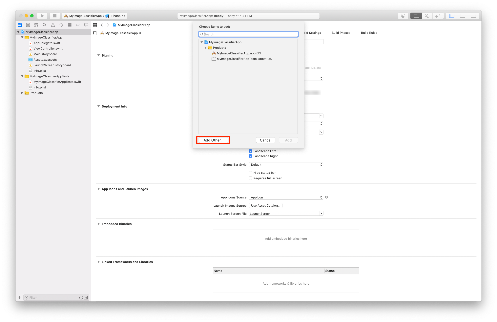

Navigate to the **Release-fat** folder inside the **Frameworks** folder you've created. Choose the following frameworks:

- `SAPCommon`
- `SAPFiori`
- `SAPFoundation`
- `SAPOData`

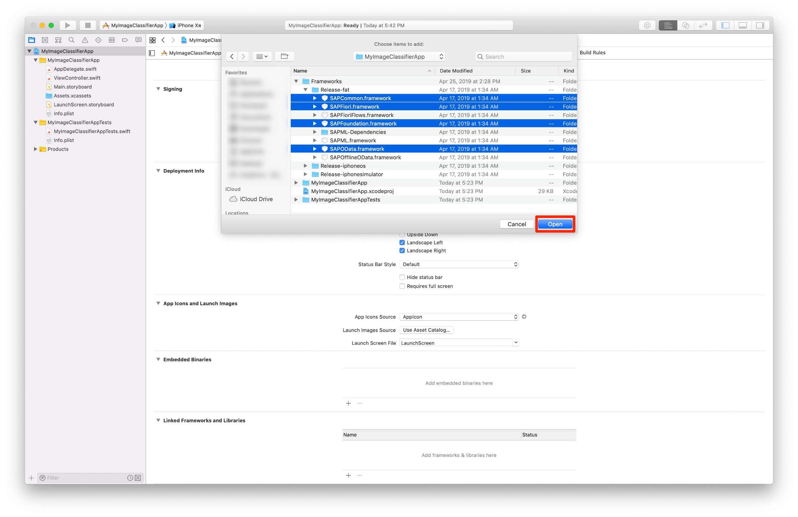

Click on **Open**.

In the project settings you can see that those frameworks have been added to your app.


[DONE]
[ACCORDION-END]

[ACCORDION-BEGIN [Step 3: ](Add a Table View to your app)]

It's about time to build some UI for the user to classify images over the provided API.
We're going to add an `UINavigationController` and a `UITableViewController` to the `Main.storyboard`. Please open the `Main.storyboard`, delete the existing view and add a `UITableViewController` from the **Object Library**.

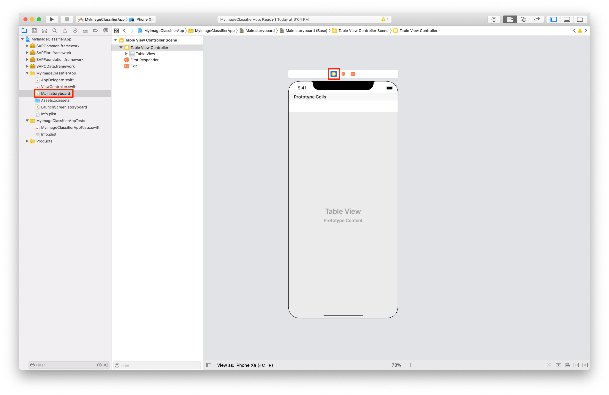

Embed the added `UITableViewController` in a `UINavigationController` via the menu bar, **Editor** -> **Embed in** -> **Navigation Controller**.

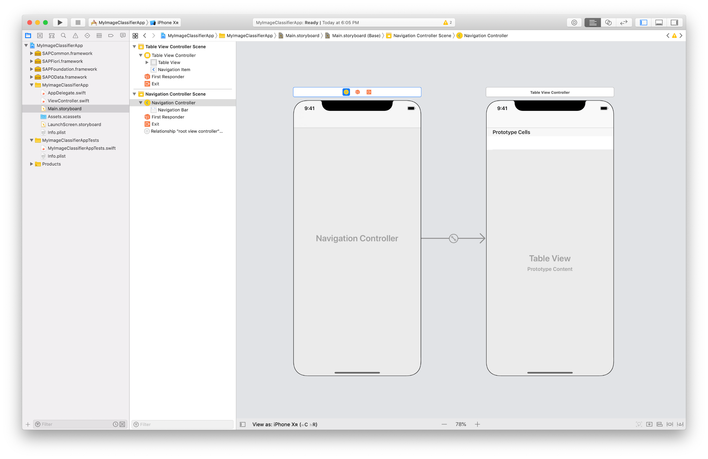

Next it is necessary to have a Swift class inheriting from the `UITableViewController` class. Create a new `UITableViewController` Cocoa Touch class with the name `ImageClassifierTableViewController`.

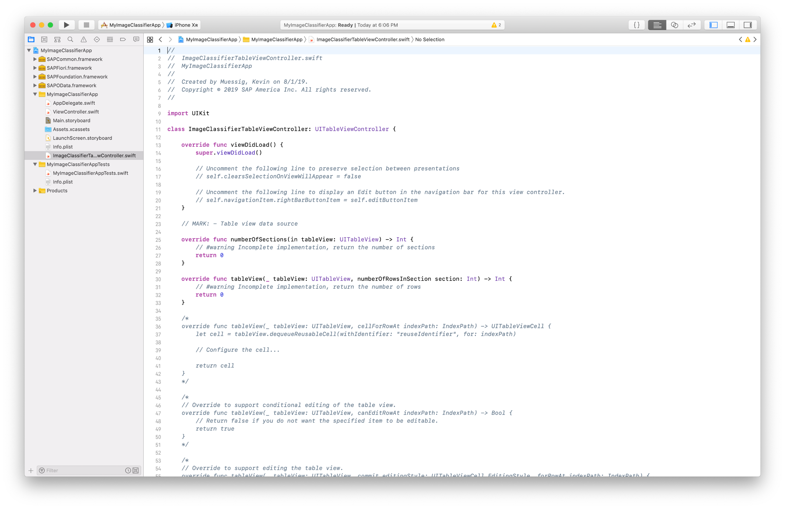

Go back to the `Main.storyboard` and select the added `UITableViewController`. Click on the **Identity Inspector** and set the **Custom Class** to the `ImageClassifierTableViewController`. Hit return.

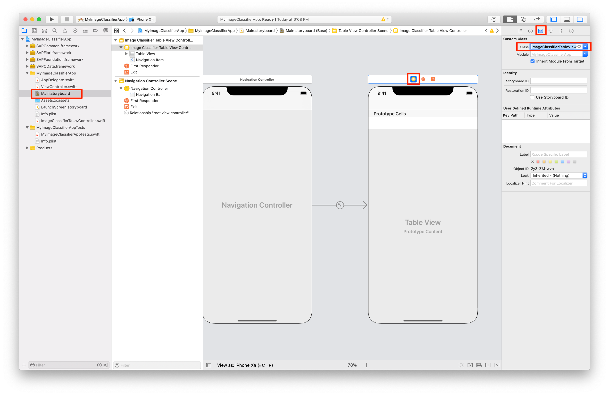

[DONE]
[ACCORDION-END]

[ACCORDION-BEGIN [Step 4: ](Add an Image picker)]

We want to enable the user to take a picture or choose one from his Photo library. We will add a **Flexible Space Bar Button Item** to the bottom of the view.

Go back to the **Main.storyboard**, choose the **Flexible Space Bar Button Item** from the **Object Library** and add it into the **Bar Button Item** in the view hierarchy.


Also add two **Bar Button Items** left and right of the **Flexible Space Bar Button Item**. Select each of those and give the left one the **Title** of **Library** and the right one choose the **Camera** icon. Both **Bar Button Items** you can edit by selecting it and choosing the **Attributes Inspector**.


Let's create some `IBActions` for the two **Bar Button Items** we added. Please stay in the `Main.storyboard`, select the `ImageClassifierTableViewController` and open the **Assistant Editor**. Please create a action of each of those Bar Button Items with the **Type** set on `UIBarButtonItem`. Call them `didTapLibrary(_: UIBarButtonItem)` and `didTapCamera(_: UIBarButtonItem)`.

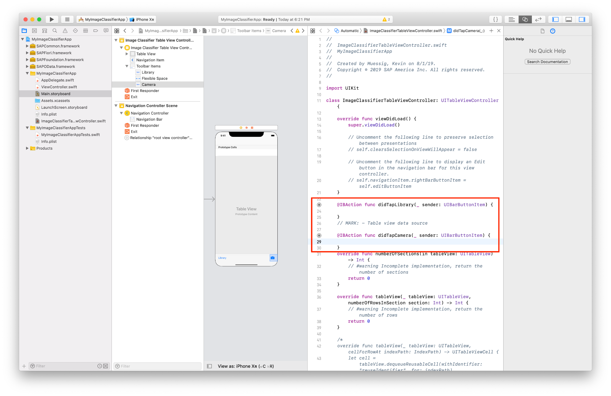

Because we're using a `UINavigationController` you have to make sure that it allows the toolbar to show. Select the `UINavigationController` and click on the **Attributes Inspector** icon and make sure the box for the **Shows Toolbar** option is checked.


Last step would be mark the `UINavigationController` as **Initial View Controller**. To do so select the `UINavigationController` and go to the **Attributes Inspector** and check the **Is Initial View Controller** checkbox.

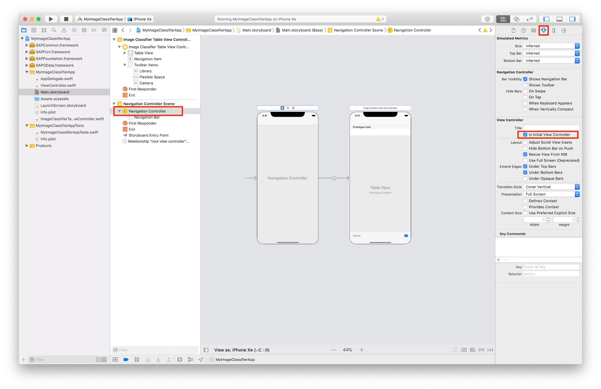

[DONE]
[ACCORDION-END]

[ACCORDION-BEGIN [Step 5: ](Add access to the Camera and Photo Library)]

In order for the user to have access to the camera and Photos library, you have to ask for permission via the `info.plist` file.

Please open the `info.plist` file and add the following property for camera access: **Privacy - Camera Usage Description**. Give it the value: `$(PRODUCT_NAME) needs to use your Camera`.

We do the same thing for Photo Library access: **Privacy - Photo Library Usage Description**. Give it the value: `$(PRODUCT_NAME) needs to use your Photos Library`.

Your `info.plist` file should look like this now


[DONE]
[ACCORDION-END]

[ACCORDION-BEGIN [Step 6: ](Change the class delegates and add import statements)]

First open the `ImageClassifierTableViewController` class and add the following import statements:

```swift
  import UIKit
  import Photos
  import Foundation
  import SAPFoundation
  import SAPCommon
  import SAPFiori

```

Next change the class declaration to inherit from:

- `UITableViewController`
- `UINavigationControllerDelegate`

Also add the following properties to your class, this code will give us a logger, an `AppDelegate` instance, an `UIImagePickerController` instance for the Photo Library and a dictionary to safe the response of the classifier:


```swift
  var classifications = [Dictionary<String, Any>]( )
  let picker = UIImagePickerController()
  private let appDelegate = UIApplication.shared.delegate as! AppDelegate
  private let logger: Logger = Logger.shared(named: "ImageClassifierTVC")
  var loadingIndicator: FUIModalLoadingIndicatorView?

```

At last, add the following lines of code to the `viewDidLoad(:)`:

```swift
  logger.logLevel = .info
  picker.delegate = self

```

[DONE]
[ACCORDION-END]

[ACCORDION-BEGIN [Step 7: ](Implement logic to use the FUIObjectTableViewCell to display the classifiers result)]

Before we go and implement the logic for calling the classifier's API, we will implement the Table View logic. First we want to register a `FUIObjectTableViewCell` at our Table View. Go to the `viewDidLoad(:)` and add the following lines of code:

```swift
  tableView.estimatedRowHeight = 80
  tableView.rowHeight = UITableView.automaticDimension
  tableView.register(FUIObjectTableViewCell.self, forCellReuseIdentifier: FUIObjectTableViewCell.reuseIdentifier)

```

With that we make sure the cell is registered on the table view and the rows will be displayed the correct way. Implementing the `UITableViewDataSource` will make sure that the products are going to be displayed the correct way. Implement the following lines of code:

```swift
  // MARK: - Table view data source

  override func tableView(_ tableView: UITableView, numberOfRowsInSection section: Int) -> Int {
        let numRows = classifications.count

        if numRows == 0 {
            let noDataLabel: UILabel  = UILabel(frame: CGRect(x: 0, y: 0, width: tableView.bounds.size.width - 50, height: tableView.bounds.size.height))
            noDataLabel.text          = "Select an image or take a picture"
            noDataLabel.textColor     = UIColor.lightGray

            noDataLabel.textAlignment = .center
            tableView.backgroundView  = noDataLabel
        }
        else {
            tableView.backgroundView = nil
        }
        return numRows
    }

    override func tableView(_ tableView: UITableView, cellForRowAt indexPath: IndexPath) -> UITableViewCell {
        let item = classifications[indexPath.row]

        let cell = tableView.dequeueReusableCell(withIdentifier: FUIObjectTableViewCell.reuseIdentifier) as! FUIObjectTableViewCell

        cell.headlineText   = item["label"] as? String
        cell.footnoteText   = "Confidence: \(String(describing: Int(round(Double(((item["score"]) as! NSNumber) as! Double) * 100))))) %"

        return cell
    }

```

[DONE]
[ACCORDION-END]

[ACCORDION-BEGIN [Step 8: ](Implement logic to use the Camera and Photo Library)]

You remember we created those `IBActions` all the way in the beginning, now you're going to implement those to actual show the camera and the Photo Library.

In your `ImageClassifierTableViewController` locate the two action methods. Replace the code of the `didTapLibrary(_ : UIBarButtonItem)`:

```swift
  picker.allowsEditing = false

  // select the source
  picker.sourceType = .photoLibrary

  // define the needed media types
  picker.mediaTypes = UIImagePickerController.availableMediaTypes(for: .photoLibrary)!

  // present the UIImagePickerController
  present(picker, animated: true, completion: nil)

```

Also replace the code of the `didTapCamera(_ : UIBarButtonItem)`:

```swift
  // if there is a camera, present it
  if UIImagePickerController.isSourceTypeAvailable(.camera) {
      picker.allowsEditing = false
      picker.sourceType = UIImagePickerController.SourceType.camera
      picker.cameraCaptureMode = .photo
      picker.modalPresentationStyle = .fullScreen
      present(picker,animated: true,completion: nil)
  } else {

      // if there is no camera available (Simulator), show an UIAlertController
      let alertVC = UIAlertController(
          title: "No Camera",
          message: "Sorry, this device has no camera",
          preferredStyle: .alert)

      let okAction = UIAlertAction(
          title: "OK",
          style:.default,
          handler: nil)

      alertVC.addAction(okAction)

      present(
          alertVC,
          animated: true,
          completion: nil)
  }

```

[DONE]
[ACCORDION-END]

[ACCORDION-BEGIN [Step 9: ](Add a UIImage extension to resize images)]

We want to make some resizing to the images, so we implement some logic for that:

```swift
extension UIImage {
  func resized(toWidth width: CGFloat) -> UIImage? {
      let canvasSize = CGSize(width: width, height: CGFloat(ceil(width/size.width * size.height)))
      UIGraphicsBeginImageContextWithOptions(canvasSize, false, scale)
      defer { UIGraphicsEndImageContext() }
      draw(in: CGRect(origin: .zero, size: canvasSize))
      return UIGraphicsGetImageFromCurrentImageContext()
  }
}

```

This resizes any image from the camera or the Photo Library to width of 600 pixels, and scales the height proportionally. Since the API Hub does not allow files exceeding 1 megabyte, in this particular case resizing the image to a smaller size is preferred over increasing the image compression.

If you now build run the app on the simulator, your app should look like this:

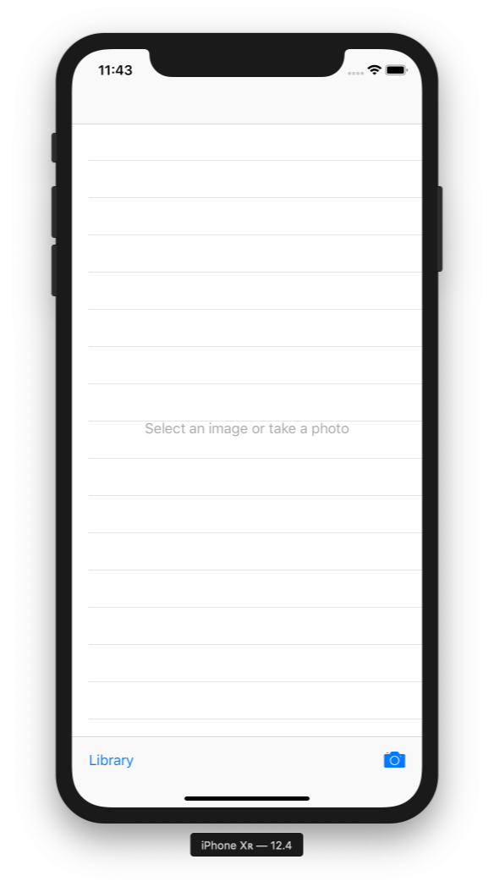

> You won't be able to use the camera on simulator, run it on a physical iOS device to use the camera.

[DONE]
[ACCORDION-END]

[ACCORDION-BEGIN [Step 10: ](Connect to the SAP Leonardo Image Classification API)]

Now everything is ready to take pictures or pick one from the Photo Library. Let's implement the logic for connecting to the API and get the photo classified.

Please take the sample code from the [SAP API Business Hub](https://api.sap.com).


Let's implement a method which will connect to the API and send an image with it.
Please add the following method to your class:

```swift
private func sendImage(image: UIImage, filename: String) {
  //adding request headers
   let boundary = "Boundary-\(UUID().uuidString)"
   let headers = [
       "Accept": "application/json",
       "APIKey": "0dj0kYVf4a7CK6AXKk5JLcBtdoAm7NWB",
       "Content-Type": "multipart/form-data; boundary=\(boundary)"
   ]

   var request = URLRequest(url: URL(string: "https://sandbox.api.sap.com/ml/prodimgclassifier/inference_sync")!,
                            cachePolicy: .useProtocolCachePolicy,
                            timeoutInterval: 10.0)
   //setting request method
   request.httpMethod = "POST"
   request.allHTTPHeaderFields = headers
   request.httpBody = self.createBody(
       boundary,
       data: image.jpegData(compressionQuality: 0.8),
       mimeType: "image/jpg",
       filename: filename)

   let session = SAPURLSession()

   //sending request
   let dataTask = session.dataTask(with: request) { data, response, error in
       guard let data = data, error == nil else {
           // check for fundamental networking error
           return
       }

       do {
           let json = try JSONSerialization.jsonObject(with: data, options: .mutableContainers) as AnyObject


           self.logger.info("response :\(json)")
           let rootKey = json.allKeys[0]
           let dictArray = json[rootKey] as! [NSDictionary]

           // retrieve 'results' node from JSON and store results in classifications field
           self.classifications = dictArray[0].value(forKey: "results") as! [Dictionary<String, Any>]


           DispatchQueue.main.async {
               self.tableView.reloadData()
               self.loadingIndicator?.dismiss()
           }
       }
       catch let error as NSError {
           self.logger.error("error : \(error)")
       }
   }

   dataTask.resume()
 }

```

Okay this code does a lot, let's take a look. In this method, first the required HTTP headers are created. The image is sent as `multipart/form-data`, and the response is retrieved in JSON format. The `APIKey` header expects your personal API Hub key, which can be retrieved from the API Hub by clicking the key icon in the top-right of the REST API page.

Because the request is sent as `multipart/form-data`, a boundary string needs to be constructed which will be used in the request body. This HTTP body is populated in method `createBody(:)`.

The REST API URL is then set in the request and an `URLSession` is created. After a successful response, the returned data is serialized to a JSON object. The classifications array will then be populated with the JSON object's results node, and the table view is reloaded.

Now let's implement the `createBody(_ : String, data: Data?, mimeType: String, filename: String) -> Data?` method:

```swift
private func createBody(_ boundary: String, data: Data?, mimeType: String, filename: String) -> Data? {
  var body = Data()

  let boundaryPrefix = "--\(boundary)\r\n"

  body.append(Data(boundaryPrefix.utf8))
  body.append(Data("Content-Disposition: form-data; name=\"files\"; filename=\"\(filename)\"\r\n".utf8))
  body.append(Data("Content-Type: \(mimeType)\r\n\r\n".utf8))
  guard let data = data else {
    self.logger.error("Data is nil! Can't create body")
    return nil
  }

  body.append(data)
  body.append(Data("\r\n".utf8))
  body.append(Data("--".appending(boundary.appending("--")).utf8))

  return body
}

```

[DONE]
[ACCORDION-END]

[ACCORDION-BEGIN [Step 11: ](Implement UIImagePickerControllerDelegate)]

Everything is ready to use now, there is one piece missing which is the implementation of the `UIImagePickerControllerDelegate`. Please add another extension to the `ImageClassifierTableViewController` which is implementing the `UIImagePickerControllerDelegate` protocol.

```swift
extension ImageClassifierTableViewController: UIImagePickerControllerDelegate {
  func imagePickerController(_ picker: UIImagePickerController, didFinishPickingMediaWithInfo info: [UIImagePickerController.InfoKey : Any]) {
      let  pickedImage = info[UIImagePickerController.InfoKey.originalImage] as? UIImage

      // API Hub doesn't allow images submitted over 1MB in size.
      // Resizing the image to a width of 600px should suffice.
      let resizedImage = pickedImage?.resized(toWidth: 600.0)

      loadingIndicator = FUIModalLoadingIndicator.show(inView: self.view, animated: true)
      self.sendImage(image: resizedImage!, filename: "image.jpg")

      dismiss(animated:true, completion: nil)
  }

  func imagePickerControllerDidCancel(_ picker: UIImagePickerController) {
      dismiss(animated: true, completion: nil)
  }
}

```

[DONE]
[ACCORDION-END]

[ACCORDION-BEGIN [Step 12: ](Run the app and classify some images)]

Run the app on your physical device to take a picture. In the following screenshots you can see I take a picture of an iPad and it get's classified the correct way.

Scan             |  Result
:-------------------------:|:-------------------------:
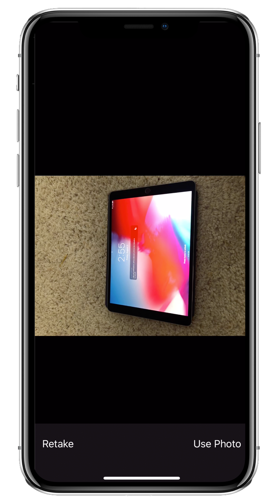  |  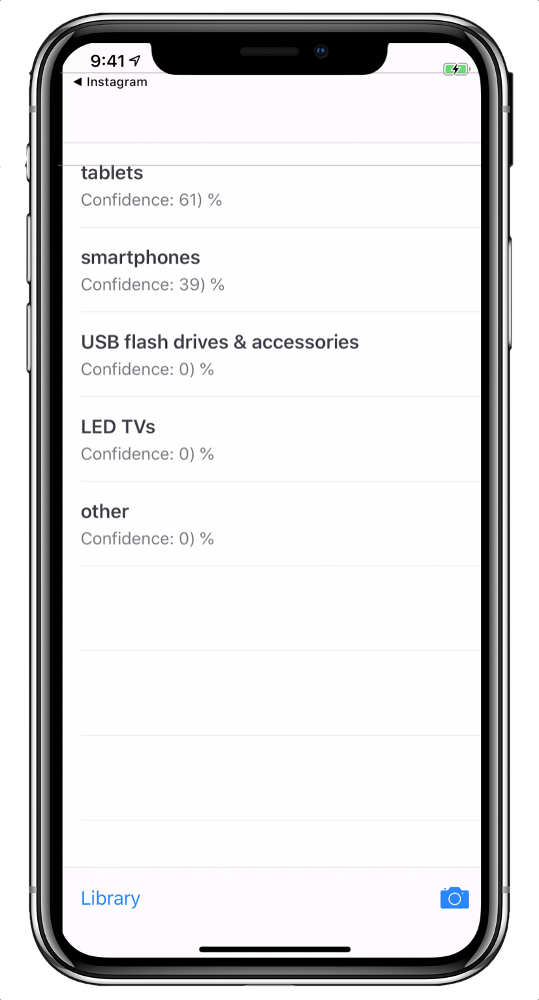

[VALIDATE_11]
[ACCORDION-END]
