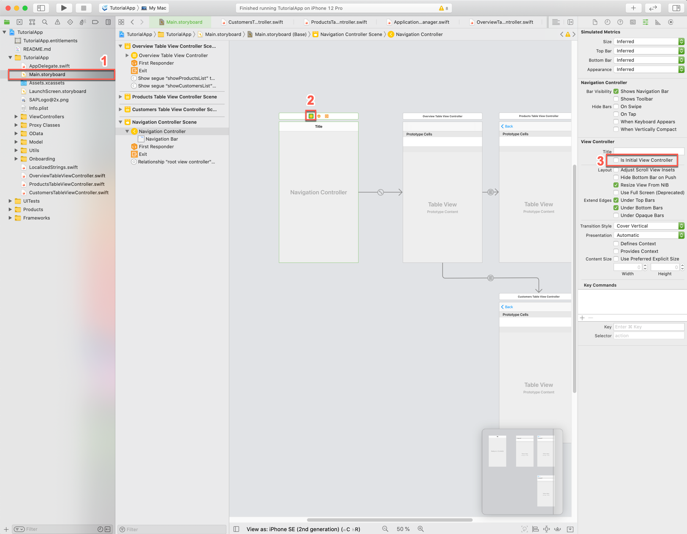
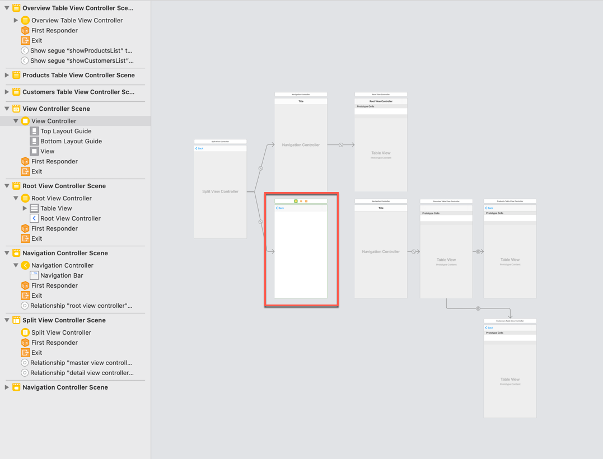
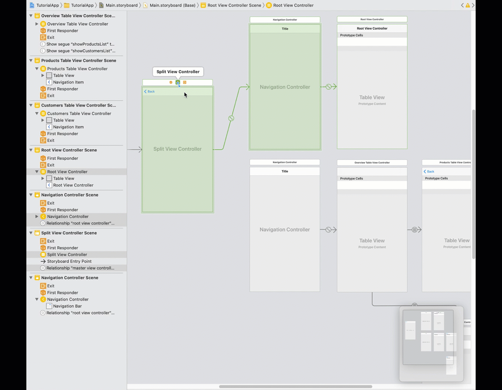
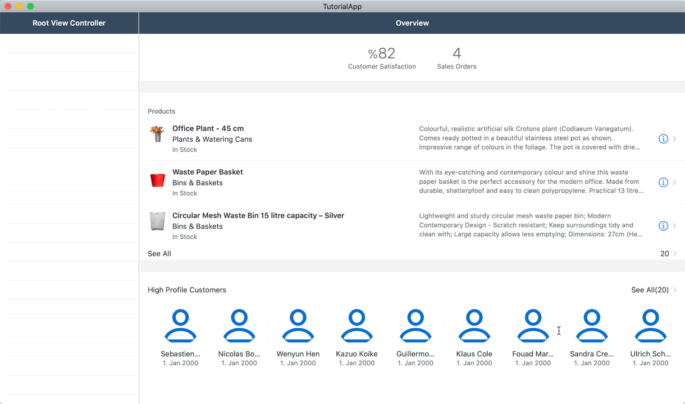
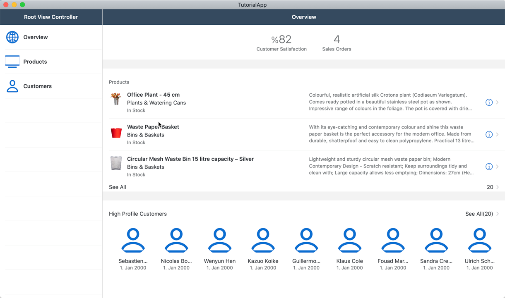
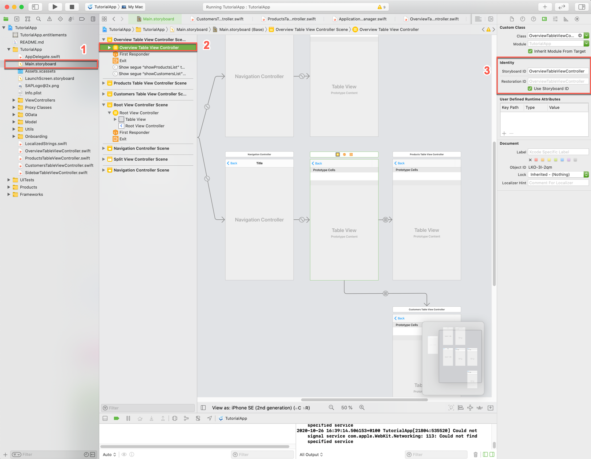
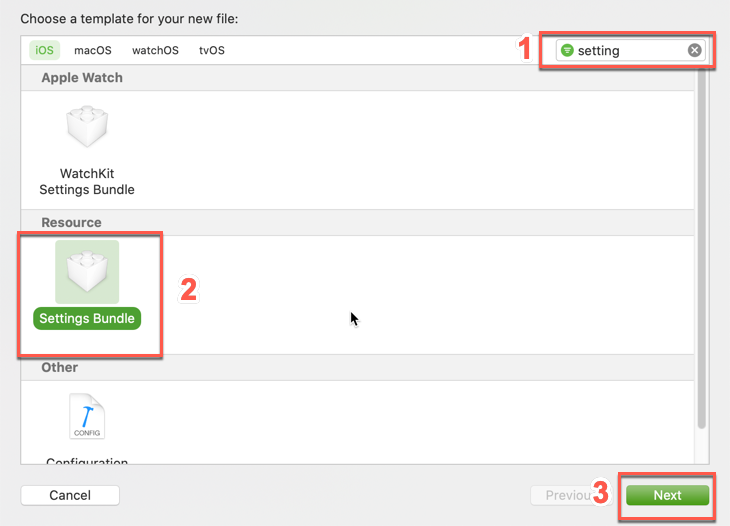
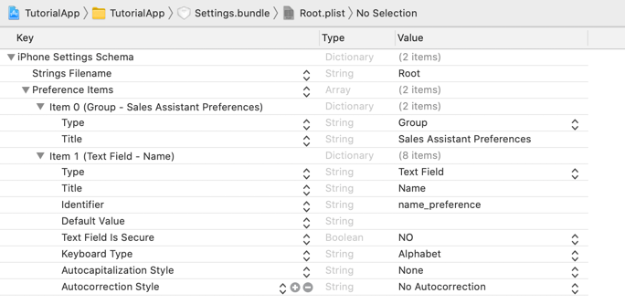
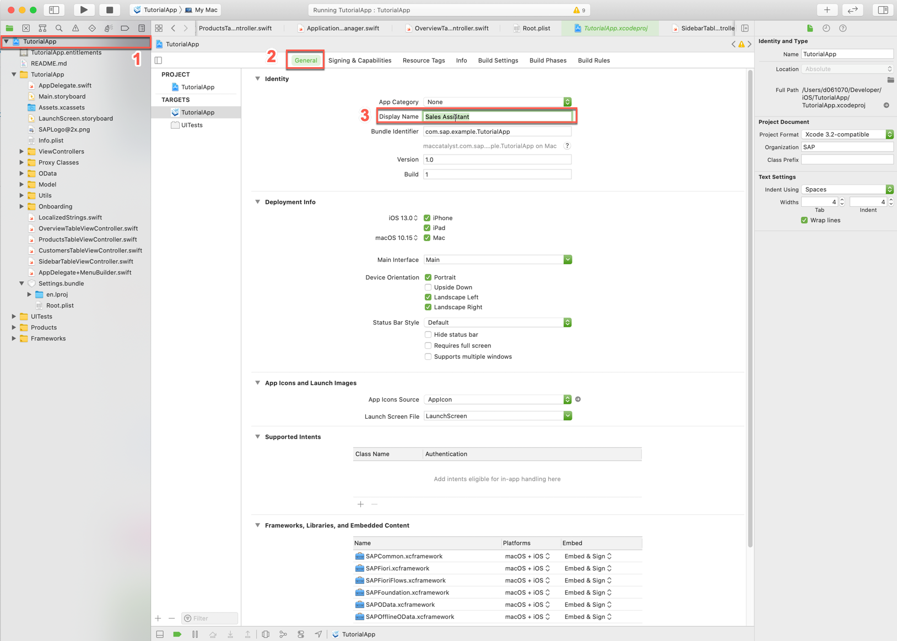
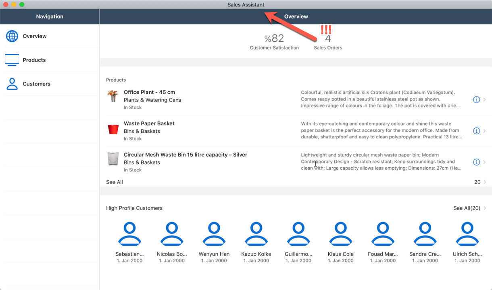

## Prerequisites
- **Development environment:** Apple Mac running macOS Catalina or higher with Xcode 11 or higher
- **SAP Cloud Platform SDK for iOS:** Version 5.0 or higher

## Details
### You will learn  
  - How to implement a Split View Controller to support a sidebar on MacOS
  - How to change the Menu Bar items
  - How to create a settings bundle to enable a preferences menu

---

[ACCORDION-BEGIN [Step 1: ](Implement the master-detail view)]

In the last tutorial you made changes to your Xcode project settings to enable Mac Catalyst for your app project.
This tutorial is about making some changes to the project to fit better on MacOS without changing the appearance on iPhone or iOS.

We are going to cover the basics for Mac Catalyst and the SAP Cloud Platform SDK for iOS but using the previously mentioned documentation in combination with this tutorial series you should be well suited to build great business apps.

In the beginning we want to change the app flow to have a split view in place when running on Mac Catalyst. The split view or Master-Detail View allows Mac Catalyst to display a sidebar similar to Apple's Music or Stocks applications on MacOS.

If you look at the current app structure the user will end up on the Overview screen right after finishing the onboarding process. On MacOS this is going to be the same way with the difference that the user will have a sidebar available where he or she can switch between Overview, Customer and Product list directly.

To implement the new flow we can attach our current app flow in storyboard to a standard Split View Controller.

1. Open the `Main.storyboard` and select the **Navigation Controller**, open the **Attributes Inspector** to uncheck the **Is Initial View Controller**. This is necessary because the new main entry point is going to be the Split View Controller.

    

2. Use the **Object Library** to search for **Split View Controller** and drag + drop it next to the navigation controller.

    

3. With that in place we can connect the Split View Controller with our current app flow. Delete the View Controller Scene of the Split View Controller in Storyboard first.

    

    After deleting your storyboard should look like this now:

    

4. Drag the Navigation Controller of the app flow right next to the Split View Controller and create a storyboard segue between the **Split View Controller** and the **Navigation Controller**. As the segue type, select **detail view controller** and safe.

    

5. Make the Master View Controller the initial view controller for the app by selecting the Master View controller and using the **Attributes Inspector** to check the box for **Is Initial View Controller**.

    

    Let's quickly go over what we did here. First we added a new Split View Controller which is a standard Apple UI control. Then we added our app flow to the Split View Controller through a **detail view controller** segue. This allows the Split View Controller to automatically manage your Split View lifecycle. We leave the Navigation Controller in as we want to maintain our regular app flow.

    Because the Master View Controller is the new initial view controller we have to change the `ApplicationUIManager` code accordingly.

    To ensure that we will see the standard app flow while running on iOS and displaying the Split View when running on Mac Catalyst we can use environmental conditions to distinct different initialization code.

    ```Swift
    #if targetEnvironment(macCatalyst)
    #else

    ```

6. Open the `ApplicationUIManager.swift` file and locate the `showApplicationScreen(completionHandler:)` method. Right now you can see that we're initializing the Navigation Controller as our initial screen but you have to change that to be adaptable to Mac Catalyst. Change the implement code to the following and read the inline comments carefully:

    ```Swift
    func showApplicationScreen(completionHandler: @escaping (Error?) -> Void) {
        // Check if an application screen has already been presented
        guard self.isSplashPresented else {
            completionHandler(nil)
            return
        }

        // Restore the saved application screen or create a new one
        let appViewController: UIViewController
        if let savedViewController = self._savedApplicationRootViewController {
            appViewController = savedViewController
        } else {
            // If running on Mac Catalyst initialize the Split View Controller and set it as new app view controller
            #if targetEnvironment(macCatalyst)
            let splitViewController = UIStoryboard(name: "Main", bundle: Bundle.main).instantiateInitialViewController() as! UISplitViewController

            splitViewController.modalPresentationStyle = .currentContext
            splitViewController.preferredDisplayMode = .allVisible
            appViewController = splitViewController

            // If running on iOS show the OverviewTableViewController
            #else
            let overviewTVC = UIStoryboard(name: "Main", bundle: Bundle.main).instantiateViewController(withIdentifier: "OverviewTableViewController") as! OverviewTableViewController
            appViewController = overviewTVC
            #endif

        }
        self.window.rootViewController = appViewController
        self._onboardingSplashViewController = nil
        self._savedApplicationRootViewController = nil
        self._coveringViewController = nil

        completionHandler(nil)
    }

    ```

7. Run the app on the **My Mac** scheme and you should see you app being in Split View now and you can see that beautiful empty sidebar. Also if you have noticed the system automatically knows that your app wants to receive Push Notifications and the Mac Catalyst makes sure that MacOS displays it accordingly.

    

[DONE]
[ACCORDION-END]


[ACCORDION-BEGIN [Step 2: ](Implement root view controller UI)]

The Root View Controller represents the list you can see in the sidebar. This is a standard UI Table View Controller which allows you to have all the freedom you want to implement that.

We're going to display a list with three cells containing the navigation possibilities for the user including a nice system image using `SF Symbols`.

1. Create a new Table View Controller Cocoa Touch Class using the project navigator and make sure it inherits of `UITableViewController` and name it `SidebarTableViewController`.

2. Open the `Main.storyboard` and set the `SidebarTableViewController` as **Custom Class** on the **`Root View Controller`**.

    

3. Switch back to the `SidebarTableViewController.swift` file to implement the views logic.

4. First import the `SAPFiori` and `SAPCommon` frameworks, leave the `UIKit` statement:

    ```Swift
    import SAPFiori
    import SAPCommon

    ```

5. Next retrieve a new logger instance like we did before:

    ```Swift
    private let logger = Logger.shared(named: "SidebarTableViewController")

    ```

6. In the `viewDidLoad()` method register an `FUIObjectTableViewCell` to be used by the Table View:

    ```Swift
    override func viewDidLoad() {
        super.viewDidLoad()

        tableView.register(FUIObjectTableViewCell.self, forCellReuseIdentifier: FUIObjectTableViewCell.reuseIdentifier)
    }

    ```

    This should all be familiar to you, you see building an app is really easy.

7. Now let's implement the table view's data source first add the `numberOfSections(in:)` method:

    ```Swift
    override func numberOfSections(in tableView: UITableView) -> Int {
        return 1
    }

    ```

    We only need one section for this view so just return 1.

8. Directly below implement the `tableView(_:numberOfRowsInSection:)` method:

    ```Swift
    override func tableView(_ tableView: UITableView, numberOfRowsInSection section: Int) -> Int {
        return 3
    }

    ```

    We're going to display three cells for the Overview, the customer list and the product list.

9. Let's not forget about the `tableView(_:cellForRowAt:)` method:

    ```Swift
    override func tableView(_ tableView: UITableView, cellForRowAt indexPath: IndexPath) -> UITableViewCell {
        let cell = tableView.dequeueReusableCell(withIdentifier: FUIObjectTableViewCell.reuseIdentifier) as! FUIObjectTableViewCell

        // Define a UIImage SymbolConfiguration with the scaling factor of small. This allows the system to scale the SF Symbol accordingly.
        let smallConfiguration = UIImage.SymbolConfiguration(scale: .small)

        // Switch Statement to go over the different rows. Set the headline text and the detail image using SF Symbols.
        switch indexPath.row {
        case 0:
            cell.headlineText = NSLocalizedString("Overview", comment: "")
            cell.detailImage = UIImage(systemName: "globe", withConfiguration: smallConfiguration)
        case 1:
            cell.headlineText = NSLocalizedString("Products", comment: "")
            cell.detailImage = UIImage(systemName: "tv", withConfiguration: smallConfiguration)
        case 2:
            cell.headlineText = NSLocalizedString("Customers", comment: "")
            cell.detailImage = UIImage(systemName: "person", withConfiguration: smallConfiguration)
        default:
            return UITableViewCell()
        }

        return cell
    }

    ```

10. If you run the app now you should see the cell being displayed in the sidebar.

    !

[DONE]
[ACCORDION-END]


[ACCORDION-BEGIN [Step 3: ](Implement root view controller logic)]

In order to let the user have interactions with the list items we have to write some code.

Before we go ahead and implement the interaction with these cells we make sure to have a default selection being made when starting the application.

1. Implement a private helper method to make a decision which view controller to display as detail view controller.

    Add the following class property to the **`SidebarTableViewController`**:

    ```Swift
    // Store the selected index path
    private var selectedCellIndexPath: IndexPath?

    ```

2. In the `SidebarTableViewController` add the following method below the data source methods. Read the inline comments carefully:

    ```Swift
    // CollectionType selection helper
    private func viewSelected(at indexPath: IndexPath) {
        // Load the EntityType specific ViewController from the specific storyboard"
        var viewController: UIViewController!

        self.selectedCellIndexPath = indexPath
        let mainStoryboard = UIStoryboard(name: "Main", bundle: nil)

        // Decide which View Controller to instantiate.
        switch indexPath.row {
        case 0:
            viewController = mainStoryboard.instantiateViewController(identifier: "OverviewTableViewController")
        case 1:
            viewController = mainStoryboard.instantiateViewController(identifier: "ProductsTableViewController")
        case 2:
            viewController = mainStoryboard.instantiateViewController(identifier: "CustomersTableViewController")
        default:
            viewController = UIViewController()
        }

        // Load the NavigationController and present with the EntityType specific ViewController
        let rightNavigationController = mainStoryboard.instantiateViewController(withIdentifier: "SubNavigationController") as! UINavigationController
        rightNavigationController.viewControllers = [viewController]

        // Display the Detail View Controller
        splitViewController?.showDetailViewController(rightNavigationController, sender: nil)
    }

    ```

3. We have to make sure that the `viewSelected(at:)` method gets called as soon as the user clicks on a list item. Add the following table view delegate method directly below the data source methods:

    ```Swift
    override func tableView(_: UITableView, didSelectRowAt indexPath: IndexPath) {
        viewSelected(at: indexPath)
    }

    ```

    This will make sure that the correct index path gets passed into the `viewSelected(at:)` method.

4. Last step is to set those above implemented storyboard identifiers for the respective view controllers is necessary to instantiate the screens.

    Open the **`Main.storyboard`** and select the **Overview Table View Controller**. Open the **Identity Inspector** and set the **Identity** to `OverviewTableViewController`.

    

5. Repeat that procedure for the **Products Table View Controller** with `ProductsTableViewController` and **Customers Table View Controller** with `CustomersTableViewController`.

    And that's it, you have a working split view controller with a sidebar and working navigation.

6. The last step we want to do is change the navigation item's title from **Root View Controller** to **Navigation**. Add the following line of code to the `viewDidLoad()` method:

    ```Swift
    navigationItem.title = NSLocalizedString("Navigation", comment: "")

    ```

7. Compile and run the app on **My Mac** and try your hard work.

    !

[DONE]
[ACCORDION-END]


[ACCORDION-BEGIN [Step 4: ](Change the menu bar)]

We have our basic layout but now it would be interesting what else we could do to be more MacOS conform.
As mentioned in the last tutorial Mac Catalyst gives you a Menu Bar for free, but how do we access the menu bar and make changes to it?

There is an API provided by Apple allowing us to modify the Menu Bar in the app delegate.

We can create an extension swift file containing an `AppDelegate` extension containing a `buildMenu(with:)` override method.

> This would be also the way to generically have the Table View Data Source implemented.

1. Use the **Project Navigator** to create a **Swift** file and name it `AppDelegate+MenuBuilder`.

2. Open the `AppDelegate+MenuBuilder.swift` file and change the import statement from `Foundation` to `UIKit`:

    ```Swift
    import UIKit
    ```

3. The override `buildMenu(with:)` allows us to manipulate and create menu items for the menu bar. Implement the `buildMenu(with:)` method and read the inline comments carefully:

    ```Swift
    extension AppDelegate {
        // MARK: - Mac Catalyst Menu Bar
        override func buildMenu(with builder: UIMenuBuilder) {
            super.buildMenu(with: builder)

            // Remove the Format menu because this is not needed for this app.
            builder.remove(menu: .format)

            // Create an menu item and give it a selector method from some class. In this case OverviewTableViewController.
            let reloadMenuItem = UIKeyCommand(title: NSLocalizedString("Synchronize...", comment: ""),
                                                 action: #selector(OverviewTableViewController.loadData),
                                                 input: "r",
                                                 modifierFlags: .command)

            // Create a Menu and add it an identifier, also define that it should be shown in line. Give it the menu item as children. You could add far more items here if you wanted to.
            let reloadDataMenu = UIMenu(title: "",
                                        image: nil,
                                        identifier: UIMenu.Identifier("com.sap.example.MySampleAppCatalyst.Synchronize"),
                                        options: .displayInline,
                                        children: [reloadDataCommand])

            // Tell the UIMenuBuilder where to insert the menu.
            builder.insertChild(reloadDataMenu, atEndOfMenu: .file)
        }
    }
    ```

4. Save the file and open the `OverviewTableViewController.swift` class and change the `loadData()` method declaration to:

    ```Swift
    @objc func loadData() { ... }
    ```

5. Run the app on **My Mac** scheme.

    

    Of course you can add all sorts of menu entries as long as they make sense being there. Usually you want to have more global tasks in there. If you're interested in more about the menu bar on `MacOS` visit the official documentation [Adding Menus and Shortcuts to the Menu Bar and User Interface](https://developer.apple.com/documentation/uikit/uicommand/adding_menus_and_shortcuts_to_the_menu_bar_and_user_interface).

[VALIDATE_4]
[ACCORDION-END]


[ACCORDION-BEGIN [Step 5: ](Create settings bundle)]

Every Mac user expects a preferences menu in the menu bar so you should provide, if available, settings via a settings bundle. The reason for this is that using a settings bundle will give you the preferences menu for free.

Here we're going to implement some settings with help of the settings bundle.

1. Use the **Project Navigator** to open the context menu and click on **New File...**. In the search field of the upcoming dialog, search for **Settings**, select the **Settings Bundle** and click on **Next** and then **Create**.

    

    As a result you will get a brand new `settings.bundle` file in the project navigator.

2. If you run the app now and open the app's preferences you should see the preferences screen displayed below.

    

3. You can see that the `Root.plist` file contains all the settings for the displayed preferences. We can go and change the different preferences now.

    In the `Root.plist` locate the **Title** of **Item 0 (Group - Group)** and change it to **Sales Assistant Preferences**.

    Leave **Item 1 (Text Field - Name)** as is and delete the remaining items.

    

4. Run the app now and open the preferences you should see the title has changed and the other items are gone.

    

[DONE]
[ACCORDION-END]


[ACCORDION-BEGIN [Step 6: ](Change app title)]

Maybe you have noticed that the app's title is still `TutorialApp`, let's change this now.

1. Open the **`TutorialApp.xcproj`** file and click on the **General** tab if not already there.

2. Change the **Display Name** in the **Identity** section to `Sales Assistant`.

    

3. Of course you might want to change the bundle identifier as well to match the display name or create the whole project with the correct name in the beginning. As we're extending the app created in the prerequisites, we just change the display name here.

    !

    This is our finished app now. From here go ahead and look through different tutorials to maybe enhance this app more or go ahead and implement a detail screen for the products using the Human Interface Guideline of SAP Fiori for iOS.

[DONE]
[ACCORDION-END]
