## Prerequisites  
- **Development environment:** Apple Mac running macOS Catalina or higher with Xcode 11 or higher
- **SAP SDK for iOS:** Version 5.0 or newer

## Details
### You will learn  
  - How to implement and Action Sheet and make sure it will automatically be replaced with a Popover when running on regular size class on iPad
  - How to implement an Image Picker using Camera or Photo Library

---

[ACCORDION-BEGIN [Step 1: ](Add a Bar Button Item to Overview View Controller)]

In order for the user to pick an image for the classification you will implement a Bar Button Item bringing up an Action Sheet or a Popover when running on Regular mode on iPad.

1. To do so open the `Main.storyboard` and locate the Overview View Controller. Use the **Object Library** to drag a **Bar Button Item** onto the Navigation Item of the Overview View Controller.

    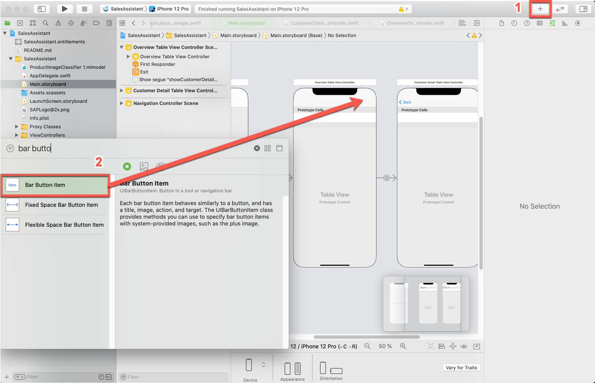

2. Open the **Assistant Editor** in Xcode and create an `IBOutlet` for the Bar Button Item in the `OverviewTableViewController.swift` class by **control + drag** into the View Controller class, name it `actionListButton` and place it directly below the `tableView` outlet.

    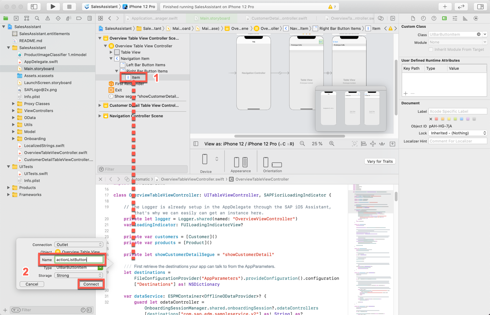

    In code the following line will appear:

    ```Swift

    @IBOutlet var actionListButton: UIBarButtonItem!
    ```

3. Next you will need an `IBAction` for handling user's interaction with that button.

    Create an `IBAction` in the `OverviewTableViewController.swift` class by **control + drag** into the View Controller class, choose **Action** this time instead of **Outlet**, name the action `didPressActionListButton`.

    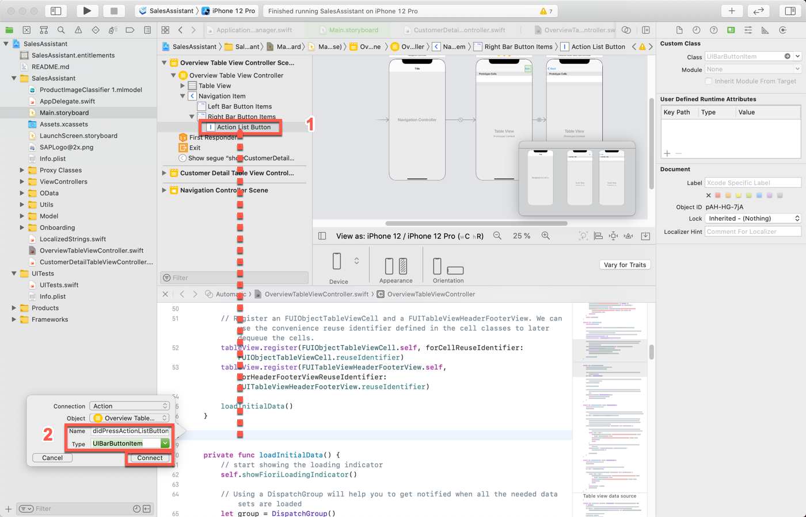

    The following method stub will appear in code:

    ```Swift

    @IBAction func didPressActionListButton(_ sender: UIBarButtonItem) {

    }
    ```

[DONE]
[ACCORDION-END]

[ACCORDION-BEGIN [Step 2: ](Implement a UIImagePickerController)]

1. Open the class `OverviewTableViewController.swift`. Add two properties for holding the `UIImagePickerController` and the picked image.

    Add the following lines of code below the segue property:

    ```Swift

    private let pickerController = UIImagePickerController()
    private var pickedImage: UIImage!

    ```

    Disregard the compile time error for the moment as this is just showing you that you have to conform to the protocol. You will do this at a later point.

2. Next implement a method with the name `setupImagePicker` below the just added `IBAction`:

    ```Swift

    private func setupImagePicker() {
        pickerController.delegate = self
        pickerController.allowsEditing = false

        // Only allow images here
        pickerController.mediaTypes = ["public.image"]
    }

    ```

3. Next call that just added method in the `viewDidLoad(:)` right above the `loadInitialData()` method call:

    ```Swift[15]

    override func viewDidLoad() {
        super.viewDidLoad()

        self.view.backgroundColor = .preferredFioriColor(forStyle: .backgroundBase)

        // Define the estimated row height for each row as well as setting the actual row height to define it's dimension itself.
        // This will cause the Table View to display a cell for at least 80 points.
        tableView.estimatedRowHeight = 80
        tableView.rowHeight = UITableView.automaticDimension

        // Register an FUIObjectTableViewCell and a FUITableViewHeaderFooterView. You can use the convenience reuse identifier defined in the cell classes to later dequeue the cells.
        tableView.register(FUIObjectTableViewCell.self, forCellReuseIdentifier: FUIObjectTableViewCell.reuseIdentifier)
        tableView.register(FUITableViewHeaderFooterView.self, forHeaderFooterViewReuseIdentifier: FUITableViewHeaderFooterView.reuseIdentifier)

        setupImagePicker()
        loadInitialData()
    }

    ```

    The compiler will currently complain because the `OverviewTableViewController.swift` is not conforming to the `UIImagePickerControllerDelegate` or the `UINavigationControllerDelegate`.

4. Add an extension below the closing class brackets, read the inline comments for more information:

    ```Swift

    extension OverviewTableViewController: UIImagePickerControllerDelegate, UINavigationControllerDelegate {

      // If the Image Picker Controller did get cancelled, just dismiss the Image Picker Controller
      public func imagePickerControllerDidCancel(_ picker: UIImagePickerController) {
              picker.dismiss(animated: true, completion: nil)
          }

      // If the user picked an image check if the image can be unwrapped to an UIImage, if not log an error and dismiss the Image Picker
      public func imagePickerController(_ picker: UIImagePickerController,
                                        didFinishPickingMediaWithInfo info: [UIImagePickerController.InfoKey: Any]) {
          guard let image = info[.originalImage] as? UIImage else {
              logger.error("Image is nil! Please check UIImagePicker implementation.")
              return picker.dismiss(animated: true, completion: nil)
          }

          // If all went good, please assign the picked image to the pickedImage property, dismiss the the Image Picker and perform the segue to the classification View Controller
          pickedImage = image
          picker.dismiss(animated: true) {
              self.performSegue(withIdentifier: self.showProductClassificationSegue, sender: self)
          }
      }

    }

    ```

    Continue to the next step to implement a segue to a new Table View Controller. The compile errors will then go away.

[DONE]
[ACCORDION-END]

[ACCORDION-BEGIN [Step 3: ](Create segue and Product Classification Table View Controller)]

1. Select the `SalesAssistant` group in the **Project Navigator** and create a new `UITableViewController` with the name `ProductClassificationTableViewController`.

    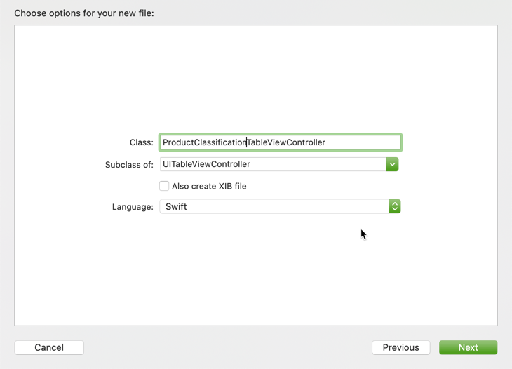

2. Open the `Main.storyboard` and use the **Object Library** to create a **Table View Controller** right above the Overview View Controller.

    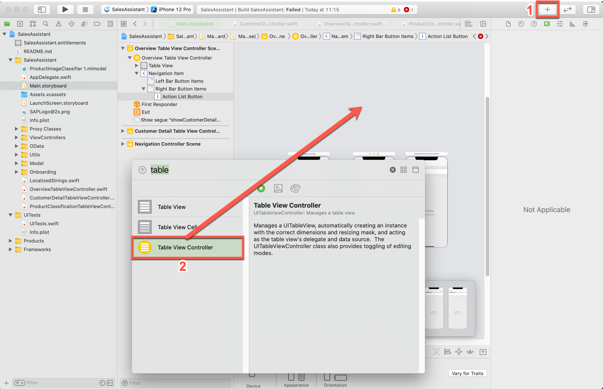

3. Select the newly added Table View Controller and set it's custom class to `ProductClassificationTableViewController` in the **Identity Inspector**.

    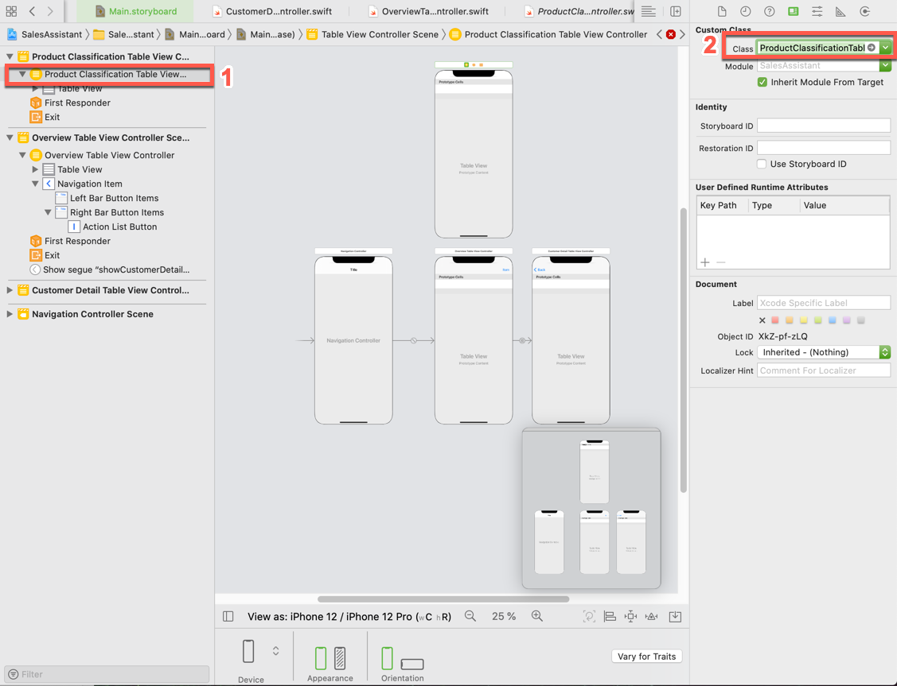

4. The Table View Controller has to have a Navigation Bar so let's embed the `ProductClassificationTableViewController` in a **Navigation Controller** by selecting the `ProductClassificationTableViewController` and then click on `Editor -> Embed In -> Navigation Controller`.

    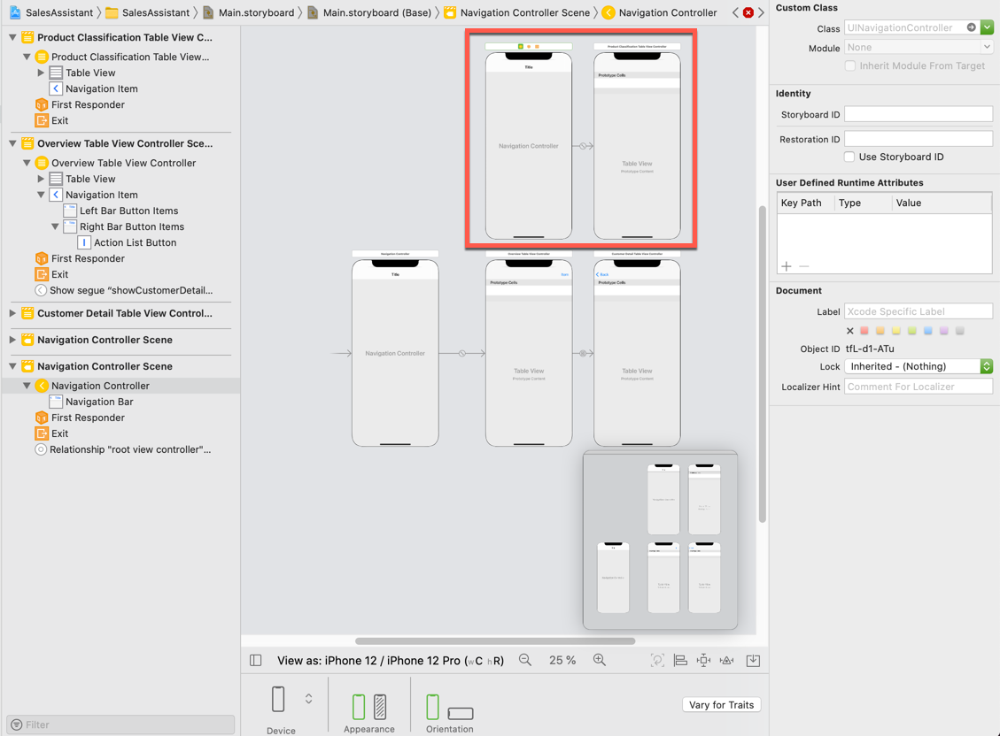

5. Last step is to create the segue from the Bar Button Item inside the Overview View Controller to the Product Classification Table View Controller.

    Select the `OverviewViewController` and **control + drag** to the Product Classification Table View Controller, choose **Present Modally** as you want to display this Table View Controller in a modal fashion.

    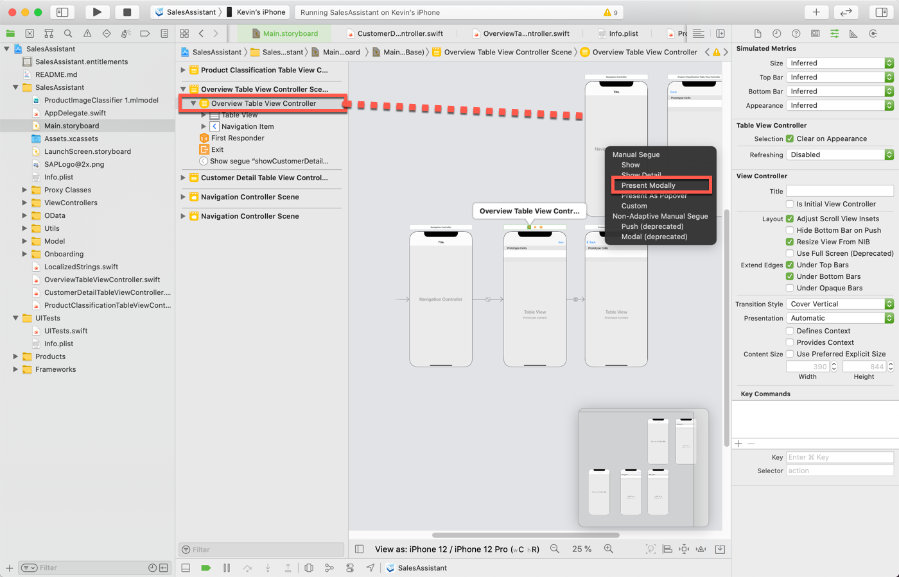

    Select the created segue and set the identifier to `showProductClassification` in the **Attributes Inspector**.

    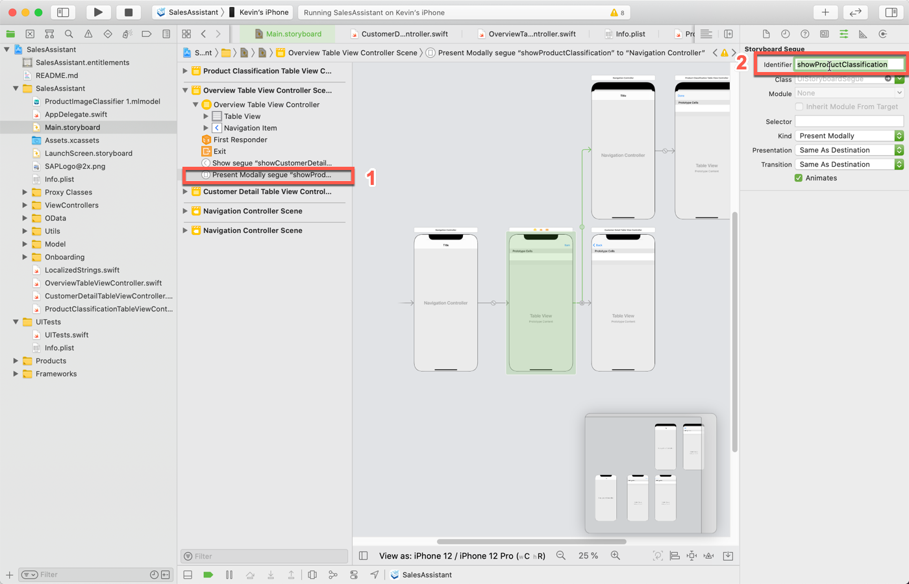

6. Create a constant in the `OverviewViewController.swift` class holding that identifier.

    Close the `Main.storyboard` and open the `OverviewViewController.swift` class, add the following line of code directly below the `private let showCustomerDetailSegue = "showCustomerDetails"` line:

    ```Swift

    private let showProductClassificationSegue = "showProductClassification"

    ```

7. You have to make sure that the selected image later on get's passed on to the `ProductClassificationTableViewController` for the classification process.

    Locate the `prepare(for:sender:)` method and add a new if statement to it:

    ```Swift[28-32]

    override func prepare(for segue: UIStoryboardSegue, sender: Any?) {
        // Implement a switch over the segue identifiers to distinct which segue get's called.
        if segue.identifier == showCustomerDetailSegue {

            // Show the selected Customer on the Detail view
            guard let indexPath = self.tableView.indexPathForSelectedRow else {
                return
            }

            // Retrieve the selected customer
            let selectedEntity = self.customers[indexPath.row]

            // Get an instance of the CustomerDetailTableViewController with asking the segue for it's destination.
            let detailViewController = segue.destination as! CustomerDetailTableViewController

            // Check if the customer ID is set, if not handle the errors and notify the user.
            guard let customerID = selectedEntity.customerID else {
                AlertHelper.displayAlert(with: "We're having issues displaying the details for the customer with name \(selectedEntity.lastName ?? "")", error: nil, viewController: self)
                self.logger.error("Unexpectedly customerID is nil! Can't pass customerID into CustomerDetailViewController.")
                return
            }

            // Set the customer ID at the CustomerDetailTableViewController.
            detailViewController.customerId = customerID

            // Set the title of the navigation item on the CustomerDetailTableViewController
            detailViewController.navigationItem.title = "\(self.customers[indexPath.row].firstName ?? ""), \(self.customers[indexPath.row].lastName ?? "")"
        } else if segue.identifier == showProductClassificationSegue {
            let navController = segue.destination as! UINavigationController
            let productPredictionVC = navController.children.first! as! ProductClassificationTableViewController
            productPredictionVC.image = pickedImage
        }
    }

    ```

8. Remember that you want to pass on the selected image to the `ProductClassificationTableViewController`. You have to implement that property to the `ProductClassificationTableViewController` class first to make the compiler happy.

    Open the `ProductClassificationTableViewController` class and add the following line of code right above the `viewDidLoad(_:)` method:

    ```Swift

    var image: UIImage!

    ```

[DONE]
[ACCORDION-END]

[ACCORDION-BEGIN [Step 4: ](Implement action for Bar Button Item)]

When the user taps on the Bar Button Item it should show an Action Sheet or a Popover when running on Regular mode on the iPad. For that you will implement that code in the `didPressActionListButton(_:)` method. Before doing that you will add one more line of code to the `viewDidLoad(_:)` to make sure the Bar Button Item shows an Icon instead of just the word **Item**.

1. Open the `OverviewViewController.swift` class and add the following line of code to the `viewDidLoad(_:)`:

    ```Swift[16]

    override func viewDidLoad() {
        super.viewDidLoad()

        self.view.backgroundColor = .preferredFioriColor(forStyle: .backgroundBase)

        // Define the estimated row height for each row as well as setting the actual row height to define it's dimension itself.
        // This will cause the Table View to display a cell for at least 80 points.
        tableView.estimatedRowHeight = 80
        tableView.rowHeight = UITableView.automaticDimension

        // Register an FUIObjectTableViewCell and a FUITableViewHeaderFooterView. You can use the convenience reuse identifier defined in the cell classes to later dequeue the cells.
        tableView.register(FUIObjectTableViewCell.self, forCellReuseIdentifier: FUIObjectTableViewCell.reuseIdentifier)
        tableView.register(FUITableViewHeaderFooterView.self, forHeaderFooterViewReuseIdentifier: FUITableViewHeaderFooterView.reuseIdentifier)

        // Using the FUI Icon Library
        actionListButton.image = FUIIconLibrary.system.more

        setupImagePicker()
        loadInitialData()
    }

    ```

2. Add the following lines of code to the `didPressActionListButton(_:)` method, read the inline comments carefully:

    ```Swift

    // You will use an Action Sheet and Pop-Over on regular mode on iPad
    // Create an UIAlertController with the preferred style actionSheet
    let alertController = UIAlertController(title: nil, message: nil, preferredStyle: .actionSheet)

    // Define the image sources as a tuple having a description and the actual source type
    let imageSources = [
        ("Using Camera", UIImagePickerController.SourceType.camera),
        ("Based on Photo", UIImagePickerController.SourceType.photoLibrary)
    ]

    // Iterate over the tuple and create an UIAlertAction accordingly. Add those actions to the alertController
    for (sourceName, sourceType) in imageSources where UIImagePickerController.isSourceTypeAvailable(sourceType) {
        alertController.addAction(UIAlertAction(title: "Find Product \(sourceName)", style: .default) { _ in
            self.pickerController.sourceType = sourceType
            self.present(self.pickerController, animated: true)
        })
    }

    // Add a cancel action as well for the user to cancel the alertController
    alertController.addAction(UIAlertAction(title: "Cancel", style: .cancel))

    // If in a regular layout on iPad, show as a popover
    if let popoverController = alertController.popoverPresentationController {
        popoverController.barButtonItem = sender
    }

    // Present the alertController
    self.present(alertController, animated: true)

    ```

    All the needed code is now implemented for the user to choose a picture from the Photo Library or if running on an actual device take a picture with the device's camera.

[DONE]
[ACCORDION-END]

[ACCORDION-BEGIN [Step 5: ](Add permissions to Info.plist file)]

Because iOS is a privacy focused operation system, you have to ask the user for permission to access both camera and photo library within your app. Those permissions are maintained in the Info.plist file.

Open the Info.plist and add the following two information properties to it by clicking on the small **+** icon.

| Property | Value |
|----|----|
| Privacy - Photo Library Usage Description | Please permit using Photo Library |
| Privacy - Camera Usage Description | Please permit using Camera |

That's it, the first time your app will try to access the Camera or Photo Library, the user will get asked for permission to perform this action.

[DONE]
[ACCORDION-END]

[ACCORDION-BEGIN [Step 6: ](Add back navigation)]

Right now the user has no possibility to navigate back from the Product Classification Table View Controller.

1. Open the `Main.storyboard` and add a Bar Button Item to the left-side of the Navigation Item of the `ProductClassificationTableViewController`.

    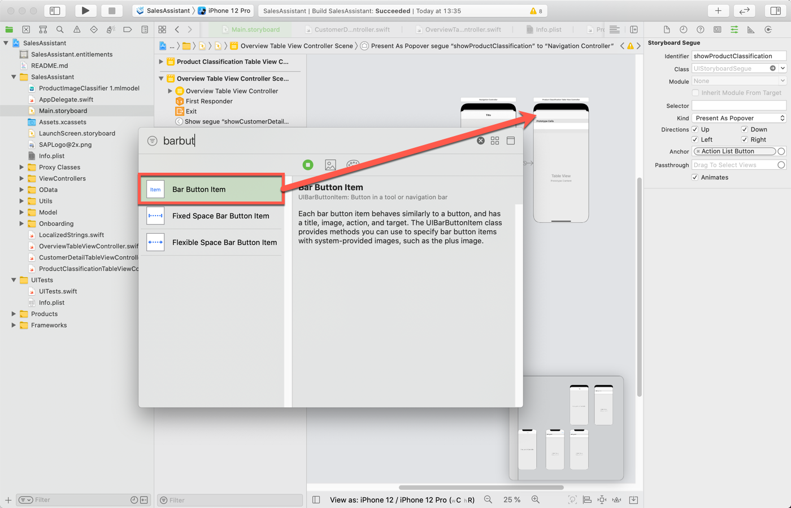

    In the **Attributes Inspector** for the Bar Button Item, select the **System Item** to be **Done**.

    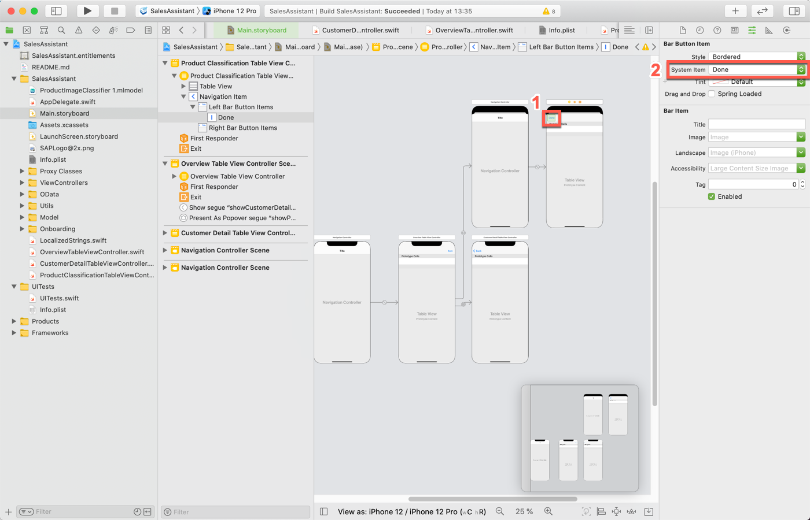

2. Again you will need an `IBAction` for that Bar Button Item, open the **Assistant Editor** and **control + drag** from the Bar Button Item to the Product Classification Table View Controller class, select **Action** as type and `doneButtonTapped` as **Name** and click **Create**.

3. Close the **Assistant Editor** and open the `ProductClassificationTableViewController.swift` class. Locate the `doneButtonTapped(_:)` method and add the following line of code, responsible for dismissing this modally presented Table View Controller:

    ```Swift

    @IBAction func doneButtonTapped(_ sender: UIBarButtonItem) {
          self.dismiss(animated: true)
      }

    ```

[DONE]
[ACCORDION-END]

[ACCORDION-BEGIN [Step 7: ](Run app to see results of your work)]

You have implemented all necessary steps to choose or take a picture using an Action Sheet or Popover, make the needed navigations and passing on the selected image. Now it is time to test if your code works.

Run the app and click on the Bar Button Item in the Overview View Controller.

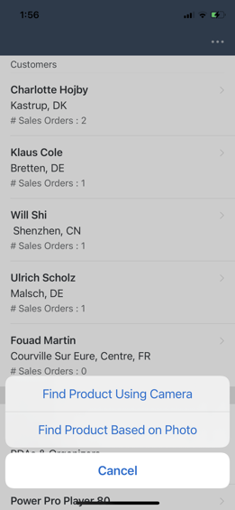

[VALIDATE_7]
[ACCORDION-END]
