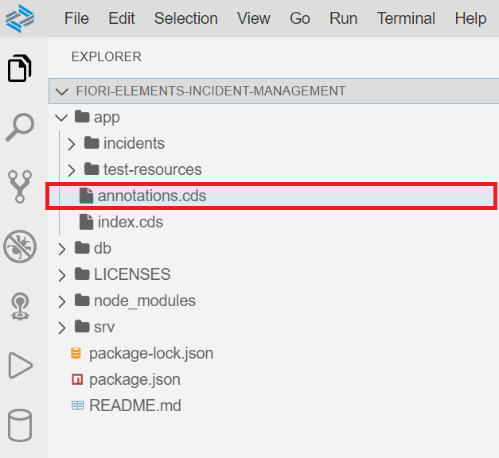

## Prerequisites
- You have prepared your development environment by completing the tutorial [Prepare your Development Environment](fiori-tools-cap-prepare-dev-env)
- You have generated the Incident Management application from the previous tutorial [Create an SAP Fiori elements application](fiori-tools-cap-create-application)

## Details
### You will learn
  - How to add additional filter fields in the filter bar
  - How to add an additional column in the list report table


In SAP Fiori elements applications, UI annotations are used to refine the user interface. All annotations are documented in the [OData 4.0 Vocabularies - SAP UI Wiki page](https://wiki.scn.sap.com/wiki/display/EmTech/OData+4.0+Vocabularies+-+SAP+UI).


[ACCORDION-BEGIN [Step 1: ](Add filter field Category to the filter bar)]

Open the `annotations.cds` file located in the `app` folder of your service.

!

>There´s a second `annotations.cds` file below folder `app/incidents`. This file was created during the generation of the application and is not meant to be modified within this tutorial.

The annotation `SelectionFields` defines the filter fields offered in the filter bar.

Search for the `SelectionFields` annotation and add an additional field `category_code` to the existing list of fields, as shown in the coding example below. When editing the file, code completion helps to select the field.


```CDS
SelectionFields : [
    incidentStatus_code,
    priority_code,
    //insert your selection fields enhancement here
    category_code
],
```

After saving the file, the server will be restarted and when refreshing the application, the new field is added to the filter bar.

!

[VALIDATE_1]
[ACCORDION-END]

[ACCORDION-BEGIN [Step 2: ](Add column Title to the list report table)]

To add an additional column to the list report table, you will use the annotation `LineItem`. Again, ensure that the `annotations.cds` file of the service is opened (see step 1).

Now search for the annotation `LineItem` of the `Incidents` entity and add the new column representing the field `title` as shown in the coding below.

```CDS
LineItem : [
    {
        $Type : 'UI.DataField',
        Value : identifier,
    },
    {
        $Type                     : 'UI.DataField',
        Value                     : priority_code,
        Criticality               : priority.criticality,
        CriticalityRepresentation : #WithoutIcon,

    },
    {
        $Type : 'UI.DataField',
        Value : incidentStatus_code
    },
    {
        $Type : 'UI.DataField',
        Value : category_code
    },
    //insert your line item enhancement here
    {
        $Type : 'UI.DataField',
        Value : title
    }
],
```

After saving and refreshing the application, you will see the column added to the table.

!

At this point, you have added a new field to the filter bar and one more column within the list report table.

In the next tutorial, you will refine the object page by adding new fields and extend it with a new section leveraging the Flexible Programming Model.


[DONE]

[ACCORDION-END]


[ACCORDION-BEGIN [Step 1: ](Test yourself)]

[VALIDATE_2]
[ACCORDION-END]
