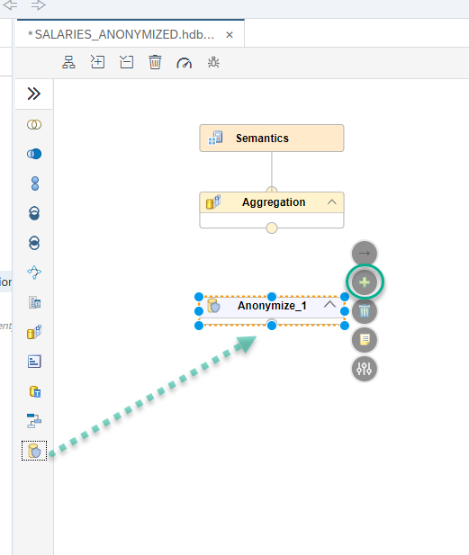
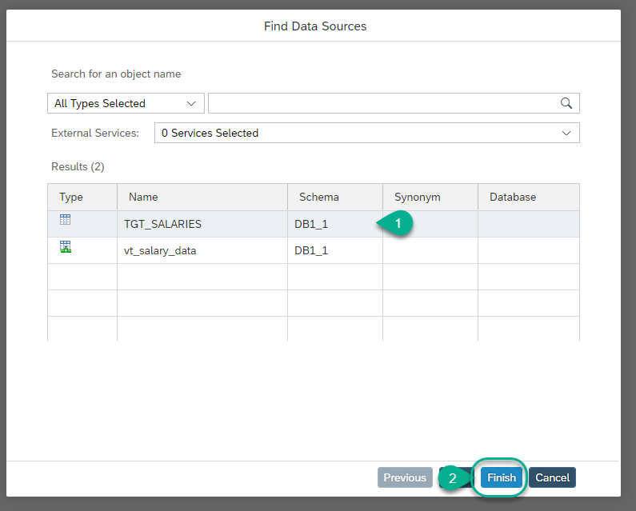
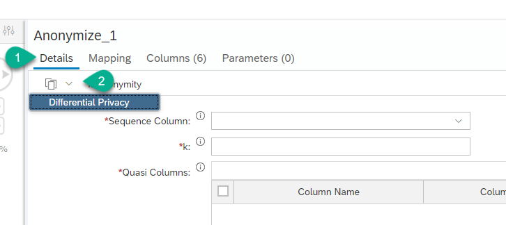
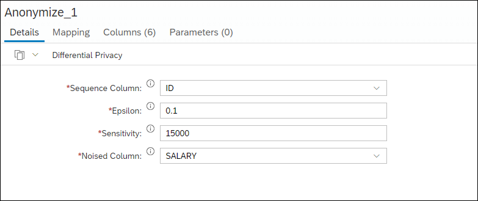
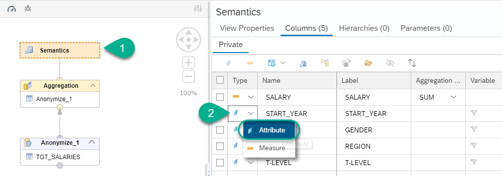
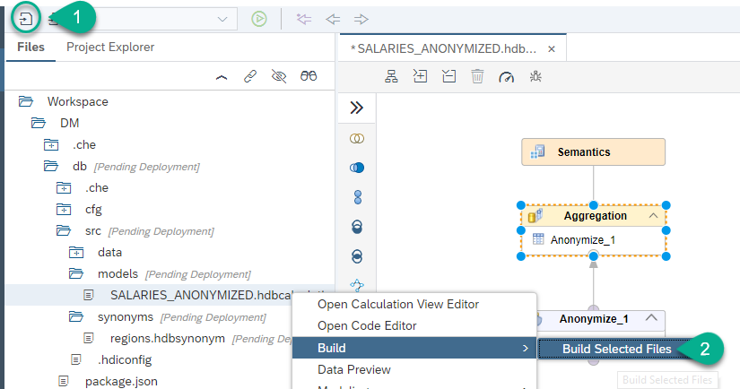
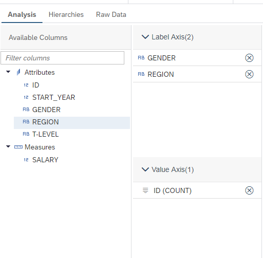

## Prerequisites
 - This tutorial is designed for HANA As A Service. Consider newer tutorials designed for HANA Cloud.
 - You have completed the previous tutorials to load data into the table `TGT_SALARIES`

>**This tutorial cannot be completed with a trial account.**

## Details
### You will learn
  - How to create Calculation View of type Cube using SAP Web IDE
  - How to configure differential privacy to add noise to a column

---

[ACCORDION-BEGIN [Step 1: ](Create a new Calculation view)]

Create a new folder called **models** under `db/src`. Create a new **Calculation View** and call it `SALARIES_ANONYMIZED`

Click on the `anonymization` node and then click on the white canvas to drop it.

Use the  on the node to add a table as a data source. Choose `TGT_SALARIES`

[DONE]
[ACCORDION-END]

[ACCORDION-BEGIN [Step 2: ](Configure differential privacy)]

Double click on the `Anonymize_1` node. This will open the mapping. Double click on `TGT_SALARIES` to add all of the columns to the output

Click **Details** and switch `k-anonymity` to **Differential Privacy**

Configure the following parameters for anonymity

  - Sequence Column: ID
  - Epsilon: 0.1
  - Sensitivity: 15000
  - Noised Column: SALARY

For example:

> For more information about these parameters check the [SAP HANA Security Guide](https://help.sap.com/viewer/b3ee5778bc2e4a089d3299b82ec762a7/2.0.04/en-US/ace3f36bad754cc9bbfe2bf473fccf2f.html)

[DONE]
[ACCORDION-END]

[ACCORDION-BEGIN [Step 3: ](Configure semantics)]

Connect the `Anonymize_1` node to the **Aggregation** node.

Double-click on the name of the node to move all the fields into the output columns.

Go into the **Semantics** node and switch `START_YEAR` to attribute

[DONE]
[ACCORDION-END]

[ACCORDION-BEGIN [Step 4: ](Data preview)]

**Save** and **Build** the calculation view

Right-click on it and choose **Data Preview**

Click **Raw Data** and you will see the anonymized data:

> See the negative salaries? The added noise guarantees privacy while keeping sum and average results similar to the original dataset.

Use the **Analysis** tab and drag the `GENDER` and `REGION` fields to the label axis and `ID` to the Value axis.
Change the aggregation for `SALARY` to `COUNT` to answer the question below.

[VALIDATE_1]

[ACCORDION-END]

[ACCORDION-BEGIN [Step 5: ](Configure the HANA Analytics Adapter)]

If you have a tenant in SAP Analytics Cloud or a reporting tool such as Analysis for Office, you can configure the SAP HANA Analytics Adapter. The adapter is a Java application that exposes Calculation Views for consumption through Information Access (or `InA`).

Follow the steps in the following blog post if you want to set up the HANA Analytics Adapter: <https://blogs.sap.com/2019/04/24/connecting-the-sap-hana-service-on-cloud-foundry-to-sap-analytics-cloud-the-lazy-approach-pt1/>

[DONE]
[ACCORDION-END]

---
