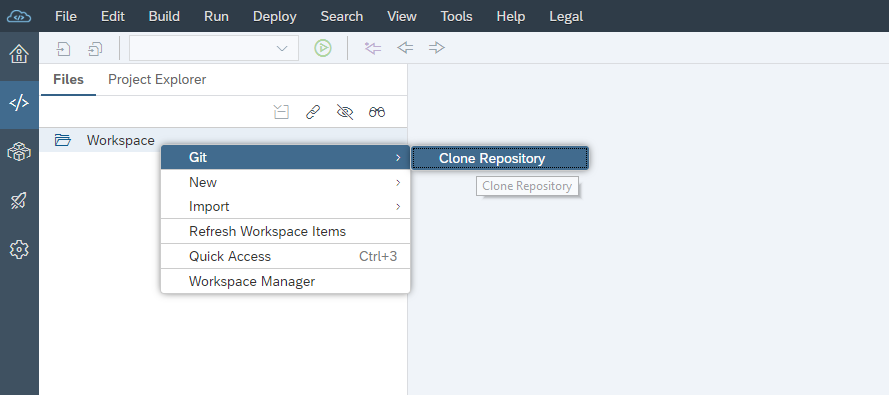
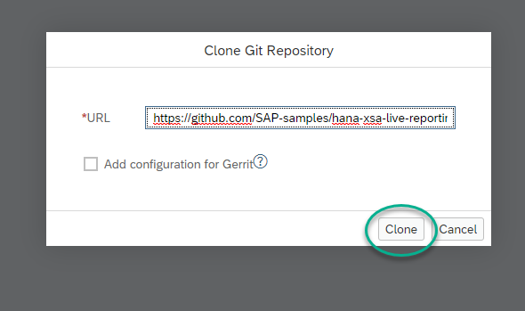
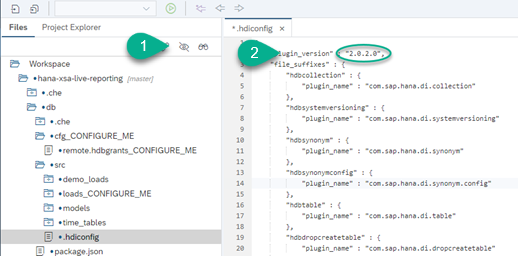
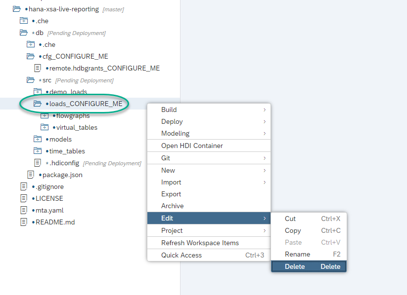
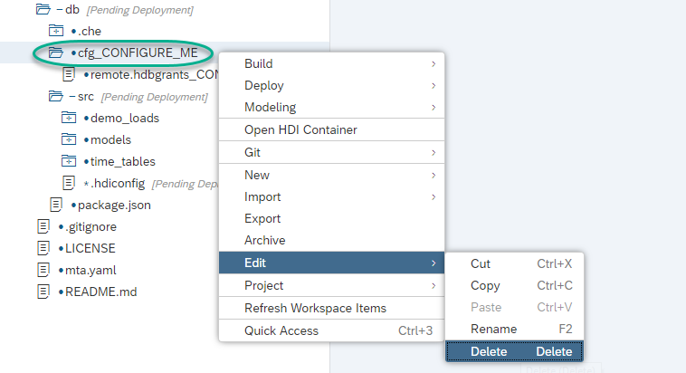
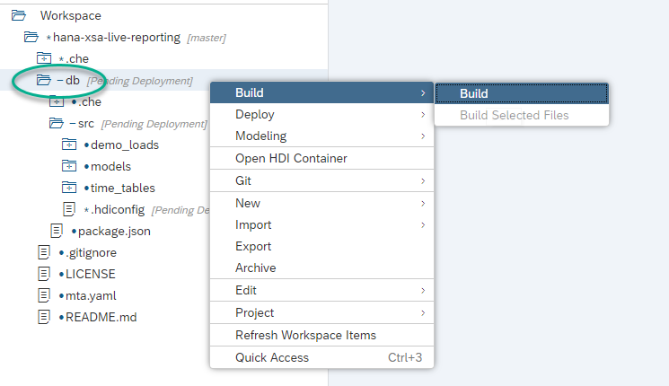
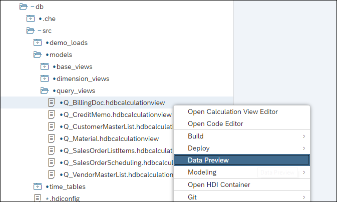

## Prerequisites
 - You have a productive instance of the [SAP Cloud Platform, SAP HANA Service on Cloud Foundry](https://developers.sap.com/group.hana-service-setup.html) **or** have signed up for a [trial account in SAP Cloud Platform](https://developers.sap.com/tutorials/hcp-create-trial-account.html) **or** an on-premise instance of SAP HANA with XS Advanced (e.g., [SAP HANA, express edition](https://developers.sap.com/topics/sap-hana-express.html))
 - You will need administration access to a tenant SAP Analytics Cloud to import the pre-built models

## Details
### You will learn
  - How to import and deploy the template calculation views into SAP HANA using SAP Web IDE
  - How to remove the pre-built artifacts for Smart Data Integration to explore the templates using the test data

**If you would like to deploy the SAP HANA Operational Reporting Templates for SAP ECC including the artifacts to integrate with an SAP ECC system, refer to the [instructions in the repository](https://github.com/SAP-samples/hana-xsa-live-reporting/blob/master/README.md)**

---

[ACCORDION-BEGIN [Step 1: ](Clone repository)]

Right-click on the workspace in SAP Web IDE and choose `Git -> Clone Repository`



Enter the following repository:

```text
https://github.com/SAP-samples/hana-xsa-live-reporting
```




> If you are using the trial in SAP Cloud Platform and get the error `No hdi-shared plan available found in this space`, switch to the `EU10` region. Check this [blog post](https://blogs.sap.com/2019/04/16/how-to-change-the-region-in-your-cloud-foundry-trial/) for instructions on changing the region.
> Right-click on the repository and choose `Project -> Project Settings` to change the space where it is deployed
> 

</br>

> If you get an error, stating version `2.0.2.0 (installed) is incompatible with 2.0.40.0` in the trial account in SAP Cloud Platform, change the plugin version in the hidden file `.hdiconfig`
> 

[DONE]
[ACCORDION-END]

[ACCORDION-BEGIN [Step 2: ](Remove data replication artifacts)]

This repository includes virtual tables and `flowgraphs` to replicate data from an SAP ECC system. You will use the sample data instead.

> If you want to deploy the replication artifacts, you will need to configure cross-container access. Follow the instructions in [the README file in the repository](https://github.com/SAP-samples/hana-xsa-live-reporting/blob/master/README.md)

Remove the artifacts related to replication. Right-click on `db/src/loads_CONFIGURE_ME` and delete it.

> 

Remove the folder `db/cfg_CONFIGURE_ME`

> 

[DONE]
[ACCORDION-END]


[ACCORDION-BEGIN [Step 3: ](Build and preview the calculation views)]

Right-click on the `db` folder and choose **Build**.

> 

The build log should show a successful deployment. You can scroll up to check for any errors.

> 

After successful deployment, you can preview the data in each of the models. For example:

> 

[DONE]
[ACCORDION-END]

[ACCORDION-BEGIN [Step 4: ](Install Information Access)]

If you are using a productive instance of the SAP HANA Service, you can use the Information Access (`InA`) protocol to connect with SAP Analytics Cloud or other reporting tools using the HTTP protocol for live connections.

Use these [instructions to deploy the XS Advanced HANA Analytics Adapter](https://blogs.sap.com/2019/04/24/connecting-the-sap-hana-service-on-cloud-foundry-to-sap-analytics-cloud-the-lazy-approach-pt1/) into the Cloud Foundry stack in SAP Cloud Platform.

**When configuring the connection from SAP Analytics Cloud, call it `HANALIVE`**.

> Note: For on-premise SAP HANA systems or SAP HANA, express edition, follow the instructions in this [series of blog posts](https://blogs.sap.com/2018/12/24/from-zero-to-analytics-pt1-setting-up-your-own-sap-hana-instance/) instead.

Once connected you can continue by creating reports in SAC to consume the Calculation Views deployed in earlier steps.

[DONE]
[ACCORDION-END]

---
