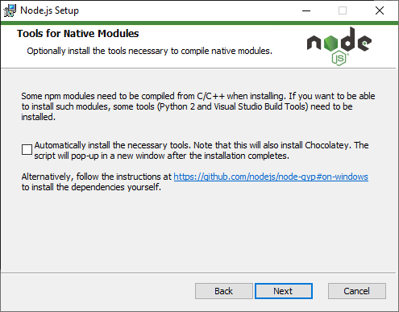
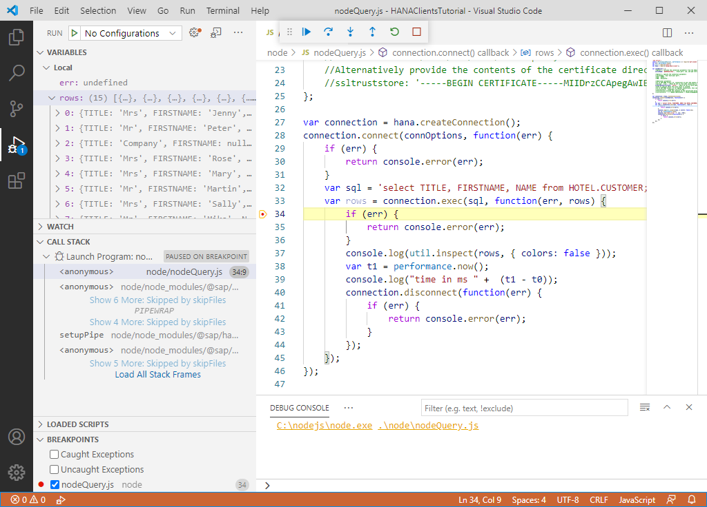

## Prerequisites
 - You have completed the first 3 tutorials in this mission.

## Details
### You will learn
  - How to install Node.js and the SAP HANA client Node.js driver
  - How to create a Node.js application that queries a SAP HANA database

Node.js provides a JavaScript engine outside of the browser and uses an asynchronous event driven programming model.  For more details, see [Introduction to Node.js](https://nodejs.dev/).  

---

[ACCORDION-BEGIN [Step 1: ](Install Node.js)]

The first step is to check if you have Node.js installed and what version it is.  Enter the following command:

```Shell
node -v  
```  

If Node.js is installed, it will return the currently installed version, such as v12.16.1.  

If node is not installed, download the long-term support (LTS) version of Node.js from [Node.js Download](https://nodejs.org/en/download/).

During the installation, there is no need to check the following box as you do not need to install Chocolatey.  



>The SAP HANA client provides a 32-bt and a 64-bit install, as does Node.js.  It is important that both versions are the same (i.e., 64-bit)

[DONE]
[ACCORDION-END]

[ACCORDION-BEGIN [Step 2: ](Install SAP HANA client for Node.js from NPM)]

Node.js packages are available using [NPM](https://www.npmjs.com/), which is the standard package manager for Node.js.  

1. Enter `@sap/hana-client`, and click **Search**.

      

      

2. Create a folder named `node` and enter the newly created directory.

    ```Shell for Windows
    mkdir %HOMEPATH%\HANAClientsTutorial\node
    cd %HOMEPATH%\HANAClientsTutorial\node
    ```

    ```Terminal for Linux or Mac
    mkdir $HOME/HANAClientsTutorial/node
    cd $HOME/HANAClientsTutorial/node
    ```

3. Install the `hana-client` driver from NPM.

    ```Shell
    npm install @sap/hana-client
    ```

    >The hana-client driver is also available from the HANA clients install folder.

    >```Shell
    >npm install C:\SAP\hdbclient\node
    ```

The following command will list the Node.js modules that are now installed locally into the `HANAClientsTutorial\node` folder.  Note that the extraneous message can be ignored.  

```Command Prompt
npm list
```

> ### Some Tips

>At this point, a project has been created and the SAP HANA client module has been installed.  The following is some extra optional information on npm.  

> ---

>Node.js modules can also be installed globally. To see the list of node modules installed globally enter the following command.  

>The depth parameter can be used to specify the number of levels to show when displaying module dependencies.  By setting depth=x, a tree-structure is outputted that shows modules that are x levels below the top-level module.

>```Shell
>npm list -g
>npm list -g --depth=0
>```  

>To enable debug logging of the HANA Node.js client, enter the following command:

>```Shell for Windows
>SET DEBUG=*
>```  

>```Terminal for Linux or Mac
DEBUG=*
>```    

>Command line help for NPM is available.  A few examples of this are shown below.

>```Shell
>npm help
>npm help list
>```  

>Additional information can be found out for a module, such as the debug module, via the info command.

>```Shell
>npm info @sap/hana-client
>```  

>The following commands can be used to view the latest available version of a package, remove a package, add a specific version of a package and then update it to the latest version.

>```Shell
>npm view @sap/hana-client version
>npm uninstall @sap/hana-client
>npm install @sap/hana-client@2.4.167
>npm list @sap/hana-client
>npm update @sap/hana-client
>npm list @sap/hana-client
>```  

[DONE]
[ACCORDION-END]

[ACCORDION-BEGIN [Step 3: ](Create Node.js application that queries SAP HANA)]

1. Create a file named nodeQuery.js and open the file in notepad.

    ```Shell for Windows
    echo.> nodeQuery.js
    notepad nodeQuery.js
    ```

    Substitute `kate` below for your preferred text editor.  

    ```Terminal for Linux or Mac
    echo > nodeQuery.js
    kate nodeQuery.js
    ```

2. Add the code below to `nodeQuery.js`.

    ```JavaScript
    'use strict';
    const { PerformanceObserver, performance } = require('perf_hooks');
    var t0 = performance.now();
    var util = require('util');
    var hana = require('@sap/hana-client');

    var connOptions = {
        serverNode: 'your host:your port',
        UID: 'USER1',
        PWD: 'Password1',
        encrypt: 'true',  //Must be set to true when connecting to SAP HANA Cloud
        sslValidateCertificate: 'false',  //Must be set to false when connecting to a HANA, express instance that uses a self signed certificate.
    };

    var connection = hana.createConnection();
    connection.connect(connOptions, function(err) {
        if (err) {
            return console.error(err);
        }
        var sql = 'select TITLE, FIRSTNAME, NAME from HOTEL.CUSTOMER;';
        var rows = connection.exec(sql, function(err, rows) {
            if (err) {
                return console.error(err);
            }
            console.log(util.inspect(rows, { colors: false }));
            var t1 = performance.now();
            console.log("time in ms " +  (t1 - t0));
            connection.disconnect(function(err) {
                if (err) {
                    return console.error(err);
                }   
            });
        });
    });
    ```  

3. Update the `serverNode` values in the `connOptions` to match your SAP HANA host and port.

4. Run the app.

    ```Shell
    node nodeQuery.js
    ```


Note the above app makes use of some of the SAP HANA client Node.js driver methods, such as [connect](https://help.sap.com/viewer/f1b440ded6144a54ada97ff95dac7adf/latest/en-US/d7226e57dbd943aa9d8cd0b840da3e3e.html), [execute](https://help.sap.com/viewer/f1b440ded6144a54ada97ff95dac7adf/latest/en-US/ef5564058b1747ce99fd3d1e03266b39.html) and [disconnect](https://help.sap.com/viewer/f1b440ded6144a54ada97ff95dac7adf/latest/en-US/fdafeb1d881947bb99abd53623996b70.html).

In the above example, the asynchronous versions of these methods are used as the optional callback function is provided as opposed to the synchronous version, which does not provide a callback. For readers that are unfamiliar with synchronous and asynchronous operations, see [The Node.js Event Loop, Timers, and process.nextTick()](https://nodejs.org/de/docs/guides/event-loop-timers-and-nexttick/).

[DONE]
[ACCORDION-END]

[ACCORDION-BEGIN [Step 4: ](Debug the application)]

Visual Studio Code can be used to run and debug a Node.js.  

1. [Download Visual Studio Code.](https://code.visualstudio.com/Download)

2. In Visual Studio Code, choose **File | Add Folder to Workspace** and then add the `HANAClientsTutorial` folder.

    

3. Open the file `nodeQuery.js`.

4. Place a breakpoint at line 26. Select **Run | Start Debugging**.  

    Notice that the program stops running at the breakpoint that was set. Observe the variable values in the leftmost pane.  Step through code.

    


There are two further examples in the SAP HANA client install directory `C:\SAP\hdbclient\node\examples` that may be of interest.

Congratulations! You have created and debugged a Node.js application that connects to and queries an SAP HANA database.

[VALIDATE_1]
[ACCORDION-END]


---
