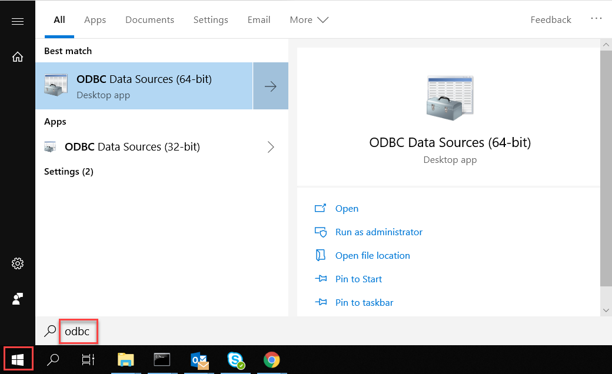
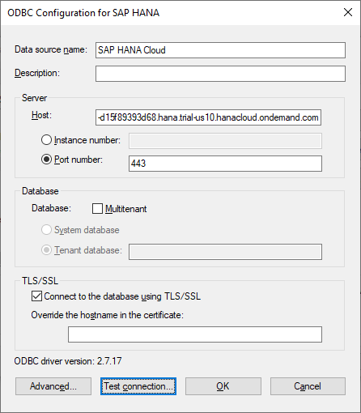
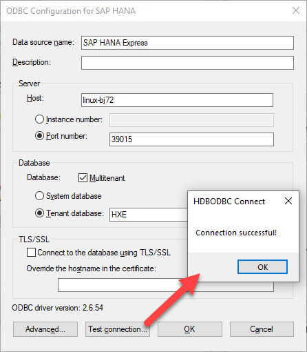
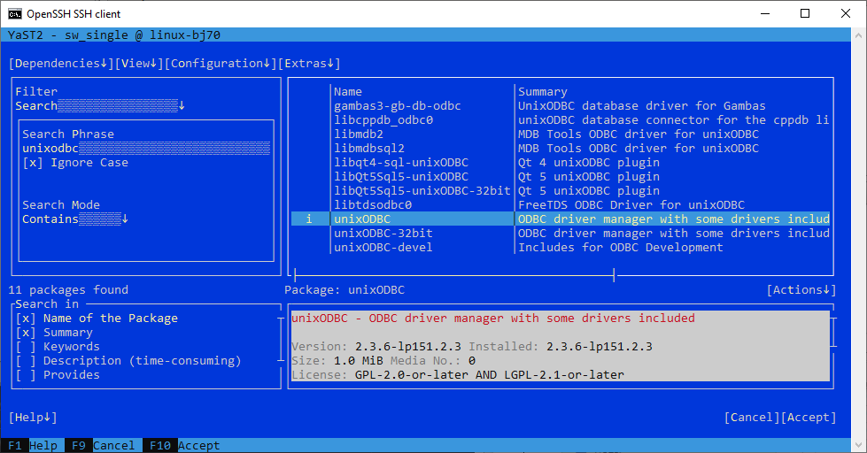
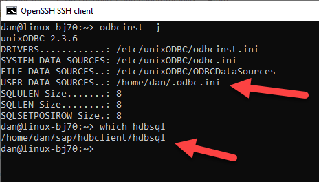
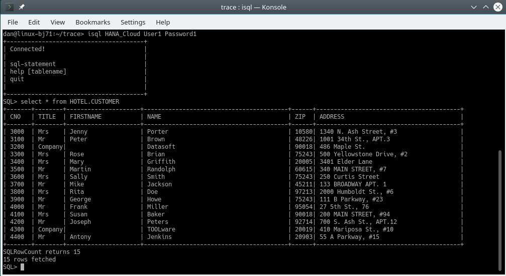
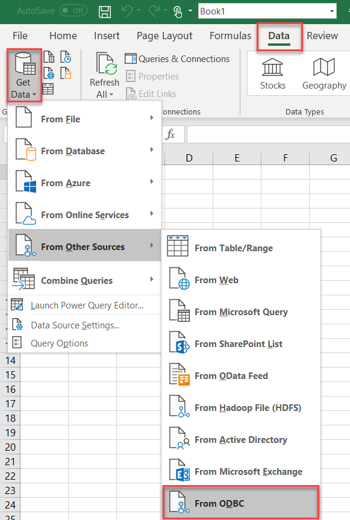
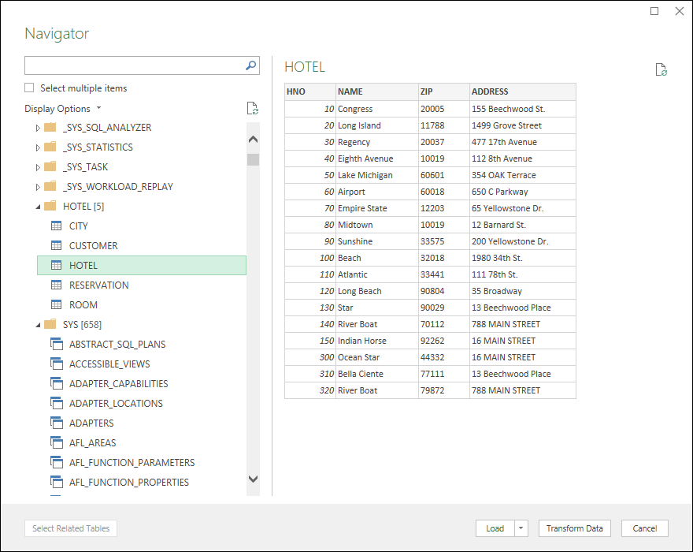
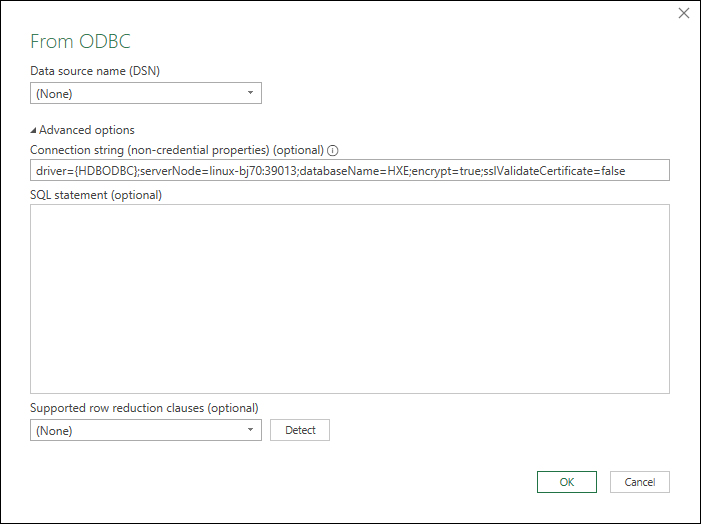

## Prerequisites
 - You have completed the first 3 tutorials in this mission.


## Details
### You will learn
  - How to create and test an SAP HANA ODBC data source
  - How to use an ODBC data source in an application

[Open Database Connectivity](https://en.wikipedia.org/wiki/Open_Database_Connectivity) (ODBC) provides an API for accessing databases.  Database vendors provide ODBC drivers for their database products.  An application written to the ODBC standard can be ported to other databases that also provide an ODBC interface.  

---

[ACCORDION-BEGIN [Step 1: ](Configure a data source using Microsoft Windows ODBC Data Source Administrator)]

The ODBC Data Source Administrator lists the ODBC drivers installed and the configured data sources.  

1. Open it by entering ODBC after clicking on the Microsoft Windows start icon.  

    >Ensure that you choose the 64-bit version assuming that you have the 64-bit version of the SAP HANA client installed.

    !

2. Click on the **Drivers** tab and view the installed drivers.  

    

    The SAP HANA ODBC driver (HDBODBC) will appear.  

3. Click the **User DSN** tab to view the data sources.  

4. Click **Add** to create a new data source to connect to a SAP HANA database.  

      

5. Select **`HDBODBC`** and click **Finish**.

    

6. Example data source configuration for SAP HANA Cloud.   

      

    To connect to SAP HANA Cloud, **Multitenant** can be unchecked and the **Validate TLS/SSL certificate** option must be checked.

7. Example data source configuration for SAP HANA, express edition.    

      

    To connect to SAP HANA, express edition, **Multitenant** should be checked and the **Validate TLS/SSL certificate** option can be unchecked.  For more information on this topic, see [How to Configure TLS/SSL in SAP HANA 2.0](https://blogs.sap.com/2018/11/13/how-to-configure-tlsssl-in-sap-hana-2.0/).  

8. Click on Test connection.  

    

    The user name `USER1` and password `Password1` can be entered when prompted for credentials.

9. Press OK, to save the data source.

[DONE]
[ACCORDION-END]


[ACCORDION-BEGIN [Step 3: ](Configure a data source on Linux or Mac with unixODBC)]
The following instructions demonstrate how [unixODBC](http://www.unixodbc.org/) can be used to configure and test a data source on Linux or Mac.  

1. On SUSE Linux, the YaST installer can be used to install unixODBC.

    

2. On a Mac, unixODBC can be installed using [Homebrew](https://brew.sh).  

    ```Shell (Mac)
    brew install unixodbc
    ```

3. The following commands can be used to confirm that unixODBC is installed, the location of the .odbc.ini file, and to confirm the location of the SAP HANA client install that contains the ODBC driver.

    ```Shell (Linux or Mac)
    odbcinst -j
    which hdbsql
    ```

    

4. Edit the `.odbc.ini` file (or create it if it does not exist) to add one or more data sources.  Note that the driver's file extension is `dylib` instead of `so` on a Mac.

    ```.odbci.ini
    [HANA_Cloud]
    servernode = 61964be8-39e8-4622-9a2b-ba3a38be2f75.hana.hanacloud.ondemand.com:443
    driver = /home/dan/sap/hdbclient/libodbcHDB.so
    encrypt = true
    sslValidateCertificate = false

    [HANA_Express]
    servernode = linux-bj70:39015
    driver = /home/dan/sap/hdbclient/libodbcHDB.so
    databasename = HXE
    ```

5.  unixODBC provides a basic SQL query tool called `isql` that can be used to validate a data source.

    ```Shell (Linux or Mac)
    isql -v HANA_Cloud User1 Password1
    ```

    


[DONE]
[ACCORDION-END]


[ACCORDION-BEGIN [Step 4: ](Use a SAP HANA data source from another program)]

An application that supports ODBC can now make use of the created data source.  One example on Windows is Microsoft Excel.  

> Note that Microsoft Excel can be 32 or 64 bit.  This can be seen under **File | Account | About Excel**.    
>
>   
>
> The SAP HANA client install can also be 32 or 64 bit.  To connect, the versions of SAP HANA client and Microsoft Excel must match.  If needed, the 32-bit installer for SAP HANA client is available from the SAP Software downloads site and can be installed into a separate directory such as `C:\SAP\hdbclient32`.  

The following steps demonstrate how to use Microsoft Excel to query data in SAP HANA using the ODBC connector.  

1. On Microsoft Windows, open Microsoft Excel.

2. In the **Data** tab, go to **Get Data | From Other Sources | From ODBC**.

      

3. Select the previously created data source that contains the connection information to an SAP HANA database.

      

4. Enter the credentials.  

    

5. Select a schema and table, then press **Load**.

      

6. The selected data is now imported into a Microsoft Excel spreadsheet.

      

7. One further option for some tools is to provide the connection details directly to an ODBC enabled application as shown below.

      

For further information on programming an application to use the ODBC client driver, see [ODBC Application Programming](https://help.sap.com/viewer/f1b440ded6144a54ada97ff95dac7adf/latest/en-US/73f03d62240f435880ade3bc1242cc05.html).

Congratulations! You have configured an ODBC data source to contain connection information for a SAP HANA database and used that data source from Microsoft Excel.

[VALIDATE_1]
[ACCORDION-END]


---
