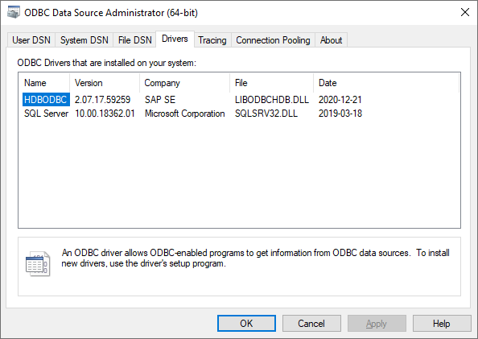
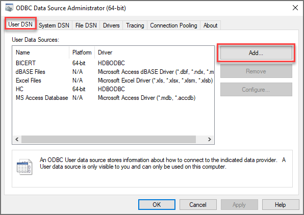
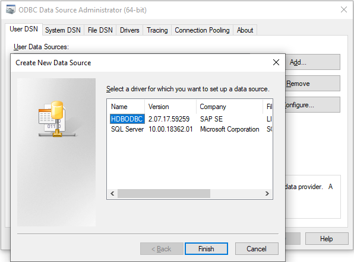
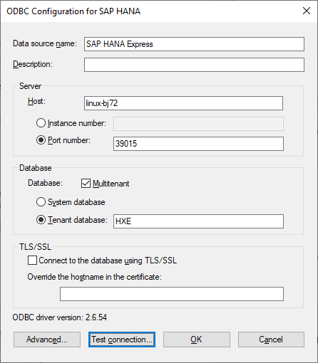
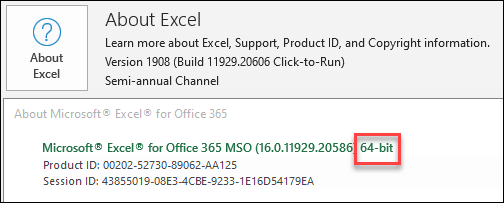
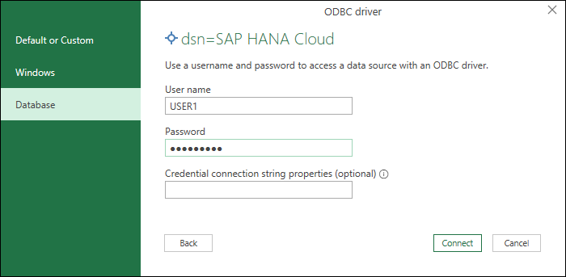
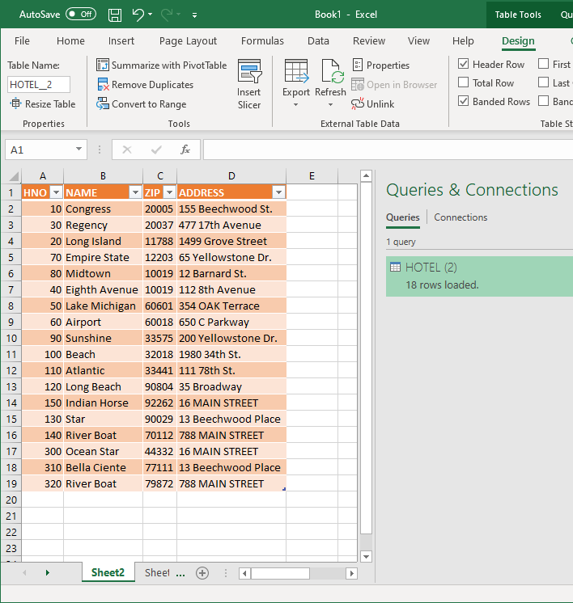

## Prerequisites
 - You have completed the first 3 tutorials in this mission.

## Details
### You will learn
  - How to create and test an SAP HANA ODBC data source
  - How to use an ODBC data source in an application

[Open Database Connectivity](https://en.wikipedia.org/wiki/Open_Database_Connectivity) (ODBC) provides an API for accessing databases.  An application written to the ODBC standard can be ported to other databases that also provide an ODBC interface.  Database vendors provide ODBC drivers for their database products.

---

[ACCORDION-BEGIN [Step 1: ](ODBC Data Source Administrator)]

The ODBC Data Source Administrator lists the ODBC drivers installed.  To open it, enter ODBC after clicking on the Windows logo.  

>Ensure that you choose the 64-bit version assuming that you have the 64-bit version of the SAP HANA clients installed.

!

Click on the **Drivers** tab and view the installed drivers.  

[DONE]
[ACCORDION-END]

[ACCORDION-BEGIN [Step 2: ](Configure an SAP HANA data source)]

1. Click the **User DSN** tab to view the data sources.  

2. Click **Add** to create a new data source to connect to a SAP HANA database.  

      

3. Select **`HDBODBC`** and click **Finish**.

    

The following are examples of data source configurations setup to connect to SAP HANA Cloud and an SAP HANA, express edition.

Notice below for the SAP HANA Cloud connection, **Multitenant** is unchecked and that both TLS options are checked.  

Notice below for the SAP HANA, express edition connection that **Multitenant** is checked and the **Validate TLS/SSL certificate** option is unchecked.  For more information on this topic, see [How to Configure TLS/SSL in SAP HANA 2.0](https://blogs.sap.com/2018/11/13/how-to-configure-tlsssl-in-sap-hana-2.0/).  

[DONE]
[ACCORDION-END]

[ACCORDION-BEGIN [Step 3: ](Use SAP HANA data source from another program)]

An application that supports ODBC could now make use of the created data source.  One example is Microsoft Excel.  

> Note that Microsoft Excel can be 32 or 64 bit.  This can be seen under **File | Account | About Excel**.    
>
>   
>
> The SAP HANA client install can also be 32 or 64 bit.  To connect, the versions of SAP HANA client and Microsoft Excel must match.  If needed, the 32-bit installer for SAP HANA client is available from the SAP Software downloads site and can be installed into a separate directory such as `C:\SAP\hdbclient32`.  

The following steps demonstrate how to use Microsoft Excel to query data in SAP HANA using the ODBC connector.  

>The SAP HANA connector under **Database** is restricted to querying calculation views.  
>
>

1. In the **Data** tab, go to **Get Data | From Other Sources | From ODBC**.

      

2. Select the previously created data source that contains the connection information to an SAP HANA database.

      

    

      

      

For further information on programming an application to use the ODBC client driver, see [ODBC Application Programming](https://help.sap.com/viewer/f1b440ded6144a54ada97ff95dac7adf/latest/en-US/73f03d62240f435880ade3bc1242cc05.html).

Congratulations! You have configured an ODBC data source to contain connection information for a SAP HANA database and used that data source from Microsoft Excel.

[VALIDATE_1]
[ACCORDION-END]

---
