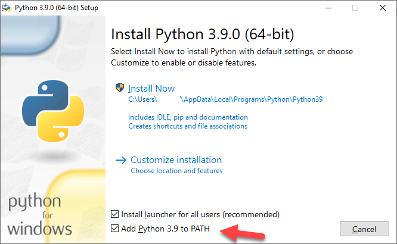
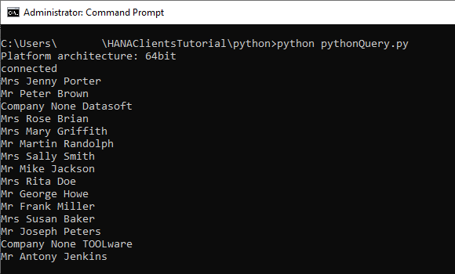
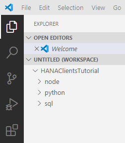
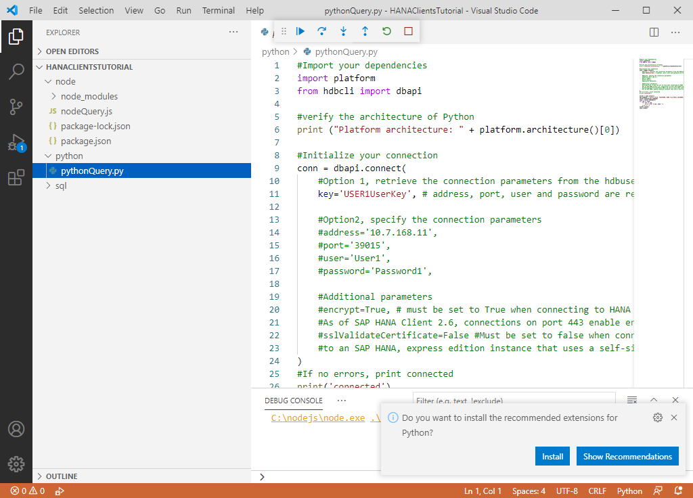
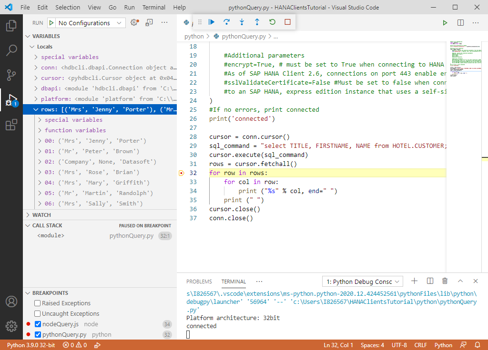

## Prerequisites
 - You have completed the first 3 tutorials in this mission.

## Details
### You will learn
- How to install Python and the SAP HANA client Python driver
- How to create and debug a Python application that queries a SAP HANA database

In the 2019 Stack Overflow's annual developer survey, Python ranked 4th in the [Most Popular Technologies](https://insights.stackoverflow.com/survey/2019#technology) section.  For further information on Python, see [Introduction to Python 3](https://realpython.com/python-introduction/).

The [SAP HANA client for Python](https://help.sap.com/viewer/f1b440ded6144a54ada97ff95dac7adf/latest/en-US/f3b8fabf34324302b123297cdbe710f0.html) supports Python 3.4+ and  Python 2.7.  For further details see SAP note [2939501 - SAP HANA Client Supported Platforms for 2.5 and later](https://launchpad.support.sap.com/#/notes/2939501).  

The following steps will create a simple Python app that can connect to and query an SAP HANA database.  

---

[ACCORDION-BEGIN [Step 1: ](Install Python)]

The first step is to check if Python is installed.

Enter the commands below.

```Shell
python --version
python3 --version
```
If Python is installed, the command will return a value such as Python 3.7.4.  Use whichever command returns a Python 3.4 or greater version number.   

If Python is not installed, it can be downloaded from [Python downloads](https://www.python.org/downloads/).

>On Microsoft Windows, be sure to download the 64-bit version of Python, since the 32-bit version is not supported by SAP's Python client.  The 64-bit version will have a file name like python-3.8.2-amd64.exe.  

Check the box that says **Add Python 3.x to PATH** as shown below to ensure that the interpreter will be placed in your path.   



You should now be able to open a new shell and verify that Python is installed.

[DONE]
[ACCORDION-END]

[ACCORDION-BEGIN [Step 2: ](Install SAP HANA client for Python using pip and PyPI)]

The standard package installer for Python is [pip](https://pypi.org/project/pip/).  The following commands will check the version of pip and attempt to upgrade it to the latest available version.  Again, use the pip or pip3 command that returns a version 3.4 or greater of Python.

```Shell
pip --version
pip3 --version
pip install --upgrade pip
```

>On Linux or Mac, if you encounter permission issues, one way to solve the issue is to use `sudo` before the command.


The repository that contains Python packages is [PyPI](https://pypi.org/) and includes a package for the SAP HANA client for Python.

  

The pip command can be used to list the currently available version of the SAP HANA database driver for Python on PyPI.  

```Shell
pip search hdbcli
```

Run the following command to download and install the SAP HANA client for Python from PyPI:

```Shell
pip install hdbcli
```

>If an error is displayed that mentions "No matching distribution found for `hdbcli`, an alternate method is to install it from the SAP HANA client install folder as shown below.
>
> ```Shell
> cd C:\SAP\hdbclient
> pip install hdbcli-2.5.86.zip
> ```

> ---

> To upgrade to the latest available version, enter the following command:
> ```Shell
> pip install --no-cache-dir --upgrade hdbcli
> ```

> ---

> To uninstall `hdbcli`, run the following command:
> ```Shell
> pip uninstall hdbcli
> ```

> ---

> A specific version can be installed using the following command.
>
> ```Shell
> pip install hdbcli==2.4.167
> ```


[DONE]
[ACCORDION-END]

[ACCORDION-BEGIN [Step 3: ](Create Python application that queries SAP HANA)]


1. In a shell, create a folder named `python`, enter the newly created directory, and open an editor on a file name `pythonQuery.py`.

    ```Shell (Microsoft Windows)
    mkdir %HOMEPATH%\HANAClientsTutorial\python
    cd %HOMEPATH%\HANAClientsTutorial\python
    notepad pythonQuery.py
    ```

    Substitute `pico` below for your preferred text editor.  

    ```Shell (Linux or Mac)
    mkdir -p $HOME/HANAClientsTutorial/python
    cd $HOME/HANAClientsTutorial/python
    pico pythonQuery.py
    ```

2. Add the code below to `pythonQuery.py`.

    ```Python
    #Import your dependencies
    import platform
    from hdbcli import dbapi

    #verify that this is a 64 bit version of Python
    print ("Platform architecture: " + platform.architecture()[0])

    #Initialize your connection
    conn = dbapi.connect(
        #address='10.7.168.11',
        #port='39015',
        #user='User1',
        #password='Password1',
        key='USER1UserKey', # address, port, user and password are retreived from the hdbuserstore
        encrypt=True, # must be set to True when connecting to HANA Cloud
        sslValidateCertificate=False # True HC, False for HANA Express.
    )
    #If no errors, print connected
    print('connected')

    cursor = conn.cursor()
    sql_command = "select TITLE, FIRSTNAME, NAME from HOTEL.CUSTOMER;"
    cursor.execute(sql_command)
    rows = cursor.fetchall()
    for row in rows:
        for col in row:
            print ("%s" % col, end=" ")
        print (" ")
    cursor.close()
    conn.close()
    ```

    Note that the address, port, UID and PWD will be retrieved from the `hdbuserstore`.   

3. Run the app.

    ```Shell
    python pythonQuery.py
    ```

    

The code in `pythonQuery.py` uses [PEP 249 -- Python Database API Specification](https://www.python.org/dev/peps/pep-0249/), which defines a set of methods that provide a consistent database interface, independent of the actual database being used.   

  - For further examples of accessing a database from Python, see [Python and SQL](https://www.python-course.eu/sql_python.php) and [Python MySQL](https://www.w3schools.com/python/python_mysql_insert.asp).  

  - For information on the SAP HANA Python client, see [Python Application Programming](https://help.sap.com/viewer/f1b440ded6144a54ada97ff95dac7adf/latest/en-US/f3b8fabf34324302b123297cdbe710f0.html).

  - For further details on secure connections from Python to SAP HANA see [Connect to SAP HANA with a Secure Connection from Python](https://developers.sap.com/tutorials/hana-python-secure-connection.html) and [Secure connection from Python to SAP HANA](https://blogs.sap.com/2020/05/07/secure-connection-from-python-to-sap-hana/).

[DONE]
[ACCORDION-END]

[ACCORDION-BEGIN [Step 4: ](Debug the application)]

Visual Studio Code provides plugins for Python and can be used to debug an application.  

1. If you have not already done so, download [Visual Studio Code](https://code.visualstudio.com/Download).

2. If you have not already done so, in Visual Studio Code, choose **File | Add Folder to Workspace**, and then add the `HANAClientsTutorial` folder.

    

3. Open the file `pythonQuery.py`.

    

    Visual Studio Code will recognize the `py` file extension and will suggest installing the Python extension.  Click **Install**.

4. Place a breakpoint.

5. Select **Run | Start Debugging**.

6. Select **Python Current File** from the debug configuration options.  

    Notice that the debug view becomes active and that the RUN option is Python: Current File.  

    Notice that the program stops running at the breakpoint that was set.

    Observe the variable values in the leftmost pane.  Step through code.

      

Congratulations! You have now created and debugged a Python application that connects to and queries an SAP HANA database.  


[VALIDATE_1]
[ACCORDION-END]


---
