## Prerequisites
 - This tutorial is designed for SAP HANA Cloud. It is not designed for SAP HANA on premise or SAP HANA, express edition
 - You have created an project according the previous tutorial -- see [SAP HANA Cloud, Create an SAP Cloud Application Programming Model project](hana-cloud-cap-create-project).

## Details
### You will learn
 - How to use SAP Cloud Application Programming Model (CAP) Core Data Services (CDS) to create simple database entities
 - How to define database-agnostic artifacts in the persistence module

The SAP Cloud Application Programming model utilizes core data services to define artifacts in the database module. Because this model is meant to be database-agnostic -- i.e., work with any database -- it does not allow you to leverage features that are specific to SAP HANA Cloud. For this reason, you will also create two tables that do not require any advanced data types.

Video version of tutorial: </br>

<iframe width="560" height="315" src="https://www.youtube.com/embed/hlHY7eBriRA" frameborder="0" allow="accelerometer; autoplay; clipboard-write; encrypted-media; gyroscope; picture-in-picture" allowfullscreen></iframe>

---

[ACCORDION-BEGIN [Step 1: ](Create database entities)]

1. In the `db` folder, right mouse click and choose **New File**

    !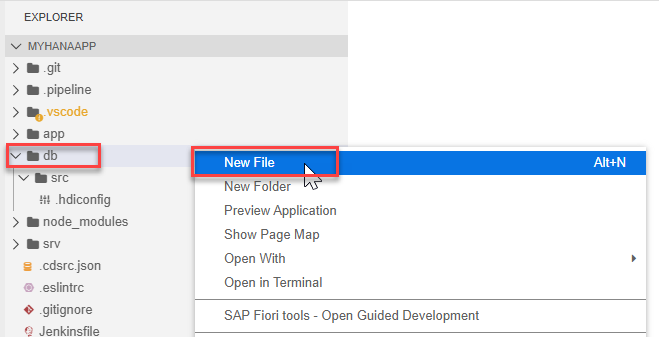

2. Use the following name:

    ```Name
    interactions.cds
    ```

    !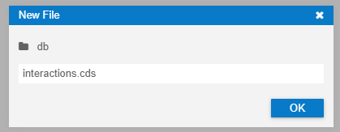

3. Use the following content in this new file:

    ```CDS
    namespace app.interactions;

    using { Country } from '@sap/cds/common';
    type BusinessKey : String(10);
    type SDate : DateTime;
    type LText : String(1024);


    entity Interactions_Header {
      key ID : Integer;
      ITEMS  : Composition of many Interactions_Items on ITEMS.INTHeader = $self;
      PARTNER  : BusinessKey;
      LOG_DATE  : SDate;
      BPCOUNTRY	: Country;

    };
    entity Interactions_Items {

    	key INTHeader : association to Interactions_Header;
    	key TEXT_ID : BusinessKey;
    		LANGU	: String(2);
    		LOGTEXT	: LText;
    };

    ```

    > ### What is going on?
    >
    > You are declaring two entities with relationships between each other. The design-time artifacts declared in this file will be converted to run-time, physical artifacts in the database. In this example, the entities will become tables.


[DONE]
[ACCORDION-END]

[ACCORDION-BEGIN [Step 2: ](Create service interface)]

1. In the `srv` folder created another file and name it `interaction_srv.cds`

    ```Name
    interaction_srv.cds
    ```

    !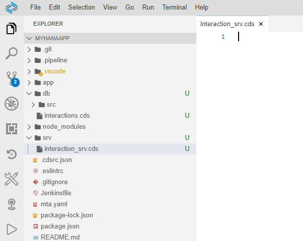

2. Use the following content in this new file:

    ```CDS

    using app.interactions from '../db/interactions';
    service CatalogService {

     entity Interactions_Header
    	as projection on interactions.Interactions_Header;

     entity Interactions_Items
    	as projection on  interactions.Interactions_Items;

    }

    ```

3. Save all.

    > ### What is going on?
    >
    > You are declaring services to expose the database entities you declared in the previous step.

4. From the terminal issue the command: `cds build`

    ```shell
    cds build
    ```

    !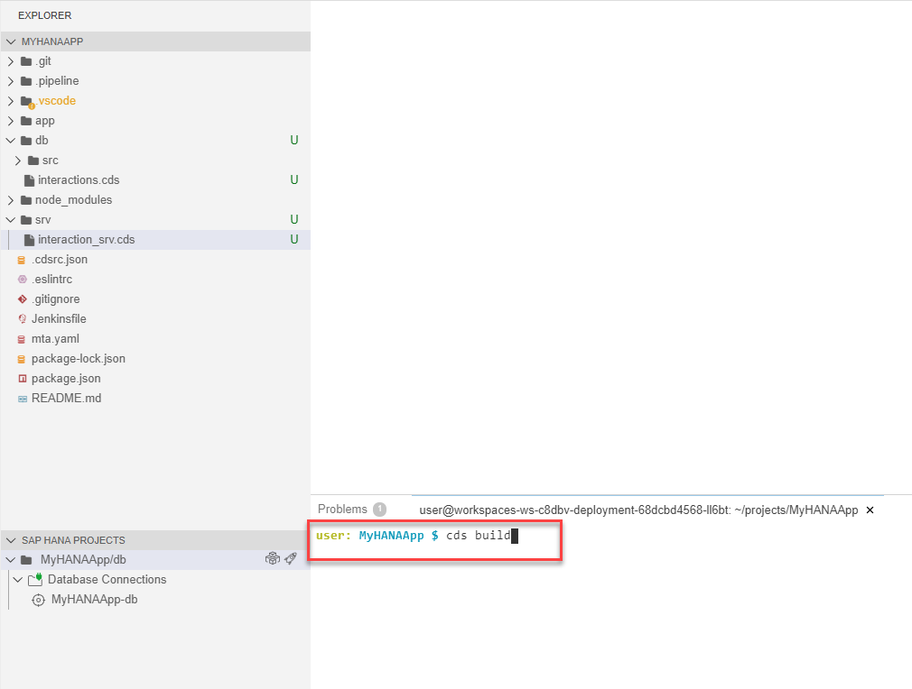

5. Look into the console to see the progress. You can scroll up and see what has been built

    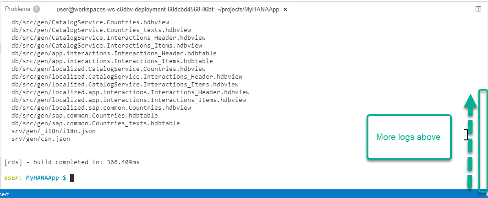

[DONE]
[ACCORDION-END]


[ACCORDION-BEGIN [Step 3: ](Explore generated design-time artifacts)]

1. If you pay attention to the build log in the console, you will see the `CDS` artifacts were converted to `hdbtable` and `hdbview` artifacts. You will find those artifacts in a new folder under `src` called `gen`.

    !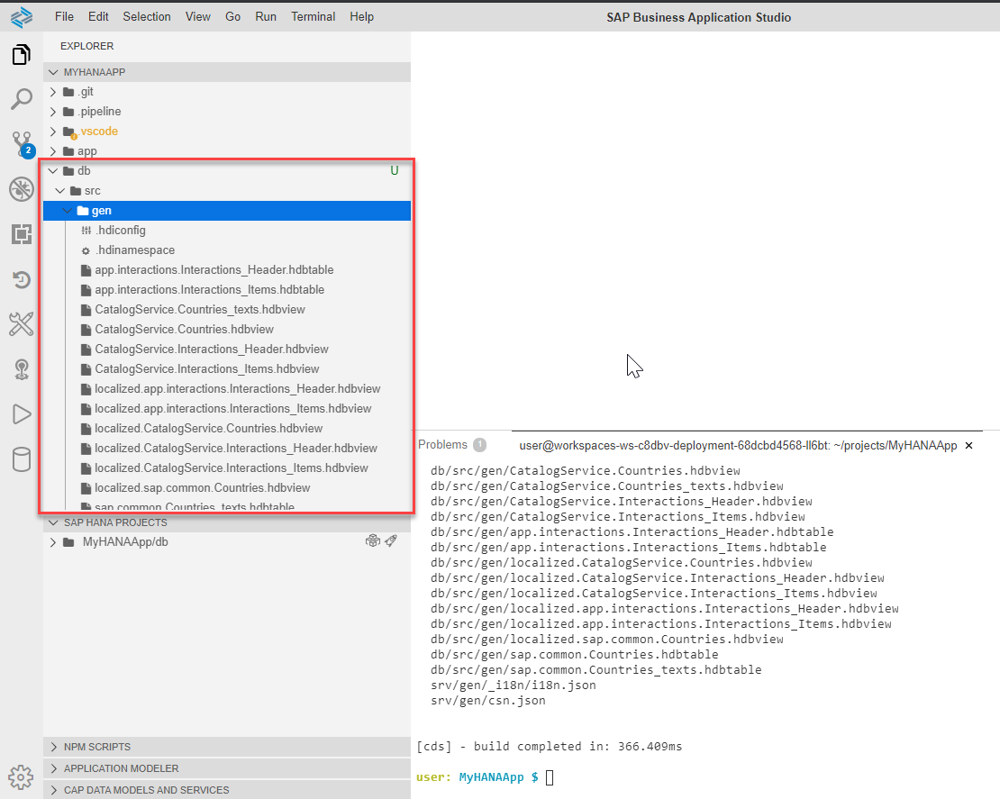

2. You will now deploy those objects into the HANA Database creating tables and views. We will use the SAP HANA Projects view to do this. Please expand this view and you will see the following:

    !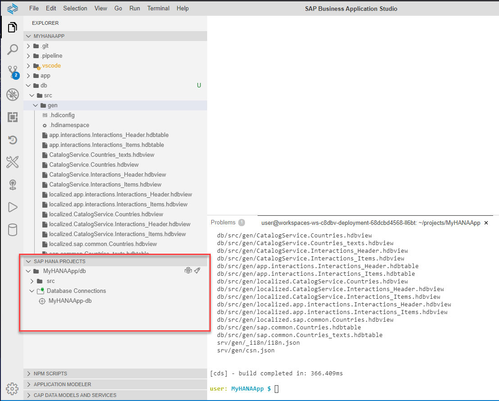

3. We need to bind our project to a Database Connection and HDI container instance. Press the **bind** icon to being the process.

    !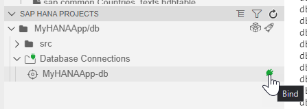

4. The bind process will start a wizard where you will be prompted for values via the command pallet at the top of the SAP Business Application Studio screen. You might be asked to confirm your Cloud Foundry endpoint and credentials depending upon how long it has been since you last login.

    !

5. You might be presented with options for existing service instances (if you've completed other tutorials or have performed other HANA development). But for this exercise we want to choose **Create a new service instance**

    !

6. Press enter to accept the generated service name

    !

7. It will take a minute or two for the service to be created in HANA. A progress bar will be shown in the message dialog

    !

8. Upon completion, the Database Connections will now show the service bound to the instance the wizard just created.

    !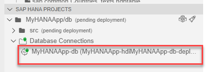

9. We are now ready to deploy the development content into the database. Press the **Deploy** button (which looks like a rocket) at the **db** folder level in the SAP HANA Projects view.

    !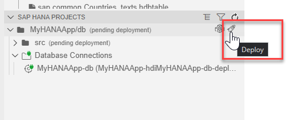

10. Scroll up to in the console to see what the build process has done.

> ### What is going on?
>
> CDS stands for Core Data Services. This is an infrastructure that allows you to create persistency and services using a declarative language. Notice how you are using the same syntax to define both the persistency and the services.
>&nbsp;
> You can find more information on CDS [in the help](https://help.sap.com/viewer/65de2977205c403bbc107264b8eccf4b/Cloud/en-US/855e00bd559742a3b8276fbed4af1008.html)
>
>You defined a CDS artifact, this is an abstraction, a design-time declaration of the entities to be represented in a database and the services to expose them.
>&nbsp;
> 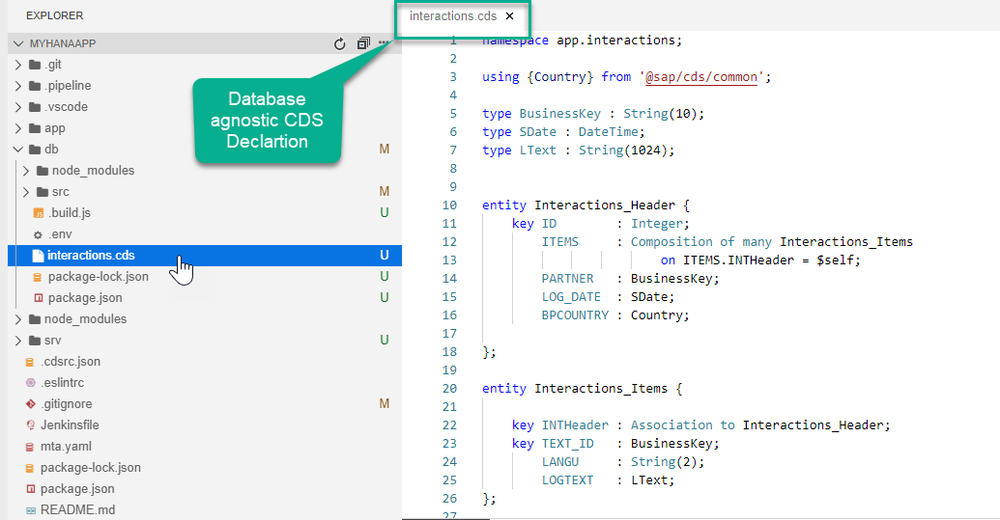
>
>The original `.cds` file was translated into `hdbtable`, which is the SQLDDL syntax specific to SAP HANA when you saved all of the files.
>&nbsp;
> 
>
>These `hdbtable` files were then translated into runtime objects such as tables in the HANA database.
>
> 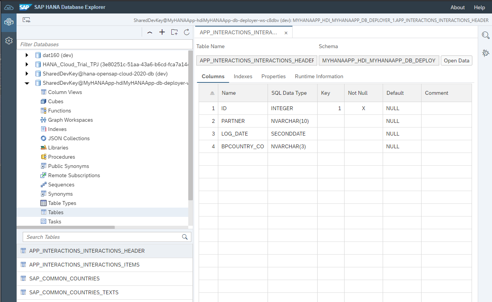
>
> If you checked the services in your space, you would see the service for your [HDI container](https://help.sap.com/viewer/4505d0bdaf4948449b7f7379d24d0f0d/latest/en-US/e28abca91a004683845805efc2bf967c.html).
>
> 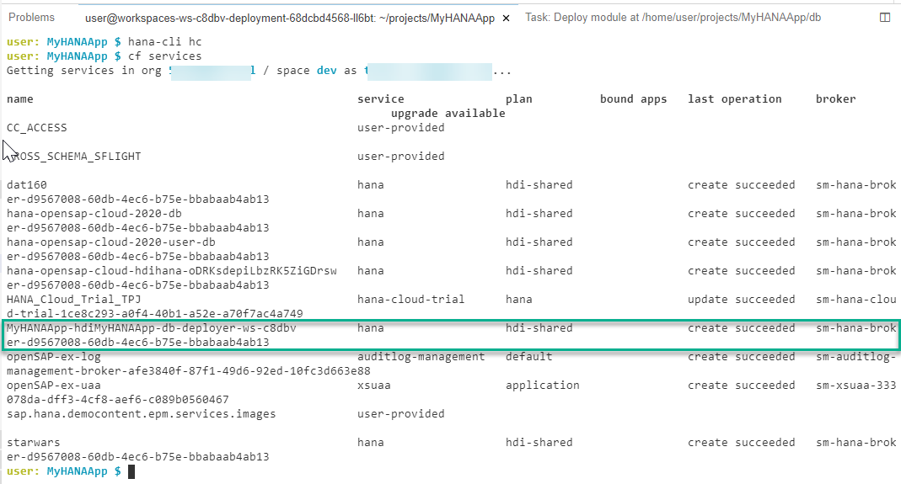
>
> You can find a similar example and further context on Core Data and Services in [this explanatory video](https://www.youtube.com/watch?v=O0qSsbnx3u8&list=PLoc6uc3ML1JR38-V46qhmGIKG07nXwO6X&index=6)

[DONE]
[ACCORDION-END]

[ACCORDION-BEGIN [Step 4: ](Check the Database Explorer)]

You can now check the generated tables and views in the Database Explorer.

1. In the SAP HANA Projects view, press the **Open HDI Container** button

    !

2. The Database Explorer will open in a new browser tab and automatically select the database entry for your project's HDI container.    

3. Once open, navigate to the `Tables` section and click on the `Header` table.

    !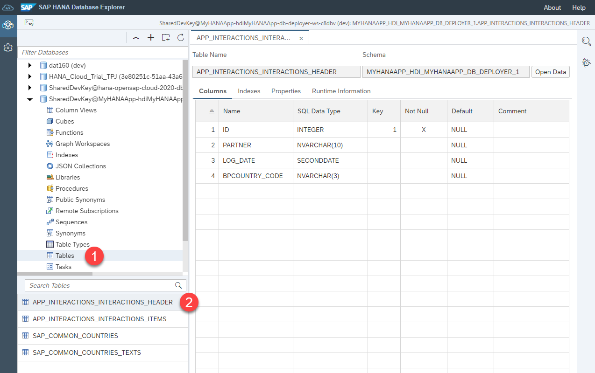

4. Note the name of the table matches the generated `hdbtable` artifacts. You will also see the physical schema managed by the HDI container.

    > Unless a name is specified during deployment, HDI containers are automatically created with names relative to the project and user generating them. This allows developers to work on different versions of the same HDI container at the same time.
    > !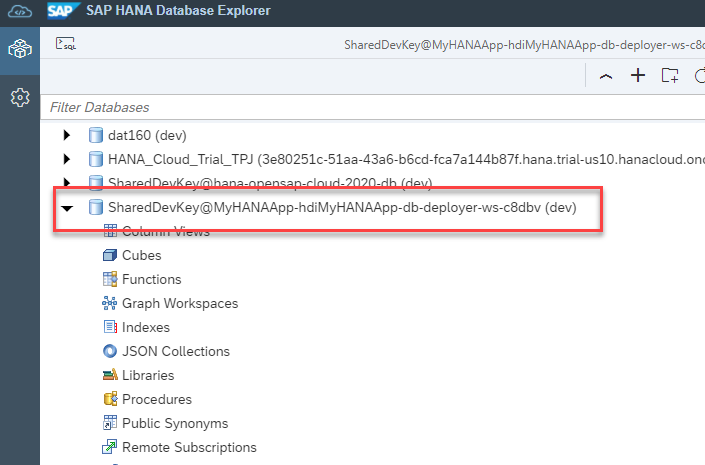


[DONE]
[ACCORDION-END]

[ACCORDION-BEGIN [Step 5: ](Load data into your tables)]

1. Download the [header file](https://raw.githubusercontent.com/SAP-samples/hana-opensap-cloud-2020/main/tutorial/Header.csv) and the [items file](https://raw.githubusercontent.com/SAP-samples/hana-opensap-cloud-2020/main/tutorial/Items.csv) into your local file system.

2. Right-click again on the header table and choose **Import Data**.

    !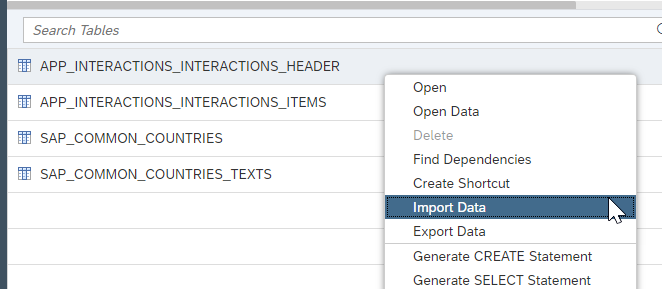

3. Choose **Import Data** and press **Step 2**

    !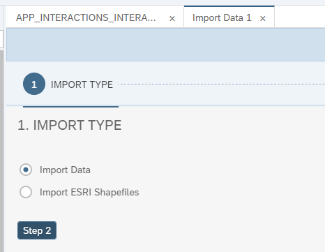    

3. Choose **Local** for the **Import Data From:** option. Browse for the `Header` file and click **Step 3**.

    !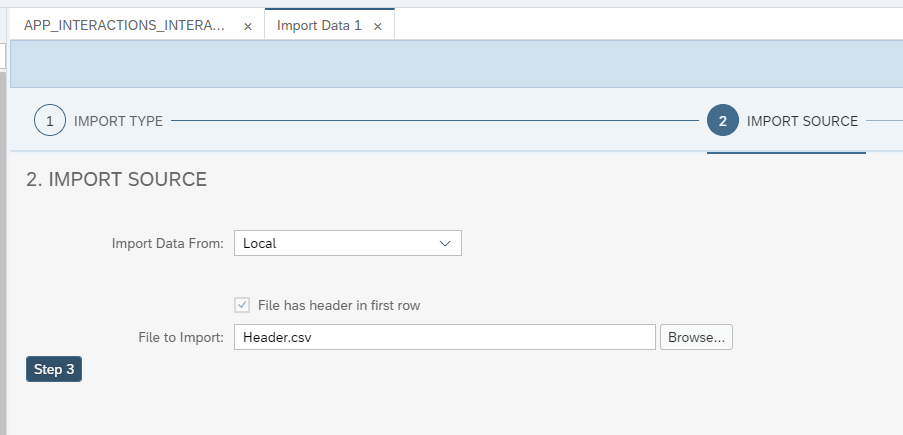

4. Keep the default import target and click **Step 4**.

    !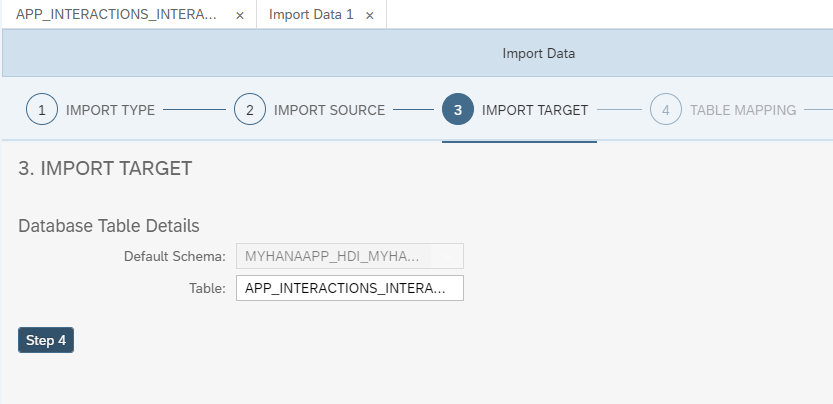

5. Keep the default table mapping and press **Step 5**.

    !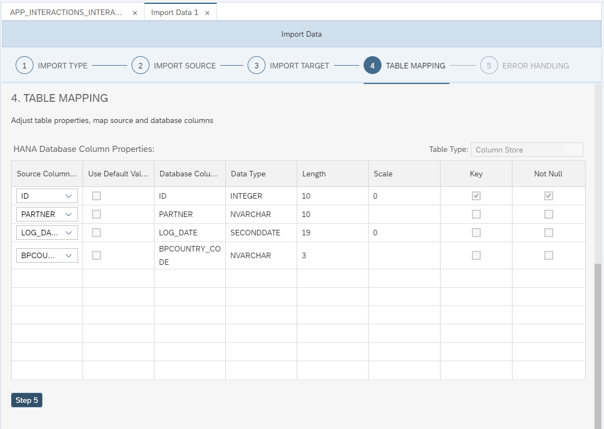

6. Keep the default error handling and press **Review**

    !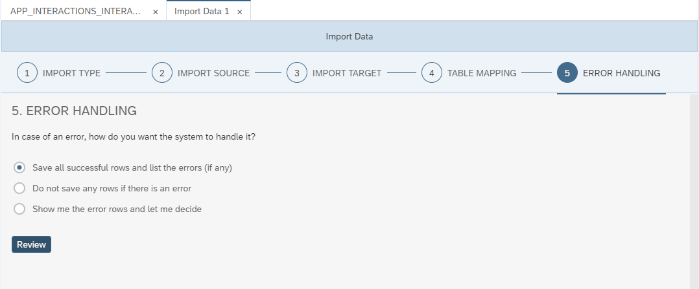

7. Choose **Import into Database**.

    !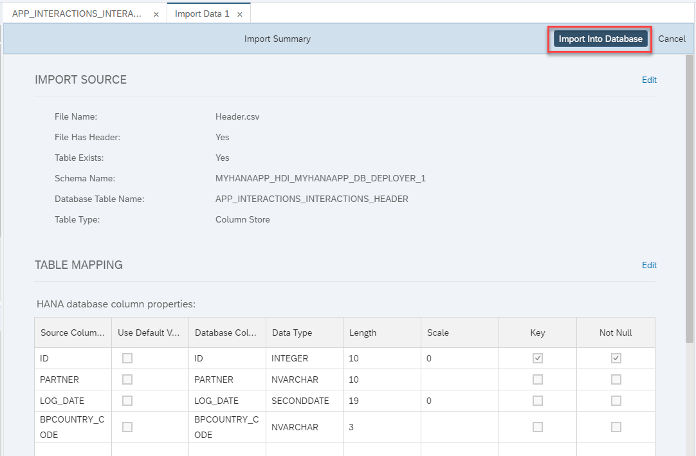

8. You will see confirmation that 4 records have imported successfully.

    !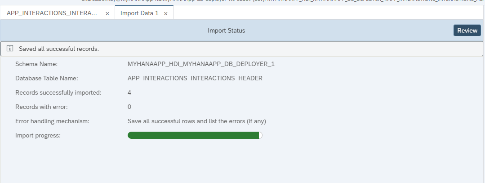

9. Repeat the process with the `Items.csv` file into the `Items` table.

    !

[DONE]
[ACCORDION-END]

[ACCORDION-BEGIN [Step 6: ](Check data loaded into the tables)]

1. You can now check the data loaded into the tables. Right-click on the `Items` table and click **Generate Select Statement**.

    !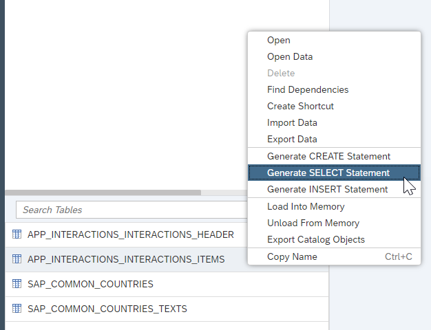

2. Add the following WHERE clause to the SELECT statement and execute it to complete the validation below.

    ```SQL
    where "LOGTEXT"  like '%happy%';
    ```

[VALIDATE_1]
[ACCORDION-END]

---
