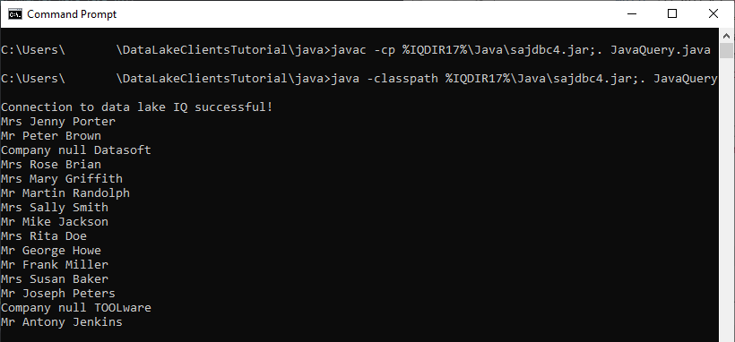
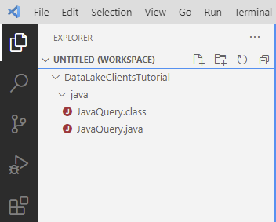
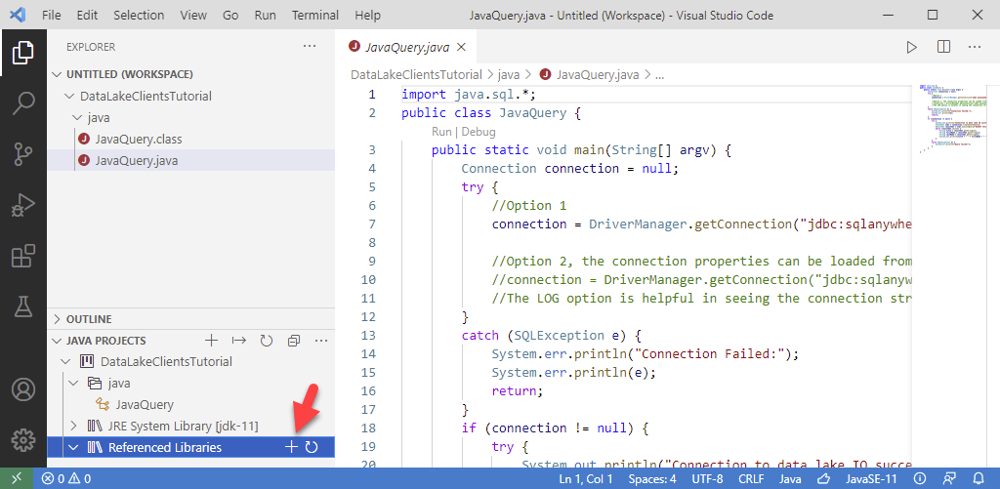
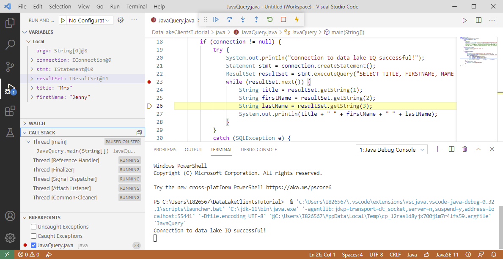

## Prerequisites
 - You have completed the first tutorial in this group.

## Details
### You will learn
  - How to create and debug a Java application that connects to and queries a data lake IQ database

[Java Database Connectivity](https://en.wikipedia.org/wiki/Java_Database_Connectivity) (JDBC) provides an [API](https://docs.oracle.com/javase/8/docs/technotes/guides/jdbc/) for accessing databases from Java. An application written to the JDBC standard can be ported to other databases. Database vendors provide JDBC drivers for their database products.

---

[ACCORDION-BEGIN [Step 1: ](Install a JDK)]

Ensure that you have a Java Development Kit (JDK) installed and make sure it is accessible from your path. Details of the driver and supported versions can be found at [JDBC Drivers](https://help.sap.com/viewer/a894a54d84f21015b142ffe773888f8c/latest/en-US/3bd02ce86c5f101482b78476939fb83a.html) and [Oracle Java SE Support Roadmap](https://www.oracle.com/java/technologies/java-se-support-roadmap.html).

A few options include:

* [Java JDK](https://www.oracle.com/technetwork/java/javase/overview/index.html) such as [Java SE 11 (LTS)](https://www.oracle.com/java/technologies/javase-jdk11-downloads.html)

* [A SAP supported version of the `OpenJDK`](https://sap.github.io/SapMachine/#download)

To verify that the JDK is correctly set up, run the following:

```Shell
java -version
javac -version
```

If these commands fail, ensure that the folder they are located in is included in your path.  

The following command will install Java on openSUSE Leap 15.2.

```Shell (Linux)
sudo zypper install java-11-openjdk-devel
```

[DONE]
[ACCORDION-END]

[ACCORDION-BEGIN [Step 2: ](The SAP IQ JDBC driver)]

The SAP IQ JDBC driver is a type 2 driver, which means it has a native (non-Java) component. For additional details see [Type 2 driver – Native-API driver](https://en.wikipedia.org/wiki/JDBC_driver#Type_2_driver_%E2%80%93_Native-API_driver). The driver is located in `%IQDIR17%\Java\sajdbc4.jar` on Microsoft Windows and `$IQDIR17/java/sajdbc4.jar` on Linux.  The native component is at `%IQDIR17%\Bin64\dbjdbc17.dll` on Microsoft Windows and `$IQDIR17\lib64\libdbjdbc17.so` on Linux.

A native JDBC driver called `jConnect` is also provided. This tutorial focuses on the SAP IQ JDBC driver.

See [JDBC Drivers](https://help.sap.com/viewer/a894a54d84f21015b142ffe773888f8c/latest/en-US/3bd02ce86c5f101482b78476939fb83a.html) for additional details.

[DONE]
[ACCORDION-END]

[ACCORDION-BEGIN [Step 3: ](Create a Java application that queries data lake IQ)]

1. The following commands create a folder named `java`, enter the newly created directory, create a file named `JavaQuery.java`, and open the file in notepad.

    ```Shell (Microsoft Windows)
    mkdir %HOMEPATH%\DataLakeClientsTutorial\java
    cd %HOMEPATH%\DataLakeClientsTutorial\java
    notepad JavaQuery.java
    ```

    ```Shell (Linux)
    mkdir ~/DataLakeClientsTutorial/java
    cd ~/DataLakeClientsTutorial/java
    nano JavaQuery.java
    ```

2. Copy the following code into `JavaQuery.java`:

    ```Java
    import java.sql.*;
    public class JavaQuery {
        public static void main(String[] argv) {
            Connection connection = null;
            try {
                //Option 1
                connection = DriverManager.getConnection("jdbc:sqlanywhere:uid=HDLADMIN;pwd=myPassword;Host=XXXXXXXX-XXXX-XXXX-XXXX-XXXXXXXXXXX.iq.hdl.trial-XXXX.hanacloud.ondemand.com:443;ENC='TLS{tls_type=rsa;direct=yes}'");

                //Option 2, the connection properties can be loaded from an ODBC datasource.
                //connection = DriverManager.getConnection("jdbc:sqlanywhere:DSN=HC_HDL_Trial;LOG=myLog.log");  
                //The LOG option is helpful when diagnosing connection issues.
            }
            catch (SQLException e) {
                System.err.println("Connection Failed:");
                System.err.println(e);
                return;
            }
            if (connection != null) {
                try {
                    System.out.println("Connection to data lake IQ successful!");
                    Statement stmt = connection.createStatement();
                    ResultSet resultSet = stmt.executeQuery("SELECT TITLE, FIRSTNAME, NAME from CUSTOMER;");
                    while (resultSet.next()) {
                        String title = resultSet.getString(1);
                        String firstName = resultSet.getString(2);
                        String lastName = resultSet.getString(3);
                        System.out.println(title + " " + firstName + " " + lastName);
                    }
                }
                catch (SQLException e) {
                    System.err.println("Query failed!");
                }
            }
        }
    }
    ```

3. Update the `uid`, `pwd`, and `host` values in the connection string.

4. Compile the `.java` file into a `.class` file using the following command:

    ```Shell (Microsoft Windows)
    javac -cp %IQDIR17%\Java\sajdbc4.jar;. JavaQuery.java
    ```  
    ```Shell (Linux)
    javac -cp $IQDIR17/java/sajdbc4.jar:. JavaQuery.java
    ```  

5. Run `JavaQuery.class` and indicate where the JDBC driver is located.  

    ```Shell (Microsoft Windows)
    java -classpath %IQDIR17%\Java\sajdbc4.jar;. JavaQuery
    ```  
    ```Shell (Linux)
    java -classpath $IQDIR17/java/sajdbc4.jar:. JavaQuery
    ```  

    

See [JDBC Program Structure](https://help.sap.com/viewer/a894a54d84f21015b142ffe773888f8c/latest/en-US/3bd5a89b6c5f1014ad1bae9e04645f43.html) for additional details.  


[DONE]
[ACCORDION-END]

[ACCORDION-BEGIN [Step 4: ](Debug the application)]

Visual Studio Code can run and debug a Java application. It is a lightweight but powerful source code editor available on Microsoft Windows, macOS, and Linux.

1. If required, [Download Visual Studio Code](https://code.visualstudio.com/Download).

2. In Visual Studio Code, choose **File | Open Folder** and then add the `DataLakeClientsTutorial` folder.

    

3. Open the file `JavaQuery.java`, and if asked, install the recommended extensions.

    

4. Once the Java Extension Pack has been installed, expand the Java Project Explorer and click on the **+** icon to add the JDBC driver as a referenced library.

    

    The JDBC driver is located at `%IQDIR17%\Java\sajdbc4.jar` on Microsoft Windows and `$IQDIR17/java/sajdbc4.jar` on Linux.

5. Place a breakpoint and then select **Run | Start Debugging**.  

    Notice that the debug view becomes active.  

    Notice that the program stops running at the breakpoint that was set. Step through the code by pressing F10 and observe the variable values in the variables pane.

    

Congratulations! You have now created and debugged a Java application that connects to and queries a data lake IQ database.


[VALIDATE_1]
[ACCORDION-END]

---
