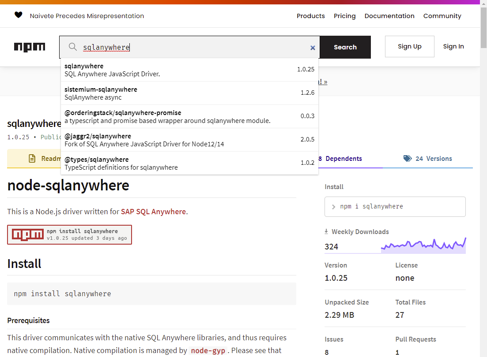
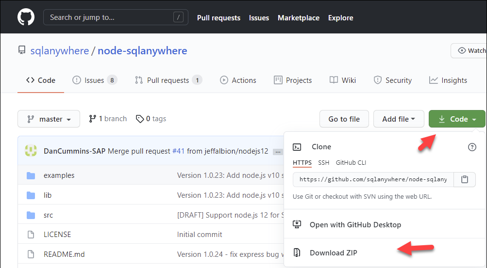
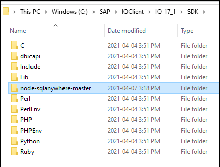
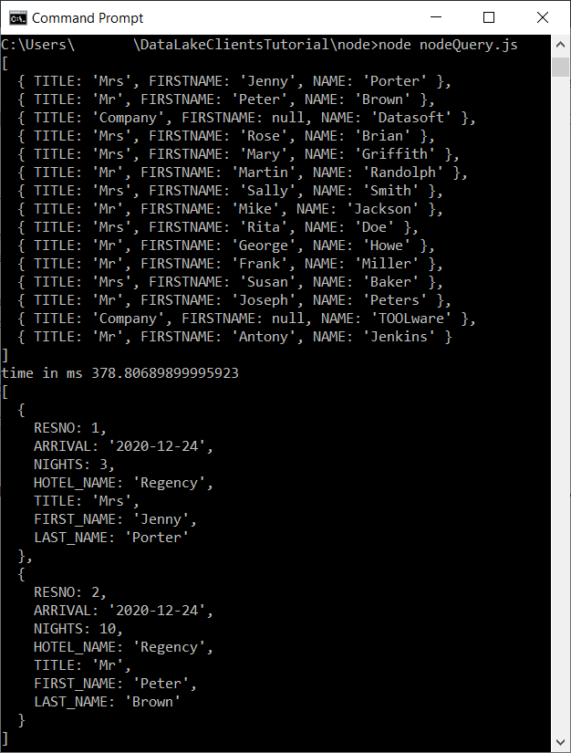
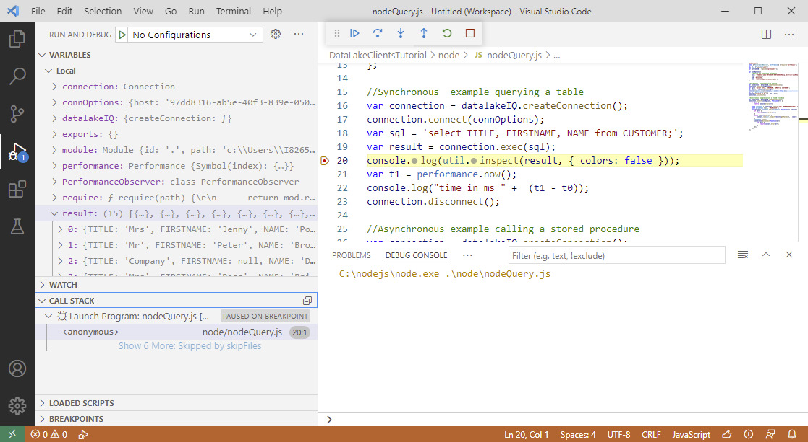

## Prerequisites
 - You have completed the first two tutorials in this group.

## Details
### You will learn
  - How to create and debug a Node.js application that connects to and queries a data lake IQ database

Node.js provides a JavaScript runtime outside of the browser and uses an asynchronous event driven programming model. For more details, see [Introduction to Node.js](https://nodejs.dev/).  

---

[ACCORDION-BEGIN [Step 1: ](Install Node.js)]

1. Ensure you have Node.js installed and check its version. Enter the following command:

    ```Shell
    node -v  
    ```  

    If Node.js is installed, the currently installed version is returned, such as v12.14.1.

    > Note that the supported versions of Node.js are listed at [node sqlanywhere](https://www.npmjs.com/package/sqlanywhere).

    If Node.js is not installed, on Microsoft Windows, download the long-term support (LTS) version 12 of Node.js from [Download Node.js](https://nodejs.org/en/download/).

    The following command will install Node 12 on openSUSE Leap 15.2.

    ```Shell (Linux)
    sudo zypper install nodejs12
    sudo zypper install npm
    ```

[DONE]
[ACCORDION-END]

[ACCORDION-BEGIN [Step 2: ](Install additional dependencies for native compilation on Linux)]

The driver requires compilation on Linux.  On Microsoft Windows, these libraries are included when the driver is downloaded from NPM.  

Compilation is managed by [node-gyp](https://github.com/nodejs/node-gyp).

1. Install node-gyp with the following command:

    ```Shell (Linux)
    sudo npm install -g node-gyp
    ```

2. `node-gyp` also has additional requirements.

    |Dependencies|
    |---|
    |Python v3.6, v3.7, v3.8, or v3.9|
    |A C/C++ compiler like [GCC](https://gcc.gnu.org/)|
    |make|

    The following commands can be used to check if the software is installed and the version:

    ```Shell (Linux)
    python3 --version
    gcc -v
    g++ --version
    make -v
    ```

    The following commands will install these on openSUSE Leap 15.2.

    ```Shell (Linux)
    sudo zypper install nodejs12-devel
    sudo zypper install python3
    sudo zypper install gcc
    sudo zypper install gcc-c++
    sudo zypper install make
    ```

[DONE]
[ACCORDION-END]


[ACCORDION-BEGIN [Step 3: ](Install Node.js driver from NPM)]

Node.js packages are available using [NPM](https://www.npmjs.com/), which is the standard package manager for Node.js.  

1. Enter `sqlanywhere` and click **Search**.

      

    The page for the SQL Anywhere Node.js package on NPM is shown below. Note that this same driver is used for data lake IQ and SQL Anywhere.   

2. Create a folder named `node` and enter the newly created directory.

    ```Shell (Microsoft Windows)
    mkdir %HOMEPATH%\DataLakeClientsTutorial\node
    cd %HOMEPATH%\DataLakeClientsTutorial\node
    ```
    ```Shell (Linux)
    mkdir -p ~/DataLakeClientsTutorial/node
    ```

3. Initialize the project and install the driver from NPM.

    ```Shell
    npm init -y
    npm install sqlanywhere
    ```

    >The driver is also available at [GitHub](https://github.com/sqlanywhere/node-sqlanywhere) and can alternatively be used as shown below.

    >Download a zip of the project.

    >

    >Extract the driver to the data lake client SDK folder.

    >

    >Initialize the project and build and install the driver.

    >```Shell
    npm init -y
    npm install %IQDIR17%\SDK\node-sqlanywhere-master
    >```

4. The following command lists the Node.js modules that are now installed locally into the `DataLakeClientsTutorial\node` folder.

    ```Shell
    npm list --depth=2
    ```

    

[DONE]
[ACCORDION-END]


[ACCORDION-BEGIN [Step 3: ](Create a Node.js application that queries data lake IQ)]

1. Open a file named `nodeQuery.js` in an editor.

    ```Shell (Microsoft Windows)
    notepad nodeQuery.js
    ```

    ```Shell (Linux)
    nano nodeQuery.js
    ```

2. Add the code below to `nodeQuery.js`.

    ```JavaScript
    'use strict';
    const { PerformanceObserver, performance } = require('perf_hooks');
    var t0;
    var util = require('util');
    var datalakeIQ = require('sqlanywhere');

    var connOptions = {
        //Specify the connection parameters
        host: 'XXXXXXXX-XXXX-XXXX-XXXX-XXXXXXXXXXX.iq.hdl.trial-XXXX.hanacloud.ondemand.com:443',
        uid: 'HDLAdmin',
        pwd: 'myPWD',
        enc: 'TLS{tls_type=rsa;direct=yes}',
    };

    //Synchronous  example querying a table
    var connection = datalakeIQ.createConnection();
    connection.connect(connOptions);

    var sql = 'select TITLE, FIRSTNAME, NAME from CUSTOMER;';
    t0 = performance.now();
    var result = connection.exec(sql);
    console.log(util.inspect(result, { colors: false }));
    var t1 = performance.now();
    console.log("time in ms " +  (t1 - t0));
    connection.disconnect();

    //Asynchronous example calling a stored procedure
    var connection = datalakeIQ.createConnection();
    connection.connect(connOptions, function(err) {
        if (err) {
            return console.error(err);
        }
        const statement = connection.prepare('CALL SHOW_RESERVATIONS(?,?)');
        const parameters = [11, '2020-12-24'];
        var results = statement.exec(parameters, function(err, results) {
            if (err) {
                return console.error(err);
            }
            console.log(util.inspect(results, { colors: false }));
            statement.drop();
            connection.disconnect(function(err) {
                if (err) {
                    return console.error(err);
                }   
            });
        });
    });
    ```  

4. Update the `uid`, `pwd`, and `host` values in `connOptions`.

5. Run the app.  

    ```Shell
    node nodeQuery.js
    ```


Note the above app makes use of some of the SAP SQL Anywhere Node.js driver classes and methods. Additional details can be found at [Node.js Application Programming](https://help.sap.com/viewer/09fbca22f0344633b8951c3e9d624d28/latest/en-US/815e3ccf6ce21014b8a4b4e18cbe9b3b.html).

In nodeQuery.js, synchronous and asynchronous queries are performed. Notice that asynchronous method calls use callback functions. See [JavaScript Asynchronous Programming and Callbacks](https://nodejs.dev/learn/javascript-asynchronous-programming-and-callbacks) for additional details.


[DONE]
[ACCORDION-END]

[ACCORDION-BEGIN [Step 4: ](Debug the application)]

Visual Studio Code can run and debug a Node.js application. It is a lightweight but powerful source code editor available on Windows, macOS, and Linux.

1. If required, [Download Visual Studio Code](https://code.visualstudio.com/Download).

2. If required, in Visual Studio Code, choose **File | Add Folder to Workspace** and then add the `DataLakeClientsTutorial` folder.

    

3. Open the file `nodeQuery.js`, place a breakpoint, select **Run | Start Debugging**, and select Node.js.

    Notice that the debug view becomes active.  

    Notice that the program stops running at the breakpoint that was set. Step through the code by pressing F10 and observe the variable values in the variables pane.

    


Congratulations! You have now created and debugged a Node.js application that connects to and queries a data lake IQ database.

[VALIDATE_1]
[ACCORDION-END]

---
