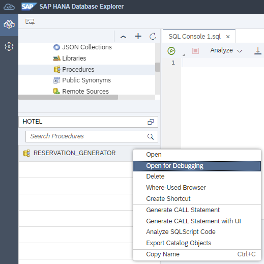
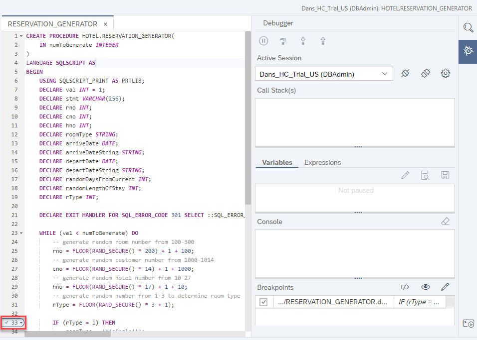
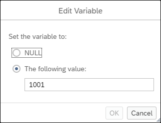
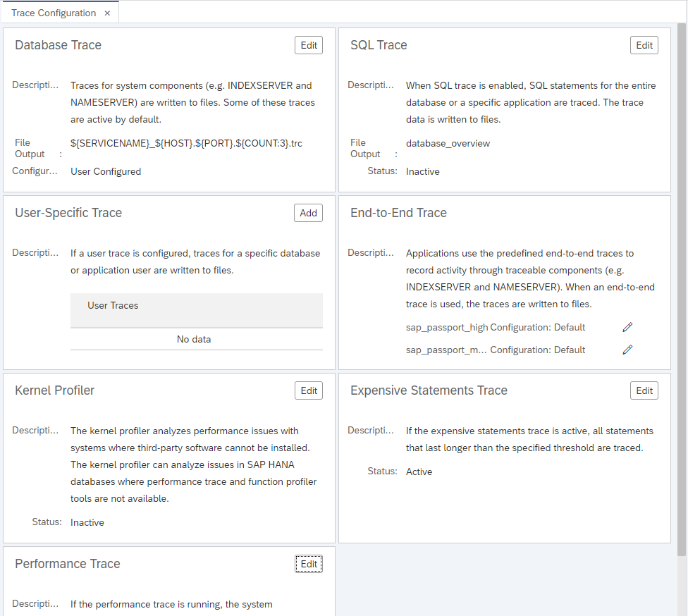
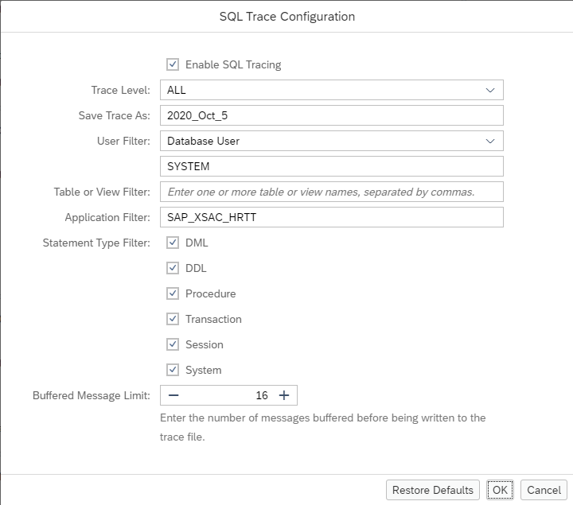
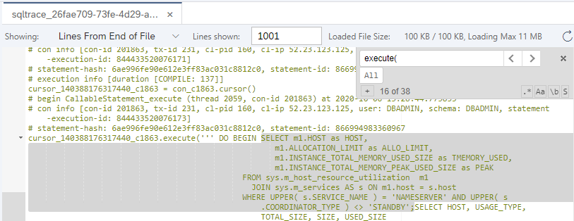
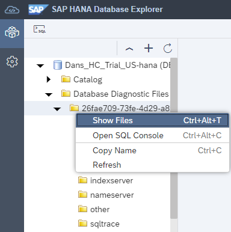

## Prerequisites
 - An SAP HANA database such as SAP HANA Cloud trial or the SAP HANA, express edition that includes the SAP HANA database explorer
 - You have completed the first 3 tutorials in this group.

## Details
### You will learn
  - How to debug SQLScript
  - How to use code coverage and SQLScript code analysis
  - About the tools available to assist in performance analysis (explain plan, SQL Analyzer)
  - How to configure and examine traces

---

[ACCORDION-BEGIN [Step 1: ](Debugger)]
The debugger can be used to help find issues in procedures, functions, or anonymous blocks.  The steps below demonstrate how to use the debugger to debug a procedure.

  1. To start a debugging session, navigate to the procedure `RESERVATION_GENERATOR`, right-click, and select **Open For Debugging**.

    


  2. From the **Debugger Attach Options** dialog, ensure that **SQL console connections** is selected.  

    

    >Note that anonymous blocks can also be debugged if the **Stop at execution start** option is checked.

  3. Set breakpoints in the procedure by clicking next to the line number.  A check mark will appear next to the line number to  indicate that a breakpoint has been set.

    

  4. Right-click the procedure named `RESERVATION_GENERATOR` in the database browser and select **Generate Call Statement** or **Generate Call Statement with UI**.

    

    A call statement for the procedure will open in a new SQL console. Provide an input parameter value, such as 10, and run the statement.

    

  5. When the breakpoint is hit, execution will suspend.

    

    The current values of any variables used can be examined.  It is possible to modify the value of certain local and global variables types by clicking the edit button highlighted above.

    

  6. Execution can be continued by using the navigation icons at the top of the debugger. The debugging session can be stopped by using the detach icon.

    

    >For more information on the SAP database explorer debugger, see the [Debugger Tutorials](https://help.sap.com/viewer/e8d0ddfb84094942a9f90288cd6c05d3/latest/en-US/5f452e148e2440f89d6d94cdb1d73b70.html).

[DONE]
[ACCORDION-END]

[ACCORDION-BEGIN [Step 2: ](Code coverage)]
The code coverage tool shows statements that have been run.  This can be helpful when used in conjunction with a set of tests, as it can show the amount of statements that the tests have covered.

1. Right-click the procedure `RESERVATION_GENERATOR` and choose **Generate CALL Statement**.

    

    A call statement for the procedure will open in a new console. Provide an input parameter value of 1.

    

    Select  **Report Code Coverage**.

    

2. The code coverage report shows the number of statements that were hit.

      

    The report also visually shows the statements that were hit and the ones that were not.

    

[DONE]
[ACCORDION-END]

[ACCORDION-BEGIN [Step 3: ](SQLScript analysis)]
The [SQLScript code analyzer](https://help.sap.com/viewer/d1cb63c8dd8e4c35a0f18aef632687f0/2020_02_QRC/en-US/f7e1c7fbce6f4db49e29d7cc58b78384.html) can be used to identify patterns indicating problems in code quality, security, or performance.  Follow the steps below to try it out.

1. Create a new procedure to generate fictitious hotel reservations. The procedure accepts a number of reservations to generate and a room type.

    ```SQL
    CREATE OR REPLACE PROCEDURE HOTEL.RESERVATION_GENERATOR2(
    		IN numToGenerate INTEGER,
    		IN rmType STRING
    	)
    	LANGUAGE SQLSCRIPT AS
    BEGIN
    	USING SQLSCRIPT_PRINT AS PRTLIB;
    	DECLARE val INT := 0;
    	DECLARE stmt VARCHAR(256) := '';
    	DECLARE rno INT := 0;
    	DECLARE cno INT := 0;
    	DECLARE hno INT :=0;
    	DECLARE arriveDate DATE := null;
    	DECLARE arriveDateString STRING := '';
    	DECLARE departDate DATE := null;
    	DECLARE departDateString STRING := '';
    	DECLARE randomDaysFromCurrent INT :=0;
    	DECLARE randomLengthOfStay INT :=0;
    	DECLARE unusedVar INT :=0;
    	DECLARE MYCOND CONDITION FOR SQL_ERROR_CODE 10001;
    	DECLARE EXIT HANDLER FOR SQL_ERROR_CODE 301
    	SELECT ::SQL_ERROR_CODE, ::SQL_ERROR_MESSAGE FROM DUMMY;
    	unusedVar := unusedVar + 1;
    	-- IF IS_SQL_INJECTION_SAFE(rmType) <> 1 THEN
    	--     SIGNAL MYCOND SET MESSAGE_TEXT = 'Invalid field ' || rmType;
    	-- END IF;

    	WHILE (val < numToGenerate) DO
    		-- generate random room number from 100-300
    		rno := FLOOR(RAND_SECURE() * 200) + 1 + 100;
    		-- generate random customer number from 1000-1014
    		cno := FLOOR(RAND_SECURE() * 14) + 1 + 1000;
    		-- generate random hotel number from 10-26
    		hno := FLOOR(RAND_SECURE() * 16) + 1 + 10;

            -- generate random number of days to be used for arrival date.  
    		-- date range is one year in the past to one year in the future
    		randomDaysFromCurrent := FLOOR(RAND_SECURE() * 730) + 1 - 365;
    		arriveDate := ADD_DAYS( TO_DATE( CURRENT_DATE, 'YYYY-MM-DD' ), randomDaysFromCurrent );
    		arriveDateString := '''' || TO_VARCHAR( arriveDate, 'YYYY-MM-DD' ) || '''';
    		-- generate a random number of days to stay
    		randomLengthOfStay := FLOOR(RAND_SECURE() * 7) + 1;
    		departDate := ADD_DAYS( arriveDate, randomLengthOfStay );
    		departDateString := '''' || TO_VARCHAR( departDate, 'YYYY-MM-DD' ) || '''';

            -- Reservations Columns: RNO, CNO, HNO, Type, Arrival, Departure
    		stmt := 'INSERT INTO hotel.reservation (RNO, CNO, HNO, TYPE, ARRIVAL, DEPARTURE) VALUES(' || rno || ',' || cno || ',' || hno || ',' || rmType || ',' || arriveDateString || ',' || departDateString || ');';
        PRTLIB:PRINT_LINE(stmt);
        EXEC(stmt);
    		val := val + 1;
    	END WHILE;
    	PRTLIB:PRINT_LINE('Rows inserted: ' || val);
    END;
    ```

2. Try it out.

    ```SQL
    CALL "HOTEL"."RESERVATION_GENERATOR2"(NUMTOGENERATE => 3,RMTYPE => '''suite''');
    ```

    

3. Right-click the procedure and choose **Analyze SQLScript Code**.

    

4. Notice that three issues were raised.   

    

    A double-click on an issue will open another tab containing the SQL of the procedure and the issue will be highlighted.

    

5. To address these issues, make the following changes and rerun the SQL in the SQL Console tab.  
    * The first issue can be resolved by commenting out `unusedVar` on lines 19 and 23.  
    * The second issue can be resolved by checking the input parameter `rmType` with the [IS SQL INJECTION SAFE](https://help.sap.com/viewer/c1d3f60099654ecfb3fe36ac93c121bb/2020_02_QRC/en-US/4496cc5717e847feb7daa41516047df9.html) function.  Uncomment lines 24 - 26 to try this.

3. Right-click the procedure and choose **Analyze SQLScript Code**.

    Notice that only one warning remains

    

[DONE]
[ACCORDION-END]

[ACCORDION-BEGIN [Step 4: ](Explain plan)]
Explain plan provides a compiled plan in tabular form without executing it.  This can be useful in analyzing certain situations when it is hard to reproduce issues without causing the issue.

1. Run the following SQL.

    ```SQL
    SELECT HOTEL_NAME, count(*) AS "NUMBER OF RESERVATIONS" FROM HOTEL.RESERVATION_VIEW group by HOTEL_NAME order by HOTEL_NAME;
    ```

    

2. Choose **Analyze | Explain Plan** to see the complied plan without executing the statement.

    

For further details see the links below.

[View Execution Plans for SQL Statements, Procedures, and Anonymous Blocks](https://help.sap.com/viewer/a2cea64fa3ac4f90a52405d07600047b/cloud/en-US/c41b37e67fa647b392c05b41804aee39.html)

[Explain Plan](https://help.sap.com/viewer/9de0171a6027400bb3b9bee385222eff/2.0.05/en-US/ee5e2ac159f14cc897c8b3a5f39a38b5.html)


[DONE]
[ACCORDION-END]

[ACCORDION-BEGIN [Step 5: ](SQL Analyzer)]
The SQL Analyzer provides a graphical view of how an analyzed SQL statement was executed.  This can help diagnose performance issues with query execution.  The viewer is currently available in on-premise versions of the SAP HANA database explorer and the SAP HANA cockpit as well as HANA studio.  A `.plv` file can also be saved, thereby enabling the user to open it in the SAP HANA Studio viewer.

1. Run the following SQL.

    ```SQL
    SELECT HOTEL_NAME, count(*) AS "NUMBER OF RESERVATIONS" FROM HOTEL.RESERVATION_VIEW group by HOTEL_NAME order by HOTEL_NAME;
    ```

    

2. Choose **Analyze | Analyze SQL** to execute the SQL and to view graphically how the SQL was executed.

      

    Information is shown about the tables in use, records, dominant operators, and the time it took to compile and execute the SQL.

    

3. Switch to the **Timeline** tab to visually see the time that the operations took.

    

>Refer to [Analyzing Statement Performance](https://help.sap.com/viewer/e8d0ddfb84094942a9f90288cd6c05d3/latest/en-US/1458a4079b294a58a57eca5823025108.html) for more information.


[DONE]
[ACCORDION-END]


[ACCORDION-BEGIN [Step 6: ](Tracing)]
Tracing can be helpful when debugging a problem or in identifying SQL statements that a particular application is using.  SAP support may also ask for specific trace files when attempting to help diagnose an issue.  The following steps demonstrate an example of enabling a trace and then viewing the resulting trace file by using the SAP HANA database explorer.

1. The database overview presents general information about a database.  Right-click a database and choose **Show Overview**.

    

    Different information and statistics are shown for the selected database.

    

2. To determine the SQL requests that were executed in order to populate the various fields of the overview (e.g. memory used), enable a SQL trace by running the SQL statements below in a SQL console.

    ```SQL SAP HANA Cloud
    ALTER SYSTEM ALTER CONFIGURATION ('indexserver.ini', 'SYSTEM') SET ('sqltrace', 'trace') = 'on', ('sqltrace', 'application') = 'sap_xsac_hrtt', ('sqltrace', 'user') = 'DBAdmin' WITH RECONFIGURE;
    ```

    ```SQL SAP HANA on-premise
    ALTER SYSTEM ALTER CONFIGURATION ('indexserver.ini', 'SYSTEM') SET ('sqltrace', 'trace') = 'on', ('sqltrace', 'tracefile') = 'database_overview', ('sqltrace', 'application') = 'sap_xsac_hrtt', ('sqltrace', 'user') = 'SYSTEM' WITH RECONFIGURE;
    ```

    >Additional details can be found in the [Configuration Parameter Reference](https://help.sap.com/viewer/138dcf7d779543608917a2307a6115f2/2020_03_QRC/en-US/514ab38a2e574c85a70ebba80ff16d99.html#loio514ab38a2e574c85a70ebba80ff16d99__configHC_id_30).


3. Press the refresh button on the database overview.

    

4. Turn off the SQL trace as tracing can have an effect on performance and takes up storage space.

    ```SQL
    ALTER SYSTEM ALTER CONFIGURATION ('indexserver.ini', 'SYSTEM') SET ('sqltrace', 'trace') = 'off' WITH RECONFIGURE;
    ```

    >Note that when using the SAP HANA database explorer running in SAP HANA on-premise or HANA as a Service, it is possible to configure traces using a graphical interface.
    >
    >
    >
    >A set of tiles display that provide a graphical user interface to configure different trace types.
    >
    >
    >
    >The SQL Trace dialog is shown below.
    >
    >

5. Examine the trace file.

    

    >Note that in SAP HANA Cloud the file can be found under the `sqltrace` folder while with SAP HANA on-premise, the trace file appears under the `other` folder.

    The SQL queries that return information about the memory being used by the HANA instance can be viewed in the file.  For example, the highlighted query is one such SQL request.

    


6. If you are unsure where to find a trace file, choose **Show Files**.

    

    Notice that trace files can be found by using sorting and filtering.

    

>For additional details, consult the [Traces](https://help.sap.com/viewer/6b94445c94ae495c83a19646e7c3fd56/latest/en-US/7e31247372fb4dd7b8c6bbac758b8c91.html) topic in the SAP HANA Administration Guide for SAP HANA Platform and SAP Note [2119087 - How-To: Configuring SAP HANA Traces](https://launchpad.support.sap.com/#/notes/2119087).

Congratulations! You have now explored the available tools to help diagnose and debug SQL or SQLScript.

[VALIDATE_1]
[ACCORDION-END]


---
