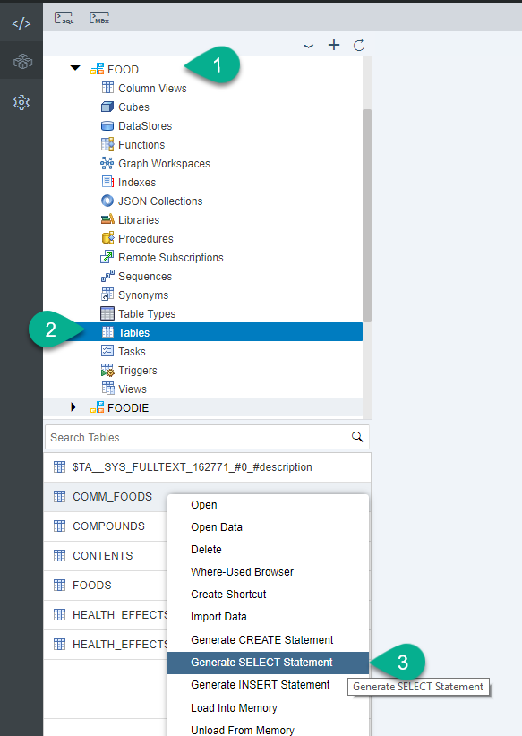
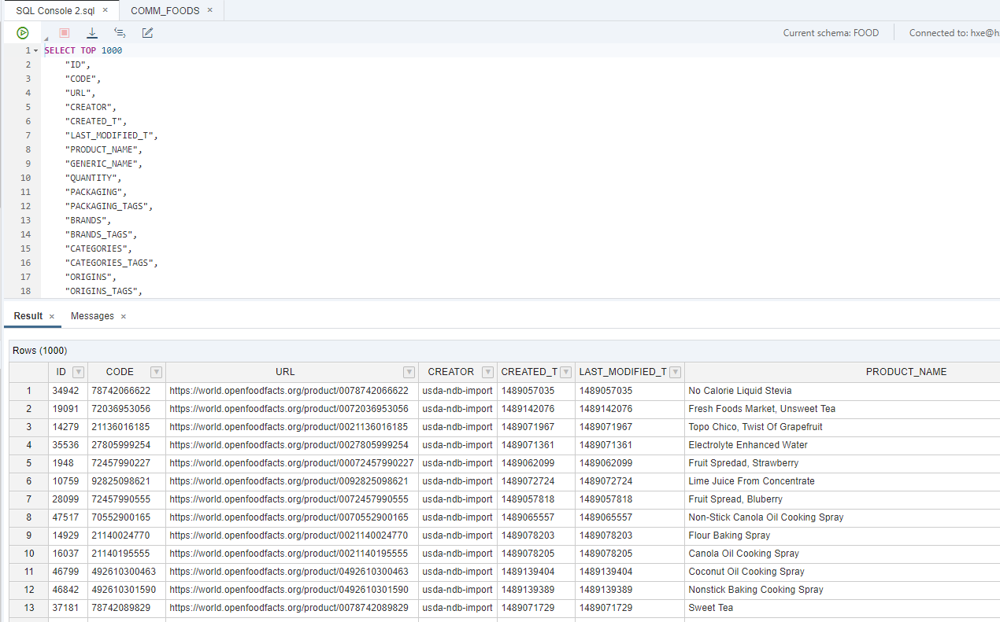
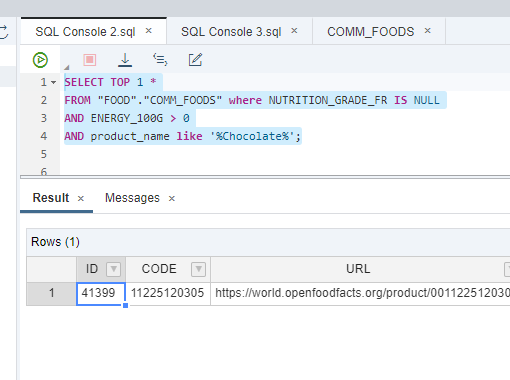
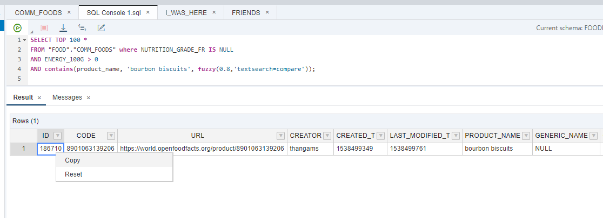
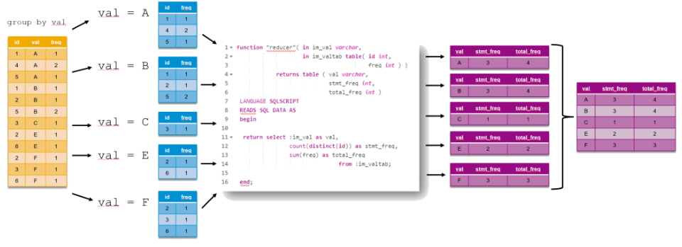
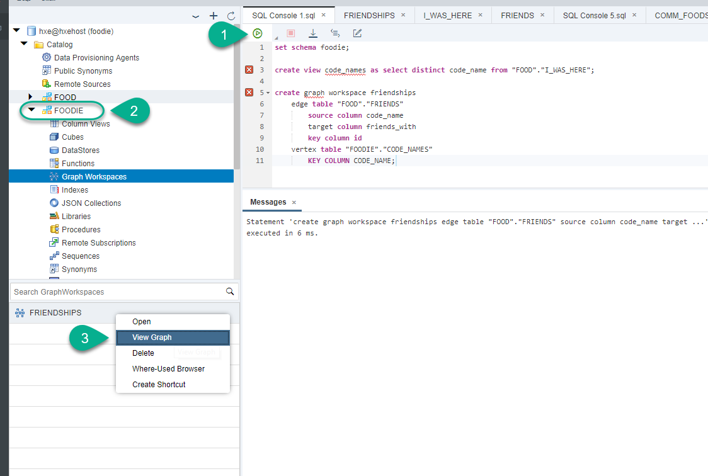

## Prerequisites
 - You are attending a hands-on event with a live instructor
 - The instructor has provided you with log in directions

## Details
### You will learn
  - How to apply basic fuzzy search on unstructured data
  - How to train and run a predictive algorithm
  - How to execute a `MapReduce` operation
  - How to use create a graph workspace


**This tutorial can only be completed with a live instructor.**

This tutorial uses two databases obtained from two open sources:
- [`FooDB`](http://foodb.ca/) is the world's largest and most comprehensive resource on food constituents, chemistry and biology. It provides information on both macro-nutrients and micro-nutrients, including many of the constituents that give foods their flavor, color, taste, texture and aroma.
- [Open Food Facts](https://world.openfoodfacts.org/) gathers information and data on food products from around the world.

---

[ACCORDION-BEGIN [Step 1: ](Connect to the database)]

> This tutorial can only be completed with a live instructor.

You will be provided with connection details. You should see a connection:


You are currently connected with the user **FOODIE**.

For a better experience, make sure you close all of the tabs if there are any open:


[ACCORDION-END]

[ACCORDION-BEGIN [Step 2: ](Explore the existing data)]

Find an entry for the food you like. To understand what data looks like, open the schema **FOOD**.

Click on tables. Right-click on **`COMM_FOODS`** and choose **Generate SELECT statement**.



You will see a SQL console and a `SELECT` statement. Press **Run**  to see the results.



**Think of a food you like**.

Replace the word in the like clause to get a commercial food to analyze.  

This example will use `Bourbon biscuits`.

```SQL

SELECT TOP 100 *
FROM "FOOD"."COMM_FOODS" where NUTRITION_GRADE_FR IS NULL
AND ENERGY_100G > 0
AND contains(product_name, 'bourbon biscuits', fuzzy(0.8,'textsearch=compare'));
```

**Leave the SQL tab open** to keep your result handy.


> ##  What is going on?
> You are using a fuzzy search on text. The results cover anything with a similarity score of `0.8` to `bourbon biscuits` in this example.
> Results could also contain typos, differences between upper and lower case and even similar words.

[ACCORDION-END]


[ACCORDION-BEGIN [Step 3: ](Create a view)]

The nutrition grade is an indicator of how much energy for growth is provided by food. You have selected a food that does not have a nutrition grade assigned.  

You will train a model using the records in the database that have a nutrition grade.

The algorithm you will use is called [Multi-Class Logistic Regression](https://help.sap.com/viewer/2cfbc5cf2bc14f028cfbe2a2bba60a50/2.0.03/en-US/bc5fe09f584a4cd1a6b6b2176719a07f.html). You will take the normalized values of nutrients as explanatory attributes to model the relation with the nutrition grade (dependent variable).

Open a new **SQL** console


Use the following code to create a view for foods that need a nutrition grade assigned:

```sql
set schema foodie;

DROP view "PAL_FOOD_DATA_SCORE_VIEW";

CREATE VIEW "PAL_FOOD_DATA_SCORE_VIEW" AS
	SELECT
		TO_INT("ID"),
		"ENERGY_100G",
		"ENERGY_FROM_FAT_100G",
		"FAT_100G",
		"SATURATED_FAT_100G",
		"MONOUNSATURATED_FAT_100G",
		"POLYUNSATURATED_FAT_100G",
		"TRANS_FAT_100GCHOLESTEROL_100G",
		"CARBOHYDRATES_100G",
		"SUGARS_100G",
		"FIBER_100G",
		"PROTEINS_100G",
		"SALT_100G",
		"SODIUM_100G",
		"VITAMIN_A_100G",
		"BETA_CAROTENE_100G",
		"VITAMIN_D_100G",
		"VITAMIN_E_100G",
		"VITAMIN_K_100G",
		"VITAMIN_C_100G",
		"VITAMIN_B1_100G",
		"VITAMIN_B2_100G",
		"VITAMIN_PP_100G",
		"POTASSIUM_100G",
		"CHLORIDE_100G",
		"CALCIUM_100G",
		"IRON_100G",
		"COCOA_100G"
	FROM
		"FOOD"."COMM_FOODS"
	WHERE
		NUTRITION_GRADE_FR IS NULL;		


```

Press **F8** or to run.


Use the following code to create a view with the foods that will be used for training


```sql

SET schema foodie;

DROP VIEW PAL_FOOD_DATA_TRAIN_VIEW;

CREATE VIEW PAL_FOOD_DATA_TRAIN_VIEW AS
SELECT
  TO_INT("ID"),
  "ENERGY_100G",
  "ENERGY_FROM_FAT_100G",
  "FAT_100G",
  "SATURATED_FAT_100G",
  "MONOUNSATURATED_FAT_100G",
  "POLYUNSATURATED_FAT_100G",
  "TRANS_FAT_100GCHOLESTEROL_100G",
  "CARBOHYDRATES_100G",
  "SUGARS_100G",
  "FIBER_100G",
  "PROTEINS_100G",
  "SALT_100G",
  "SODIUM_100G",
  "VITAMIN_A_100G",
  "BETA_CAROTENE_100G",
  "VITAMIN_D_100G",
  "VITAMIN_E_100G",
  "VITAMIN_K_100G",
  "VITAMIN_C_100G",
  "VITAMIN_B1_100G",
  "VITAMIN_B2_100G",
  "VITAMIN_PP_100G",
  "POTASSIUM_100G",
  "CHLORIDE_100G",
  "CALCIUM_100G",
  "IRON_100G",
  "COCOA_100G",
  "NUTRITION_GRADE_FR"
FROM
  "FOOD"."COMM_FOODS"
WHERE
  NUTRITION_GRADE_FR IS NOT NULL;

```

Press **F8** to run.


[ACCORDION-END]

[ACCORDION-BEGIN [Step 4: ](Create structures for training)]

Aside from the values for training, the procedure included in the Predictive Analytics Library in SAP HANA requires a table with parameter as an input.

You can find more details about the parameters and their meaning in the [official SAP Help](https://help.sap.com/viewer/2cfbc5cf2bc14f028cfbe2a2bba60a50/2.0.03/en-US/bc5fe09f584a4cd1a6b6b2176719a07f.html).

Use the following statement to create the input table and populate it with parameters

```sql
SET schema foodie;

--DROP TABLE #PAL_PARAMETER_TBL;
CREATE LOCAL TEMPORARY COLUMN TABLE #PAL_PARAMETER_TBL (
    "PARAM_NAME"   NVARCHAR (256),
    "INT_VALUE"    INTEGER,
    "DOUBLE_VALUE" DOUBLE,
    "STRING_VALUE" NVARCHAR (1000)
);

DROP TABLE PAL_FOOD_PMML_TBL;
CREATE COLUMN TABLE PAL_FOOD_PMML_TBL (
    "ROW_INDEX" INT,
    "MODEL_CONTENT" NVARCHAR(5000)
);

DROP TABLE PAL_FOOD_STATISTICS_TBL;
CREATE COLUMN TABLE PAL_FOOD_STATISTICS_TBL (
    "STAT_NAME" NVARCHAR(256),
    "STAT_VALUE" NVARCHAR(1000)
);

DROP TABLE PAL_FOOD_OPTIMAL_PARAM_TBL;
CREATE COLUMN TABLE PAL_FOOD_OPTIMAL_PARAM_TBL (
    "PARAM_VALUE" NVARCHAR(256),
    "INT_VALUE" INT,
    "DOUBLE_VALUE" DOUBLE,
    "STRING_VALUE" NVARCHAR(1000)
);

DROP TABLE PAL_FOOD_MODEL_TBL;
CREATE COLUMN TABLE PAL_FOOD_MODEL_TBL (
    "VARIABLE_NAME" NVARCHAR(1000),
    "CLASS" NVARCHAR(100),
    "COEFFICIENT" DOUBLE,
    "Z_SCORE" DOUBLE,
    "P_VALUE" DOUBLE
);

DROP TABLE PAL_FOOD_RESULT_SCORE_TBL;
CREATE COLUMN TABLE PAL_FOOD_RESULT_SCORE_TBL (
    "CODE" INT,
    "CLASS" NVARCHAR(100),
    "PROBABILITY" DOUBLE
);

DROP TABLE PAL_FOOD_PLACEHOLDER_TBL;
CREATE COLUMN TABLE PAL_FOOD_PLACEHOLDER_TBL (
    "PARAM_VALUE" NVARCHAR(256),
    "INT_VALUE" INT,
    "DOUBLE_VALUE" DOUBLE,
    "STRING_VALUE" NVARCHAR(1000)
);

TRUNCATE TABLE #PAL_PARAMETER_TBL;
INSERT INTO #PAL_PARAMETER_TBL VALUES ('MAX_ITERATION',100,NULL,NULL);
INSERT INTO #PAL_PARAMETER_TBL VALUES ('PMML_EXPORT',1,NULL,NULL);
INSERT INTO #PAL_PARAMETER_TBL VALUES ('HAS_ID',1,NULL,NULL);  
INSERT INTO #PAL_PARAMETER_TBL VALUES ('DEPENDENT_VARIABLE',NULL,NULL,'NUTRITION_GRADE_FR');
INSERT INTO #PAL_PARAMETER_TBL VALUES ('STANDARDIZE',1,NULL,NULL);
INSERT INTO #PAL_PARAMETER_TBL VALUES ('STAT_INF',0,NULL,NULL);
```

This may take some seconds. Here is some information about the platform you are using - SAP HANA, express edition- to pass the time:

<iframe width="560" height="315" src="https://www.youtube.com/embed/HWP839IWaNU" frameborder="0" allow="autoplay; encrypted-media" allowfullscreen></iframe>

[ACCORDION-END]

[ACCORDION-BEGIN [Step 5: ](Train the model)]

You can now call the training algorithm and check the results

```sql
CALL _SYS_AFL.PAL_MULTICLASS_LOGISTIC_REGRESSION (
	PAL_FOOD_DATA_TRAIN_VIEW,
	#PAL_PARAMETER_TBL,
	PAL_FOOD_MODEL_TBL,
	PAL_FOOD_PMML_TBL,
	PAL_FOOD_STATISTICS_TBL,
	PAL_FOOD_PLACEHOLDER_TBL
) WITH OVERVIEW;

SELECT * FROM PAL_FOOD_MODEL_TBL;
SELECT * FROM PAL_FOOD_STATISTICS_TBL;
```

You can see statistics about the accuracy of the model in the results.


[ACCORDION-END]

[ACCORDION-BEGIN [Step 6: ](Use the model to predict the nutrition score)]

Some steps ago, you created a view with all of the foods without a nutrition score. This view is called `PAL_FOOD_DATA_SCORE_VIEW`.

You will now fill the scores using the prediction model created in the previous step.

```sql

TRUNCATE TABLE #PAL_PARAMETER_TBL;
INSERT INTO #PAL_PARAMETER_TBL VALUES ('VERBOSE_OUTPUT',1,NULL,NULL);

CALL _SYS_AFL.PAL_MULTICLASS_LOGISTIC_REGRESSION_PREDICT  (
	PAL_FOOD_DATA_SCORE_VIEW,
	PAL_FOOD_PMML_TBL,
	#PAL_PARAMETER_TBL,
	PAL_FOOD_RESULT_SCORE_TBL
) WITH OVERVIEW;

SELECT * FROM PAL_FOOD_DATA_SCORE_VIEW;
SELECT * FROM PAL_FOOD_RESULT_SCORE_TBL order by 3 desc;

```

The previous call populated the table `PAL_FOOD_RESULT_SCORE_TBL` with nutrition scores based on the results of the predictive algorithm. Get the ID of your selected food...



...and use it in the where clause to replace the sample one:

```sql
SELECT top 1 *
FROM PAL_FOOD_RESULT_SCORE_TBL
where CODE = 186710
order by probability desc;
```
For example:



You now know the most probable nutrition grade for the food you have chosen.

[ACCORDION-END]

[ACCORDION-BEGIN [Step 7: ](Get the most popular ingredients)]

The ingredients for the commercial foods are contained in a text field, separated by a comma.

You now want to find out which ingredients are the most common in foods with the lowest nutrition grades.

You will use the map reduce capabilities to split the ingredients into a separate table and get the most frequent ones.

Paste and execute the following code in a new SQL console. This will take some moments to execute but you can continue to read an explanation of the code in the meantime.

```sql
drop function "mapper";
create function "mapper" ( in iv_id int, in iv_text nvarchar(5000) )
				returns table (id int, val nvarchar(5000), freq int)
	language sqlscript
	reads sql data as
	begin
	using sqlscript_string as lib;

	declare lt_split_result table(result nvarchar(5000));

	lt_split_result = lib:split_to_table(:iv_text, ',', 5000);
	return select iv_id as id, result as val, count(result) as freq
				from :lt_split_result group by result;

	end;

drop function "reducer";
create function "reducer"( in iv_val nvarchar(5000),
						   in it_valtab table ( id int, freq int  ) )
				returns table (
					val nvarchar(5000),
					ingdt_freq int,
					total_freq int )
	language sqlscript
	reads sql data as
	begin

	return select :iv_val as val,
				count(distinct(id)) as ingdt_freq,
				sum(freq) as total_freq
				from :it_valtab;

	end;


  do begin

  declare lt_input table(id int, ingredients_text nvarchar(5000));
  declare lt_result table(val nvarchar(5000), ingdt_freq int, total_freq int );
  declare lv_id int;
  declare lv_code_name nvarchar(100);
  declare lv_new_friend nvarchar(100) = '0';
  declare lv_main_ingredient nvarchar(100);
  declare lt_here table(code_name nvarchar(100));
  declare lv_count int = 0;

----!!!!SET THE ID FOR YOUR FOOD AND YOUR CODE NAME HERE!!!!------

lv_id = <<Use the ID of the food you selected>>;
lv_code_name = '<<Use your First name, your day of birth and the first letter of the color of your socks>>';
-------------------------------

  lt_input = select id, to_nvarchar(INGREDIENTS_TEXT) as ingredients_text from "FOOD"."COMM_FOODS" where id = lv_id;

  lt_result = map_reduce( :lt_input,
  						"mapper"(:lt_input.id, :lt_input.ingredients_text) group by val as map_result,
  						"reducer"(map_result.val, map_result));
  select * from :lt_result order by total_freq desc;

  select count(code_name) into lv_count from "FOOD"."I_WAS_HERE" where ingredient in (select val from :lt_result);
  if lv_count > 0 then
	select top 1 code_name into lv_new_friend from "FOOD"."I_WAS_HERE" where ingredient in (select val from :lt_result) group by code_name;
  end if;

  if lv_new_friend = '0' then
		lv_new_friend = lv_code_name;
	end if;

  insert into "FOOD"."I_WAS_HERE" (code_name, fav_food, ingredient ) select :lv_code_name,  :lv_id, val from :lt_result ;

   insert into "FOOD"."FRIENDS" (code_name, friends_with) values (lv_code_name, lv_new_friend);

  end;

```


> ##  What is going on?
> `MapReduce` is a programming model to split large dataset into parts and process them in parallel, generally in different nodes in a cluster. The parts in the dataset are then reunited into a consistent output.
>  You have created two functions. The first one, `mapper`, takes each list of ingredients from each record, and splits the ingredients into separate records in a table. You are using a reusable library to split text into a table. The function also counts the occurrences of an ingredient within a list. The `MAP_MERGE` operator then merges the results into a single table with the individual ingredient and its original `ID`.
>
> 
> The second function, the reducer, will use each group of ingredient tables for each ID, process all groups and return the total count for the ingredients.
>
> 
>  You can learn more about these examples in this [blog post](https://blogs.sap.com/2018/04/11/sap-hana-2.0-sps-03-new-developer-features-database-development/). Note the input is limited so you can finish on time for this exercise.


[ACCORDION-END]

[ACCORDION-BEGIN [Step 8: ](Find who you are connected to through the same food)]

The previous function associated participants through food and their ingredients. You can now represent that relationship in a graph


```SQL
set schema foodie;

create view code_names as select distinct code_name from "FOOD"."I_WAS_HERE";

create graph workspace friendships
	edge table "FOOD"."FRIENDS"
		source column code_name
		target column friends_with
		key column id
	vertex table "FOODIE"."CODE_NAMES"
		KEY COLUMN CODE_NAME;

```

Navigate to the **Graph Workspaces** in the **FOODIE** schema. Right-click on the graph workspace and choose **View Graph**.



**Congratulations!** You are now part of the foodie network and earned a prize. Show your node on the graph to the instructor.


[ACCORDION-END]


---
