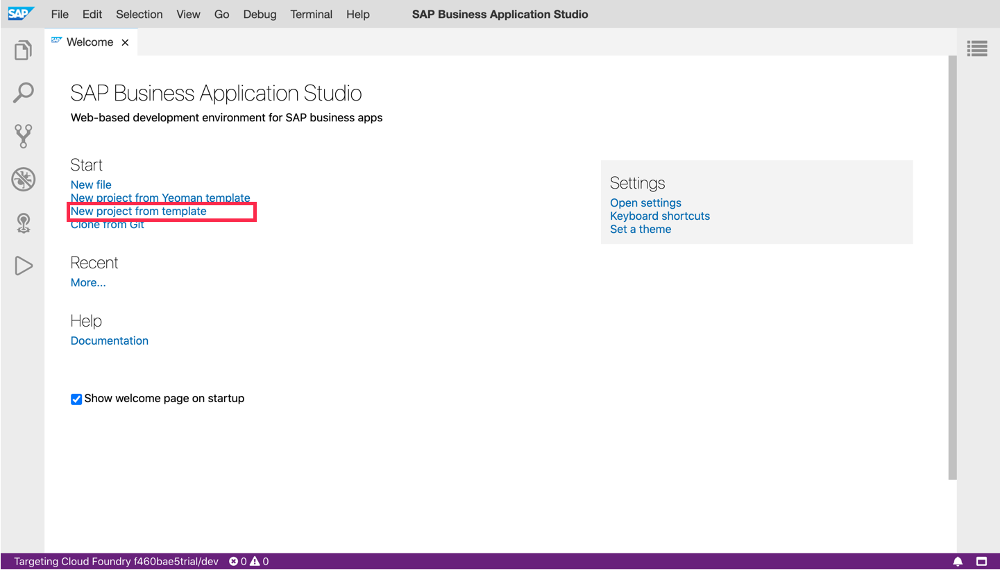
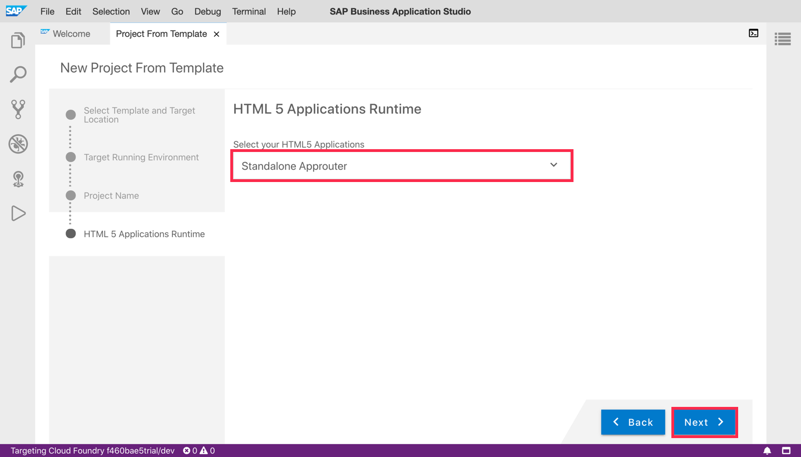
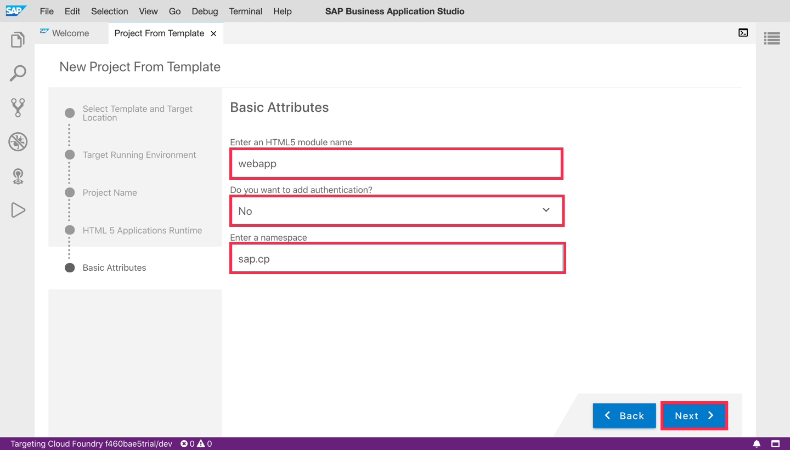
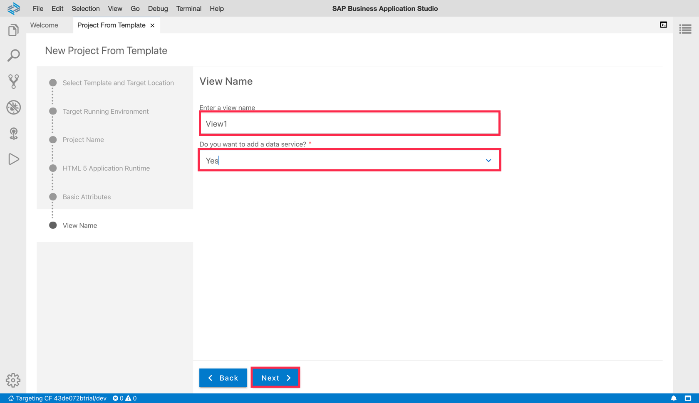
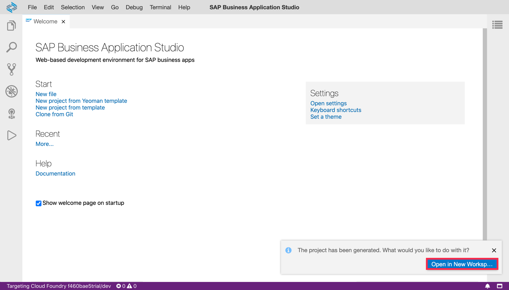
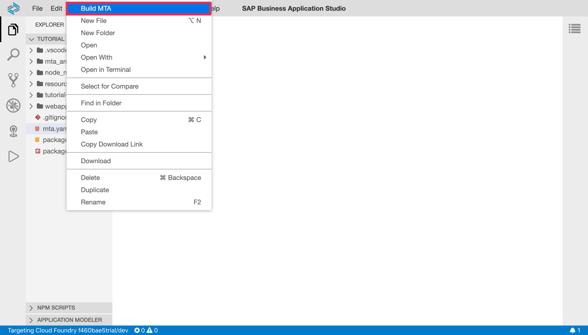
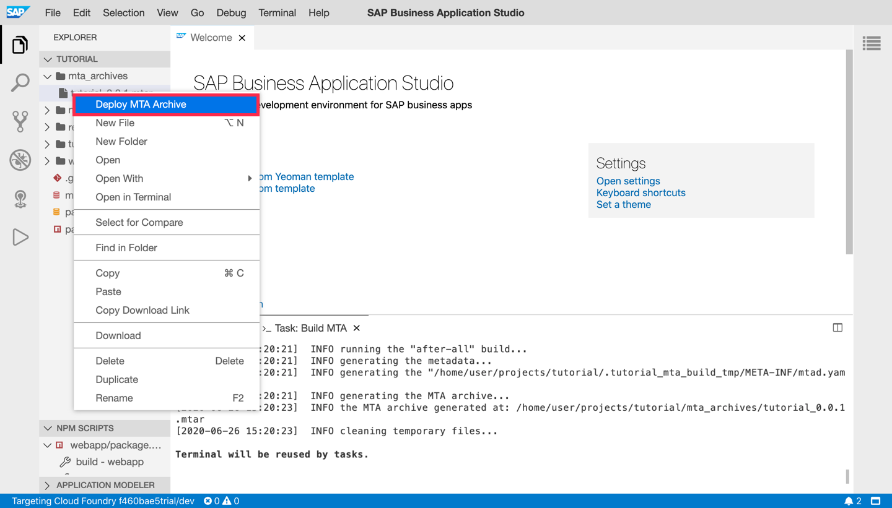
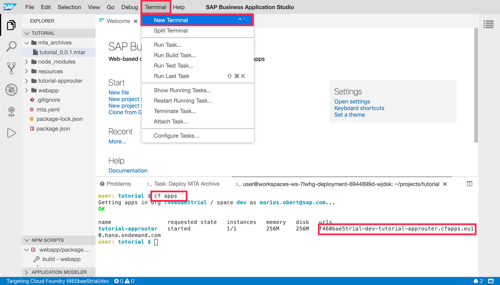

## Details
### You will learn  
In this tutorial, you will build a basic UI5 application that uses data from the SAP Success Factors API, that you test in the SAP Business Hub, to populate a list. Each User will have a list item that displays relevant information about that person.

> It is important to note that in UI5, it is recommended to use an `ODataModel` with an `OData` service, which is what the Success Factors APIs provided in the API Business Hub are, as UI5 will optimize the data parsing for you. This tutorial uses the pre-generated SAPUI5 JSON model from the code snippets section of the API Business Hub. Using an `ODataModel` is the best practice for UI5 applications, but it is not covered in this tutorial. You can find more information about `ODataModels` in the [UI5 Demo Kit](https://sapui5.hana.ondemand.com/#docs/guide/6c47b2b39db9404582994070ec3d57a2.html).


---

[ACCORDION-BEGIN [Step : ](Open the Fiori dev space)]


**Start** a dev space of kind *SAP Fiori* and **open** it by clicking its name.

!

> Have a look at [this tutorial](appstudio-devspace-fiori-create) if you are unsure how to get here or how to create a dev space.


[DONE]
[ACCORDION-END]
[ACCORDION-BEGIN [Step : ](Connect to a Cloud Foundry endpoint)]

Make sure you are connected to a Cloud Foundry endpoint to which you will deploy the SAPUI5 application later.

1. Click on the bottom-left corner of the screen to start the connection flow.

    !

2. Enter the Cloud Foundry endpoint you want to connect with. If your environment runs in the EU10-region, this is `https://api.cf.eu10.hana.ondemand.com`. Enter your email and your password to proceed.

    !

3. Next, you need to select the Cloud Foundry Organization and space you want to use. You will see that you are connected to the endpoint once these prompts have been answered.

    !


[DONE]
[ACCORDION-END]

[ACCORDION-BEGIN [Step : ](Create a new project)]
1. Click on the link **New project From template** on the *Welcome* screen.

    !

2. Select **Fiori Project** as the template category you want to use and click **Next**.

    !

3. Specify the target environment ( **Cloud Foundry** ) and the template ( **SAPUI5 Application** ) and go to the **Next** screen.

    !

4. Name the project **`tutorial`** and proceed by clicking **Next**.

    !

4. Choose **Standalone Approuter** for the runtime and click **Next**.

    !

4.  Name of the module  **`webapp`** and the namespace **`sap.cp`** and turn authentication off. Go to the **Next** screen.

    !

4. Keep the default view name and go for no data service on this screen. Click **Next** to create the new project.

    !


4. Once the project has been created, the Business Application Studio will prompt you to open the project in a new workspace. Click **Open in New Workspace**.


    !


[DONE]
[ACCORDION-END]
[ACCORDION-BEGIN [Step : ](Redirect incoming traffic to the SAPUI5 app)]


The generated code comes ready-to-deploy. By default, the web app will be available at `https://<approuter-url>/<app/id>` and the application router will not redirect traffic that hits the root URL. In this step, you will change this.

1. **Open** the file `webapp/webapp/manifest.json` and find the property `sap.app>id`. The value of this property should be `sap.cp.webapp` but can vary depending on the names you choose in the previous step.

    !

2. **Open** the file `tutorial-approuter/xs-app.json` and add a new property to define the redirect.

    !


[DONE]
[ACCORDION-END]
[ACCORDION-BEGIN [Step : ](Get the pre-generated SAPUI5 snippet)]
In the [API Business Hub](https://api.sap.com), search for the **Success Factors** from the Discover APIs page. Find the **SAP Success Factors Foundation** API package and select it.


Once on the API package documentation, find the **User Management** API in the listing. Select the API to open the documentation.


On the documentation, find the `GET /User` method and click the **Code Snippet** link.


Pick the **SAPUI5** tab and then copy the entire code up to the `oModel.loadData` call (we won't need the rest).


[VALIDATE_2]
[ACCORDION-END]
[ACCORDION-BEGIN [Step: ](Call the API from your application)]
Back in your Web IDE, open the controller file `webapp/webapp/controller/View1.controller.js`.

1. **Paste** the copied code from the API Business Hub to your `onInit` function. This code will load the data from the API Business Hub in a JSON model.
2. Add the following line after the code you pasted to use the created model in the view.
    ```JavaScript
    this.getView().setModel(oModel, "results");
    ```
3. **Save** your changes and compare the controller to this file:

    ```JavaScript[12-20]
    sap.ui.define([
        "sap/ui/core/mvc/Controller"
    ],
    	/**
         * @param {typeof sap.ui.core.mvc.Controller} Controller
         */
        function (Controller) {
            "use strict";

            return Controller.extend("sap.cp.webapp.controller.View1", {
                onInit: function () {
                    //Create JSON Model with URL
                    var oModel = new sap.ui.model.json.JSONModel();

                    //API Key for API Sandbox
                    var sHeaders = { "Content-Type": "application/json", "Accept": "application/json", "APIKey": "<Your Keys>" };

                    oModel.loadData("https://sandbox.api.sap.com/successfactors/odata/v2/User", null, true, "GET", null, false, sHeaders);

                    this.getView().setModel(oModel, "results");
                }
            });
        });
    ```

It is important to note that we just inserted and API key in the UI file that is being served to all consumers. This is only okay for demo and tutorial scenarios, **never ever add API keys in production applications!**

> You'll get a warning that a hard-coded URL should not be used in JavaScript files (rule `sap-no-hardcoded-url`). As this is a tutorial, we can ignore it and disable the warning by adding the following comment in the respective line:

> `// eslint-disable-line sap-no-hardcoded-url`


[DONE]
[ACCORDION-END]
[ACCORDION-BEGIN [Step: ](Add a list)]

1. Open the view file `webapp/webapp/view/View1.view.xml`.
2. **Replace** the existing `<Page>` element with the following snippet to change the title and include a list that is bound to the model.
    ```XML[5-11]
    <mvc:View controllerName="sap.cp.webapp.controller.View1" xmlns:mvc="sap.ui.core.mvc" displayBlock="true" xmlns="sap.m">
    	<Shell id="shell">
    		<App id="app">
    			<pages>
    				<Page id="page" title="Data from the SAP API Business Hub">
    				    <content>
    				          <List items="{results>/d/results}">
    				              <StandardListItem title="{results>firstName} {results>lastName}" description="{results>email}"/>
    				          </List>
    				    </content>
    				</Page>
    			</pages>
    		</App>
    	</Shell>
    </mvc:View>
    ```
3. **Save** your changes.

[DONE]
[ACCORDION-END]
[ACCORDION-BEGIN [Step : ](Build the application)]

Build (aka package) the project to a `mtar` archive to deploy it to Cloud Foundry.  

1. Right-click on the `mta.yaml` file and select **Build MTA** to trigger this process.

    !

2. Check the console output to make sure the process started.

    !

3. Once the build is complete, you can see a message in the log. You will see the generated `mtar` archive in the project tree.


[DONE]
[ACCORDION-END]
[ACCORDION-BEGIN [Step : ](Deploy the archive to Cloud Foundry)]

Now that you created a `mtar` archive, you are all set to deploy the application.

1. Right-click on the `mtar` file and select **Deploy** and **Deploy MTA Archive**.

    !

2. Check the console output to make sure the process started.

3. You will see a success message and the URL of the app in the log once the deployment finished. Open this URL in your browser to start the application.

    !

> You can also see the URL of the deployed app when running `cf apps` in a new terminal session.
    !

[DONE]
[ACCORDION-END]

[ACCORDION-BEGIN [Step : ](Test to the application)]

1. **Open** the started application in your browser. You might need to log in with your SAP ID (the same credentials you use for the SAP Cloud Platform Cockpit).


2.  You should now see a list of the names and email addresses of the users.

    


> Feel free to add filters to the URL that you specified in the controller to display only a subset of the users. You can also change the bound properties in the view of you instead want to show other attributes of the users. You are just getting started with the SAP API Business Hub.

[DONE]
[ACCORDION-END]
