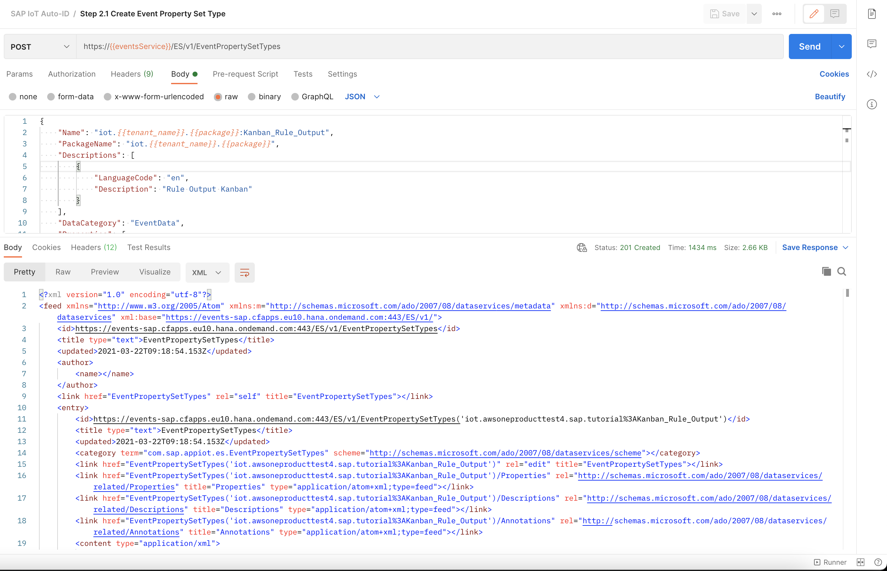
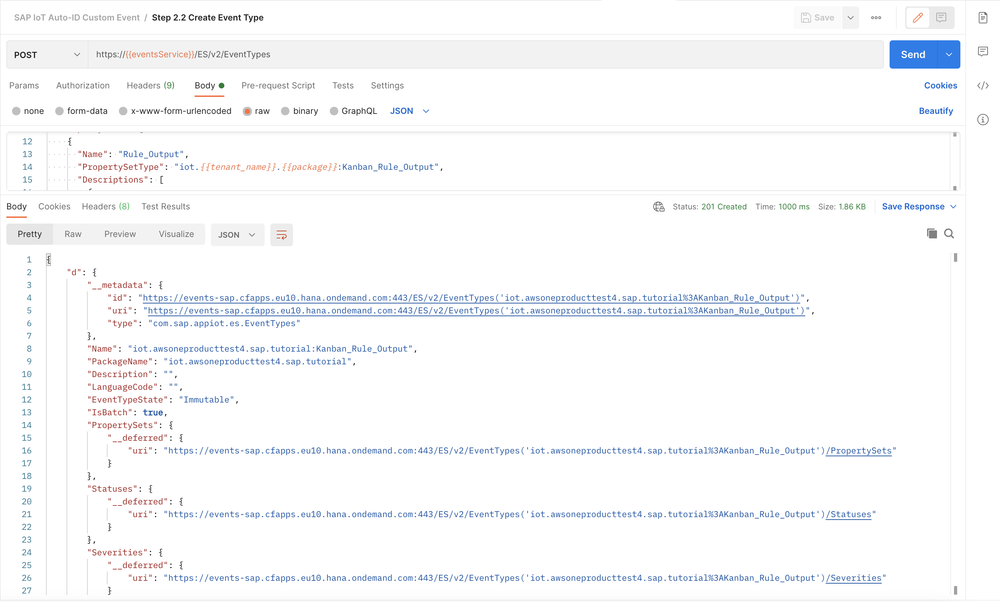
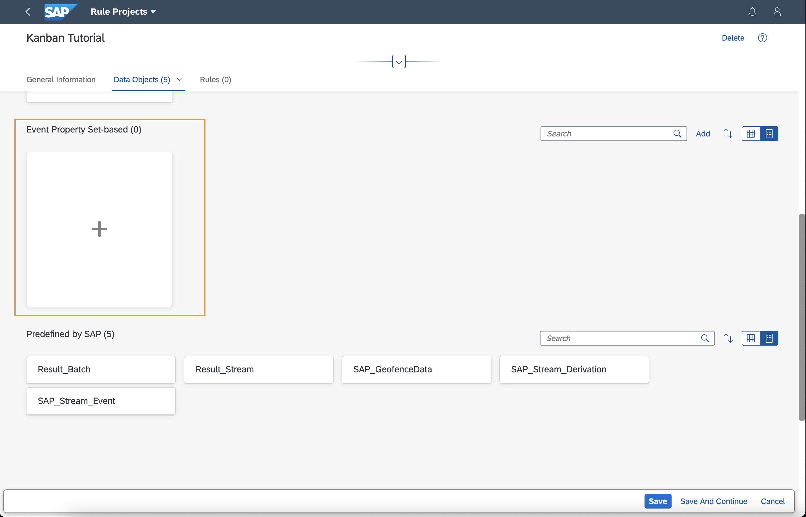
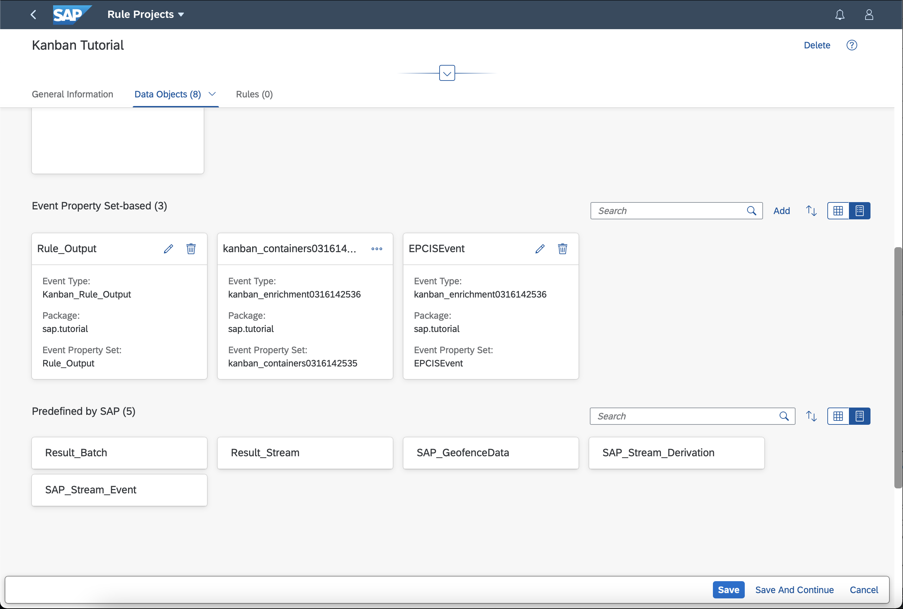
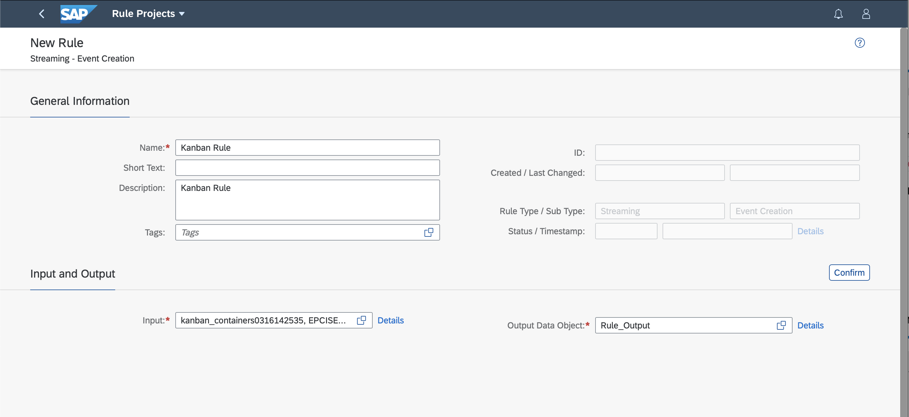

## Prerequisites
- Basic knowledge of REST, APIs and Postman
- Followed the Tutorial [Install Postman Rest Client](api-tools-postman-install)
- You have licensed SAP Internet of Things (with the new capacity unit based licensing introduced in August 2020, your company has a Cloud Platform Enterprise Agreement or Pay-As-You-Go for SAP BTP and you have subscribed to the `oneproduct` service plan)
 - You have setup the subscription for SAP IoT in your global account in a tenant (e.g. in the DEV tenant, the guide for the basic setup is at [Get Started with Your SAP IoT Account](https://help.sap.com/viewer/195126f4601945cba0886cbbcbf3d364/latest/en-US/bfe6a46a13d14222949072bf330ff2f4.html) ).
 - Your SAP User has at a minimum the `iot_role_collection` created during onboarding of your tenant and the associated roles (see [SAP Help on Providing Authorizations in](https://help.sap.com/viewer/195126f4601945cba0886cbbcbf3d364/latest/en-US/2810dd61e0a8446d839c936f341ec46d.html ) )
- You have created and setup the kanban **Business Context Hierarchy** and **Auto-ID Event Enrichment** using the [Activate Kanban Business Template](iot-autoid-kanban-bt) and [Adjust the Business Context Hierarchy for Kanban](iot-autoid-kanban-dls) tutorials.
- You have created destinations for the kanban APIs as described in [Create Destinations for Kanban APIs](iot-autoid-kanban-destination)
- You have setup Postman incl. the sample Postman collection and know how to retrieve OAuth token for SAP Internet of Things APIs as described in [Create Device Model and Thing and ingest EPCIS event](iot-autoid-device)


## Details
### You will learn
  - How to create a kanban Event Property Set Type and Event Type
  - How to create a kanban Rule Project and Rule
  - How to create a kanban Action


---

[ACCORDION-BEGIN [Step 1:](Configure event in SAP Internet of Things)]

Before you can create your **Rule** we need to create a custom **Event Type** which you will use as Output in the Rule later on. To do so, you must do the following: (For more information see [SAP Help Portal](https://help.sap.com/viewer/fffd6ca18e374c2e80688dab5c31527f/latest/en-US/f6fd1c9194d64286967e2446376b254c.html) )

  - Read the fully qualified package name by triggering **Step 1.1 Get Package name** and update the `package` Postman environment variable to your package name, for example **`iot.tenant.sap.tutorial`**.

  - Create your `Event Property Set Type` by using the Postman collection and triggering the request **Step 2.1 Create Event Property Set Type**.

    !

  - Create your `Event Type` by using the Postman collection and triggering the request **Step 2.2 Create Event Type**.

    !

[DONE]
[ACCORDION-END]

[ACCORDION-BEGIN [Step 2:](Create rule project and add property sets)]

You can define rules to specify conditions to generate events which can be consumed in actions to trigger a kanban container status update for Auto-ID scanner events. Multiple rules can be bundled in a **Rule Project**.


1.    Open the Fiori launchpad and Navigate to the **IoT Rules and Actions** tab and open the app **Rule Projects** in the Fiori Launchpad to create a new project by clicking **Create**.

2.    Provide a unique name for the name and description fields (for example, **`Kanban Tutorial`**) and confirm.

3.    Add your custom Event Type created in Step 2 as **Event Property Set-based Data Object**

    !

4.    Add your Auto-ID Events and Enrichments (`kanban_enrichmentXXXXXX` and `EPCISEvent`) as well as Event Property Sets.

At the end the Rule Project's Property Set should look as follows:

!

[DONE]
[ACCORDION-END]

[ACCORDION-BEGIN [Step 3:](Create rule)]

Now that you have a **Rule Project**, you can create a rule. In the **Rule Projects** app navigate to the **Rules** tab and create a **Streaming - Event Creation** rule.


  1.    Provide a unique name for the name and description (for example, **`Kanban Rule`**).

  2.    Add the Event Property Sets `kanban_enrichmentXXXXXX` and `EPCISEvent` as **Input**.

  3.    Add the Event Property Set `Rule_Output` as **Output**.

    !

  4.    Click **Confirm** to process the maintained information. The **Rule Editor** and **Settings** section will now be loaded based on your inputs.

  5.    A sample rule condition is provided below which you can enter it into the **Rule Editor** (you have to type the condition as copy-paste isn't possible).

  6.    Now you can **Save** and **Activate** the **Rule on Cloud**.

```
  IF  EPCISEvent.ReadpointID ='Reader_01'

    THEN      KanbanContainer:       kanban_containersXXXXXX.KanbanContainer
              KanbanContainerStatus: '2'


  ELSE IF EPCISEvent.ReadpointID = 'Reader_02'

    THEN      KanbanContainer:       kanban_containersXXXXXX.KanbanContainer
              KanbanContainerStatus: '5'

```

[DONE]
[ACCORDION-END]

[ACCORDION-BEGIN [Step 4: ](Create service integration action)]

>To define an action, you need to configure a Destination for the kanban API that allows you to update the kanban Status in SAP S/4HANA Cloud. Please refer to the tutorial [Create Destinations for kanban APIs](iot-autoid-kanban-destination) for more details.


If the above rule condition is satisfied, the rule will raise an Event based on your created custom Event Type. To react on this you need to define an action to trigger the API call to the SAP S/4HANA or SAP S/4HANA Cloud system. To do so navigate to the **IoT Rules and Actions** tab and then to **Actions** tile in the Fiori launchpad.

- Once you are in the create screen, provide a unique name for **Name** and **Description** (for example, **`Kanban Status Tutorial Action`**) to avoid conflicts.

- Select `Custom Event` for **Triggered by** field.

- Select the Event Type created in Step 2 as the **Custom Event Type**

- Select `epcis` as **Thing Type** ( **Package Name**: `epcis`)

- Select `Service Integration` as **Action Type**

- Finally, select your **Destination** and **Save** your **Action**.

The next tutorial to consider doing might be this one to ingest an EPCIS Event to see your the process end-to-end [Create EPCIS Event to change Kanban status](iot-autoid-kanban-create-event)

[VALIDATE_1]
[ACCORDION-END]

---
