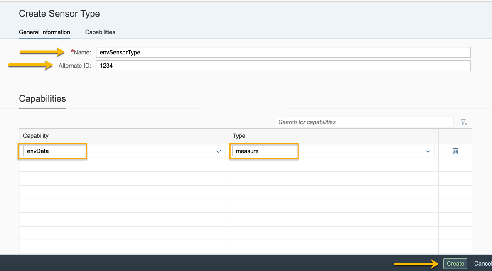
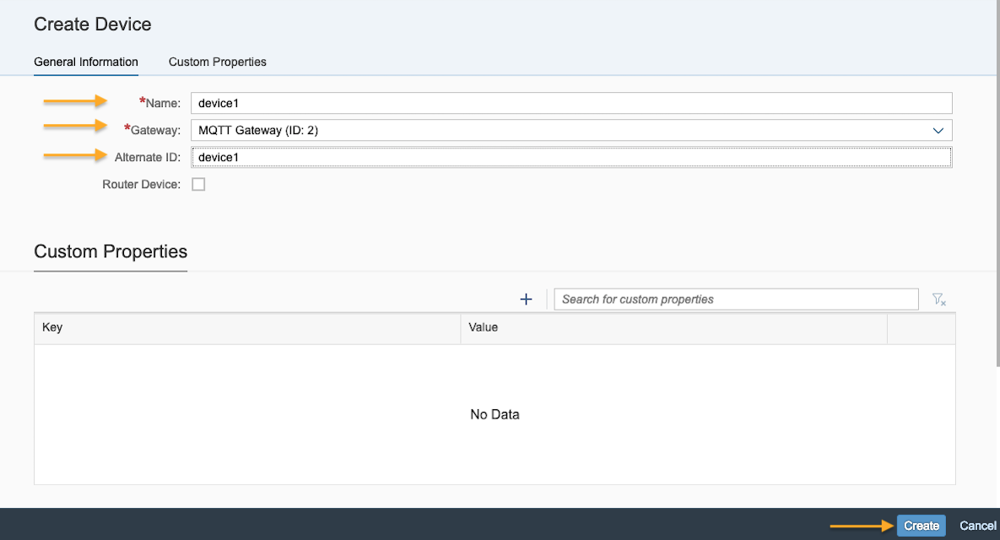

## Prerequisites  
- **Proficiency:** Beginner
- **Tutorials:** [Get Your Hands on SAP Leonardo IoT Foundation Software and Hardware](https://www.sap.com/developer/tutorials/iot-express-1-buy-sapstore.html)
- **Configuration:**
1. You or someone from your team should has followed this guide [Enabling the Internet of Things Service for the Cloud
  Foundry Environment](https://help.sap.com/viewer/c48328a1bee749da9902d52f080dba0d/Cloud/en-US).
2. You or someone from your team has created a tenant and a user to work in for yourself based on the instance owner credentials from the previous step and this guide [Creating User and Tenant](https://help.sap.com/viewer/78ac6b240a97447986e09b991d8a570a/Cloud/en-US).
2. If you want your data to feed into the thing model (aka, Digital Twin) in SAP IoT Application Enablement, then you or someone in your team needs to open an incident at [http://support.sap.com](http://support.sap.com) on component `BC-NEO-SVC-IOT` to ask for your SAP Cloud Platform IoT Service instance to be hooked up to your SAP IoT Application Enablement subscription. Please make sure you check out the subsequent tutorials in this case.

## Details
### You will learn
- How to create a device model
- How to ingest simulated data using a Node.js script
- How to ingest data using SAP Leonardo IoT Foundation Starter Kit

### Time to Complete
**15 Min**

## Next Steps
- **Tutorials:** [Assemble and Configure Device Hardware](https://www.sap.com/developer/tutorials/iot-express-3-configure-device.html), but you can also skip to [Create a Thing Model and Bind Your Device into a Business Context](https://www.sap.com/developer/tutorials/iot-express-4-create-thing-model.html) if you do not have the time or do now want to use real hardware at this point.

---

[ACCORDION-BEGIN [Step 1: ](Login to your IoT service instance)]

  1. Go to `https://<INSTANCE-NAME>.eu10.cp.iot.sap/iot/cockpit/#/welcome` (replace `<INSTANCE-NAME>` with your own, it looks like this for example: https://76eae3d3-9de6-4345-b26c-ff35be052652.eu10.cp.iot.sap/). Open a browser window and access the IoT Service for Cloud Foundry cockpit from it - the fastest way to get there is to open [http://hana.ondemand.com/](http://hana.ondemand.com/) and then navigate to your cloud foundry sub-account, from there to your space and in there you can find the `dashboard` in the service instances list.
  2. Login with your user name and password (in the cloud cockpit you can find the root user credentials in the cloud foundry space in the service key area of the service instance)

[DONE]

[ACCORDION-END]


[ACCORDION-BEGIN [Step 2: ](Create a new capability)]

  1. On the left-side menu, expand **Device Management**.
  2. Click **Capabilities**.
  3. Create a new capability by clicking the `+` at the top right.
  4. Set **Name** to `envData`.
  5. Set **`AlternateID`** to `envData`.
  6. Add records to the **Properties** list using the `+` (near the search field on the left side).
  7. Add the following properties:

    | Name | Type | Unit of Measure |
    |------|------|-----------------|
    |`temperature`|`integer`|`°C`|
    |`humidity`|`integer`|`%`|
    |`light`|`integer`|`lux`|
  10. Click **Create** (bottom-right of the page on the grey stripe).


[DONE]

[ACCORDION-END]


[ACCORDION-BEGIN [Step 3: ](Create a new sensor type)]

You need to define a sensor type to assign sensors on the devices.

  1. On the left-side menu, expand **Device Management**.
  2. Click **Sensor Types**.
  3. With the `+` on top right of **Sensor Types** list, create a new type.
  4. For **Name**, enter `envSensorType`.
  5. For **Alternate ID**, enter an integer between 0 and 2147483647.
  6. In the **Capabilities** list, add a row with **Capability** as `envData` and **Type** as `measure`.
  7. Click **Create** (bottom-right of the page, on the grey stripe).




[DONE]

[ACCORDION-END]


[ACCORDION-BEGIN [Step 4: ](Create a new MQTT device)]

You will create a new device with a sensor using the already defined sensor type and capability described in previous steps.

  1. On the left-side menu, expand **Device Management**.
  2. Click **Devices**.
  3. With the `+` on top right of **Devices** list, create a new device.
  4. Set the following fields:

    | Name | Value |
    |------|------|
    | **Name** |`device1`|
    | **Gateway** | Select the MQTT gateway |
    | **Alternate ID** |`device1`|
  7. Click **Create** (bottom-right of the page, on the grey stripe).
  8. After the device is created, add a new sensor with the type `envSensorType`.





Your device has a sensor now. Check the sensor alternate ID that was defined by you (or auto-generated if you did not specify it) in the sensor list.

[DONE]

[ACCORDION-END]

[ACCORDION-BEGIN [Step 5: ](Download PEM certificate for device)]

You will download the certificate. Be sure you write down the secret password from the pop-up window.

  1. Navigate to the newly created device using the **Devices** list (see Step 4 if you need more details).
  2. Click the **Certificate** tab.
  3. Click **Generate Certificate**.
  4. Set **Certificate Type** to `pem`.
  5. Click **Generate** on the pop-up window.
  6. Copy-paste and persist the secret displayed on screen and the certificate file that was downloaded in the background (check your browser default folder for downloads or your browser downloads section to see the file).

  >Do not forget to backup the certificate and secret password. You can email the certificate and the secret password to yourself in case you'll need it to access the device.

  >You can always generate a new certificate. The old one will remain valid.


[DONE]

[ACCORDION-END]


[ACCORDION-BEGIN [Step 6: ](Send simulated data to device via MQTT)]

You'll need to have installed Node.js on your machine or on the SAP IoT Foundation Hardware Kit to continue.

You will learn to Ingest Simulated Data using MQTT using Node.js and the device certificate.
If you have the hardware kit, than replace lines 195-199 with the actual reading for the values.

  1. Create a folder named `node-mqtt-simulator`.
  2. In the folder, create a file called `package.json` and copy-paste the following code :

```javascript
{
  "name": "data-ingestion-iot-services",
  "version": "1.0.0",
  "description": "",
  "main": "index.js",
  "scripts": {
    "start": "node app.js",
    "test": "echo \"Error: no test specified\" && exit 1"
  },
  "author": "",
  "license": "ISC",
  "dependencies": {
    "mqtt": "^2.15.2",
    "random-js": "^1.0.8"
  }
}
```

3. In the folder, a file called `app.js` and copy-paste the following code :

```javascript
const mqtt = require('mqtt')
var fs = require("fs");
var random = require('random-js')();

const deviceAlternateId = "device1";
const sensorAltenateId = "check_your_sensor_alternate_id_because_it_is_autogenerated";
const capabilityAlternateId = "envData";

const certFile = "./certificates/device1-device_certificate.pem";
const secretPasswordFile = "./certificates/device1-device_password.txt";

var connectOptions = {
    keepalive: 10,
    clientId: deviceAlternateId,
    clean: true,
    reconnectPeriod: 2000,
    connectTimeout: 2000,
    cert: fs.readFileSync(certFile),
    key: fs.readFileSync(certFile),
    passphrase: fs.readFileSync(secretPasswordFile).toString(),
    rejectUnauthorized: false
};

var mqttClient = mqtt.connect("mqtts://76eae3d3-9de6-4345-b26c-ff35be052652.eu10.cp.iot.sap:8883", connectOptions);

mqttClient.on('connect', function() {

	console.log("mqttClient connect");
});

mqttClient.on("error", function(err) {
	console.log("mqttClient ERROR : ");
	console.log(err);
});

mqttClient.on('offline', function() {
    console.log("mqttClient offline");
});

mqttClient.on('reconnect', function() {
    console.log("mqttClient reconnect");
});

mqttClient.on('close', function(){
	console.log("mqttClient close");
});

var refTemperature = 25;
var refHumidity = 70;
var refLight = 800;

var lastTemperature = refTemperature;
var lastHumidity = refHumidity;
var lastLight = refLight;

function generateDataAndSendViaMQTT() {

    console.log(new Date().toISOString(), "Creating random data...");

    var data = {
        temperature : random.integer(lastTemperature - 1, lastTemperature + 1),
        humidity : random.integer(lastHumidity - 10, lastHumidity + 10),
        light : random.integer(lastLight - 100, lastLight + 100)
    }

    sendValuesToSCPIoTService(data);

    lastTemperature = data.temperature;
    lastHumidity = data.humidity;
    lastLight = data.light;
}

function sendValuesToSCPIoTService(data){

    var pushData = {
        "sensorAlternateId" : sensorAltenateId,
        "capabilityAlternateId" : capabilityAlternateId,
        "measures" : [
            data.temperature.toString(),
            data.humidity.toString(),
            data.light.toString()
        ]
    }

    var topicName = 'measures/' + deviceAlternateId;

    mqttClient.publish(topicName, JSON.stringify(pushData), [], function(err){
        if(!err){
            console.log("MQQT client pushed data : ", pushData);
        }
        else{
            console.log("MQQT client error :");
            console.log(pushData);
            console.log(err);
        }
    });

}

setInterval(generateDataAndSendViaMQTT, 1000);
```

  3. Change the code in 2 places:
    - Change `sensorAlternateId` to the one that was generated for you in the device management cockpit.
    - Change the endpoint for MQTT to your endpoint (check the URL of the cockpit which you brought up earlier to create the device model).
  4. Go to the command line tool on your computer, change into the directory created before and then run `npm install` to install required modules.
  5. Create a subfolder called `certificates`.
  6. Download the certificate file and save it in the `certificates` folder with name `device1-device_certificate.pem`.
  7. Copy the secret and paste it in a new file, in the same folder as the certificate, with name `device1-device_password.txt`. Make sure you only add the password and no newline or return character.
  8. Download required node libraries using `npm install` from the folder that has the `package.json`in it.
  9. Run the app with `npm start` or `node app.js`.
  9. Check the console log for errors and additional information. The console log should look like this:

    

[DONE]

[ACCORDION-END]

[ACCORDION-BEGIN [Step 7: ](Check device ingested data)]

To check the device data, navigate using the `Device Management`.

  1. Click the device in the `Data Visualisation` section.
  2. Select the sensor, capability and all properties.

You should see data flowing in the system.


[VALIDATE_1]

[ACCORDION-END]

---
