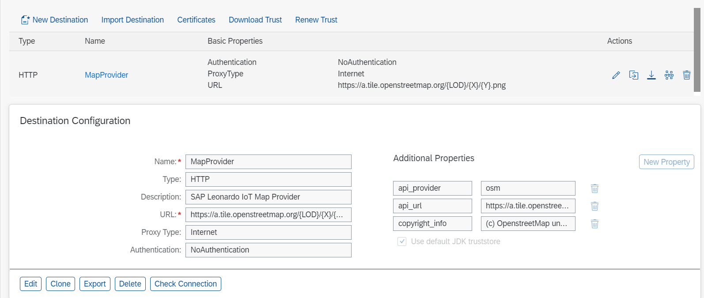
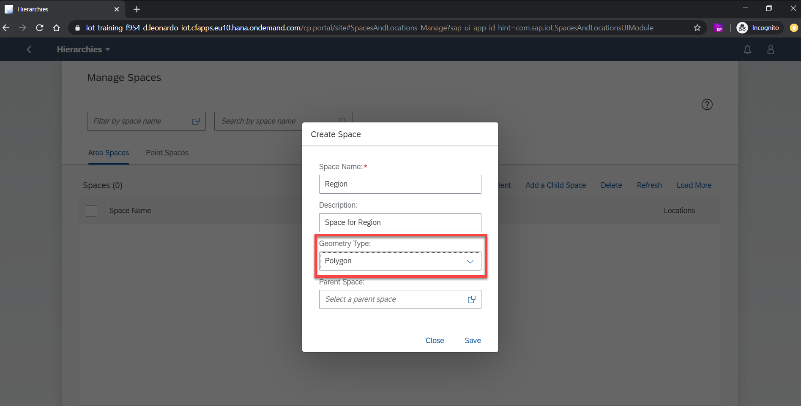
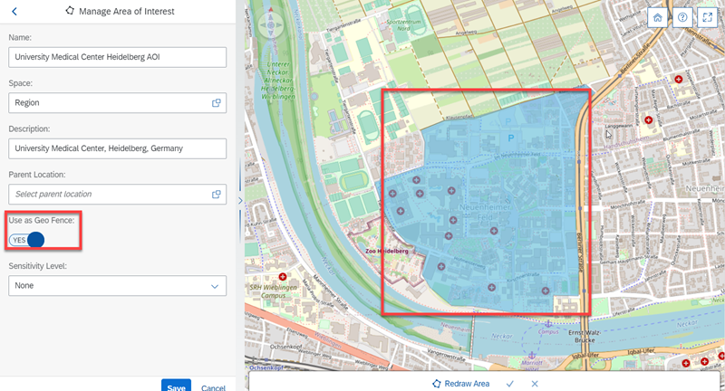
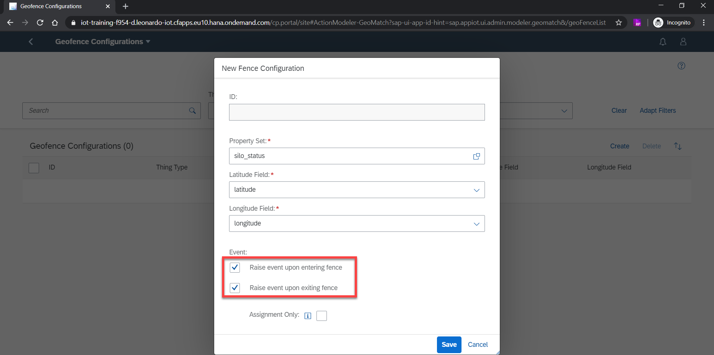
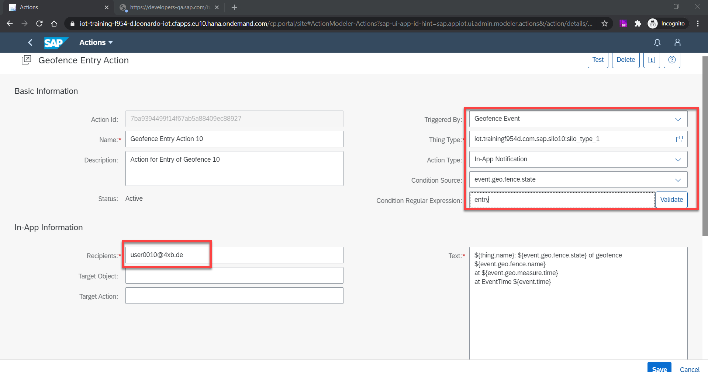
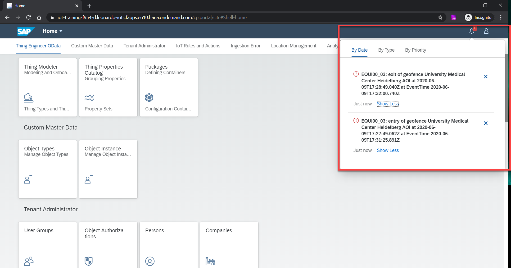
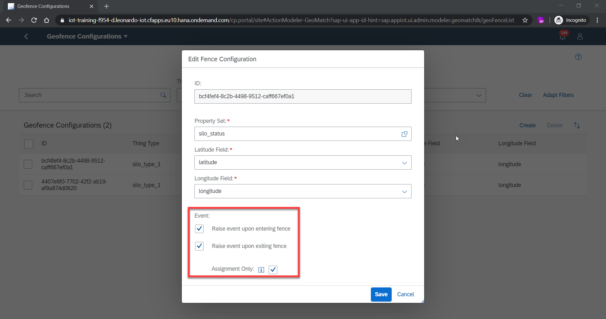
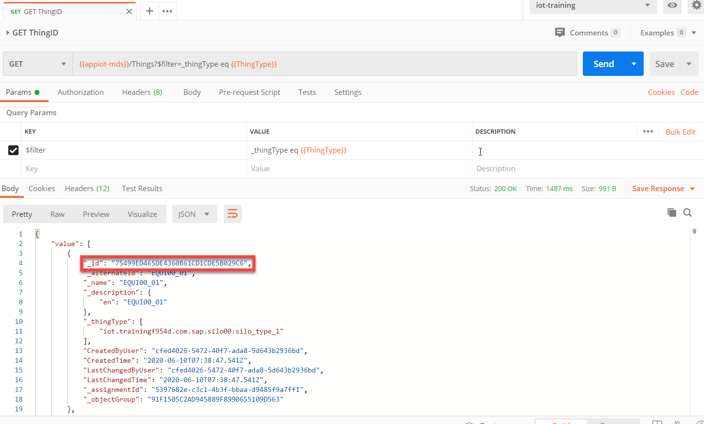
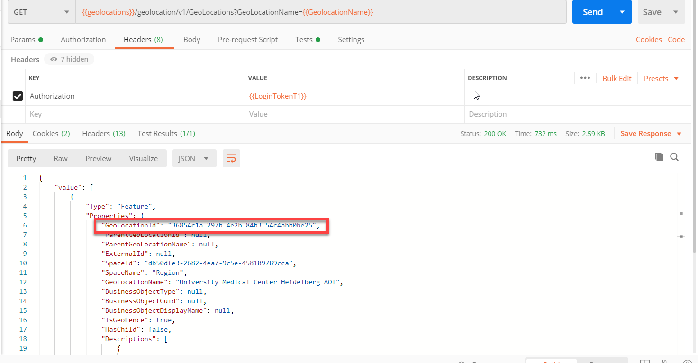

## Prerequisites
 - Basic knowledge of [REST](https://www.restapitutorial.com/) APIs.
 - Basic knowledge of [Postman](https://www.postman.com/) (Version 7.29.1 and above).
 - Have a working thing with continuous data ingestion according to the [Onboard Virtual Devices Sending Data from Your Computer](iot-onboard-device) tutorial.
 - Your SAP user from <accounts.sap.com> has been added to the Cloud Foundry space in this tenant as a Space Developer so you can retrieve the required credentials for accessing the APIs.
 - Your user has at a minimum the `iot_role_collection` permission created during onboarding of your tenant and the associated roles.
 - Basic understanding of SAP Internet of Things (IoT) Actions services.
 - Have one of the map providers (ESRI Maps, HERE Maps, OpenStreetMap, Google Maps) configured for the subaccount.

## Details
### You will learn
- How to define a geolocation space
- How to define an area of interest geolocation as geofence
- How to configure geofence assignments
- How to configure an action on geofencing to create notifications

SAP Internet of Things (IoT) geolocation services enable you to locate a specific object or device (real-time things -- like vehicles equipped with GPS sensors) based on the geographical coordinates. It allows you to define geolocations -- point of interest and area of interest (geofence).

A geofence is a virtual fence around an area of interest. Geofencing can be used to notify events like entry or exit of a thing in a defined area. This tutorial helps you with the first steps of setting up geolocations, configuring a geofence and configuring actions for the geofence events.

---

[ACCORDION-BEGIN [Step 1: ](Configure destination for map provider)]

The first step for creating the geolocations is to configure a map provider of your choice (ESRI Maps, HERE Maps, OpenStreetMap, Google Maps are supported for now).

1.    Go to your Cloud Foundry subaccount at [https://hana.ondemand.com/](https://hana.ondemand.com/), click **Connectivity** on the left panel and then click **Destinations**. Under Destination, add the map service provider destination by providing the details. An example is provided below for OpenStreetMap configuration.

    |  Property Name  | Value
    |  :------------- | :-------------
    |  Name           | `MapProvider`
    |  Type           | `HTTP`
    |  Description    | `SAP IoT Map Provider`
    |  URL            | `http://sap.com`
    |  Proxy Type     | `Internet`
    |  Authentication | `NoAuthentication`


2.    Choose **New Property** under Additional Properties and add the following properties based on the map service provider you want to configure.

    |  Property Name    | Value
    |  :-------------   | :-------------
    |  `api_url`          | `API URL proided by OpenStreetMap for rendering the base map`
    |  `api_provider`     | `osm`
    |  `copyright_info`   | `Copyright information provided by OpenStreetMap based on your license terms`

    !

[DONE]
[ACCORDION-END]

[ACCORDION-BEGIN [Step 2: ](Define geolocation space)]

A geolocation space represents the semantics such as geometry, related geolocations and hierarchy of a geolocation. A geolocation space can be of geometry type point or polygon.

In this case, let us assume a truck (thing) is delivering the items from ACME GmbH to the University Medical Centre Heidelberg. You can create the University Medical Centre Heidelberg and ACME GmbH as the points of interest and a geofence around the University Medical Centre Heidelberg and ACME GmbH to track the entry and exit of the truck. To create a point of interest / area of interest (geofence) geolocation, a geolocation space of geometry type point/ polygon are needed, which you will create in this step.

1. Open the Fiori launchpad.

    Go to your subaccount, click **Subscriptions**, and then click on **Go to Application** link for **SAP IoT** tile.

    >If you know the tenant name (in Cloud Foundry developer lingo called 'subdomain' and in SAP Cloud Platform lingo called 'Cloud Foundry subaccount') you can also invoke it by replacing **'iot-training-f954-d'** with your tenant name in the following URL:

    >[https://iot-training-f954-d.leonardo-iot.cfapps.eu10.hana.ondemand.com/](https://iot-training-f954-d.leonardo-iot.cfapps.eu10.hana.ondemand.com/)

    Use your SAP user credentials to log in to the Fiori launchpad.

2. Navigate to Hierarchies tile.

    Navigate to the **Location Management** tab and then to **Hierarchies** tile in the Fiori launchpad to create a geolocation space. In the hierarchies screen, click **Create a New Space** button. A dialog box will open where you can fill in the details. An example is provided below for creating a geolocation space of geometry type polygon using the Hierarchies UI.

    !

    In the above example, the Geometry Type is selected as **Polygon** from the dropdown. Using a **unique name** for the geolocation space, enables this geolocation space to not be in conflict with other geolocation spaces (for example, **Region 0001**)

[DONE]
[ACCORDION-END]

[ACCORDION-BEGIN [Step 3: ](Define geofence)]

An area of interest is a closed polygon with a minimum of three vertices. To track the movement of the thing around a location, you can define an area of interest as a geofence. A geofence is a geolocation of geometry type polygon.

To create a geofence, navigate to the **Location Management** tab and then to the **Locations** tile in the Fiori launchpad. Click **Create** button and select **Create Area**. Once you are in the create screen, follow the below steps to create an area of interest:

1.     Click **Draw Area**.

2.     Zoom in on the map where you want to create the geofence. Click on the map to create the area of interest. The area of interest will be completed when the last point and the first point are the same (i.e, a closed polygon).
> Hint: Click at least 2 or 3 times (2 or 3 vertices) with different positions on the map to see the shape of the area coming up.

3.    Once you are satisfied with the area of interest you have drawn on the map, **confirm it** by clicking on the **tick mark** at the footer of the map.

4.    Fill in the form details. Provide a **unique name** for the geolocation to avoid conflicts (for example, **University Medical Centre Heidelberg 0001**).

5.    To define the area of interest as a geofence, you must mark **Use as Geo Fence** as **YES**.

In this case, let us assume you want to track the entry and exit of the truck around the University Medical Centre Heidelberg. For this, you can create an area of interest around the University Medical Centre Heidelberg and define it as a geofence.

An example is provided below for defining an area of interest geolocation as geofence.

!

You can create an area of interest geolocation according to your scenario and mark it as geofence to track the thing's movement around the area. If you face any errors regarding the size of the geofence, please create a smaller geofence and try again.

[DONE]
[ACCORDION-END]

[ACCORDION-BEGIN [Step 4: ](Define geofence configuration)]

In the current scenario, you have a geofence around the University Medical Centre Heidelberg premises. You can now configure the geofence to trigger events on entry and exit of the truck.

To define geofence configurations, navigate to the **Location Management** tab and then to the **Geofence Configurations** tile in the Fiori launchpad. Click **Create** button. Once the create dialog is opened, follow the below steps to define the geofence configurations:

1.    Open the value help dialog for the Property Set. Select the package that you created for your thing model (refer to [Onboard Virtual Devices Sending Data from Your Computer](iot-onboard-device) tutorial to create a thing model and ingest data).

2.    Choose the Thing Type (for example, `silo_type_1`) which has measured values (for example, `silo_status`).

3.    Select **latitude** and **longitude** from the dropdown values for **Latitude Field** and **Longitude Field**.

4.    Select both the **entry** and **exit** events (you can also select either of the options depending on your scenario).

5.    **Uncheck** the **Assignment Only** option and save (details of this usage is given in step 6 of this tutorial).

An example is provided below for defining the geofence configurations for the entry and exit events.

!

[DONE]
[ACCORDION-END]

[ACCORDION-BEGIN [Step 5: ](Define actions for geofence events)]

In the current scenario, you have the following:

- An area of interest defined as geofence around the University Medical Centre Heidelberg.
- A truck that is moving towards the University Medical Centre Heidelberg area.

Now, you can create an action to send notifications on the truck's entry or exit from the geofence.

An action can be a receiver of an event. Navigate to the **IoT Rules and Actions** tab and then to the **Actions** tile in the Fiori launchpad.

To create an action, click **Create** button. Once you are in the create screen, fill in the name and description fields by providing a **unique name** to avoid conflicts (for example, **Geofence entry action 0001**) and follow the below steps to create a geofence action.

1.    Select **Geofence Event** from the dropdown for **Triggered by**.

2.    Select the thing type you created for your thing model (for example, `iot.trainingf954d.com.sap.silo01:silo_type_1`). Refer to [Onboard Virtual Devices Sending Data from Your Computer](iot-onboard-device) tutorial to create a thing model and ingest data.

3.    Select the **Action Type** as **In-App Notification**.

4.    Provide the **Condition Source** as **event.geo.fence.state**.

5.    Provide the **Condition Regular Expression** as **entry**.

6.    Provide your SAP user email address (the email you used to login to the Fiori launchpad) for the **Recipients**.

7.    Provide the below **Text** and save:
```Text
${thing.name}: ${event.geo.fence.state} of geofence ${event.geo.fence.name}  
at ${event.geo.measure.time}
at EventTime ${event.time}
```

8.    Confirm the email address (the email you used to login to the Fiori launchpad)

      An example is provided below of an action for the entry of the truck in the geofence:

      !

    Once the truck starts moving from a point, data is ingested continuously. You can check the truck's (thing) data using the Thing Modeler UI in the Fiori launchpad. The action is triggered when the truck enters the University Medical Centre Heidelberg Geofence and you will receive a notification in the Fiori launchpad with the action text that you have defined above. You can check the notifications by clicking on **Notifications** button in the Fiori launchpad.

    !

    Similarly, you can create another action for the exit of the truck from the geofence.

[DONE]
[ACCORDION-END]

[ACCORDION-BEGIN [Step 6: ](Retrieve OAuth token for geofence assignments)]

You can access the SAP IoT APIs using an OAuth Token. After you subscribe your subaccount to SAP IoT, you can retrieve the client secret from the service keys you created for your subaccount.

1.    Retrieve client credentials.

    Refer to the document to [retrieve Client ID and Client Secret](https://help.sap.com/viewer/fffd6ca18e374c2e80688dab5c31527f/2009a/en-US/a41c28db0cf449059d48c23fa5f7b24b.html). You can use the client secret to retrieve the OAuth token. The client secret is unique for a subaccount. You can access all the APIs and data within the subaccount using this OAuth token. This kind of authentication is used when you build backend applications, where you don't have a user context.

2.    Set up Postman collection.

    Postman is a popular and easy to use REST client using which you can access the SAP IoT APIs. Please refer to the [introduction guide](https://learning.postman.com/docs/getting-started/introduction/) for understanding the usage of Postman.

    We have provided a set of sample Postman collections on GitHub for you to download. Please clone or download/unzip the repository **sap-iot-samples** at [https://github.com/SAP-samples/sap-iot-samples](https://github.com/SAP-samples/sap-iot-samples). The Postman collection (iot-location-services-samples -> Geofence) includes all the API calls used in this tutorial and the payload structures for the same. However, if you would like to try out the APIs on your own, we have provided the details in this tutorial on the consumption of the APIs.

3.    Generate OAuth token.

    Before retrieving the OAuth token, you must update the following in the [Postman environment variables](https://learning.postman.com/docs/sending-requests/managing-environments/)

    - Update the tenant name (your subaccount name - for example, iot.trainingf954d) to the `tenant_name` Postman environment variable.

    - Update the `uaadomain` from the service key to `uaadomain` Postman environment variable.

    - Update the Client ID and Client Secret from the service key you generated for your subaccount to `client_id` and `client_secret` Postman environment variables.

    - You can retrieve the `OAuth` token by using the Postman collection (Geofence collection) and triggering the request **Step 6.1: GET OAuth Token**.

    - Update the generated token to `LoginToken1` Postman environment variable appending 'Bearer' at the beginning. For accessing the SAP IoT APIs, enter this OAuth token as an Authorization Header in the Postman.

    !

    >You can refer to the [Developer Guide](https://help.sap.com/viewer/fffd6ca18e374c2e80688dab5c31527f/2005b/en-US/7b3a94e68be9460680a915138a160c67.html) to create an OAuth Token if you would like to understand the steps for generating the token in detail.

[DONE]
[ACCORDION-END]

[ACCORDION-BEGIN [Step 7: ](Configure geofence assignments)]

To avoid receiving events from non-relevant geofences, select the Assignment Only option in the geofence configuration. With this configuration, you are assigning the geofence to a thing, for which you would like to receive the events.

If the Assignment Only option is selected in the geofence configuration, an assignment of the thing to the geofence must be done. Otherwise, the geofence events and notifications will not be generated. You can select the **Assignment Only** option by editing your geofence configuration using the **Geofence Configurations** tile in the Fiori launchpad.

!

To create a geofence assignment, the `ThingID` and `GeofenceId` are needed. Use the provided Postman collection (Geofence collection) to retrieve the `ThingID`, `GeofenceId` and create geofence assignments.

1.    Retrieve the `ThingID`.

    - First, update the thing type name in the Postman environment variable (`ThingType`) with the thing type you created for your thing model (for example, `iot.trainingf954d.com.sap.silo00:silo_type_1`).

    - Next, trigger the **Step 6.2: GET `ThingID`** request to get the `ThingID`.

    However, if you would like to try out on your own, replace `appiot-mds.cfapps.eu10.hana.ondemand.com` with the `appiot-mds` domain from the service key you generated for your subaccount in the below URL and replace `iot.trainingf954d.com.sap.silo00:silo_type_1` with the thing type you created for your thing model.

    ```URL
    https://appiot-mds.cfapps.eu10.hana.ondemand.com/Things?$filter=_thingType eq 'iot.trainingf954d.com.sap.silo00:silo_type_1'
    ```

    The above API will return all the things for the thing type provided in the request. You can select the `ThingID` (`_id` in the response) you want to use. Update the `ThingID`(`_id` in the response) you retrieved here, to the Postman environment variable `thing_id` for future use.

    !

2.    Retrieve the `GeofenceId`.

    - Use the Postman collection (Geofence collection) that you downloaded from the GitHub link and update the geolocation name (for example, **University Medical Center Heidelberg AOI**) you want use to the `GeolocationName` Postman environment variable.

    - Next, trigger the **Step 6.3: GET `GeofenceId`** request to get the `GeofenceId`. Update the `GeofenceId` (`GeoLocationId` in the response) to the `GeofenceID` Postman environment variable for future use.

      !

    Below is the sample endpoint for the same. Replace `sap-iot-noah-live-geolocation-runtime.cfapps.eu10.hana.ondemand.com` with the `geolocation` domain from the service key you generated for your subaccount and replace University Medical Center Heidelberg AOI with the geolocation name you want to use.

    ```URL
    https://sap-iot-noah-live-geolocation-runtime.cfapps.eu10.hana.ondemand.com/geolocation/v1/GeoLocations?GeoLocationName=University Medical Center Heidelberg AOI
    ```

3.    Configure geofence assignments.

    Now that you have the `ThingID` and `GeofenceId`, you can create a geofence assignment. Use the Postman collection (Geofence collection) that you downloaded form the GitHub link and execute **Step 6.4: Create geofence assignments** request.

    !

    Below is the sample API endpoint and payload. Replace `sap-iot-noah-live-geolocation-geofence.cfapps.eu10.hana.ondemand.com` with the `geolocation-geofence` domain from the service key you generated for your subaccount.

    ```URL
    https://sap-iot-noah-live-geolocation-geofence.cfapps.eu10.hana.ondemand.com/geofence/v1/GeoFenceAssignments
    ```

    ```JavaScript
    [{
        "thingId": "{{thing_id}}",
        "fenceId": "{{fence_id}}",
        "fromTime": "2020-06-18T22:08:00.000Z",
        "toTime": "2020-06-18T22:22:00.000Z"
      }]
    ```

    The `ThingID` and `GeofenceId` retrieved in the previous steps are to be used in the above payload as values for `thing_id` and `fence_id` keys. The `fromTime` and `toTime` will be the timestamp in UTC format (which is basically the same as GMT time).

    Once you have assigned a thing to a geofence, you will receive geofence events only for that thing for the assigned geofence. If the assignments are not created, then you will not receive any notifications.

    In conclusion, geofencing can be used to track the movements of the things around a particular location.

[VALIDATE_7]
[ACCORDION-END]
