## Prerequisites
 - Your company has licensed SAP IoT, has a Cloud Platform Enterprise Agreement or you have purchased SAP (Leonardo) IoT at the sapstore.com ([http://www.sapstore.com/](https://www.sapstore.com/solutions/40108/SAP-Leonardo-IoT-Foundation%2C-express-edition))
 - Your company has licensed SAP Analytics Cloud
 - Your project team has setup the subscription for SAP (Leonardo) IoT in your company's global account in a tenant (e.g. in the DEV tenant, the guide for the basic setup is at [http://help.sap.com/](https://help.sap.com/viewer/195126f4601945cba0886cbbcbf3d364/2005a/en-US/bf128e1333534c04a1cfa18ae548e2b9.html))
 - Your SAP User from accounts.sap.com has been added to the cloud foundry space in this tenant as a Space Developer so you can retrieve the required credentials for accessing the APIs
 - Your SAP User has at a minimum the `leonardoiot_role_collection` created during onboarding of your tenant and the associated roles
 - Completed hands-on session on Thing Model configuration
 - Basic knowledge of REST APIs and working with Postman


## Details
### You will learn
  - How to define dimensions, measures and aggregates
  - How to create a Data Model using dimensions, measures and aggregates
  - How to establish live connectivity between SAP IoT to SAC
  - How to create models and stories in SAC by consuming the data model created in SAP IoT

---
[ACCORDION-BEGIN [Step 1: ](Pre-Requisite: Thing Modelling in IoT )]

Pre-requisite for SAC Integration is to have completed Thing Modelling exercise including data ingestion. For the convenience of participants who have not done, we will run thru the thing modelling exercise using APIs from the postman collection.

- Open
 [Share-point](https://sap-my.sharepoint.com/:f:/p/s_imtiyaz_shariff/EpPEzSrtuaJNgamOgI14ESkBOKFbWlNVPvPFzt9lHTDrIA?e=WjoLpf)
, download the Postman Collection & Postman Environment files
- Open Postman  > Import the Collection & environment
- **IMPORTANT** Go to the environment variable settings > Select the environment **SAC – Training** > Go to variable **Package Name** > Update the package name suffix with the assigned student ID 'XX'
   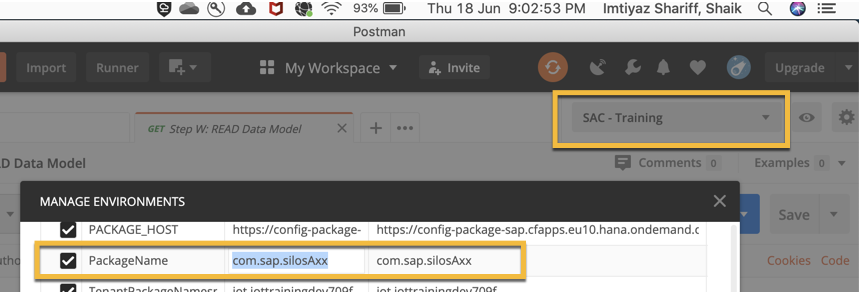
- Click on **Update**
- Go to Postman Collection and execute from **Step A** to **Step F** for Thing Model Configuration
    - Step A: Authentication to fetch JWT token  `you are good if the returned status code is 200 OK`
    - Step B: Create Package `you are good if the returned status code is 201 Created`
    - Step C: Create Master Data Property Set Type `you are good if the returned status code is 201 Created`
    - Step D: Create Time Series Property Set Type `you are good if the returned status code is 201 Created`
    - Step E: Create Silo Thing Type `you are good if the returned status code is 201 Created`
    - Step F: Read the newly created Silo Thing Type `you are good if the returned status code is 200 OK`

    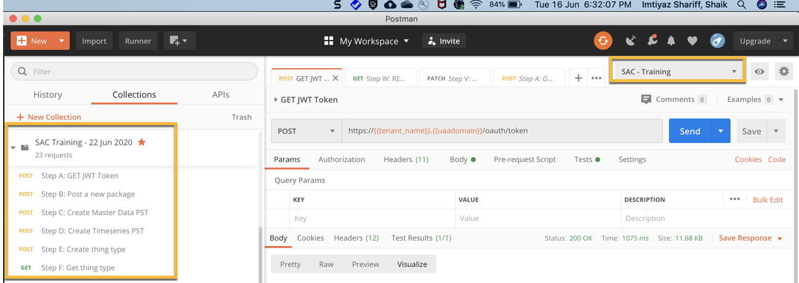
- Go to Postman Collection and execute from **Step G** to **Step J** for onboarding 4 Silos
    - Step G: Onboard Silo 1 `you are good if the returned status code is 201 Created`
    - Step H: Onboard Silo 2 `you are good if the returned status code is 201 Created`
    - Step I: Onboard Silo 3 `you are good if the returned status code is 201 Created`
    - Step J: Onboard Silo 4 `you are good if the returned status code is 201 Created`
  
- Go to Postman Collection and execute from **Step K** to **Step S** for creating master data and ingesting time series data for the silos.

    - Step K: Read the newly created Silo to ensure everything is correct `you are good if the returned status code is 200 OK`
    - Step L: Create Master Data for Silo 1 `you are good if the returned status code is 200 OK`
    - Step M: Create Master Data for Silo 2 `you are good if the returned status code is 200 OK`
    - Step N: Create Master Data for Silo 3 `you are good if the returned status code is 200 OK`
    - Step O: Create Master Data for Silo 4 `you are good if the returned status code is 200 OK`
    - Step P: Ingest Time Series Data for Silo 1 `you are good if the returned status code is 200 OK`
    - Step Q: Ingest Time Series Data for Silo 2 `you are good if the returned status code is 200 OK`
    - Step R: Ingest Time Series Data for Silo 3 `you are good if the returned status code is 200 OK`
    - Step S: Ingest Time Series Data for Silo 4 `you are good if the returned status code is 200 OK`

 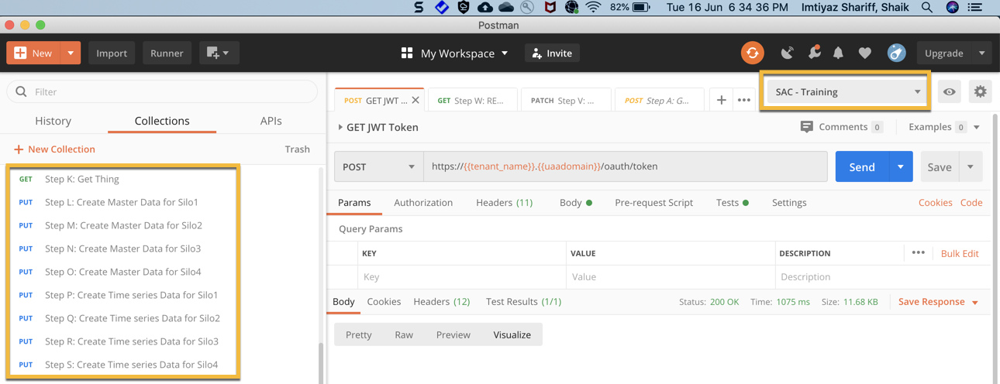


We are done with the pre-requisite Thing Model configuration to start with our SAC Data Modelling. Upon configuring the model and ingesting the data successfully, we complete this step, please proceed with further steps.

[DONE]
[ACCORDION-END]

[ACCORDION-BEGIN [Step 2: ](SAC Model Configuration)]

Now let us see the thing model that we just configured using API calls from Postman, in our IoT tenant : <https://iot-iottrainingdev-709f.leonardo-iot.cfapps.eu10.hana.ondemand.com/> by logging in using our shared credentials user00XX@4xb.de (XX is the student ID assigned to each participant).

Based on the business needs, users can configure the dimensions and measures based on Property Set Types available in the Thing Model. User can define the measure aggregates like SUM, MIN, MAX, COUNT (only these aggregates are supported currently) and the time window aggregate frequency like – Hourly, Daily, Weekly, and Monthly.

Additionally, a user can also configure dimensions. A dimension is a property based on which properties can be aggregated. For example, aggregation SUM of Fill Level based on a Dimension Material will give aggregated information about total stock of different material at any period of time. The combination of information the dimension, measure and aggregations is called a data model.

Also, user can define the retention period for the data model. This configuration sets the boundary condition for how much aggregated data will be persisted at any point of time. Users can also set a lag period which becomes useful in cases where the data arrives late. The changes of late data is high in cases of low internet connectivity for sensors.

In our previous Step 1, on Thing Modelling, we learnt how the Silos are configured with different properties like temperature, humidity etc and how the sensor data is sent to cloud and persisted. To pick up an analytic use case from the same thing model, let us assume that user want to **configure a chart in SAC to map the Average Temperature of each Silo from the time series data of last 7 days where my data is aggregated Daily.**

To keep it simple, we provide an sample data model to configure daily aggregates of temperature property for the last 7 days:

``` JavaScript
{
  "Name": "TrainingModelXX",
  "AggregationWindow": "DAILY",
  "TimeWindowIdentifier": "day",
  "TimeWindowValue": 7,
  "Descriptions": [
    {
      "Description": "Daily Silo Temperature Analysis XX",
      "LanguageCode": "en"
    }
  ],
  "Fields": [
    {
      "FriendlyName": "EQUI",
      "AnalyticType": "Dimension",
      "CatalogName": "{{TenantPackageNamespace}}.{{PackageName}}:silo_type_1",
      "CatalogType": "ThingType",
      "DatasetName": "silo_process_data",
      "DatasetType": "MasterData",
      "Name": "EQUI"
    },
    {
      "FriendlyName": "HANU",
      "AnalyticType": "Dimension",
      "CatalogName": "{{TenantPackageNamespace}}.{{PackageName}}:silo_type_1",
      "CatalogType": "ThingType",
      "DatasetName": "silo_process_data",
      "DatasetType": "MasterData",
      "Name": "HANU"
    },
    {
      "FriendlyName": "HumidityMAX",
      "AnalyticType": "Measure",
      "CatalogName": "{{TenantPackageNamespace}}.{{PackageName}}:silo_type_1",
      "CatalogType": "ThingType",
      "DatasetName": "silo_status",
      "DatasetType": "TimeSeriesData",
      "Name": "humidity",
      "AggregationType": "MAX"
    },
    {
      "FriendlyName": "HumidityMIN",
      "AnalyticType": "Measure",
      "CatalogName": "{{TenantPackageNamespace}}.{{PackageName}}:silo_type_1",
      "CatalogType": "ThingType",
      "DatasetName": "silo_status",
      "DatasetType": "TimeSeriesData",
      "Name": "humidity",
      "AggregationType": "MIN"
    },
    {
      "FriendlyName": "HumidityCOUNT",
      "AnalyticType": "Measure",
      "CatalogName": "{{TenantPackageNamespace}}.{{PackageName}}:silo_type_1",
      "CatalogType": "ThingType",
      "DatasetName": "silo_status",
      "DatasetType": "TimeSeriesData",
      "Name": "humidity",
      "AggregationType": "COUNT"
    },
    {
      "FriendlyName": "HumiditySUM",
      "AnalyticType": "Measure",
      "CatalogName": "{{TenantPackageNamespace}}.{{PackageName}}:silo_type_1",
      "CatalogType": "ThingType",
      "DatasetName": "silo_status",
      "DatasetType": "TimeSeriesData",
      "Name": "humidity",
      "AggregationType": "SUM"
    },
    {
      "FriendlyName": "TemperatureMAX",
      "AnalyticType": "Measure",
      "CatalogName": "{{TenantPackageNamespace}}.{{PackageName}}:silo_type_1",
      "CatalogType": "ThingType",
      "DatasetName": "silo_status",
      "DatasetType": "TimeSeriesData",
      "Name": "temperature",
      "AggregationType": "MAX"
    },
    {
      "FriendlyName": "TemperatureMIN",
      "AnalyticType": "Measure",
      "CatalogName": "{{TenantPackageNamespace}}.{{PackageName}}:silo_type_1",
      "CatalogType": "ThingType",
      "DatasetName": "silo_status",
      "DatasetType": "TimeSeriesData",
      "Name": "temperature",
      "AggregationType": "MIN"
    },
    {
      "FriendlyName": "TemperatureCOUNT",
      "AnalyticType": "Measure",
      "CatalogName": "{{TenantPackageNamespace}}.{{PackageName}}:silo_type_1",
      "CatalogType": "ThingType",
      "DatasetName": "silo_status",
      "DatasetType": "TimeSeriesData",
      "Name": "temperature",
      "AggregationType": "COUNT"
    },
    {
      "FriendlyName": "TemperatureSUM",
      "AnalyticType": "Measure",
      "CatalogName": "{{TenantPackageNamespace}}.{{PackageName}}:silo_type_1",
      "CatalogType": "ThingType",
      "DatasetName": "silo_status",
      "DatasetType": "TimeSeriesData",
      "Name": "temperature",
      "AggregationType": "SUM"
    }
  ]
}
```

In the above example, we have configured a data model with daily aggregates for the last 7 days. This model has both Dimension and Time Series Data / Measure in which we have configured two properties out of the existing properties - "Temperature" with all possible aggregates - SUM, COUNT, MIN, MAX. From the example we can see that currently we are allowed to configure aggregates only to measures but not the dimensions.

Please download the postman collection and environment files to be used to run this exercise from the following shared location
 [Share-point](https://sap-my.sharepoint.com/:f:/p/s_imtiyaz_shariff/EpPEzSrtuaJNgamOgI14ESkBOKFbWlNVPvPFzt9lHTDrIA?e=WjoLpf)

**NOTE: In the request payload body of Step T please update the Model name and Model Description in postman collection - replace XX with assigned student ID**

**IMPORTANT:** From the postman collection, execute **Step T** to create the  Data Model with the payload provided in the API.

`you are good if the returned status code is 201 Created`


``` JavaScript

POST 'https://<tenant name>-cm-metadata-management.cfapps.eu10.hana.ondemand.com/metadata/v1/model.svc/DataModels' \

```

We are done with data model definition with dimensions / measures, aggregates, aggregate window and time window. On creating the data model, model status is shown as "NEW" in the API response.

 In order to consume this model in SAC we need to activate the model. Upon completion of this step, a calculation view is generated which is exposed to SAC. Please proceed with further steps.


[DONE]
[ACCORDION-END]

[ACCORDION-BEGIN [Step 3: ](Data Model Activation)]

Activate the data model. Activation of data model creates and persists aggregated data based on the input parameters defined in the data model.

From the postman collection,  execute **Step U** to Read Data Model API to fetch the ETAG (ETAG is required to execute the model activation)

`you are good if the returned status code is 200 OK`

 

For reference the READ Data Model API is provide below:

``` JavaScript

GET 'https://<tenant name>-cm-metadata-management.cfapps.eu10.hana.ondemand.com/metadata/v1/model.svc/DataModels('<Model ID')'

```

From the postman collection, execute **Step V** to activate the Model using the API with the payload provided in the postman.

`you are good if the returned status code is 202 Accepted`

 


``` JavaScript

PATCH https://<tenant name>-cm-metadata-management.cfapps.eu10.hana.ondemand.com/metadata/v1/model.svc/DataModel

```
PS: We use patch call as status is already set as "NEW" while creating the data model.
Sample Payload for Model Activation is provided below for reference:

``` JavaScript

{
	"Status" : "Active"
}

```

From the postman collection, please execute **Step W** to Read Data Model API to check the model activation status. On triggering activation model status turns "ACTIVATION REQUESTED" and subsequently changes as "Activation In Progress". In few minutes, the status will turn to "Active" Status.

`you are good if the returned status code is 200 OK`

 

PS: Depending on the model and number of aggregates configured it may take few minutes to activate the model as - the process behind activation is to generate all the aggregates configured in data model and generate the aggregated data.

For reference the READ Data Model API is provide below:

``` JavaScript

GET 'https://<tenant name>-cm-metadata-management.cfapps.eu10.hana.ondemand.com/metadata/v1/model.svc/DataModels('<Model ID')'

```

If the model activation is successful, the status of the model changes from 'NEW' to 'Active'. If the model activation is not successful, the status of the model changes to 'Activation Failed'.

We are done with data model activation. Upon activation, aggregates are created and calculation view is generated that will be exposed in SAC.

Note: Calculation view is auto generated from activation and cannot be manually accessed or edited.

In order to consume this calculation view in SAC we need to establish a connection between SAC and IoT. Upon activating the model successfully, we complete this step, please proceed with further steps.

[DONE]
[ACCORDION-END]


[ACCORDION-BEGIN [Step 4: ](Establish HANA Live Connectivity with SAC )]

**Note**: For the convenience of training participants, we have already configured the live connection with our training IoT tenant. We do not need to run this step, this is just for info only.

1.	Open SAC URL <https://acme-iot.eu10.sapanalytics.cloud/> and log onto SAP Analytics Cloud using the shared credentials. user00XX@4xb.de (XX is the student ID assigned to each participant)
2.	Click  and then select **Connection**.
    
3.	In the **Connection** page, under **Connections** tab, click   to add a connection
4. In Select Data Source window, expand **Connect to Live Data**
    
5.	From the **Connect to Live Data** list, choose **SAP HANA** >> New HANA Live Connection window will be opened
6.	In the **New HANA Live Connection** window box, fill in the following:

    | Field | Value |
    |-------|-------|
    | **Name** | `TrainingEU` |
    | **Description** | `Live Connection to IoT Training tenant` |
    | **Connection Type** | `Direct` |
    | **Host** | `<<tenant>>.leonardo-iot.cfapps.eu10.hana.ondemand.com/cm`|
    | **HTTPS Port** | `443` |
    | **Default Language** (Optional)|  Once you have clicked **OK** to save the live connection, the default language can only be changed by the administrator. If the language you choose is not installed on your SAC system, SAC will choose the default language. |
    | **Authentication Method** | `SAML Single Sign On` |
    | **Save** | Click on **OK** |
7. User should be able to see the newly created Live Connection


We are done with establishing a Live SAC Connection with IoT tenant. Upon configuring the connection successfully, we complete this step, please proceed with further steps.

[DONE]
[ACCORDION-END]

[ACCORDION-BEGIN [Step 5: ](Configure SAC Model using our exposed calculation view)]

1. Click  and then select **Create**.

2. Click on **Model**
3. From the New Model screen, click on **Get data from a data source** 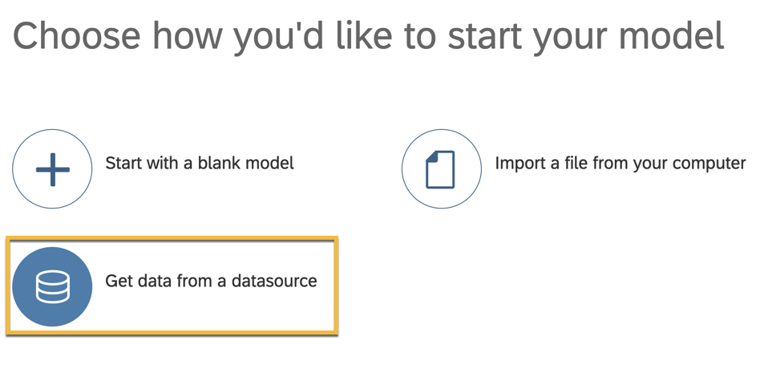
4. Go to top right in 'New Model Screen' under 'Connect to live data', click on **Live Data connection**  
5. From the newly opened 'Create Model From Live Data Connection' popup window,  choose 'System Type' as **SAP HANA** 
6. From 'Connection' dropdown, choose **`TrainingEU`** (Live connection that we had configured in the previous Step 4)
7. SAP Cloud Platform authentication popup will be displayed > Authenticate using the credentials shared . user00XX@4xb.de (XX is the student ID assigned to each participant)
  **NOTE**:
  Please enter the authentication credentials using keyboard and navigate using TAB key. In case you have the same identity provider configured for both analytics cloud and the cloud foundry sub-account, then this additional login is not required.
 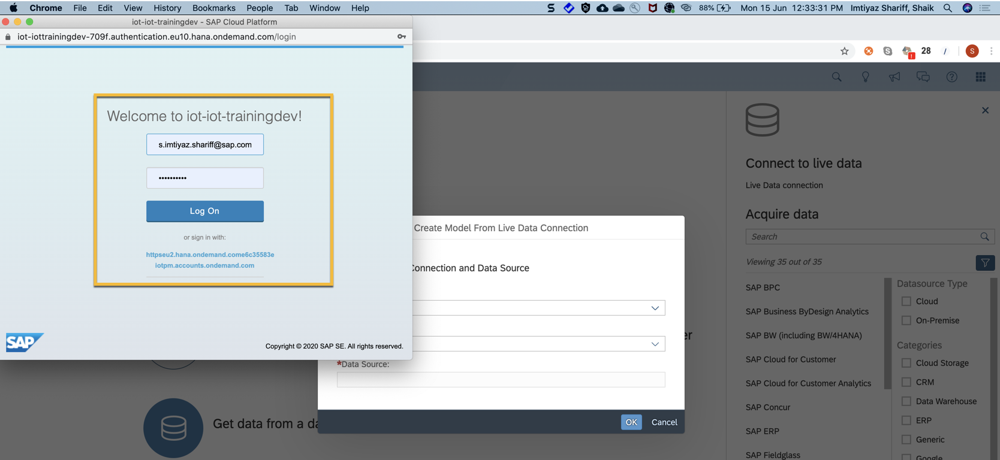
8. Click on **Data Source** and search for the Data Model name that we have created in Step 1 - `TRAININGMODELXX` (XX is the student ID assigned to each participant) 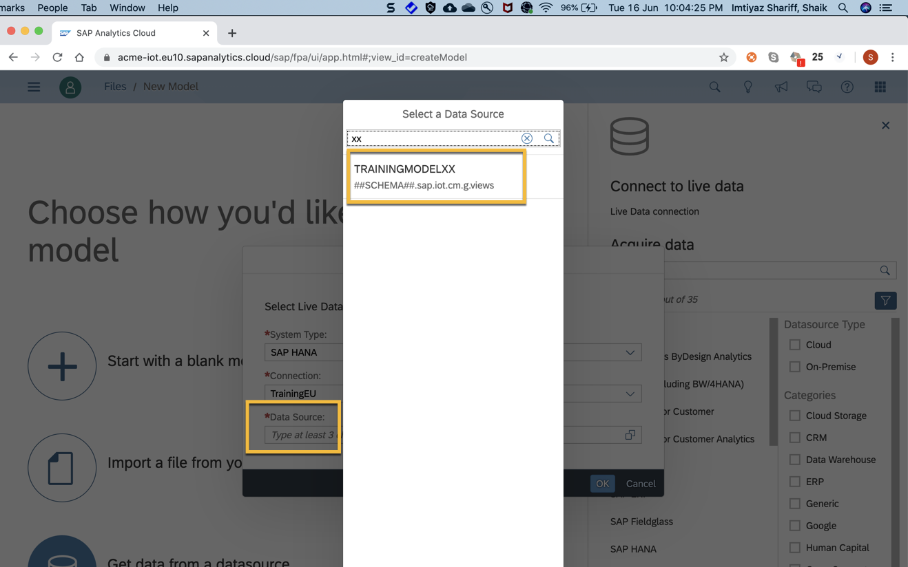
9. From the search results in Data Source list, choose the model name - `TRAININGMODELXX` for which the Calculation view was generated.
10. Click on **OK**
11. New Model Screen will be displayed listing all the generated / configured aggregates >> Click on **Save**  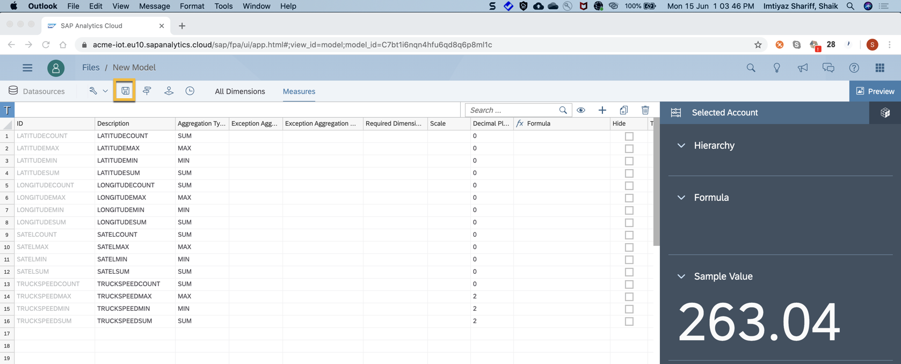
12. Enter the Model name as **`ModelXX`** (XX is the student ID assigned to each participant) 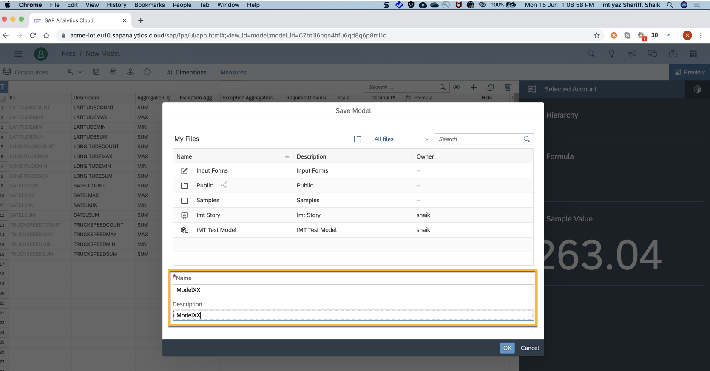
13. Click on **OK**
14. Model shall be saved as **`ModelXX`**

 We are done with creating a SAC Model from the exposed Calculation view generated using a Live SAC Connection. Upon saving the SAC Model, we complete this step, please proceed with further steps.

[DONE]
[ACCORDION-END]

[ACCORDION-BEGIN [Step 6: ](Create SAC Story using the created SAC Model )]

1. Click  and then select **Create**. 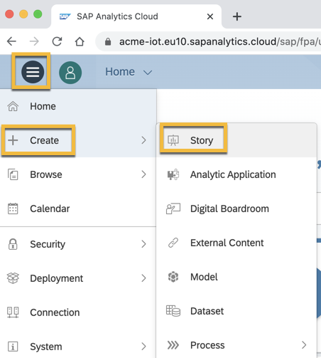
2. Click on **Story**
3. From the displayed 'Start your Story' page, choose a SAP Analytics Template - Click on '**Add a Canvas Page**' 
4. From the Story Canvas page, add an object to the Story - Click on **Chart** 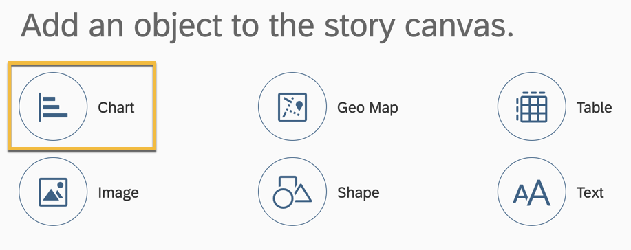
5. From the displayed 'Select Dataset or Model' popup window, select the Model created in Step 5 - `ModelXX` (XX is the student ID assigned to each participant) 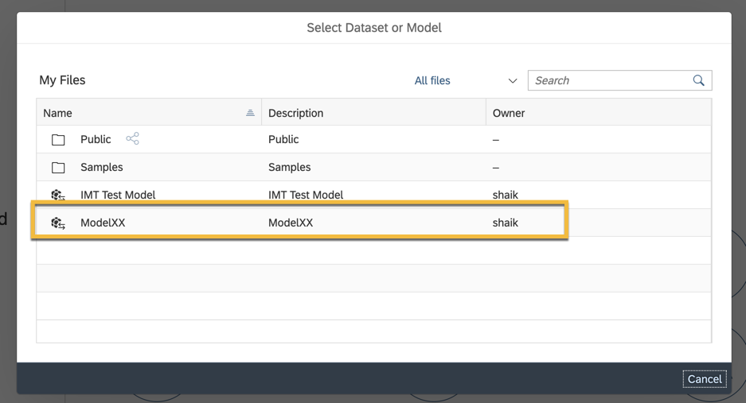
6. SAP Cloud Platform authentication popup will be displayed > Authenticate using the credentials shared . user00XX@4xb.de (XX is the student ID assigned to each participant)                                         
**NOTE**:
  Please enter the authentication credentials using keyboard and navigate using TAB key. In case you have the same identity provider configured for both analytics cloud and the cloud foundry sub-account, then this additional login is not required. 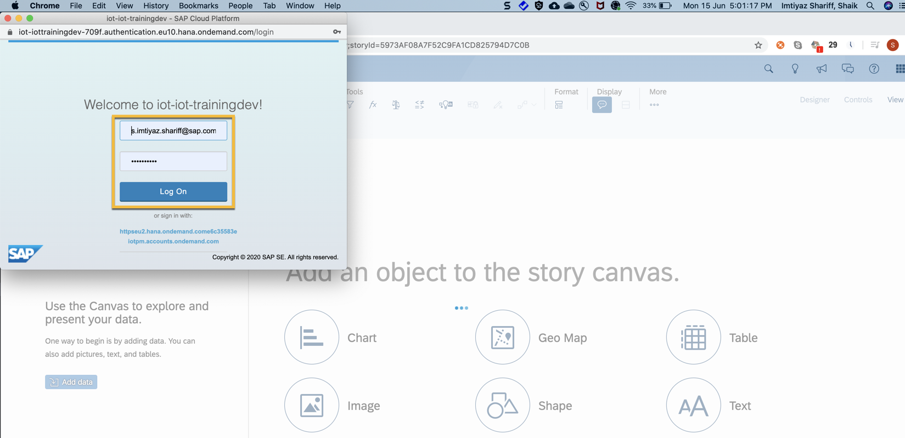
7. New Document screen is displayed > Go to **Builder** section under **Designer** tab > Under **Measures** - Click on **+ Add Measure**   
8. Under **CALCULATIONS** > Click on **+Create Calculation**  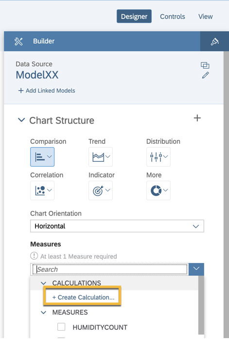
9. 'Calculation Editor' popup window shall be displayed > Under Type dropdown, select **Calculated Measure**  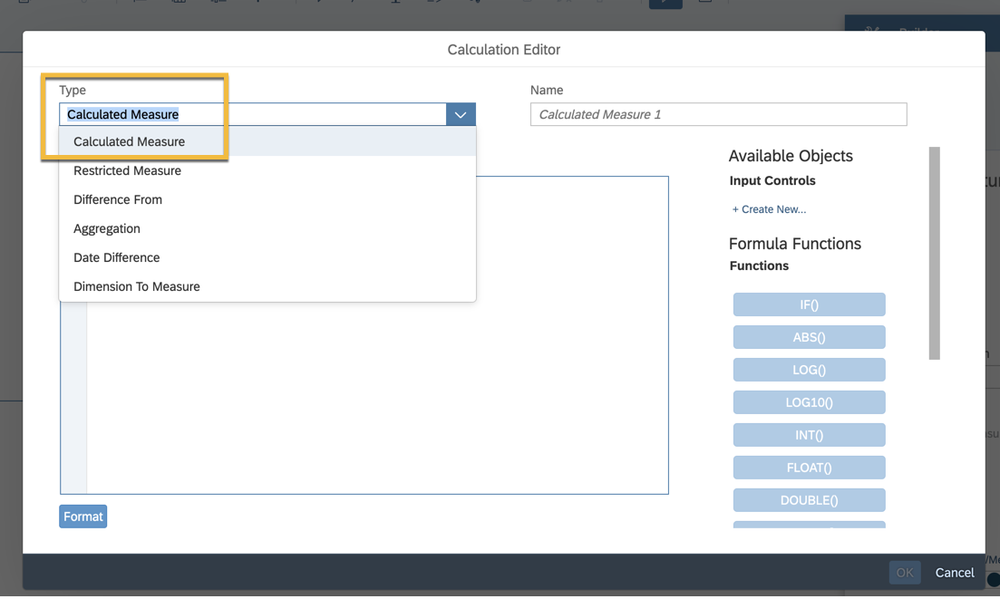
10. In 'Name' text field, enter the calculation name as **Average Temperature** 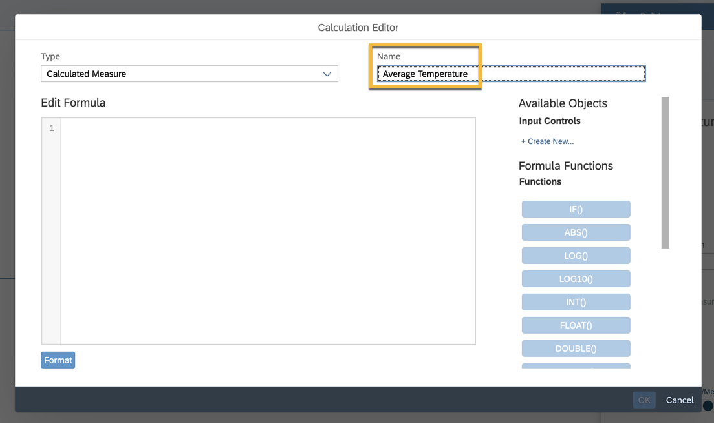
11. In 'Edit Formula' text box, enter **SUM** > Editor displays the help text to pick the available 'SUM' aggregated Measures > Choose **[`ModelXX`:TEMPERATURESUM]**  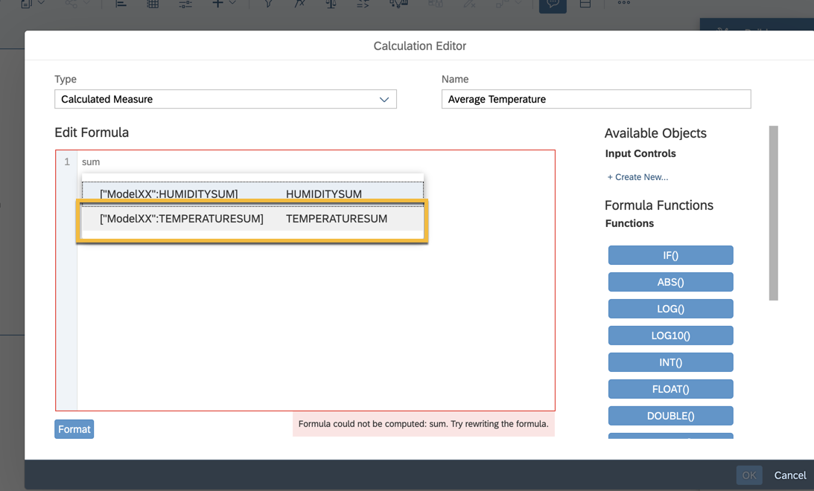
12. Under 'Available Objects' on right side > Scroll Down to 'Operations' section > Choose **''/''** 
13. In 'Edit Formula' text box, enter **COUNT** > Editor displays the help text to pick the available 'COUNT' aggregated Measures > Choose **[`ModelXX`:TEMPERATURECOUNT]**  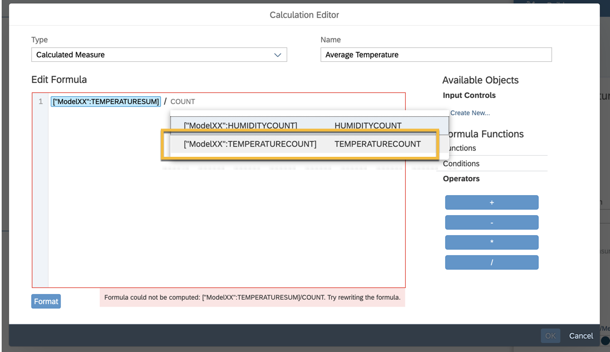
14. Click on **OK**
15. Go to **Builder** section under **Designer** tab > Under **Dimensions** - Click on **+ Add Dimensions** 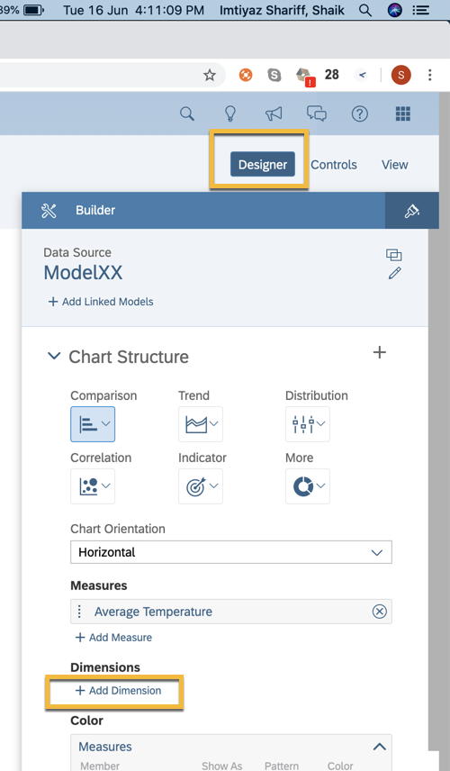
16. Scroll down to choose **EQUI** 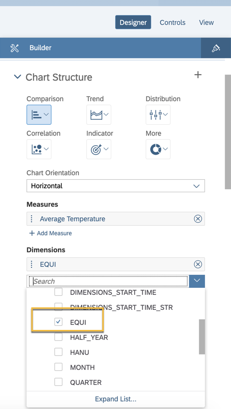
17. Chart shall be refreshed to fetch the data based on the chosen Measures and Dimensions
18. Click on **Save** > Provide **Name** as `StoryXX` and **Description** as `StoryXX` (XX is the student ID assigned to each participant) 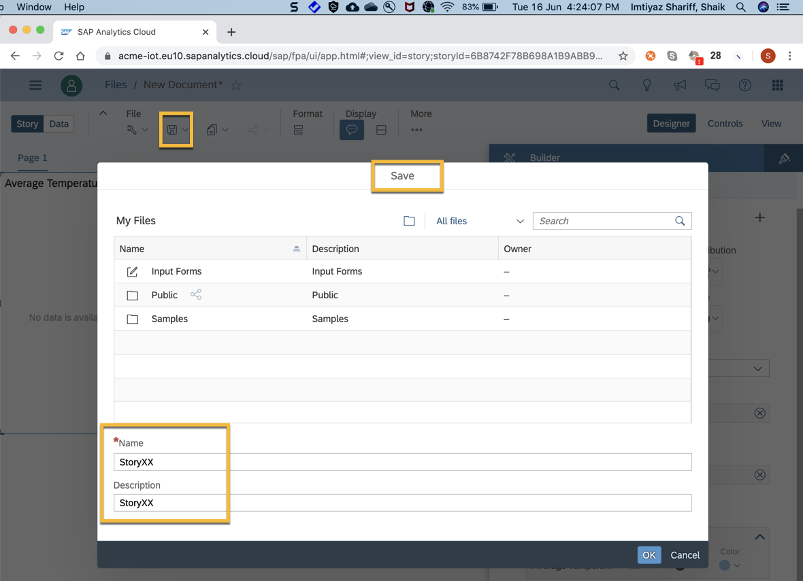
19. Click on **OK**
20. Chart depicting the Average Temperature per each Silo is plotted successfully. 

Note: Users can try configuring various chart types and features in SAC.

 We are done with creating an SAC Story / Chart depicting aggregated temperature across the week, per each Silo - from the configured SAC Model.  Upon saving the SAC Story, we complete the End to End flow.

---

 ### **What we learnt**

 - Thing Modelling
 - Ingesting Data
 - Data Modelling
 - Data Model Activation
 - Configuring Live Connection in SAC
 - Creating SAC Model
 - Plotting charts from SAC Story .

---


 This completes our hands-on exercise on **SAC Integration with IoT**

[VALIDATE_9]

[ACCORDION-END]


---
