## Prerequisites  
 - **Proficiency:** Intermediate
 - **Tutorials:** [Creating OData based on CDS Views. ](http://sap.com/developer/tutorials/s4hana-cds-creating-odata-service.html)

## Next Steps
 [Building simple tile](http://sap.com/developer/tutorials/s4hana-cds-building-simple-tile.html)

## Details
### You will learn  
- How to create a tile within Fiori Launchpad .

### Time to Complete
**15-20 Min**.

---

1. The first thing you have to do is to access the Fiori Launchpad Designer by opening the welcome page that came with S/4HANA trial landscape.
    

2. From the above welcome page, click on the link (1) to access the Login screen of the Fiori Launchpad Designer.
    
Start the Fiori Launchpad Logon and logon to the preconfigured system with:
 (1) User:     `S4H`
 (2) Password: `Welcome1`
 (3) Client:   `100`
and afterwards(4) click on Log On button.

3. Now you have to append the `url` to the Fiori Launchpad Designer to SAP Launchpad `url`. The part that needs to be appended to the `url` is this:
`/sap/bc/ui5_ui5/sap/arsrvc_upb_admn/main.html`

    
Afterwards hit the Enter taste from your keyboard.
We are now able to see lots of tiles because new profiles were already assigned to the user S4H.

    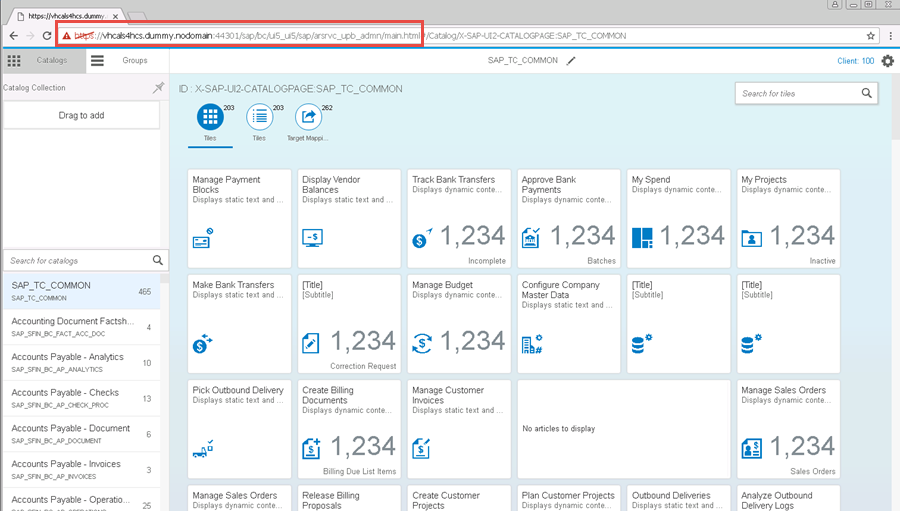    

4. You can open the customization scope by appending  the following to the `url` :
     `?scope=CUST`

    

5. Another scope is called Configuration. It is for system specific settings. It is accessible by appending the following to the `url`: `?scope=CONF`

    

6. Now let's assign some roles to the Business user. To achieve this you have to login in the SAP GUI (User: `SH4`, Client: `100`, Password:`Wecome1`)

    
After successfully login , enter the ABAP transaction `su01` (1) for user maintenance and hit enter from the keyboard.

    

     While in the transaction `su01` maintain the field User with `SH4` (1)
     Now click on the change button (2) to maintain fields and add the roles `SAP_BR_PURCHASER` and `SAP_BR_PURCHASING_MANAGER` in the tab Roles:

     6.1. Tab Roles(1)
      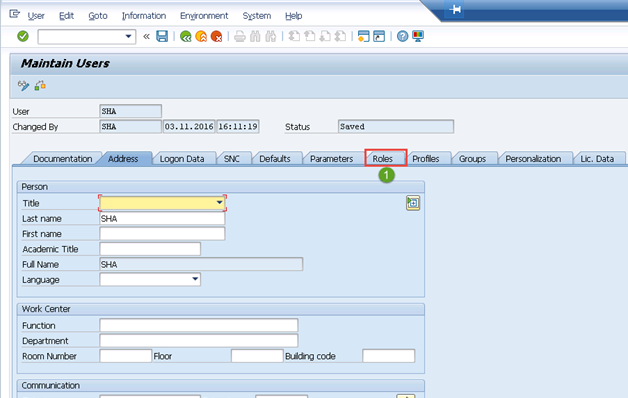

     6.2. Status Roles
      

     6.3  Press the F4 help
      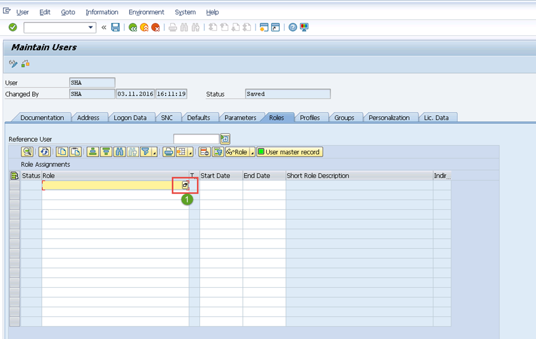

     6.4 Role Name window
     a) Here switch to the tab Roles (1) and maintain the field Single Role

      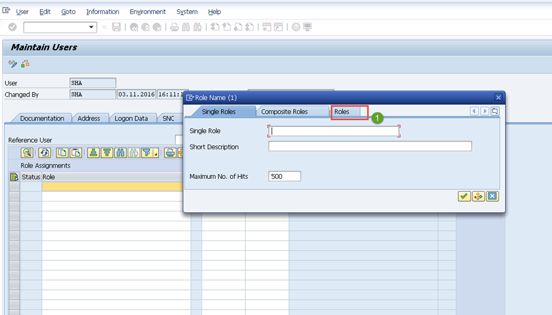    
     b) Maintain the field single role with `SAP_BR*` (1) and click on the OK button (2)   

      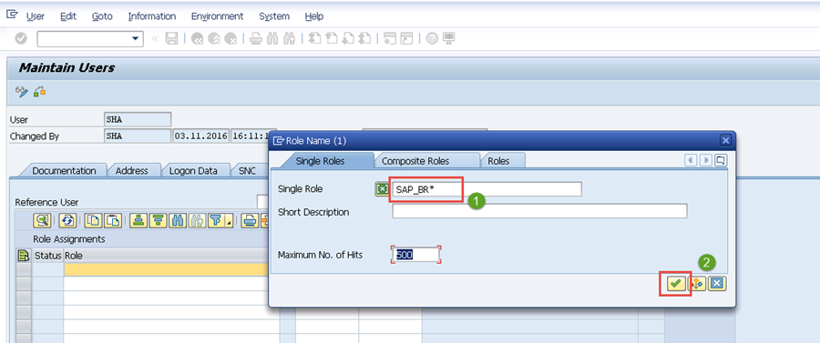

     c) On the Tab Single Roles of the window Roles Name, check the lines (1) :
        `SAP_BR_PURCHASER`
        `SAP_BR_PURCHASING_MANAGER`
      and click on the OK button (2)
      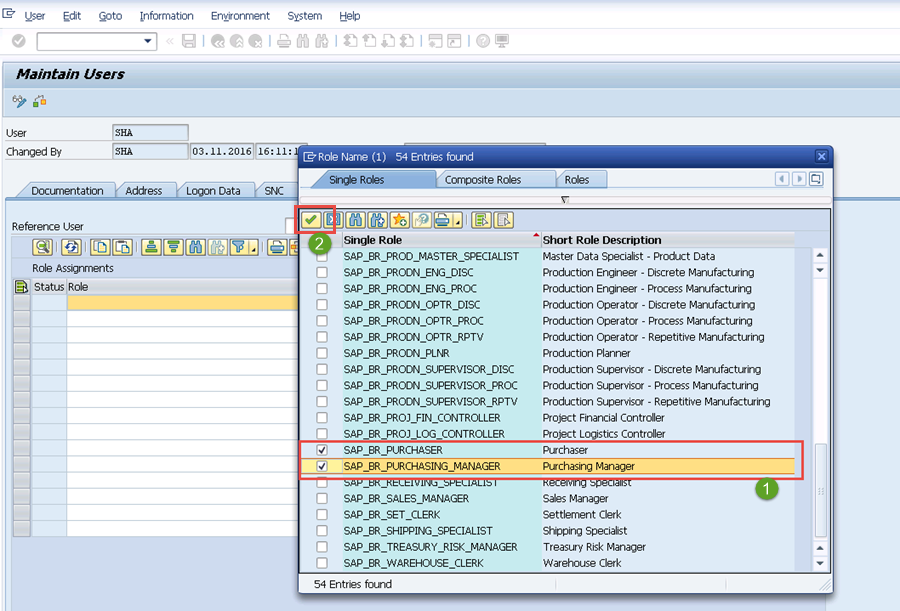
  You should have something like this:
  
  7. Add additional role following the steps described above: `SAP_BR_ANALYTICS_SPECIALIST`
      
  8. Add additional role following the the steps described above : `SAP_BR_EMPLOYEE`
      
      
  9. Add additional role following the the steps described above : `ZSAP_UI2_ADMIN_700`
      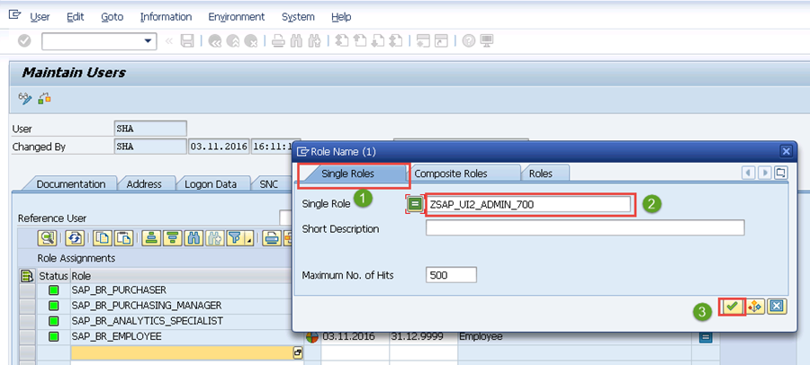
      
  10. Add additional role following the the steps described above: `ZSAP_UI2_USER_700`
      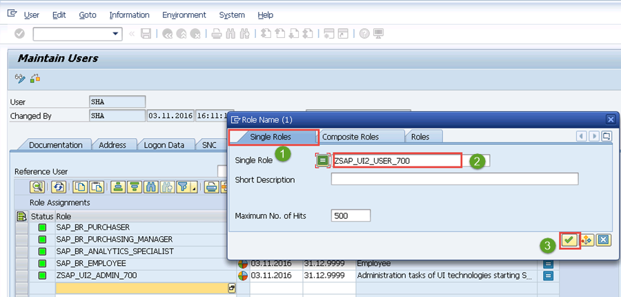                                                                            
      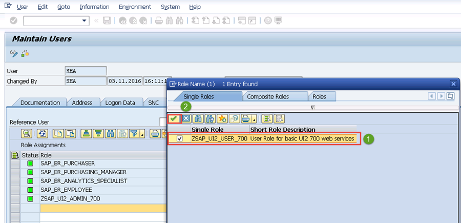   
  11. Add additional role following the steps described above : `Z_RDS_BR`
      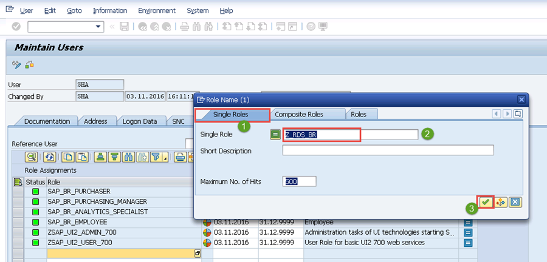
      
  12. Add additional role following the steps described above: `Z_RT_ADMIN`
      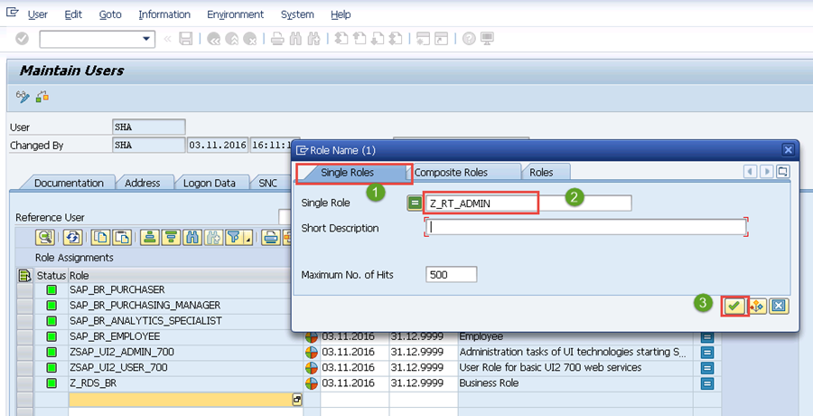  
      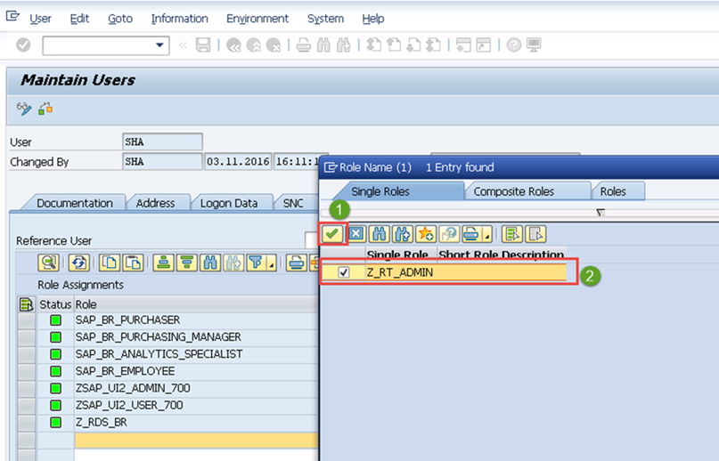  
      Save the changes you made and close the SAP Logon.
  13. Go back to Fiori Launchpad  Designer restart and logon to it by clicking on the link (1) to access the Login screen of the Fiori Launchpad Designer
      
    While in the Fiori Launchpad Designer you would be able to see several groups related to purchasing Business Roles as well as some groups for creating KPI.
    You will also see the group `Z_RDS_BCG`.
        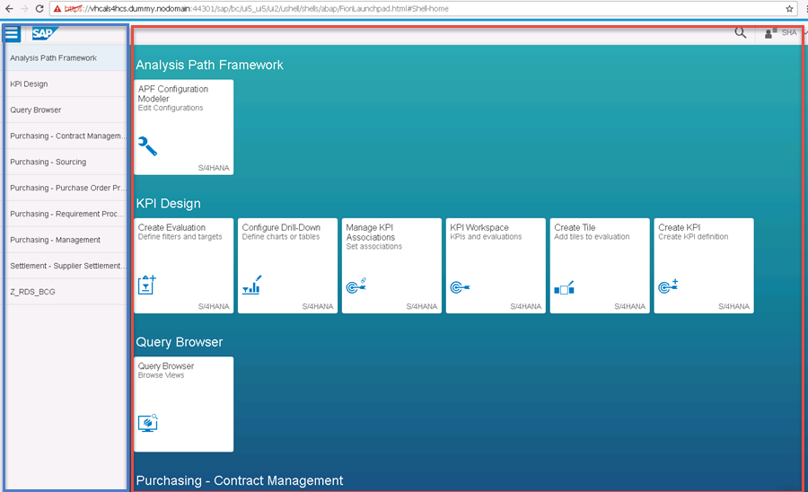

### Optional
 - Put any option steps here or remove this section if not applicable.

## Next Steps
 - [Building simple tile](http://go.sap.com/developer/tutorials/s4hana-cds-building-simple-tile.html)
