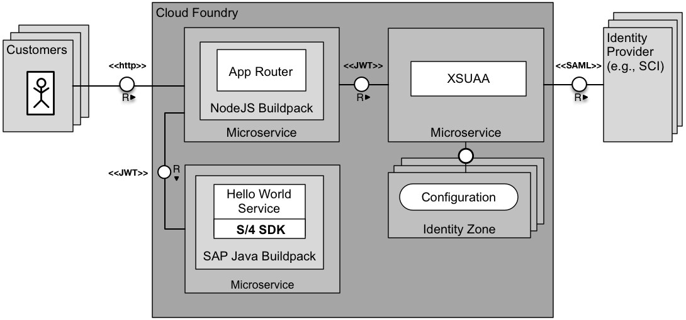
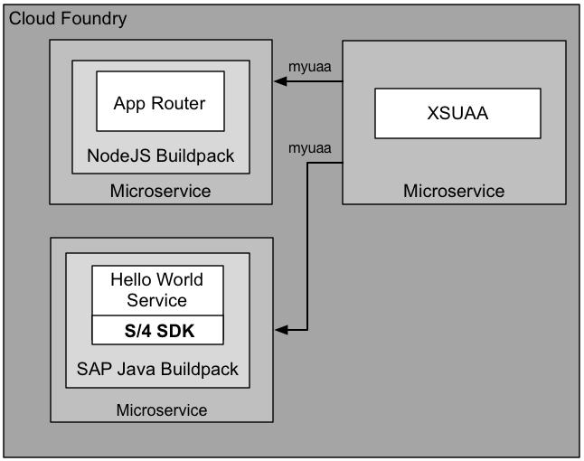
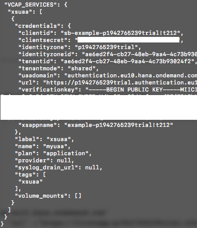
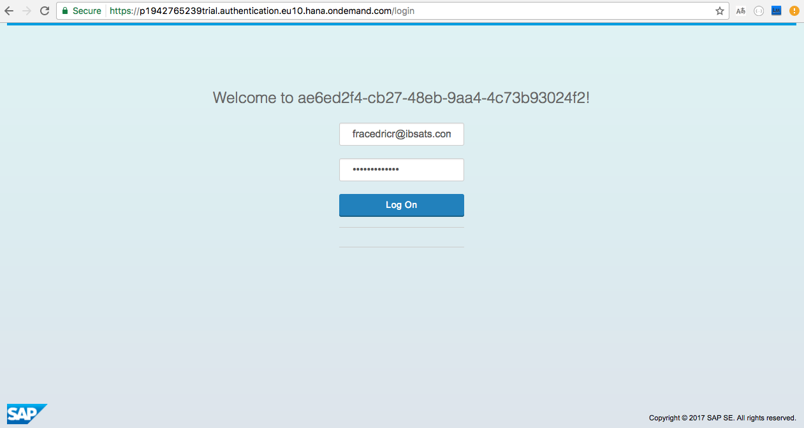
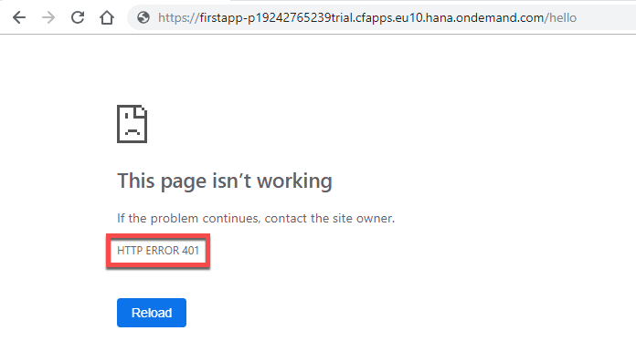
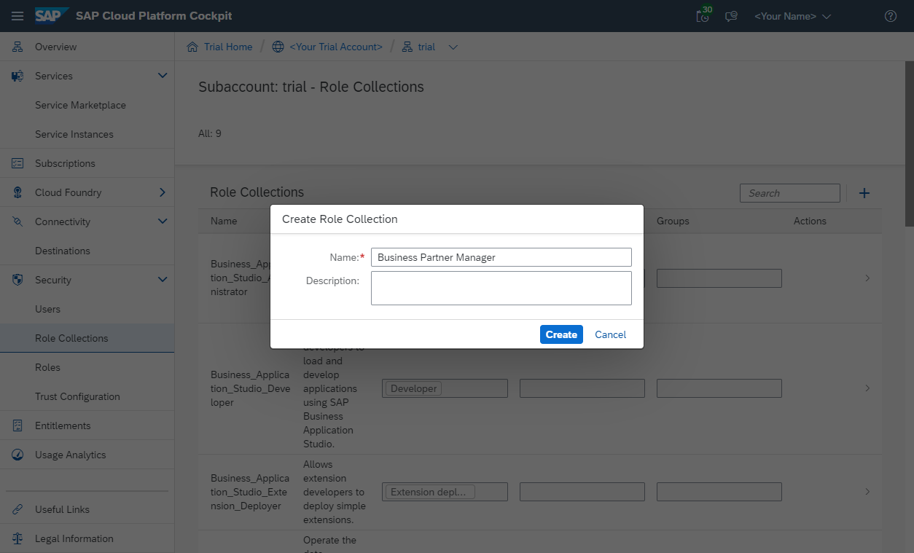
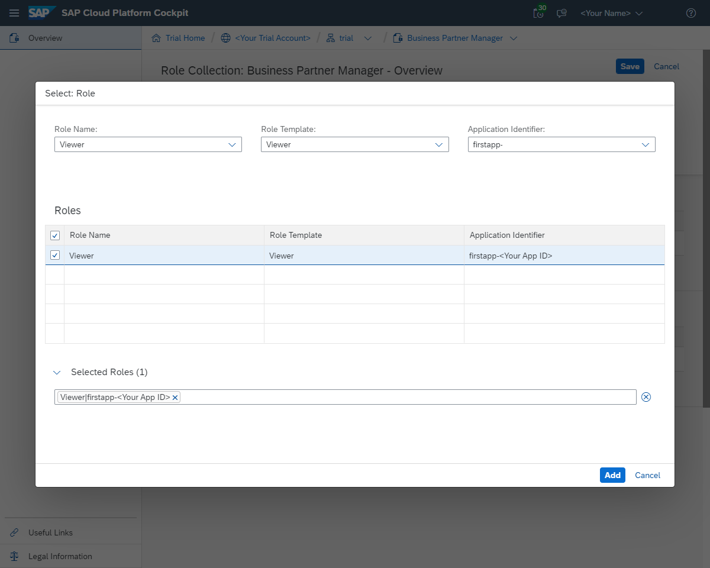
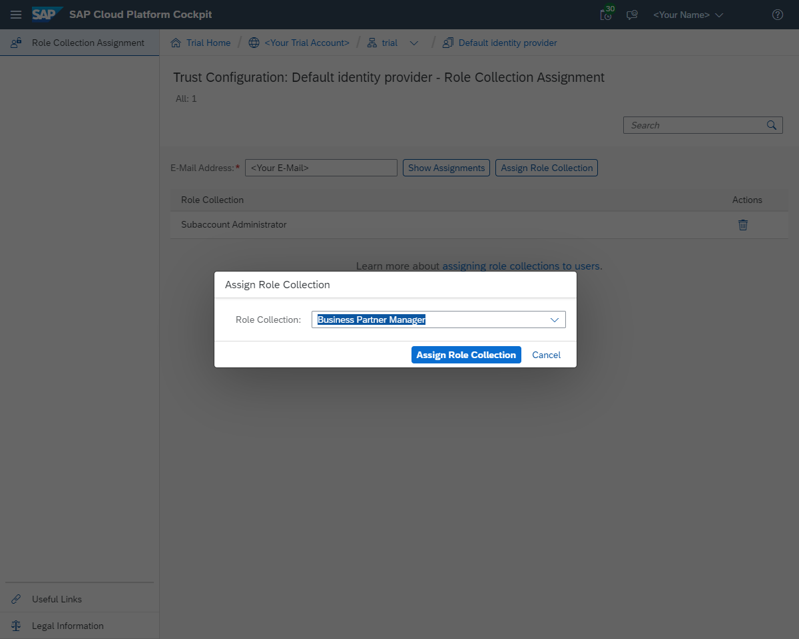

## Prerequisites
 - You completed all steps until [Create a Sample Application on Cloud Foundry Using SAP Cloud SDK](https://developers.sap.com/tutorials/s4sdk-cloud-foundry-sample-application.html).

## Details
### You will learn
  - How to set up and configure the App Router component as a central entry point to your microservice landscape to handle authentication and authorization
  - How to protect your Java microservice so that it only accepts requests based on a valid JSON Web Token (JWT) that is received from the App Router
  - Assign roles and scopes to your application users and let your backend deal with authorization information

---

[ACCORDION-BEGIN [Step 1: ](Concepts)]

Before we dive deeper into the real setup of the architecture, let's quickly review the architecture we intend to go for.

Figure 1 presents the final setup. First, we still have our existing "Hello World" or "Business Partner" Java-based microservice that we have created in the previous tutorials. However, instead of letting the customer access this application directly, we will use the so-called Application Router (App Router) that serves two purposes.

On the one hand, the App Router is a general entry point into the world of microservices. The main idea is that you can split an application into multiple microservices with independent deployability, polyglot `runtimes` & persistence and independent teams. Therefore, a central entry component is required that hides the complexity of the microservice landscape from the end customer.

On the other hand, the App Router is mainly responsible for managing authentication flows. The App Router takes incoming, unauthenticated requests from users and initiates an OAuth2 flow with the [Extended Services for User Account and Authentication (XSUAA)](https://help.sap.com/viewer/65de2977205c403bbc107264b8eccf4b/Cloud/en-US/51ec15a8979e497fbcaadf80da9b63ba.html). The XSUAA service is an SAP-specific extension of [`CloudFoundry's` UAA](https://docs.cloudfoundry.org/concepts/architecture/uaa.html) service to deal with authentication and authorization (it may again delegate this aspect to other providers such as external Identity Providers, see later in this tutorial). If the user authenticates at the XSUAA, it will respond with a [JSON Web Token (JWT)](https://de.wikipedia.org/wiki/JSON_Web_Token) containing the authenticated users as well as all scopes that he or she has been granted.


**Figure 1: Authentication Flow during Runtime**

The JWT s passed by the App Router to the underlying microservices so that they are freed up from this task. At the same time, these microservices can only be accessed with a valid JWT, hence, are protected from unauthenticated traffic.

The JWT contains a signature that needs to be verifiable by every microservice to establish trust. Hence, every service require a key (client-secrets or public keys) to verify this signature and reject any requests with non-valid `JWTs`. Therefore, every service has to maintain a service binding to the XSUAA that provides this information for runtime verification (Figure 2). To enable this, every microservice binds to a dedicated XSUAA instance which writes this information into the `VCAP_SERVICES` environment variable which the microservices can use to verify any token's validity.



**Figure 2: Provisioning view with XSUAA binding**

With these basics in mind, let's create the picture of Figure 1 and Figure 2 by setting up the App Router, XSUAA and backend microservices to enable full application security.

[DONE]
[ACCORDION-END]

[ACCORDION-BEGIN [Step 2: ](Setup the App Router)]

We will let Cloud Foundry retrieve the App Router automatically on deployment. To achieve this, we will first setup the necessary structure.

1. Go to your favourite `<destLocation>` and create the `approuter` directory:

    ```bash
    cd <destLocation>
    mkdir approuter
    cd approuter
    ```

2. Place the following `package.json` in your `approuter` directory:
    ```json
    {
      "name": "approuter",
      "dependencies": {
        "@sap/approuter": "*"
      },
      "scripts": {
        "start": "node node_modules/@sap/approuter/approuter.js"
      }
    }
    ```

3. Within `<destLocation>/approuter` create a new file called `xs-app.json` with the following content:
    ```json
    {
      "welcomeFile": "index.html",
      "routes": [{
        "source": "/",
        "target": "/",
        "destination": "app-destination"
        }]
    }
    ```

4. Now head to `<destLocation>/firstapp` and replace the `random-route: true` in `manifest.yml` with the following content:

    ```yaml
    routes:
      - route: firstapp-<SUBACCOUNT>.cfapps.<REGION_IDENTIFIER>.hana.ondemand.com
    ```

    Replace `<SUBACCOUNT>` with your actual account, which is the one you use in the CF CLI to login to Cloud Foundry. With this step we determine a route instead of generating a random route. This is important since we will configure the app router for exactly this destination. Further change the `<REGION_IDENTIFIER>` to match your region (e.g. `eu10`). If you are unsure about your region, head to your Cloud Foundry Cockpit Home Screen. More details on the region specific URLs can be found [here](https://help.sap.com/viewer/65de2977205c403bbc107264b8eccf4b/Cloud/en-US/350356d1dc314d3199dca15bd2ab9b0e.html).

5. Redeploy your application to Cloud Foundry by pushing with `cf push`. Make sure the route was registered successfully by accessing your application via the browser. If applicable remove old routes in the Cloud Foundry Cockpit.

6. With a proper URL set in place we can now create a new `manifest.yml` file within `<destLocation>` for the app router microservice with the following content:

    ```yaml

    ---
    applications:
    - name: approuter
      routes:
        - route: approuter-<SUBACCOUNT>.cfapps.<REGION_IDENTIFIER>.hana.ondemand.com
      path: approuter
      memory: 128M
      buildpacks:
        - nodejs_buildpack
      env:
        TENANT_HOST_PATTERN: 'approuter-(.*).cfapps.<REGION_IDENTIFIER>.hana.ondemand.com'
        destinations: '[{"name":"app-destination", "url" :<APPLICATION_URL>, "forwardAuthToken": true}]'
      services:
        - my-xsuaa
    ```

    Adapt the file as follows:

      - Just like before provide the values for your account and region
      - In `destinations` replace `<APPLICATION_URL>` with the actual URL of your previously deployed app.

**Note**: It is mandatory that your app URL conforms the format `<APP_NAME>-<SUBACCOUNT>.cfapps.<REGION_IDENTIFIER>.hana.ondemand.com`. The authentication mechanism will identify you by pulling the user-id (`SUBACCOUNT`) out of the subdomain.

### Understanding the AppRouter's `manifest.yml` and `xs-app.json`

The `TENANT_HOST_PATTERN` is a variable that declares the pattern how multiple tenants in the URL are identified and handled. During runtime, the App Router will match the incoming host against the pattern and tries to extract the regular expression from the pattern. It will use the matched string to delegate authentication to the respective XSUAA tenant (in SAP Cloud Platform the tenant ID corresponds to the subaccount ID. If you desire different URL patterns, you need to change this pattern accordingly.

Note that the `TENANT_HOST_PATTERN` variable is only required in real multi-tenant application, i.e, applications where a physical deployment serves multiple clients from the same deployment. We assume in this blog series that we want to build multi-tenant applications, as we aim towards cloud-native development. However, this variable is not necessary if you have a single-tenant application. To realize this, the `xs-security.json` security descriptor may declare `"tenant-mode": "dedicated"`  (see step 5 below).

`destinations` is a variable that declares the internal routes from the App Router to the underlying backend microservices. As we only have one hello world microservice yet, we define only one destination called `app-destination` here. This `app-destination` is referenced by the previously created `xs-app.json` file.

The `services` section declares to bind our own XSUAA service instance to the App Router. This binding will ensure a corresponding `VCAP_SERVICES` entry that holds the client ID, client secret and public key that is required to validate any incoming OAuth token/JWT from the XSUAA service:



### Bind the XSUAA Service

Now we need to create a service binding to the XSUAA service. As a prerequisite we require an `xs-security.json` (security descriptor) file that contains a declaration about authorization scopes we intend to use in our application. In our case, we simply declare a `DISPLAY` scope that we will use later on to authorize our users. In addition, we declare a so-called role template called `Viewer` that references our `DISPLAY` scope.

We put this file to `<destLocation>/xs-security.json`. For a more detailed explanation on scopes and role templates, see the appendix of this tutorial. More details on the syntax of the `xs-security.json` can be found [here](https://help.sap.com/viewer/4505d0bdaf4948449b7f7379d24d0f0d/2.0.01/en-US/df31a08a2c164520bb7e558103dd5adf.html).

**_Note_**: The `xsappname` has to be unique within the entire XSUAA instance. We follow here the same pattern using our `<appID>-<tenantID>`.

**_Note_**: As explained above, the `"tenant-mode": "shared"` assumes a multi-tenant application and will require the `TENANT_HOST_PATTERN` variable to be declared. You may also use `"tenant-mode": "dedicated"` if you develop a single-tenant application.

`<destLocation>/xs-security.json`:

```json
{
  "xsappname": "firstapp-<SUBACCOUNT>",
  "tenant-mode": "shared",
  "scopes": [
    {
      "name": "$XSAPPNAME.Display",
      "description": "display"
    }
  ],
  "role-templates": [
    {
      "name": "Viewer",
      "description": "Required to view things in our solution",
      "scope-references"     : [
        "$XSAPPNAME.Display"
      ]
    }
  ]
}
```

Create the file and change the app name just like before.

We then create a service instance called `my-xsuaa` of the XSUAA service by issuing the following command and using the `xs-security.json` file:  

```bash
cf create-service xsuaa application my-xsuaa -c xs-security.json
```

If you have created this instance of the XSUAA service before without the `xs-security.json` parameter, you can unbind and delete the existing instance with these commands before creating it with the above command:

```bash
cf unbind-service firstapp my-xsuaa
cf delete-service my-xsuaa​
```

After you have created the XSUAA service instance, deploy the app router using the following (with the appropriate API endpoint of your Cloud Foundry region):

```bash
cd <destLocation>
cf push
```

Afterwards you should be able to locate the app router from within your browser using the host name of your deployment. In my case this is `https://approuter-p1942765239trial.cfapps.eu10.hana.ondemand.com/hello` which should face you with the following login page where you can use your user e-mail and password:



After logging in you should see the `HelloWorld` servlet which is now served by the App Router as a proxy to your Java application:


[DONE]
[ACCORDION-END]

[ACCORDION-BEGIN [Step 3: ](Protect your backend microservice)]
After authentication works with the App Router, your java backend service is still fully visible in the web and not protected. We, therefore, need to protect our java microservices as well so that they accept requests with valid `JWTs` for the current user only. In addition, we will setup the microservice in a way that it deals with authorization, i.e., understands the OAuth scopes from the JWT that we have configured previously using the `xs-security.json` file.

In the following, we will use the [Spring Security framework](https://spring.io/projects/spring-security) to protect the microservices. You can also use standard mechanisms of the SAP Java Build Pack to achieve the same. If you do not want to use Spring Security please follow the steps [here](https://help.sap.com/viewer/65de2977205c403bbc107264b8eccf4b/Cloud/en-US/ead7ee64f96f4c42bacbf0ae23d4135b.html), nonetheless, the concepts described hereinafter apply for both methods.

The first step is to get some additional Java libs from Service Marketplace. To get them, perform the following steps:

1. Download additional XS security libs from service marketplace: <https://launchpad.support.sap.com/#/softwarecenter/search/XS_JAVA>
2. At the time of writing the latest package is **`XS_JAVA_1-70001362.ZIP`**
3. **Unzip `<destLocation>`**
4. Install XS Security Libs to your local maven repo using:
    ```bash
    cd <destLocation>
    mvn clean install
    ```

[DONE]
[ACCORDION-END]

[ACCORDION-BEGIN [Step 4: ](Configure your App for secure Access)]

In the `<dependencies>` section of the `application/pom.xml`, we enhance the following additional dependencies to our project:

```xml
<!-- Authentication and Authorization imports with Spring Security -->
<dependency>
  <groupId>com.sap.xs2.security</groupId>
  <artifactId>security-commons</artifactId>
  <version>0.28.6</version>
</dependency>
<dependency>
  <groupId>com.sap.xs2.security</groupId>
  <artifactId>java-container-security</artifactId>
  <version>0.28.6</version>
</dependency>
<dependency>
  <groupId>com.sap.xs2.security</groupId>
  <artifactId>java-container-security-api</artifactId>
  <version>0.28.6</version>
</dependency>
<dependency>
  <groupId>org.springframework.security</groupId>
  <artifactId>spring-security-jwt</artifactId>
  <version>1.0.9.RELEASE</version>
</dependency>
<dependency>
  <groupId>org.springframework.security.oauth</groupId>
  <artifactId>spring-security-oauth2</artifactId>
  <version>2.3.3.RELEASE</version>
</dependency>
<!-- Authentication and Authorization imports with Spring Security -->
<dependency>
  <groupId>com.sap.cloud.security.xsuaa</groupId>
  <artifactId>api</artifactId>
  <version>1.6.0</version>
</dependency>
<dependency>
  <groupId>com.sap.security.nw.sso.linuxx86_64.opt</groupId>
  <artifactId>sapjwt.linuxx86_64</artifactId>
  <version>1.1.19</version>
</dependency>
```
This dependency section contains three main parts of dependencies:

1. The `org.springframework.security` packages add certain aspects of the [Spring security](https://docs.spring.io/spring-security/site/docs/current/reference/html/index.html) framework to our application, in particular the [OAuth framework](http://projects.spring.io/spring-security-oauth/docs/Home.html) of Spring security.
2. The `com.sap.xs2.security` packages contain specific security adaptations for the Cloud Foundry environment.
3. The `com.sap.security` packages contain platform-specific native implementations for the JWT validation and support OAuth2 authentication.


Afterwards you need to go to your `web.xml` in `src/main/webapp/WEB-INF` and uncomment the following lines:

```xml
<listener>
    <listener-class>org.springframework.web.context.ContextLoaderListener</listener-class>
</listener>
<context-param>
    <param-name>contextConfigLocation</param-name>
    <param-value>/WEB-INF/spring-security.xml</param-value>
</context-param>
<filter>
    <filter-name>springSecurityFilterChain</filter-name>
    <filter-class>org.springframework.web.filter.DelegatingFilterProxy</filter-class>
</filter>
<filter-mapping>
    <filter-name>springSecurityFilterChain</filter-name>
    <url-pattern>/*</url-pattern>
</filter-mapping>
```

This configuration introduces the Spring Security Filter Chain on all incoming routes of your Java microservice and declares that the entire security configuration can be found in a file called `spring-security.xml`.

We now want to protect all our routes so that users have to be at least authenticated. Take a look into `spring-security.xml`, which contains the following line:

```
<sec:intercept-url pattern="/**" access="isAuthenticated()" method="GET" />
```

This code ensures that all users which access all URLs under `/` with the `GET` method have to be at least authenticated. Since we just added the security filters spring will now start applying this rule for our servlet. You can find the full reference for access management here: [Spring Security Reference](https://docs.spring.io/spring-security/site/docs/current/reference/html5/)

Now we need to modify the `manifest.yml` of our application a bit to interpret the JWT sufficiently. To do this add the following environment variable in the `env` section of your file:

```
SAP_JWT_TRUST_ACL: '[{"clientid" : "*", "identityzone" : "*"}]'
```


[DONE]
[ACCORDION-END]

[ACCORDION-BEGIN [Step 5: ](Deploy and test the application)]
Now we are ready to build and deploy the application to try all our changes with:

```bash
mvn clean install
cf push
```

After deployment, accessing your backend service directly should not be possible anymore and will quit with the following message:



However, you should be still able to access your application using the App Router as the entry point:


[DONE]
[ACCORDION-END]

[ACCORDION-BEGIN [Step 6: ](Removed CSRF Token protection from backing service)]
If you have previously exposed the backing service directly to the end user, you have used the `RestCsrfPreventionFilter` on the backend to protect against cross-site request forgery. As this is now in the responsibility of the App Router, we should remove it. For this remove the following lines from your `web.xml`:
```xml
<filter>
  <filter-name>RestCsrfPreventionFilter</filter-name>
  <filter-class>org.apache.catalina.filters.RestCsrfPreventionFilter</filter-class>
</filter>
<filter-mapping>
  <filter-name>RestCsrfPreventionFilter</filter-name>
  <url-pattern>/*</url-pattern>
</filter-mapping>
```

[DONE]
[ACCORDION-END]

[ACCORDION-BEGIN [Step 7: ](Use OAuth scope to authorize users)]
Now that we saved the backend microservice from unauthenticated users, we also want to make sure that certain endpoints can be called only when users have specific authorizations. In the following example, we want to use our `Display` OAuth scope.

Enhance `spring-security.xml` to protect routes with OAuth scopes

The backend itself can be easily adapted based on the `spring-security.xml`. In this case, we protect the `/hello` route with our `Display` OAuth Scope. Introduce (or uncomment) the following line within the `<sec:http>` element:
```xml
<sec:intercept-url pattern="/hello" access="#oauth2.hasScope('${xs.appname}.Display')" method="GET" />
```
Afterwards you need to redeploy the application with:

```bash
mvn clean install
cf push
```

[DONE]
[ACCORDION-END]

[ACCORDION-BEGIN [Step 8: ](Assign users to scopes)]

Furthermore, the user accessing the application, needs to be assigned the `Display` OAuth scope. This is done using the SCP cockpit.

1. First, go to your account on Cloud Foundry and find the **Role Collections** menu under the **Security** module.

2. Second, create a new role collection which you can give an arbitrary name. In our case, we call the role collection **Business Partner Manager**. 

3. Afterwards, select the role collection **Business Partner Manager** and select **Add Role**. From the menu, select your application and the corresponding role template and role. 

4. Afterwards, the user has to be assigned to the newly created **Business Partner Manager** in order to receive the **Display** scope. In order to do this, select the trust configuration from the security menu and select the **SAP ID Service** from the list

5. In the opening dialog, enter your user ID as e-mail into the user field and click **Show Assignments** followed by **Add Assignments**

6. Select the **Business Partner Manager** role collection from the menu to assign it to your user



Afterwards you have a route that is protected by the `Display` OAuth scope which you can still access because the user has now the corresponding role.

That's it for today. Now you have learned the basics to protect your application on SCP Cloud Foundry using the SAP Cloud SDK.

[DONE]
[ACCORDION-END]

[ACCORDION-BEGIN [Step 9: ](Appendix)]
### Understanding Roles, Role Collections and Scopes
The following picture explains how the various concepts are related to each other.


Gray Box: As a SCP developer (e.g., SAP, partner, customer) of the business application (gray box), you define role templates which may contain multiple OAuth scopes. The developer here define the scope, role templates and additional attributes within the `xs-security.json` as explained in this tutorial which is used when creating the service instantiation to the XSUAA.

Orange Box: As an SCP tenant administrator of the business application (customer) can create a role collection which is spanning multiple roles reflecting the role templates. This way you can achieve, on the one hand, a fine-granular authorization control for the microservices and, on the other hand, compose them very flexibly in coarse-grained role collections. The idea behind this is, that, for example, the **Business Partner Manager** role collection may span multiple applications and microservices all having individual scopes. The role collections resolves the roles and scopes and returns a union of all scopes which are composed by the role collection.

Green Box: As an administrator of the users (customer), the role collection can then be assigned to the final user using the SAML attribute `Groups`.
[DONE]
[ACCORDION-END]

[ACCORDION-BEGIN [Step 10: ](Troubleshooting Json Web Tokens)]
Sometimes it might be necessary to investigate the JWT on the backend microservice during development to check for potential errors. Here is an example servlet that prints the token out.

```java
@WebServlet("/debug")
public class JwtDebugServlet extends HttpServlet {

    @Override
    protected void doGet(final HttpServletRequest request, final HttpServletResponse response )
            throws ServletException, IOException
    {
        response.setContentType("text/plain");
        Enumeration headerNames = request.getHeaderNames();
        while (headerNames.hasMoreElements()) {
            String key = (String) headerNames.nextElement();
            String value = request.getHeader(key);

            response.getOutputStream().println(key+" : "+value);
        }
    }
}
```
Afterwards you may use `https://jwt.io/` to decode the token. **Note:** You should never use this with any productive JWT as these tokens are shared on a public website. Fallback to local solutions.


[DONE]
[ACCORDION-END]

[ACCORDION-BEGIN [Step 11: ](Troubleshooting OAuth Scopes from XSUAA)]
In addition, you may use the XSUAA to see which current scopes and roles a particular users has. You could do this with your XSUAA tenant-specific URL:

`https://<SUBACCOUNT>.authentication.eu10.hana.ondemand.com/config?action=who`


[DONE]
[ACCORDION-END]

[ACCORDION-BEGIN [Step 12: ](Set up your own Identity Provider)]
So far, we have used the XSUAA service itself as the user provider. However, in production scenarios customer's may want to use their own Identity Provider (IdP) as a user provider or delegate into on-premise user stores such as LDAP or Active Directory. In the following, we quickly show how the XSUAA service can delegate requests to such an external IdPs.

To make this happen, the IdP and the service provider (SP) have to exchange security metadata, i.e., the IdP has to import the metadata of the SP and vice versa.

You can retrieve the metadata from your XSUAA tenant by following the pattern `https://<tenantID>.authentication.eu10.hana.ondemand.com/saml/metadata`. In my case, that would be `https://p1942765239trial.authentication.eu10.hana.ondemand.com/saml/metadata`. This downloads the metadata to your local computer.

Second, you need to import the metadata into your IdP. In the following, we use an own SAP Cloud Identity tenant to do this.

1. Within the IdP, we have to create a new application called `MyApp` where we select the **SAML 2.0 Configuration**.

2. Import the SP's metadata and click **Save**.

3. Back in the SCP account cockpit we need to add the IdP's metadata in the same manner.

4. Click **New Trust Configuration** and add the metadata from the IdP and click **Save**.


[DONE]
[ACCORDION-END]


[ACCORDION-BEGIN [Appendix: ](Test yourself)]

[VALIDATE_1]

[ACCORDION-END]

[ACCORDION-BEGIN [Appendix: ](Test yourself)]

[VALIDATE_2]

[ACCORDION-END]
