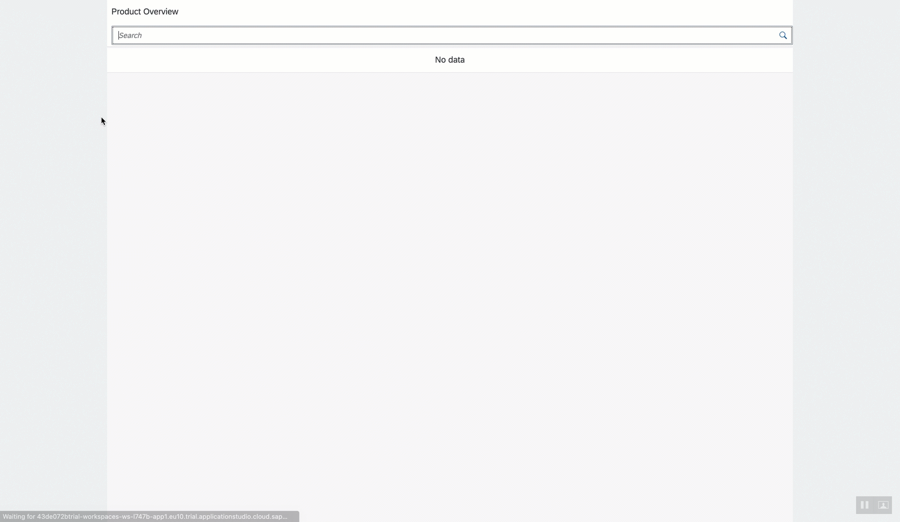

## Details
### You will learn  
- About localized strings in SAPUI5
- How to import new modules in a controller
- How to improve the user experience of the list with a search field
- Many new controls that come with SAPUI5


---

[ACCORDION-BEGIN [Step : ](Localize strings)]

[Localized strings](https://sapui5.netweaver.ondemand.com/sdk/#/topic/91f217c46f4d1014b6dd926db0e91070) are necessary to translate the application in various languages. You need to bind all exposed strings to the i18n model and avoid hard-coded strings so that the web app can be translated easily. This tutorial's views already come with bound strings, so you only need to add the properties file.

**Replace** the content of the `webapp/webapp/i18n/i18n.properties` file with the following lines.

```I18N
appTitle=Products
appDescription=Displays products


Currency=EUR
Discontinued=Discontinued
Available=Available

# List View
ListTitle=Product Overview

# Detail View
DetailTitle=Product Details
Ordered=Ordered
NotOrdered=Not Ordered
OrderButtonText=Order
OrderDialogTitle=Order Product
OrderDialogMsg=Do you want to order this product now?
OrderDialogSuccessMsg=The product has been ordered
```

> You can use [language codes](https://sapui5.netweaver.ondemand.com/sdk/#/topic/91f21f176f4d1014b6dd926db0e91070.html) to add more i18n files.


[DONE]
[ACCORDION-END]
[ACCORDION-BEGIN [Step : ](Improve the list view)]
In this step, we will add a search field on the top of the list to make it searchable and more appealing by using [custom list items](https://sapui5.hana.ondemand.com/#/api/sap.m.ObjectListItem). You will add a `<SearchField>` control to the initial page of the application. We'll add it as a child within the pages `subHeader` aggregation, which expects a `<Bar>` control.

1.	Open the `webapp/webapp/view/List.view.xml` file, and **replace** the highlighted lines.

	```XML[5-11,13-20]
	<mvc:View controllerName="sap.cp.webapp.controller.List"
		xmlns:mvc="sap.ui.core.mvc" displayBlock="true"
		xmlns="sap.m">
		<Page id="listPage" title="{i18n>ListTitle}">
			<subHeader>
				<Bar>
					<contentLeft>
						<SearchField search="handleSearch"/>
					</contentLeft>
				</Bar>
			</subHeader>
			<List id="list" items="{/Products}">
				<ObjectListItem type="Navigation" press="handleListItemPress" title="{ProductName}" number="{= ((${UnitPrice} * 100) / 100).toFixed(2) }" numberUnit="{i18n>Currency}">
					<attributes>
						<ObjectAttribute text="{QuantityPerUnit}"/>
					</attributes>
					<firstStatus>
						<ObjectStatus  text="{= ${Discontinued} ? ${i18n>Discontinued} : ${i18n>Available} }"  state="{= ${Discontinued}? 'Error' : 'Success' }"/>
					</firstStatus>
				</ObjectListItem>
			</List>
		</Page>
	</mvc:View>
	```


2.	To handle the search, we'll specify a handler for the search field's 'search' event. This handler `handleSearch` is defined in the view's controller, and the search effect is achieved by adding a 'contains string' filter to the binding of the List control's items aggregation. **Add** a listener for the search event in the  `webapp/webapp/controller/List.controller.js`.

	```JavaScript[8-22]
		sap.ui.define([
	    "sap/ui/core/mvc/Controller"
	],
	    function (Controller) {
	        "use strict";

	        return Controller.extend("sap.cp.webapp.controller.List", {
	            handleSearch: function (evt) {
	                // create model filter
	                var filters = [];
	                var query = evt.getParameter("query");
	                if (query && query.length > 0) {
	                    var filter = new sap.ui.model.Filter("ProductName", sap.ui.model.FilterOperator.Contains, query);
	                    filters.push(filter);
	                }

	                // update list binding
	                var list = this.getView().byId("list");
	                var binding = list.getBinding("items");
	                binding.filter(filters);
	            },

	            handleListItemPress: function (oEvent) {
	                var oRouter = sap.ui.core.UIComponent.getRouterFor(this);
	                var selectedProductId = oEvent.getSource().getBindingContext().getProperty("ProductID");
	                oRouter.navTo("detail", {
	                    productId: selectedProductId
	                });
	            }
	        });
	    });
	```

[DONE]
[ACCORDION-END]
[ACCORDION-BEGIN [Step : ](Improve the detail view)]
Similarly to the previous step, this step will add additional controls to the existing page. Add an [`ObjectHeader`](https://sapui5.hana.ondemand.com/#/api/sap.m.ObjectHeader) and a footer to use the full width of the page for the content.

1.	Open the `webapp/webapp/view/Detail.view.xml` file, and **replace** the highlighted lines.

	```XML[5-22]
	<mvc:View controllerName="sap.cp.webapp.controller.Detail"
	xmlns:mvc="sap.ui.core.mvc" displayBlock="true"
	xmlns="sap.m">
		<Page id="detail" title="{i18n>DetailTitle}" showNavButton="true" navButtonPress="handleNavButtonPress">
			<ObjectHeader title="{ProductName}" number="{= ((${UnitPrice} * 100) / 100).toFixed(2) }" numberUnit="{i18n>Currency}">
				<statuses>
					<ObjectStatus text="{= ${Discontinued} ? ${i18n>Discontinued} : ${i18n>Available} }" state="{= ${Discontinued} ? 'Error' : 'Success' }"/>
					<ObjectStatus text="{= (${UnitsOnOrder} > 0) ?  ${i18n>Ordered} : ${i18n>NotOrdered} }" state="Success"/>
				</statuses>
				<attributes>
					<ObjectAttribute text="Product #{ProductID}"/>
					<ObjectAttribute text="Category #{CategoryID}"/>
					<ObjectAttribute text="Supplier #{SupplierID}"/>
				</attributes>
			</ObjectHeader>
			<footer>
				<Bar>
					<contentRight>
						<Button text="{i18n>OrderButtonText}" type="Accept" icon="sap-icon://accept" press="handleOrder"/>
					</contentRight>
				</Bar>
			</footer>
		</Page>
	</mvc:View>
	```

	2.	The previous snippet contains a button. Let's implement the logic to display a [MessageBox](https://sapui5.hana.ondemand.com/#/api/sap.m.MessageBox) once this button has been pressed. **Add** a missing imports and the listener for the press event in the `webapp/webapp/controller/Detail.controller.js`.

		```JavaScript[2,3,4,6,33-50]
		sap.ui.define([
		    "sap/ui/core/mvc/Controller",
		    "sap/m/MessageBox",
		    "sap/m/MessageToast"
		],
		    function (Controller, MessageBox, MessageToast) {
		        "use strict";

		        return Controller.extend("sap.cp.webapp.controller.Detail", {
		            onInit: function () {
		                var oRouter = sap.ui.core.UIComponent.getRouterFor(this);
		                oRouter.getRoute("detail").attachMatched(this._onRouteMatched, this);
		            },
		            _onRouteMatched: function (oEvent) {
		                var oArgs, oView;
		                oArgs = oEvent.getParameter("arguments");
		                oView = this.getView();
		                oView.bindElement({
		                    path: "/Products(" + oArgs.productId + ")",
		                    events: {
		                        dataRequested: function () {
		                            oView.setBusy(true);
		                        },
		                        dataReceived: function () {
		                            oView.setBusy(false);
		                        }
		                    }
		                });
		            },
		            handleNavButtonPress: function (evt) {
		                var oRouter = sap.ui.core.UIComponent.getRouterFor(this);
		                oRouter.navTo("home");
		            },

		            handleOrder: function (evt) {
		                // show confirmation dialog
		                var bundle = this.getView().getModel("i18n").getResourceBundle();
		                MessageBox.confirm(
		                    bundle.getText("OrderDialogMsg"),
		                    function (oAction) {
		                        if (MessageBox.Action.OK === oAction) {
		                            // notify user
		                            var successMsg = bundle.getText("OrderDialogSuccessMsg");
		                            MessageToast.show(successMsg);
		                            // TODO call proper service method and update model (not part of this tutorial)
		                        }
		                    },
		                    bundle.getText("OrderDialogTitle")
		                );
		            }
		        });
		    });
		```

[DONE]
[ACCORDION-END]
[ACCORDION-BEGIN [Step : ](Test the search)]
Re-run your application.  You should see the search box at the top of the list, right below the words `Product Overview`.

Try to search for a word.



> With this, you completed the tutorial group. Congratulations!

> You can follow step 5 and step 6 of [this tutorial](https://developers.sap.com/tutorials/appstudio-sapui5-create.html) to deploy the application to the SAP Cloud Platform.


[VALIDATE_1]
[ACCORDION-END]

----
