## Prerequisites
 - Make sure you have the [proper entitlements set](https://developers.sap.com/tutorials/cp-cf-entitlements-add.html). If you are unsure which services you need, please refer to the table of step 2.

## Details
### You will learn
  - How to build and deploy the application to the cloud
  - How to interact with the SAPUI5 flex services to adapt the application to end-users

---

[ACCORDION-BEGIN [Step: ](Build the project)]

Run the following command to package the project into one single archive. This archive contains the full source files (for debugging), as well as the bundled resources (for faster loading times).

```Terminal
npm run build:mta
```

[DONE]
[ACCORDION-END]

[ACCORDION-BEGIN [Step: ](Deploy the built archive)]

Next, deploy the generated archive and track the deployment progress in the terminal with the following command.

```Terminal
cf deploy mta_archives/products_0.0.1.mtar
```

> Use `cf login` to establish a connection to the Cloud Foundry endpoint if you haven't done so yet. [This tutorial](cp-cf-download-cli) might help you if you are not sure how to do so.

The great thing about deploying a single `.mtar` file is that the Cloud Foundry environment will provision all required services for you. Here is a list of all services that are required for this project (you can see them enumerated in the `mta.yaml` file).


|  Service instance name     | service | service plan
|  :------------- | :-------------| :-------------
|  `products_destination` |  `destination` |  `lite`
|  `products_uaa` |  `xsuaa` |  `application`
|  `products_html5_repo_host` | `html5-apps-repo`  |  `app-host`


[DONE]
[ACCORDION-END]
[ACCORDION-BEGIN [Step: ](Access the running web app)]

At the end of the deployment process log, you should see a line that looks similar to this one:
```[4]
Deploying content module "productsdestination-content" in target service "products_destination"...
Deploying content module "webapp_deployer" in target service "products_html5_repo_host"...
Skipping deletion of services, because the command line option "--delete-services" is not specified.
Process finished.
Use "cf dmol -i 0915a099-4130-11eb-b43e-eeee0a8f7188" to download the logs of the process.
```

This means you uploaded the app successfully. The URL of you web app will now follow this pattern: `https://<yourID>.launchpad.cfapps.<region>.hana.ondemand.com/productsservice.tutorialproducts`
With this URL, you are able to access the `flpSandbox.html`


[DONE]
[ACCORDION-END]
[ACCORDION-BEGIN [Step: ](Embed the SAP Fiori in the SAP Cloud Platform Launchpad)]


Now it's time to embed the app in a full Launchpad environment:

1. Open the admin UI of the [Launchpad service](https://developers.sap.com/tutorials/cp-portal-cloud-foundry-getting-started.html)
2. Access the **Content Provider** menu. You should now see the following screen and **hit the refresh button** to synchronize the Launchpad with HTML5 application repository.

    !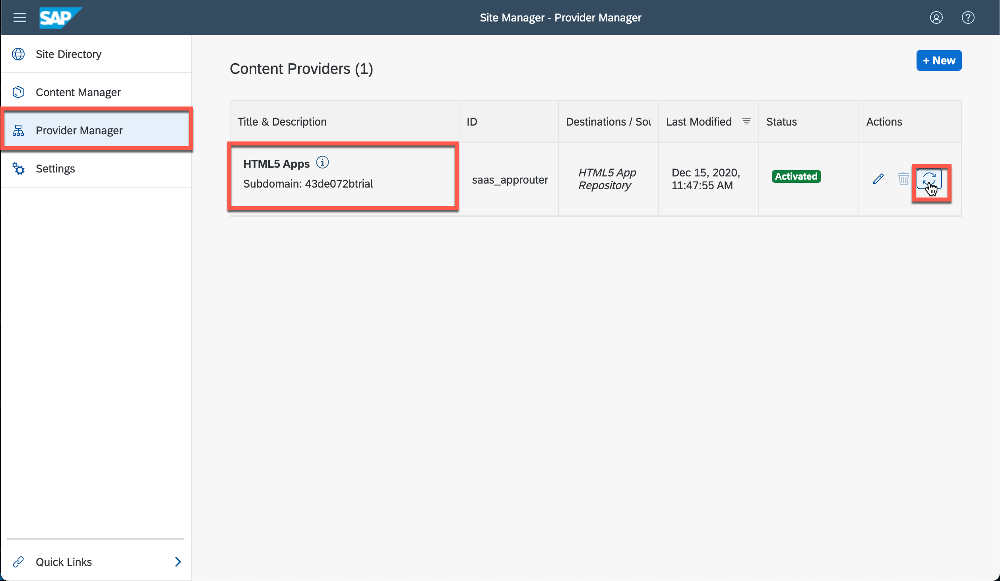

3. Open the **Content Manager** menu and click on the tab **Content Explorer** and select the tile that says **HTML5 Apps**.

    !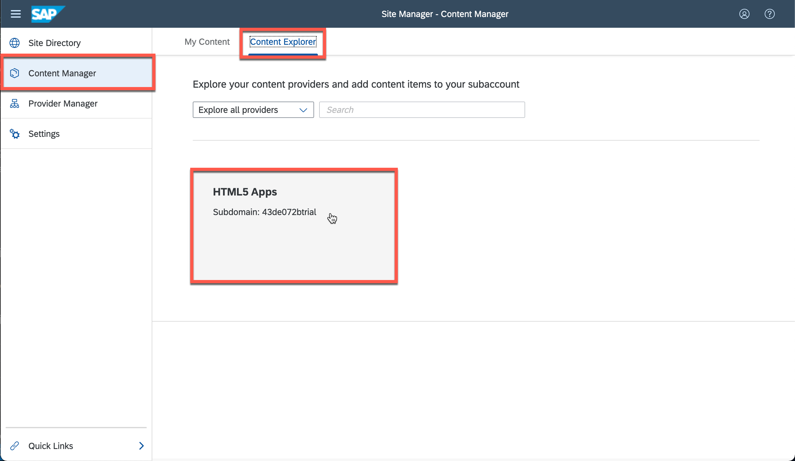

4. You should now see the following screen from where you can select the web app you just deployed. **Select the checkbox** next of Product List and hit the **Add to My Content** button.

    !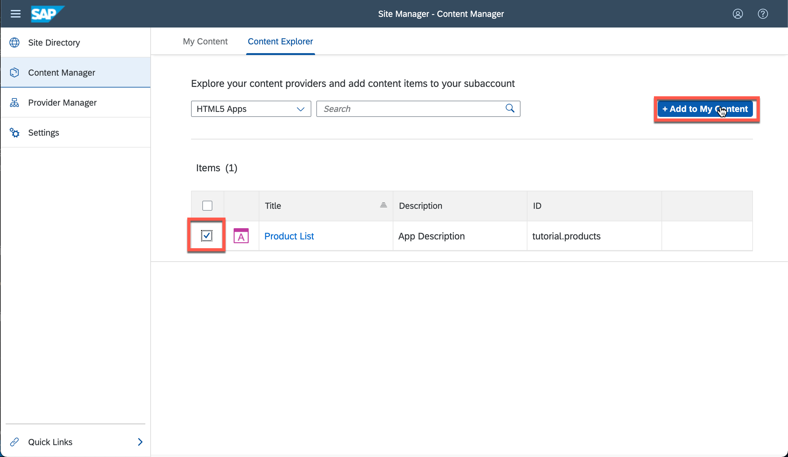

4. Switch to the **My Content** and click on the group **default**. In case you don't see this group, use the **+ New** button to create a new one.

    !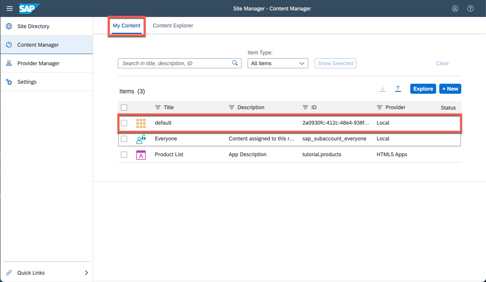

4. Select to the **Edit** button to edit the group and click in the search field in the appearing **Assignments** side panel. You should be able to add the Fiori app to the group via the **+** button after selecting this search box. Don't forget to **Save** the group before navigating back.

    !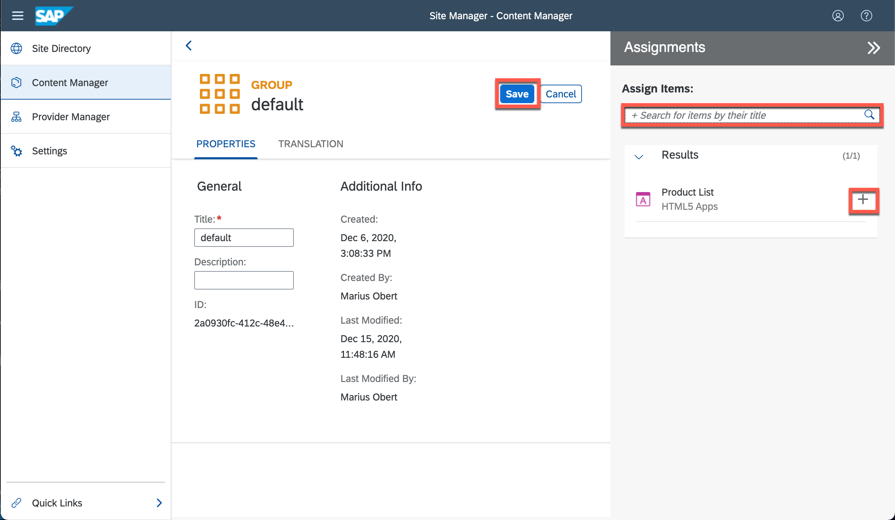

4. Now you need to make this application visible to your users. To keep it simple, we make the app visible to everyone. For this, select the **Everyone** role.

    !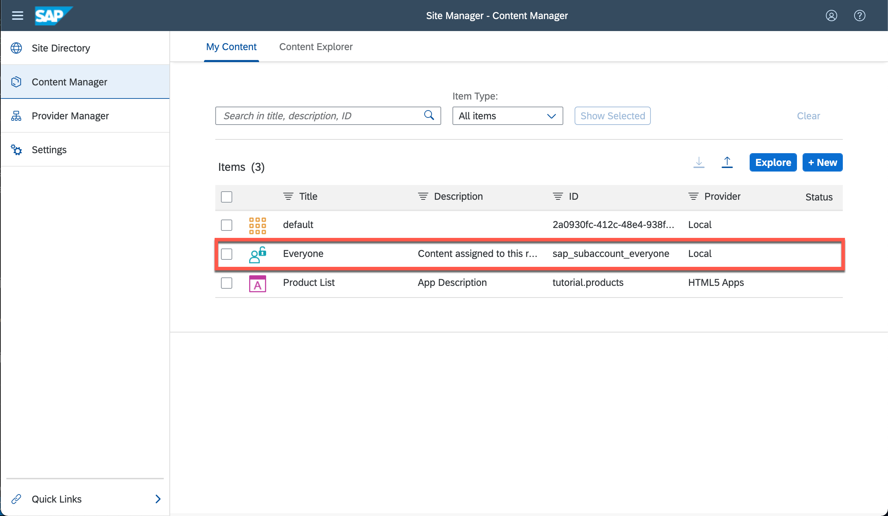

4. You are already familiar with the steps needed here. Select to the **Edit** button to edit the role and click in the search field in the appearing **Assignments** side panel. Add the Fiori app to the role via the **+** button and **Save** the change to the role.

    !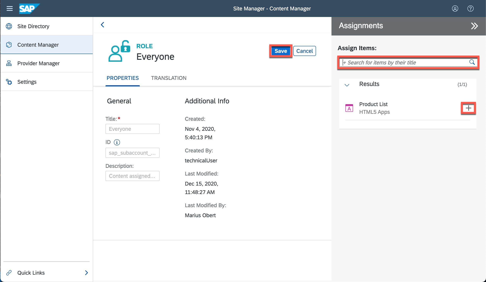

4. Go to the menu **Site Directory** and use the **Create Site** button to create a new site if you don't have an existing one.

    !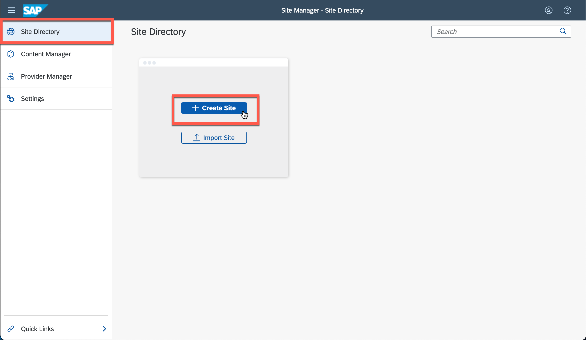

4. You can choose any name for the new site, e.g. **`ProductsTutorial`**.

    !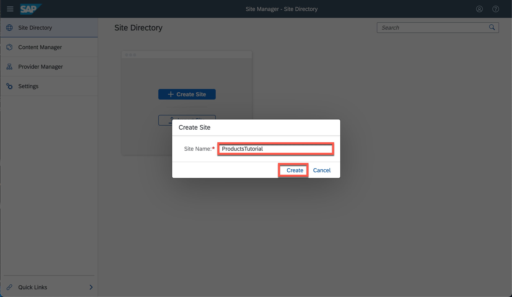

4. There's not need to edit this site, all we need comes with the default configuration. Click the button on the top right corner to open your new Launchpad site.

    !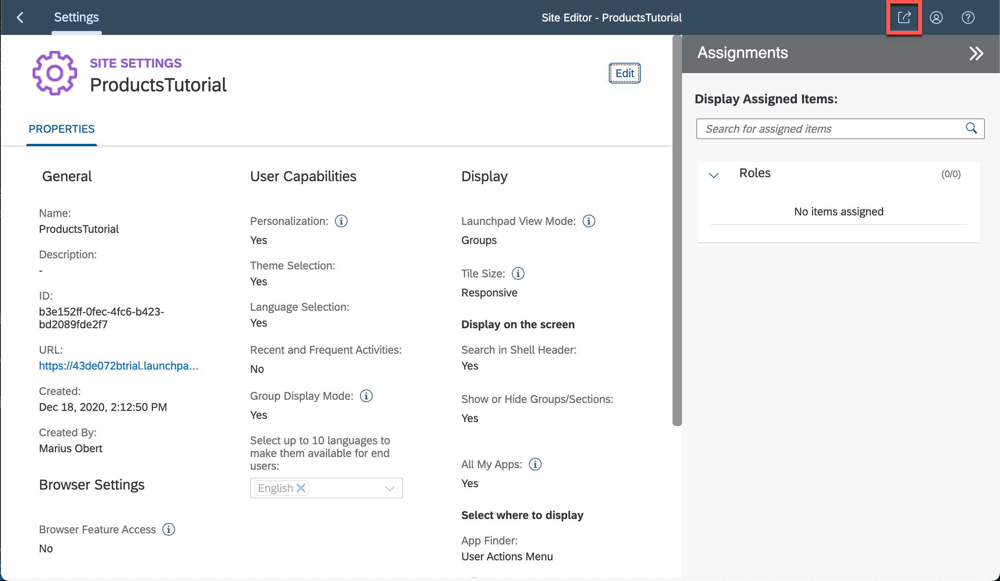


[DONE]
[ACCORDION-END]
[ACCORDION-BEGIN [Step: ](Save a custom filter variant)]

1. Click on the **Products** to open your web application. Also note that you see your initials in the top-right user menu. This shows you that you have been signed in automatically via Single-Sign-On.

      !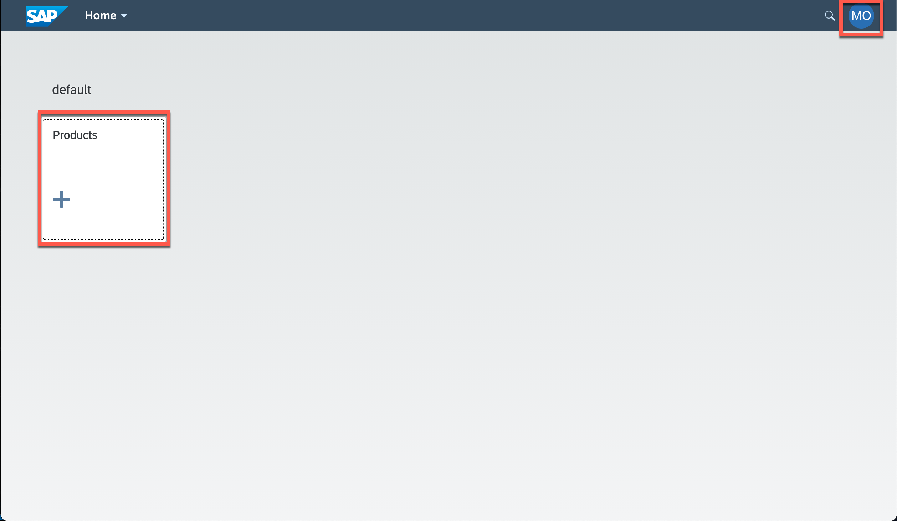

3. Apply another filter with the following criteria:
    * The `ProductID` shall be less than 18
    * The `CategoryID` shall be less than 60

4. **Open** the views dialog and save the current filter variant by clicking **Save as**.

      !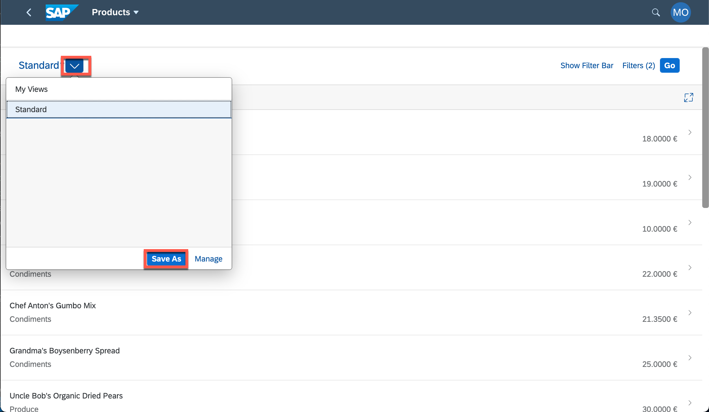

5. Name the view **`TutorialFilter`**, **check both checkboxes**, and hit **Save**. This user-specific variant is now stored in the backend.

      !


[VALIDATE_1]
[ACCORDION-END]

---
